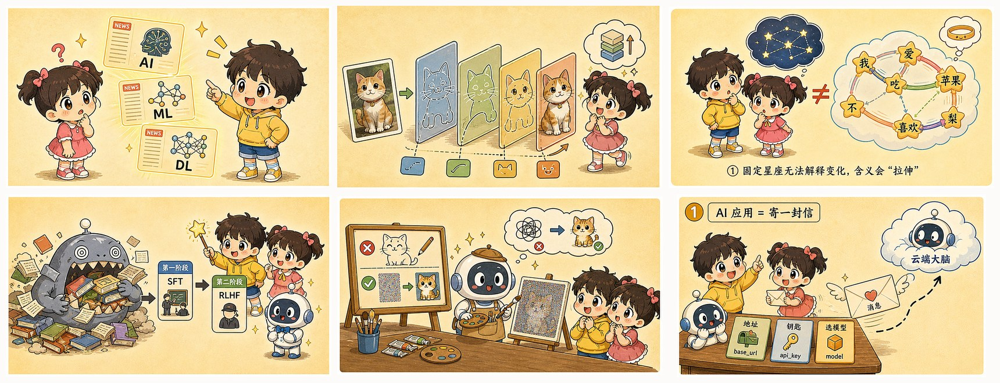
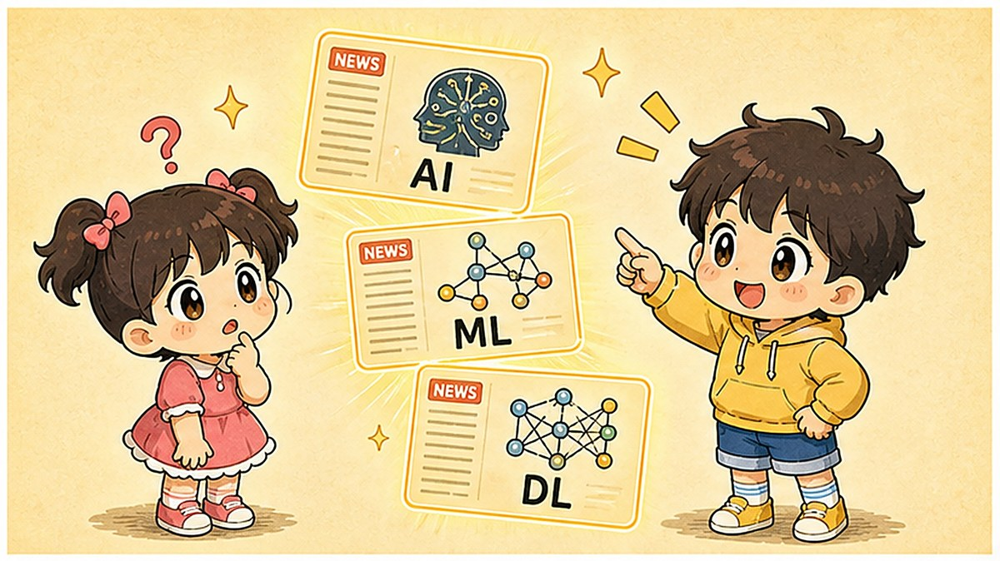
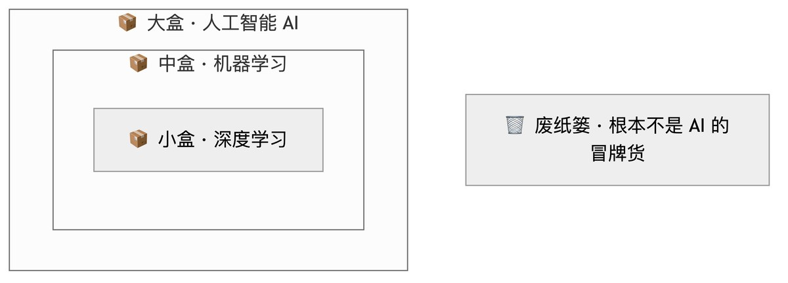
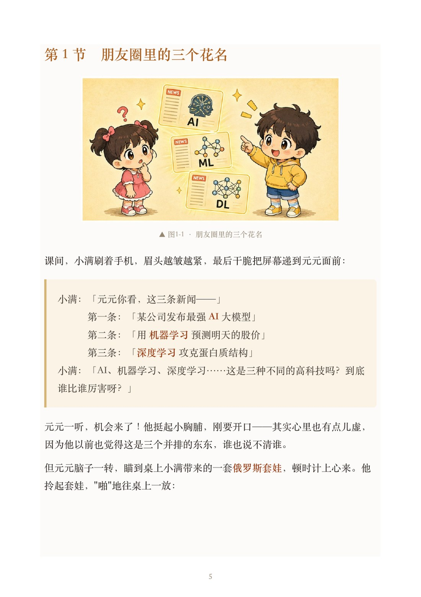

**简体中文** ｜ [English](README.en.md)

# 看得见的 AI

### 一本全图解、零基础到亲手构建的 AI 通识书 —— 永久免费

*The Visible AI · 30 lessons from intuition to building it yourself*

**如果它帮你看懂了 AI，点个 ⭐ Star 让更多人看到 —— 这是对作者最大的鼓励。**

---

## 这是什么

市面上讲 AI 的东西，要么是给工程师看的论文，要么是只会喊"颠覆""炸裂"的标题党。**这本书是给"想真正搞懂 AI 到底怎么回事"的普通人写的**——不需要数学基础、不需要会编程，跟着两个角色 **元元 × 小满** 一路爬山，从"一个神经元"一直走到"亲手写代码搭出一个 AI 应用"。

> 读完你会从 **"每个 AI 名词都是噪音"**，变成 **"每个名词都落在地图的某一格"**。
> 新模型发布、新热词刷屏，你不再焦虑——你知道它变的是架构、训练，还是应用层的包装。

---

## ✨ 为什么不一样

- 🎨 **看得见**：全程图解，**100+ 张原创插画 + 矢量流程图**，把"注意力""扩散""梯度下降"这些抽象概念**画出来**给你看。
- 🧸 **不枯燥**：**元元 × 小满** 两个角色一问一答带你学，每个原理都先讲一个"啪"地拍桌子的小故事。
- 🎯 **真学到**：每章用"**五拍闭环**"——章首先抛出"**这一章要破的题**"，章尾给你"**装进工具箱**"的一句话方法 + 自测题。读完确实有东西，不是看个热闹。
- 🔍 **祛魅**：坚持把每个 AI 名词**还原成它真实的机制**——神经元≠大脑、注意力≠意识、Agent 的"执着"是写死的 while 循环。**反玄学，看本质。**
- 🚀 **零基础到构建者**：6 阶段 30 章，从"三个套娃"一路到"亲手调 API、本地跑模型、手写 RAG"。

---

## 📥 在线阅读 / 下载

| | |
|---|---|
| 📚 **在线读全书（推荐）** | **[全 30 章 · 免费在线阅读 →](book/README.md)** —— 不用下载，点开就看，每章配四格漫画 |
| 👀 **先读第 1 章** | [《三个套娃罢了——AI、机器学习与深度学习》](book/stage_1/chapter_01.md) |
| 📖 **完整版 PDF** | **[⬇️ 下载完整版 PDF（38MB）](https://github.com/dvbs2000/visible-ai/releases/download/v1.0/The-Visible-AI-CN.pdf)** · 384 页 · 含序言 + 30 章 + 加入页 |
| 🌍 **English Edition** | [English README](README.en.md) · *The Visible AI*（英文全本，已完成）|

> 完全免费。欢迎下载、转发、打印给身边想学 AI 的人。

---

## 👀 内页预览

<table>
<tr>
<td width="50%"></td>
<td width="50%"></td>
</tr>
<tr>
<td align="center">元元 × 小满 带你把抽象概念画出来</td>
<td align="center">每个机制都有清爽的矢量流程图</td>
</tr>
</table>

 真实内页：大字号、色块盒、图文并茂

---

## 🗺️ 全书地图（30 章）

| 阶段 | 你会搞懂 | 章节 |
|---|---|---|
| **① 直觉篇** | AI 是什么、靠什么变聪明 | 1 三个套娃 · 2 从写规则到喂数据 · 3 一个神经元 · 4 训练就是下山 · 5 数据与过拟合 |
| **② 原理篇** | 深度学习四大基石 | 6 反向传播 · 7 CNN · 8 词向量 · 9 注意力机制 · 10 Transformer |
| **③ 大模型篇** | 一个 LLM 怎么炼成 | 11 Token · 12 预训练 · 13 SFT+RLHF · 14 温度采样 · 15 Scaling Laws |
| **④ 应用篇** | 把大模型用起来 | 16 提示词 · 17 上下文窗口 · 18 RAG · 19 函数调用 · 20 Agent |
| **⑤ 前沿篇** | 看懂新闻热词 | 21 扩散模型 · 22 多模态 · 23 推理模型 · 24 MCP · 25 开源与闭源 |
| **⑥ 实战篇** | 从学习者到构建者 | 26 调第一个 API · 27 本地跑 Ollama · 28 手写 RAG · 29 评估与安全 · 30 AI 学习地图 |

---

## 💬 交流 & 关于

读完有共鸣、想继续交流、或者想看更多动手内容，欢迎来找我们——

<!-- ⬇️ 二维码/入口在这里维护：群码过期了只改这里，PDF 永远不用重做 -->
- 📮 **公众号**：**AI 改变我们的世界**（关注后回复「**AI**」领取最新资料 / 进群方式）
- 👥 **免费交流群**：扫码进群（二维码见下方，**过期会在此更新**）

> 本仓库的这一节，就是你的"控制台"：群二维码 7 天会失效，**只需在这里换张图**，所有已发出去的 PDF 仍然指向这里、永不失效。

---

## ⭐ 喜欢就点个 Star

如果这本书帮你看懂了一点 AI，**点右上角的 ⭐ Star**，能让它被更多和你一样想入门的人看到。
也欢迎 **转发、打印、分享**给身边的人——这是一本写来"被传开"的书。

---

## 📄 版权 / License

**[CC BY-NC-ND 4.0](LICENSE)** —— 署名 · 非商业 · 禁止演绎。

- ✅ 可以：免费下载、阅读、转发、打印、分享给任何人。
- ❌ 不可以：商用售卖、修改内容后再分发（包括去掉/替换书中的联系方式后二次传播）。

内容版权归作者所有；书中插画与角色（元元 × 小满）为作者原创 IP。
