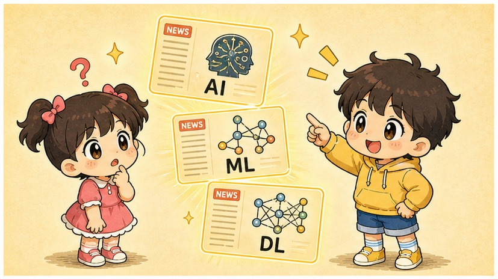
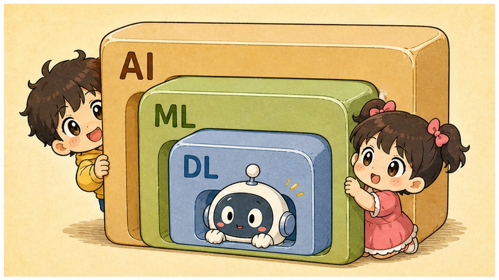
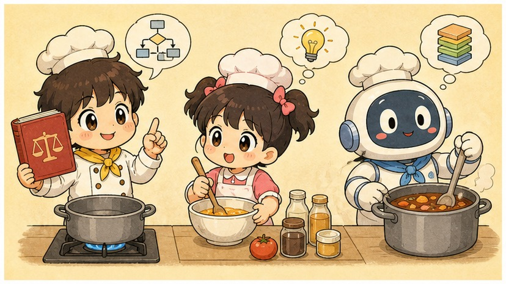
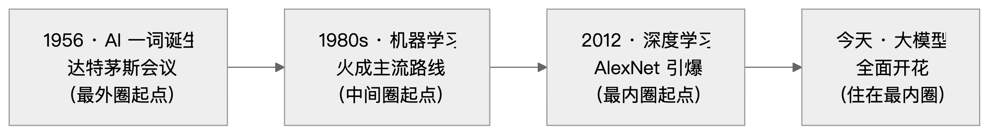
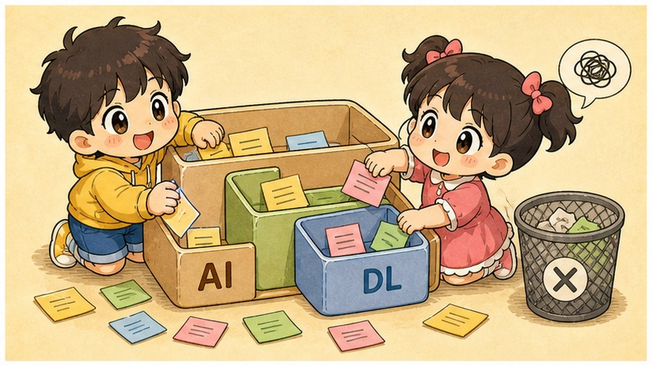
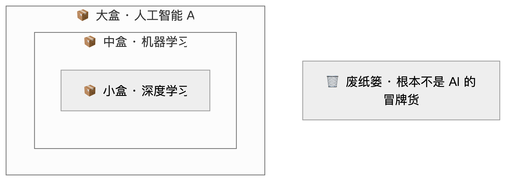

# 第 1 章　三个套娃罢了——AI、机器学习与深度学习

> ### 🎯 先别往下翻 · 这一章要破的题
>
> **🔥 痛点**：你刷手机，三条新闻——"某公司发布最强 **AI**""用**机器学习**预测股价""**深度学习**攻克蛋白质"。这仨长得像三胞胎，到底啥关系？谁比谁厉害？
> **🤔 换你来**：如果让你给它们排个座次，你会怎么排？先想 30 秒。
> **🧱 笨办法会撞墙**：大多数人把它们当成**三个并排、可互换的高科技**——可这样你永远理不清，因为它们**根本不在一个层级上**。
> 那它们到底什么关系？往下看，元元用一套套娃给你讲明白。👇

新学期第一天，元元的同桌换人啦。转来的是小满——一个笑起来眼睛弯弯的小美女（*^__^*）。元元心里那叫一个美，琢磨着怎么在新同桌面前露一手。机会很快就来了。

---

## 第 1 节　朋友圈里的三个花名

▲ 图1-1 · 朋友圈里的三个花名

课间，小满刷着手机，眉头越皱越紧，最后干脆把屏幕递到元元面前：

> 小满：「元元你看，这三条新闻——」
> 　　　第一条：「某公司发布最强 **AI** 大模型」
> 　　　第二条：「用 **机器学习** 预测明天的股价」
> 　　　第三条：「**深度学习** 攻克蛋白质结构」
> 小满：「AI、机器学习、深度学习……这是三种不同的高科技吗？到底谁比谁厉害呀？」

元元一听，机会来了！他挺起小胸脯，刚要开口——其实心里也有点儿虚，因为他以前也觉得这是三个并排的东东，谁也说不清谁。

但元元脑子一转，瞄到桌上小满带来的一套**俄罗斯套娃**，顿时计上心来。他拎起套娃，"啪"地往桌上一放：

> 元元：「小满你听好了。这三个名字啊，**根本不是三胞胎，而是一套套娃！**」

很多人之所以被这三个词绕晕，就是因为新闻和广告**总把它们平着摆**，像超市货架上并排的三瓶饮料，让你以为是三选一。

可真相是——它们**一个套一个**：

> 🪆 **最外面、最大的那个娃娃，是「人工智能 AI」。**它块头最大，肚子里啥都能装。
> 　🪆 拧开它，里面是个**中等娃娃「机器学习 ML」**。
> 　　🪆 再拧开，最里面那个**最小的娃娃，就是「深度学习 DL」**。

这个画面一立住，好几件事立刻就不用背了：

- 最小的娃娃（深度学习）**铁定**待在中娃娃（机器学习）肚子里，也**铁定**在大娃娃（AI）肚子里——**小圈一定属于大圈**。
- 可反过来不成立！大娃娃肚子里，除了那俩小娃娃，**还空着一大片地方**——那儿住着一些"是 AI、却不会学习"的老古董。这片空地，待会儿元元要专门带你去逛逛，那是 99% 的人都没注意过的盲区。

小满眼睛一亮：「哦——所以它们不是谁比谁厉害，是谁装在谁肚子里！」

元元得意地点点头。要早知道这么简单，当初自己抱着三个词死记硬背，那真是**太浪费表情了**(￣▽￣)。

---

## 第 2 节　厨房里的三种厨师

▲ 图1-2 · 厨房里的三种厨师

套娃讲清了"谁套谁"，可小满又抛来一个更要命的问题：

> 小满：「那……凭啥这么分圈呀？总得有个道理吧？」

问得好！为了讲这个道理，元元把小满拽进了**食堂后厨**。同样是"把菜做好吃"这件事，后厨里站着三种段位的厨师——

**第一种 · 照菜谱派 🍳**

他手里攥着一本**祖传菜谱**：盐放几克、火开几分、几点几秒翻面，**每一步都是别人提前替他写死的**。菜谱里有的菜，他做得分毫不差；可客人一句"今天想吃淡点儿"——菜谱上没写啊——他当场就傻了。他从不"懂"味道，只会照着指令死板地执行。

> 👉 这就是**传统 AI**：规则全靠人手写，机器只管照着跑。它挺能干，但**压根不会"学"**。

**第二种 · 试错自创派 🔥**

这位没有完整菜谱，靠的是另一套打法：**做一道、尝一口、看食客的脸色、回头再改**——咸了下回少放盐，火大了下回拧小点儿。几千次"做—尝—改"折腾下来，他的手自己长出了"咋搭才好吃"的**手感**。没人给他写规则，规则是他**从一次次试错的反馈里自己悟出来的**。

> 👉 这就是**机器学习**："学习"俩字，从这儿开始才算名副其实。

**第三种 · 天才味觉大厨 👅**

他也属于试错派，但天赋逆天：他的舌头和大脑是一套**层层叠叠的味觉系统**——第一层尝出咸甜酸，第二层尝出"咸里带一丝鲜"，第三层竟能尝出"这是外婆灶台的味道"。他能从最生的食材，**自动地、一层一层地**品出越来越玄妙的"好吃规律"，根本不用人教他"该先看咸度还是先闻香味"。

> 👉 这就是**深度学习**：它也是试错派（也是机器学习），只不过用的是一套**很多很多层的"神经网络"**，能自己把数据一层层嚼透。

看出门道没有？三种厨师，**段位一级套一级，后一种是前一种的升级版**——这不就是套娃嘛！而真正把"圈"切开的那条线，是这么一句话：

> **规则到底打哪儿来？** 是人手写死的（照菜谱派），还是机器从数据里自己悟的（后两种）？

小满把手一拍：「懂了！会不会自己悟，就是分水岭！」

---

## 第 3 节　三个圈、三句话、三个年份

▲ 图1-3 · 三个圈、三句话、三个年份

光有比喻还不够扎实，元元决定把三个娃娃挨个儿拧开，给小满看个清清楚楚。每个圈，**只记最关键的那一句话**就够本了。

### 最外圈 · 人工智能（AI）——一个梦想，不是一种技术

> **一句话：让机器表现出智能的「一切」努力。**

人工智能生于 **1956 年**。那年夏天，一帮科学家在美国达特茅斯学院开了个会，头一回正式给这门学问起名叫 "Artificial Intelligence"。

划重点：它是**一个领域、一个梦想、一面大旗**，**而不是某一项具体技术**。任何能让机器看着"有点聪明"的法子，不管新旧，统统算进这个最大的圈。

这就解释了那片"空地"：早年的**专家系统**（把专家经验写成成千上万条 if-else）、1997 年掀翻国际象棋世界冠军的 **"深蓝"**（靠暴力穷举棋步＋人写好的评分规则）——它们**百分百是 AI，却百分百不会学习**。它们就是"照菜谱派"，住在 AI 大圈里，却挤不进机器学习的圈。

### 中间圈 · 机器学习（ML）——从数据里自己找规律

> **一句话：不靠人写规则，让机器从数据里自己悟出规律。**

机器学习在 **20 世纪 80 年代** 火成了主流。它带来的转变朴素得很，却惊天动地：

**过去**，想让机器干活，得**一条一条把规则写死**喂给它（这是下一章的主角）。
**现在**，人不写规则了，改成**给机器灌大量数据**，让它自己把规律"嚼"出来。

数据越多，它通常越聪明——"学习"二字这才有了实义。**垃圾邮件过滤器**是它的招牌好戏：谁也写不全"啥样算垃圾邮件"的规则，可你只要喂它几百万封标好"垃圾／正常"的邮件，它自己就摸出了门道。**推荐系统、信用评分**，一个路子。

这里元元埋下一把**贯穿全书的尺子**，请你刻进脑子：

> **想判断一样东西是不是机器学习，就问一句：它从啥数据里学？数据多了，它会不会变得更好？**

### 最内圈 · 深度学习（DL）——用很多层神经网络来学

> **一句话：用「多层神经网络」来做机器学习。**

深度学习在 **2012 年** 彻底引爆。那年，一个叫 **AlexNet** 的多层神经网络在图像识别大赛上把对手摁在地上摩擦，全世界一下子反应过来：这条路，通了！

它是机器学习的**一种方法**（所以稳稳套在 ML 圈里），稀罕就稀罕在那个"**深**"字：层数很多，能**自动地、一层层**从生数据里抽出特征，越往深越抽象（活脱脱那位天才味觉大厨）。这套机制到底咋运转，是咱们第 3 章到第 10 章要慢慢揭的盖子。

你今天耳朵都听出茧子的那些 AI 明星——ChatGPT、Midjourney、人脸识别、AlphaGo、自动驾驶的眼睛……**几乎全挤在这个最里头的小圈里**。这一波席卷世界的 AI 浪潮，主角就是它。

### 三个年份，串成一条线

▲ 图1-1 · AI 发展三圈时间线

小满喃喃道：「往里走一层，年份就往后蹦一截，名字也越眼熟一截……」元元差点儿要给她鼓掌——悟性真高啊这同桌（★ω★）。

---

## 第 4 节　元元的套娃盒子，便签塞塞看

▲ 图1-4 · 元元的套娃盒子，便签塞塞看

光听不练假把式。元元"唰唰"撕下六张**便签纸**，每张写一样东西；又在桌上摆出**三个套着的盒子**——大盒贴 `AI`、中盒贴 `机器学习`、最小的盒贴 `深度学习`；盒子外头还撂着一个**废纸篓**，专收"连 AI 都算不上"的冒牌货。

▲ 图1-2 · 三个套娃的包含关系（AI⊃ML⊃DL）

游戏规则只有一条尺子（还记得吧）：**它从数据里学吗？用的是不是神经网络？** 小满负责猜，元元负责揭晓。来，连环画开演——

**便签①：「深蓝」**
小满脱口：「这么牛，肯定塞最小盒！」
元元摇头，把便签丢进**大盒、但没往中盒里塞**：「错啦~深蓝靠暴力搜棋＋人写的评分规则取胜，**它不从数据学**。它是 AI，可不是机器学习。——大盒，到此为止。」

**便签②：「邮箱的垃圾邮件过滤器」**
小满这回稳了：「它从几百万封邮件里学的，**中盒**！」
元元一挑眉：「漂亮！机器学习的教科书案例，正中靶心（๑•̀ㅂ•́）。」

**便签③：「ChatGPT」**
小满：「这个我知道，**最小盒**！」
元元"啪"地塞进小盒：「没错。但注意啦——它**同时也在中盒、也在大盒里**哦，因为……」
小满抢答：「**套娃**！小圈本来就属于大圈嘛！」

**便签④：「手机相册自动按人脸分类」**
元元直接塞小盒：「人脸识别靠的是卷积神经网络（第 7 章细聊），深度学习最早落地的好戏之一。**小盒，没跑。**」

**便签⑤：「号称'智能'的空调：超过 26℃ 自动制冷」**
小满刚要往大盒放，元元一把拦住，"嗖"地扔进**废纸篓**：「打住！这就**一条 if-else** 而已，没有半点学习。广告里的'智能'，跟技术上的 AI，常常压根不是一码事。这种坑，你以后会见到一卡车（╯‵□′）╯。」

**便签⑥：「购物网站的'猜你喜欢'」**
小满学乖了，先问那把尺子：「它从我和千万人的点击数据里学偏好……越用越准……**中盒，机器学习！**」
元元竖起大拇指：「满分！老做法叫协同过滤，新一代也开始上深度学习啦。」

六张便签塞完，桌面清清爽爽。小满盯着那个被扔进废纸篓的"智能空调"，乐了：「最坑的就是它，挂着 AI 的羊头，卖的是 if-else 的狗肉~」

---

## 第 5 节　这些坑，你八成也会踩

这一章道理不难，可**误会特别多**，而且个个流行。元元把自己当年栽过的三个跟头，掏心窝子讲给小满听。

**坑一：「AI 不就是机器人嘛」**

> ❌ 很多人一听 AI，脑子里立马蹦出会走会说的人形机器人。
> ✅ 真相是——**机器人是"身体"，AI 是"大脑"**。绝大多数 AI（比如 ChatGPT）**根本没有身体**，就是一段在机房里默默运行的程序。

病根：科幻片看多了（￣ー￣）。现实里，AI 多半只是服务器里的一串代码；而很多机器人（比如流水线上的机械臂）只会重复死板动作，**肚子里压根没装 AI**。身体和大脑，俩事儿。

**坑二：「深度学习这么火，别的机器学习方法都该进博物馆了吧」**

> ❌ 以为深度学习一出，老方法就全过时了。
> ✅ 真相是——在**表格类数据**（就 Excel 那种行行列列）上，梯度提升树这些经典方法，到今天**还常常能把神经网络打趴下**。

病根：新闻只爱报深度学习的高光时刻。可工业界的风控、定价、销量预测，照样大把用经典机器学习——**方法没有高低贵贱，只有合不合适**。拿牛刀杀鸡，那才叫浪费表情。

**坑三：「ChatGPT 这么聪明，通用人工智能（AGI）是不是已经实现了？」**

> ❌ 以为聊天这么溜，AI 显然"啥都会"，AGI 就在眼皮底下。
> ✅ 真相是——眼下所有落地的 AI 都是"**专用 AI**"，换个场子就可能露怯；**真正的通用人工智能（AGI）啥时候来，至今是个没人敢拍板的开放问题**。

病根：把"会聊天"错当成"全能"。大模型至今会出错、会一本正经地胡说（这毛病叫"幻觉"，第 29 章专门收拾它），离稳稳当当的通用智能还远着呢——**到底有多远，连顶尖专家都在掐架**。

---

## 第 6 节　收尾大招：一句话识破"假 AI"

小满听完直拍大腿：「这一章我算是彻底拎清了！」元元说，别急，临走再送你一张**武功秘籍**，外加一招**收尾大杀器**。

### 三个圈，一张表收干净

| 看哪儿 | 🔵 人工智能 AI | 🟡 机器学习 ML | 🟢 深度学习 DL |
|---|---|---|---|
| **一句话本质** | 让机器变聪明的"一切努力"（梦想／领域） | 从数据里自己找规律（一条路线） | 用多层神经网络来学（一种方法） |
| **生于哪年** | 1956（达特茅斯会议） | 1980 年代（火成主流） | 2012（AlexNet 引爆） |
| **规则打哪来** | 可以是人手写的 | 从数据里学出来 | 从数据里**一层层**学出来 |
| **会不会学习** | 不一定（专家系统就不会） | 会 | 会，而且更深 |
| **当家选手** | 深蓝、专家系统 | 垃圾邮件过滤、推荐系统 | ChatGPT、人脸识别、AlphaGo |
| **对应哪种厨师** | 整个后厨 | 试错自创派 | 天才味觉大厨 |

### 收尾大招：一句话识破"假 AI"

往后只要有人拍着胸脯向你兜售"搭载 AI"的产品，你不用懂任何技术，**就笑眯眯地追问一句**——

> 　🗣️ **「它从什么数据里学习？数据变多了，它会不会变得更好？」**
>
> - 对方支支吾吾"规则是我们配置好的" → 得，那只是**普通程序＋一个时髦词**，废纸篓见。
> - 对方眼睛发亮"它会随数据越用越强" → 这才是**如假包换的机器学习**。

一招制敌，连原理都不用展开。不信你下回试试看 ^^。

### 把整章拧成一句话塞进脑子

> **深度学习 ⊂ 机器学习 ⊂ 人工智能。**
> 小圈一定属于大圈，可大圈里还住着"会算不会学"的老古董。
> 今天刷屏的那些 AI，几乎全挤在 2012 年才引爆的最里头那个小圈里。

---

小满合上手机，忽然又冒出个新问题：

> 小满：「你说机器学习的本事，是从数据里自己悟规律……可它到底**咋个悟法**呀？人不写规则，机器凭空就会了？」

元元神秘一笑：「嘿，这正是一场改变整个时代的大转弯——**从'人写规则'到'喂数据'**。这事儿啊，咱们下一章再唠（￣︶￣）↗」

---

## 🧰 装进你的工具箱

> **🔑 一句话方法**：**深度学习 ⊂ 机器学习 ⊂ 人工智能**——它们是套娃，不是三胞胎；小圈必属于大圈，但大圈里还住着"会算不会学"的老古董（深蓝）。
> **🎯 触发器 · 以后遇到这种情况就掏出它**：任何东西号称"AI"，就用这把尺子追问——**"它从数据里学吗？数据变多它会变好吗？"** 答"规则是我们配置的"=普通程序；答"越用越强"=真机器学习。
>
> **✍️ 合上书自测**（先自己答，再回看）：
> 1. "深蓝"是 AI 吗？是机器学习吗？为什么？
> 2. 传统程序和机器学习，最根本的区别是哪一点？
> 3. 朋友的产品宣称"搭载 AI"，你问哪一句话就能识破真假？

> 🪜 **下一章预告**：第 2 章 · 机器是怎么"学习"的——从写规则到喂数据。

---
· ｜ [📖 目录](../README.md) ｜ [下一章 →](../stage_1/chapter_02.md)

> 在线阅读《看得见的 AI》· 全 30 章免费 —— 回到 [**项目首页**](../../README.md)，觉得有用点个 ⭐ Star 让更多人看到。
