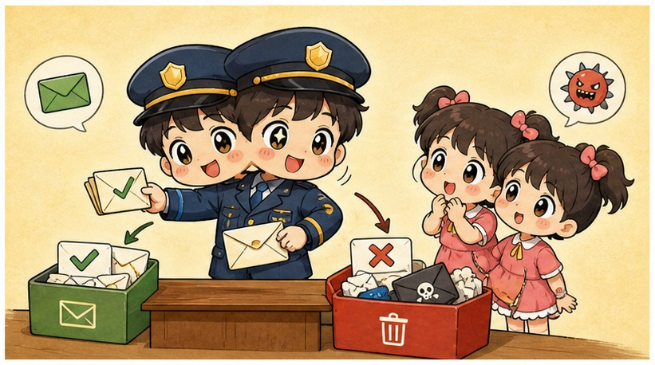
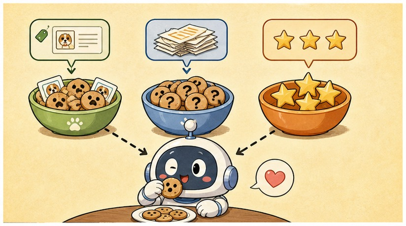
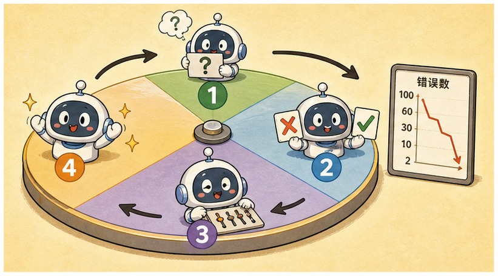
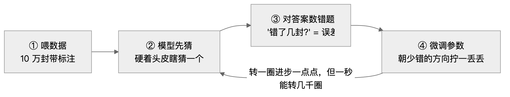

# 第 2 章 · 机器是怎么"学习"的——从写规则到喂数据

> ### 🎯 先别往下翻 · 这一章要破的题
>
> **🔥 痛点**：老板让你写个**垃圾邮件过滤器**，你手里只有一种武器：`if-else`（如果……就……）。你会怎么写？
> **🤔 换你来**：先在脑子里写两条规则试试。
> **🧱 笨办法会撞墙**：你八成会写"**如果标题含'中奖'就拦截**"……可骗子把"中奖"改成"中　奖""恭喜獲獎"，你那几百条规则**唰地全废了**（这叫规则爆炸）。
> 规则写不完，那到底该怎么办？这正是整个 AI 时代的起点——往下看。👇

这一章，元元就带小满把这层窗户纸捅破。说穿了，整个 AI 时代的起点，就是**一个箭头掉了个头**而已。不信你往下看（￣▽￣）。

---

## 第 1 节　元元当上了"垃圾邮件警察"

▲ 图2-1 · 元元当上了"垃圾邮件警察"

为了讲明白，元元给自己派了个活儿——假装回到 2002 年，当一名程序员，老板甩给他一个任务：**写个垃圾邮件过滤器**。手里的武器只有一种：`if-else`（如果……就……）。

元元撸起袖子开干。他在桌上铺开一张大纸，开始一条条写规则：

> 　如果标题里有"中奖" → 拦截！
> 　如果正文里有"免费" → 拦截！
> 　如果标题全是大写字母 → 拦截！
> 　……

写到第 500 条，元元正得意呢，骗子出招了：把"中奖"改成"中　奖"（中间加个空格），又改成"恭喜您獲獎"（换成繁体）——**元元那 500 条规则，唰地一下全废了**(；´Д｀)。

> 小满：「那你就再补规则呗？」
> 元元（欲哭无泪）：「补啊！可补到后来，规则跟规则之间开始打架——这条说拦、那条说放，好好的正常邮件反而被误杀了……」

这个死胡同，有个专门的名字叫**规则爆炸**。它就是"人写规则"这条老路的死穴。

元元把笔一摔，画了两张卡片，让小满盯着**箭头的方向**看：

> **🅰️ 老路 · 传统编程**
> 　　**规则 ＋ 数据　→　答案**
> 　　（人来写规则。规则说得清的活儿——算个税、算运费——它又快又稳。规则说不清的呢？抓瞎。）
>
> **🅱️ 新路 · 机器学习**
> 　　**数据 ＋ 答案　→　规则**
> 　　（人只管端原料：一大堆数据，外加每条数据的正确答案。机器**自己反推出规则**——它推出来的这套规则，就是我们天天挂在嘴边的"模型"。）

你发现没有？**两张卡片就差在箭头掉了个头**：老路是"人给规则、机器算答案"，新路是"人给答案、机器找规则"。

机器学习的解法干脆利落：收集 10 万封邮件，人工标好"垃圾／正常"，整批喂给算法，让它自己统计出"哪些特征凑一块儿最可疑"。骗子一变招？再喂一批新邮件重训一遍就跟上了。

> 元元一拍大腿：「这一掉头最牛的地方在于——那些人**会做、却说不清咋做**的事，第一次有解了！你写不出'猫'的定义，可你拿得出一百万张猫的照片啊！」

要早懂这个道理，当年那 500 条 `if-else` 写得我手都酸了，真是**太浪费表情了**(´;ω;｀)。

---

## 第 2 节　喂数据，也分三种喂法

▲ 图2-2 · 喂数据，也分三种喂法

小满听明白了"喂数据"，可又冒出个问题：「那这个'答案'，又是打哪儿来的呀？」

问到点子上了！"喂数据"其实分三种喂法，区别就在**这一个问题**上：**正确答案从哪儿来？** 这三个词在 AI 新闻里出场率高得吓人，认清它们，后面的章能轻松一大截——

| 喂法 | 答案从哪来 | 一句话 | 招牌好戏 |
|---|---|---|---|
| **① 监督学习** | 人提前标好的 | 拿"带答案的练习册"刷题 | 垃圾邮件分类、房价预测 |
| **② 无监督学习** | 压根没有答案 | 只给数据，让机器自己找结构 | 把用户自动分成"剁手党/比价党/潜水党" |
| **③ 强化学习** | 环境事后给的奖惩 | 没有练习册，只有一个会打分的裁判 | AlphaGo、打游戏的 AI、学走路的机器人 |

元元教了小满一句**三秒归类口诀**，屡试不爽：

> 　🗣️ **先问一句："答案从哪来？"**
> 　- 答案是人提前标好的 → **监督学习**
> 　- 压根没答案、只想找找结构 → **无监督学习**
> 　- 答案是裁判事后给的奖惩 → **强化学习**

> 小满：「等等，监督学习里，猜'是不是垃圾邮件'这种是非题，和猜'这房值多少万'这种填数字题，是一回事吗？」
> 元元：「好眼力！是非题（其实是选择题）叫**分类**，填数字题叫**回归**——都是监督学习，只是题型不同。工业界落地的模型，大半都是它。」

记牢这三个词。等会儿你会看到一个炸裂的事实：**造一个 ChatGPT，这三种喂法会在同一条流水线上全部登场。**

---

## 第 3 节　学习就是转圈圈：猜 → 比对 → 微调

▲ 图2-3 · 学习就是转圈圈：猜 → 比对 → 微调

知道了"机器自己找规则"，下一个问题自然是：它到底**怎么找**？答案朴素得让人意外——不靠灵感，靠一个**不停重复的小圈圈**。

元元搬出一个自制的"刷题转盘"，墙上挂了块**错题计数器**，拉着小满玩了起来。规则是这样的（盯住那 1000 封"模拟试卷"）：

▲ 图2-1 · 机器学习训练循环：猜→比对→微调

**连环画开演——**

🎬 **第 1 圈**：参数全是随机数，模型对垃圾邮件一无所知，纯属乱猜。小满瞄一眼计数器：「啊，1000 封错了 **471** 封，跟抛硬币差不多嘛！」

🎬 **第 10 圈**：错题降到 **392**。元元摇着转盘：「看，往少错的方向拧一拧……」

🎬 **第 100 圈**：**241**。「咦，真在降！」小满来劲了。

🎬 **第 1000 圈、1 万圈……**：计数器哗啦啦往下掉——**118、46**……

🎬 **第 100 万圈**：稳稳停在 **12 封**。小满瞪大眼：「就……就这么转圈圈转出来的？！」

元元一摊手：「对。这个'猜 → 比对 → 微调'的闭环，行话就叫**训练（training）**。你看，单看一圈，进步小得可怜；可它一秒能转成千上万圈——**'学习'的全部秘密，就俩字：笨办法 × 巨大次数。**」

> ⚠️ 小满追问：「那第④步'朝哪个方向拧、拧多少'，咋算出来的？」
> 元元神秘一笑：「这正是深度学习最核心的魔法，留着第 4 章《训练就是下山》专门拆。这一章你先记住'转圈圈'这个画面就够本啦（๑•̀ㅂ•́）。」

---

## 第 4 节　同一个圈圈，喂出一个 ChatGPT

▲ 图2-4 · 同一个圈圈，喂出一个 ChatGPT

小满忍不住问：「这套转圈圈，跟 ChatGPT 那种大模型有啥关系？」

元元把声音压低，故作神秘：「关系就是——**全部**。大模型，就是这个圈圈开到极限的产物。变的只有两处：**题目换了，规模炸了。**」

**题目换成了啥？** 就一道题：**猜下一个词。**

元元拿张纸盖住一句诗的最后一个字，让小满猜：

> 　**「床前明月 ＿」**
>
> 小满想都没想：「光！」
> 元元掀开纸：「对喽——下一个词'光'**本来就写在原文里**！妙就妙在这儿：**答案自带，根本不用人工标注！** 机器自己出题、自己对答案，这叫**自监督学习**，你就理解成'监督学习的免费版'。」

这一下可不得了。标注**免费**了，数据规模才能从"10 万封邮件"一路冲到——**万亿个词**（整个互联网）。

元元又拖了拖那个"训练量"的想象滑块，给小满演示一个小模型怎么被"喂大"：

> 🎬 **训练量 = 0 字**：参数全随机，"床前明月"后面五个候选词概率几乎一样高，它连"你好"都接不顺。
> 🎬 **训练量 = 几亿字**：常见说法的概率被一点点推高，离谱选项被压低。
> 🎬 **训练量 = 整个互联网**：「光」的概率压倒性地高。它没"读懂"月光，只是统计证据多到吓人罢了。

可光会接话，还成不了 ChatGPT。从"复读机"到"贴心助手"，还得闯**三关**——注意看，第 2 节那三种喂法，在这条流水线上**全部登场**：

| 关卡 | 干啥 | 用哪种喂法 |
|---|---|---|
| **第一关 · 预训练** | 拿海量互联网文本猛刷"猜下一个词"，转上万亿圈。出炉时它装满了语言、知识和套路，但只会接话 | 自监督（≈监督的免费版） |
| **第二关 · 指令微调 SFT** | 人工写一批"问题＋模范回答"喂它，它从"复读机"变成"会答题的助手" | **监督学习** |
| **第三关 · RLHF** | 人给它的回答打分：有用、诚实加分，胡说、冒犯扣分，把脾气磨顺 | **强化学习** |

> 小满倒吸一口气：「所以 ChatGPT 写诗、写代码的全部本事，都是从'猜下一个词'这一道破题里长出来的？！」
> 元元：「一字不差。题目足够简单 ＋ 数据足够海量 ＋ 圈圈转够多次——**仅此而已**。」

（这三关每一关后面都有专章细讲：预训练在第 12 章，SFT 和 RLHF 在第 13 章。这儿先混个脸熟。）

---

## 第 5 节　这些坑，你八成也会踩

这一章听着顺，可坑特别多，元元把自己栽过的三个，掏心窝子讲给小满——

**坑一：「机器学习，就是机器像人一样'自学成精'」**

> ❌ 以为机器有好奇心、会顿悟，自己越学越精。
> ✅ 真相是——它是一个**纯数学的优化过程**：照着误差信号，机械地把一堆数字微调到位。

病根：「学习」这个词太有人味儿了。机器既不好奇也不开窍，它只是没日没夜重复"猜 → 比对 → 微调"。ChatGPT 也不例外——它的全部"学习"，就是把"猜下一个词"做了上万亿遍。**把它想成"自动调参的统计机器"，你对它本事和短板的预判，反而会准得多。**

**坑二：「数据越多，模型一定越好，使劲堆就完了」**

> ❌ 以为数据是体力活，堆得越多越强。
> ✅ 真相是——**质量和分布，往往比数量更要命。垃圾进，垃圾出。**

病根：新闻总爱炫"用了多少万亿数据"。可 100 万条标错的样本，不如 1 万条标对的；只拿大城市房价训出来的模型，搬到县城必然抓瞎——**数据没覆盖到的情形，模型压根学不会**。大厂如今砸大钱"洗数据"、买高质量语料，就是这个道理。（这坑第 5 章还要细挖。）

**坑三：「模型答对了，说明它'理解'了任务」**

> ❌ 以为答得对 = 真懂了。
> ✅ 真相是——它只是**拟合了统计规律**：在见过的数据里，找到了"特征"和"答案"之间的相关性。

病根：拟人化的宣传话术。有个经典翻车案例：一个区分**狼和哈士奇**的模型，实际学到的规律竟是"**背景有雪 ＝ 狼**"——就因为训练照片里狼总站在雪地上。换张草地上的狼，它立马认错。大模型"一本正经胡说八道"（幻觉）同根同源：它吐的是"统计上最像答案的词"，不是"查证过的事实"（第 29 章细讲）。

---

## 第 6 节　收尾大招：一句话归类任何 AI

临别老规矩，元元送小满一张**武功秘籍**外加一招**收尾大杀器**。

### 一张表，看尽"喂数据"的门道

| 看哪儿 | 老路 · 传统编程 | 新路 · 机器学习 |
|---|---|---|
| **箭头方向** | 规则＋数据 → 答案 | 数据＋答案 → 规则 |
| **谁找规则** | 人手写 | 机器自己找 |
| **擅长** | 规则说得清的事（算税、算运费） | 规则说不清的事（认猫、翻译、聊天） |
| **死穴** | 规则爆炸 | 吃数据、吃算力 |

### 收尾大招：三秒归类任何 AI 应用

往后不管碰上哪个 AI 应用，你都不用懂技术，**就问它一句**——

> 　🗣️ **「它的答案从哪儿来？」**
> 　- 人提前标好的 → **监督学习**
> 　- 压根没答案、自己找结构 → **无监督学习**
> 　- 裁判事后给的奖惩 → **强化学习**

一句话就能给任何 AI 上户口，连原理都不用展开。不信你下回看到新闻里的 AI 就试试看 ^^。

### 把整章拧成一句话塞进脑子

> **机器学习 = 把"人写规则"的箭头掉个头，变成"机器从数据＋答案里自己找规则"。**
> 找规则的办法笨得可爱：猜 → 比对 → 微调，转上亿万圈。
> ChatGPT 不过是这个圈圈开到极限——题目换成"猜下一个词"，数据换成整个互联网。

---

小满托着腮：「转圈圈我懂了……可第④步老说'微调参数'。这个**参数**，到底长啥样啊？是个什么东西能被'拧'？」

元元眼睛一亮：「问得太好了！下一章，咱们就把机器学习最小的那个零件——**一个'神经元'**——拆开来，看看里头被拧的'参数'本人，到底是何方神圣（～￣▽￣）～」

---

## 🧰 装进你的工具箱

> **🔑 一句话方法**：机器学习 = **把箭头掉个头**——从"人写规则、机器算答案"，变成"人给数据+答案、**机器自己反推出规则**"。喂法分三种，区别只在"**答案从哪来**"：人标的=监督，没答案=无监督，环境奖惩=强化。
> **🎯 触发器 · 以后遇到这种情况就掏出它**：判断一个任务该用传统编程还是机器学习——**"规则能一句话说清吗？"** 能（算个税）→`if-else`；说不清但能收集带答案的样本（认猫、滤垃圾）→机器学习。
>
> **✍️ 合上书自测**：
> 1. 为什么"人写规则"这条老路在垃圾邮件上会撞墙？
> 2. 监督/无监督/强化，一句口诀怎么区分？
> 3. "自动判断报销是否超标"和"识别发票上的文字"，分别该用哪种？为什么？

> 🪜 **下一章预告**：第 3 章 · 一个神经元的诞生——权重、偏置与激活。

---
[← 上一章](../stage_1/chapter_01.md) ｜ [📖 目录](../README.md) ｜ [下一章 →](../stage_1/chapter_03.md)

> 在线阅读《看得见的 AI》· 全 30 章免费 —— 回到 [**项目首页**](../../README.md)，觉得有用点个 ⭐ Star 让更多人看到。
