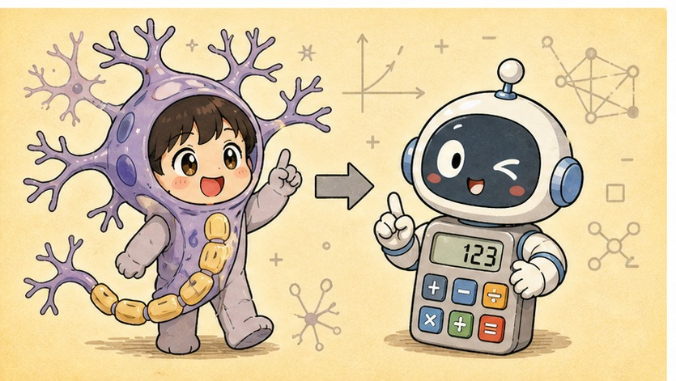
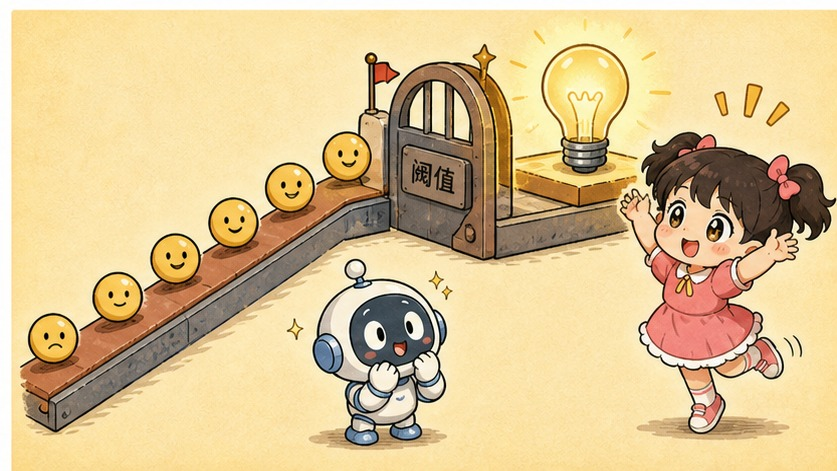
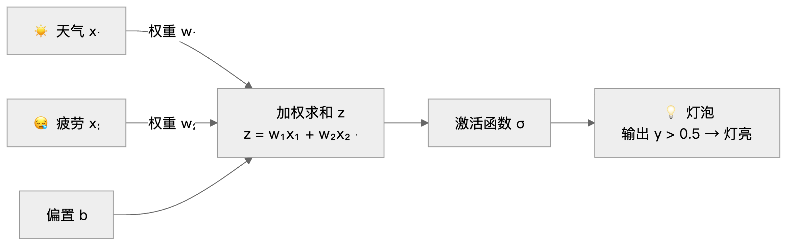

# 第 3 章 · 一个神经元的诞生——权重、偏置与激活

> ### 🎯 先别往下翻 · 这一章要破的题
>
> **🔥 痛点**：上一章说机器学习的关键是"自己找规则"。可规则装在哪个零件里？这个零件——**神经元**——听着像生物课，它到底怎么"做决定"的？
> **🤔 换你来**：想想你自己纠结"今天要不要去跑步"，脑子是怎么拍板的？
> **🧱 笨办法会撞墙**：一听"神经元""神经网络"，你八成以为它在**模拟人脑**，很玄、很高级——**这恰恰是要给你摘掉的第一个滤镜**。
> 真相小得多：它就是一道你天天在做的小学算术题。往下看。👇

这一章，元元就把机器学习最小的那个零件——**一个神经元**——大卸八块，让小满亲眼看看里头被拧的"参数"本人。别被"神经元"三个字唬住，说穿了，**它就是一道你天天在做的小学算术题**(￣▽￣)。

---

## 第 1 节　你每天都在脑子里跑"神经元"

▲ 图3-1 · 你每天都在脑子里跑"神经元"

周末早上，元元盯着窗外发呆，纠结一件大事：**今天到底要不要去跑步？**

小满凑过来：「这有啥好纠结的？」

元元一本正经：「你别说，我脑子里正在跑一个神经元呢！你听啊——」

> 　☀️ **天气好** → 加分（心情都晴朗了，想出门）
> 　😪 **身体累** → 减分（昨晚熬夜，腿像灌了铅）
> 　🛋️ 而我对跑步这事儿**本来就有几分抗拒** → 这是个**底分**

「心里把这笔账一算，**总分要是过了某条线**，我鞋一蹬就出门；没过线，那就瘫沙发上（￣ω￣）。」

小满乐了：「这不就是……掂量掂量嘛！」

「对喽！」元元一拍桌子，「人工神经元干的事，**一模一样**——接收几个数字，每个各乘一个'权重'加起来，再加一个'底分'，最后问一句：**过线了吗？**」

他刷刷写下自己今天的"跑步意愿"账：

> 　**跑步意愿 ＝ 天气 ×（+1.5） ＋ 疲劳 ×（−1.2） ＋ 底分（−0.5）**

「看，天气的权重是 **+1.5**：我很在乎天气，晴天给我加好多分；疲劳的权重是 **−1.2**，负权重就是减分项；底分 **−0.5** 说明我对跑步本来就不太上头。总分一过线，今天就去。」

这道账，就是整门深度学习的**最小零件**。把它写成"神经元标准式"，长这样：

> 　**z ＝ w₁x₁ ＋ w₂x₂ ＋ b**　　然后　　**y ＝ σ(z)**

别慌！这行式子里全是刚认识的老熟人：

- **x**：输入（今天的天气、疲劳）
- **w**：权重（你多在乎它）
- **b**：偏置（那个底分）
- 先算出分数 **z**，再用一个叫 **σ** 的东西把它"压"成最终决定 **y**

> 元元神秘兮兮：「后面足足 27 章讲的所有花活儿，**都是亿万份这行算式的排列组合**。把这一行吃透，你就摸到深度学习的命门了。」

---

## 第 2 节　神经元三件套：权重、偏置、激活

▲ 图3-2 · 神经元三件套：权重、偏置、激活

这道打分题里，藏着三个关键零件——行话叫"三件套"。元元掰着指头给小满数：

**🔧 三件套之一 · 权重（Weight）——"你多在乎它"**

每个输入的**重要性**。正权重加分、负权重减分，绝对值越大、影响越狠。

> 划重点！**权重不是人设定的，是机器从数据里自己'学'出来的。** 上一章念叨的"训练""微调参数"，拧的就是它！小满，你追问的"参数本人"，第一个就是它（￣︶￣）。

**🔧 三件套之二 · 偏置（Bias）——"门槛多高"**

不看任何输入的**底分**，决定那条"线"画多高。

- 偏置高 → 门槛低，神经元一点小事就触发（**风雨无阻型**：底分就快过线了，啥天气都去跑）
- 偏置低 → 门槛高，得攒够一堆正分才肯触发（**晴天限定型**：非得大晴天才肯挪窝）

**🔧 三件套之三 · 激活函数（Activation）——"把分数压成决定"**

最后一道工序，把分数 z **拍板成一个决定**。

- 有个叫 **sigmoid** 的，把任何分数都压进 0～1 之间，像个"可能性"；
- 还有个叫 **ReLU** 的更干脆：负分一律归零，正分原样放行。

这三件套里最不起眼的激活函数，待会儿你会发现，它其实是**整座大厦的承重墙**——这是本章最大的彩蛋，第 4 节揭晓。

---

## 第 3 节　名字借自大脑，本事全靠数学

▲ 图3-3 · 名字借自大脑，本事全靠数学

小满一脸崇拜：「'神经元''神经网络'……是不是说，这玩意儿在**模拟人脑**呀？好高级！」

元元赶紧摆手：「打住打住——这是**第一个要给你摘掉的滤镜**(￣▽￣)。」

上世纪 40 年代，研究者瞅见生物神经元有个行为：**信号汇总、一过阈值就放电**。他们从中抽出了这道打分题。对照关系是这样的——

| 生物神经元 | 人工神经元 | 它干的事 |
|---|---|---|
| 树突 | 输入 x | 接收上游传来的信号 |
| 突触强度 | 权重 w | 决定每路信号被放大还是削弱 |
| 胞体 | 加权求和 ＋ 激活 | 把信号汇总，过了阈值才"放电" |
| 轴突 | 输出 y | 把结果传给下一个神经元 |

> 元元敲黑板：「但你千万记住——**这只是一次松散的'起名致敬'，不是模拟！** 真实神经元有化学递质、脉冲时序、上百种细胞类型，复杂程度根本不在一个量级。人工神经元，**就是借了个好名字的简单函数**。」

「打个比方，」元元补刀，「**飞机是受鸟启发的，可飞机不靠扑棱翅膀飞。** 现代深度学习靠的是数学和算力，几乎不参考脑科学的最新发现。'硅基脑细胞'这种说法，听听就好，别当真。」

---

## 第 4 节　彩蛋揭晓：为什么非得有激活函数

▲ 图3-4 · 彩蛋揭晓：为什么非得有激活函数

现在揭那个彩蛋。元元问小满一个"刁钻"问题：

「要是把激活函数这道工序**去掉**，会咋样？」

小满：「少一步……应该没啥大不了吧？」

元元摇头，在桌上摆了俩演示——

> **🚫 去掉激活函数：叠一万层，还是一条直线**
>
> 直线套直线，整理一下还是直线。`w₂(w₁x + b₁) + b₂` 算一算，无非又是另一条直线。**层数再多，整个网络也只会画直线**——连"晴天但太累就不去"这种**拐弯逻辑**都表达不了。
>
> **✅ 加上激活函数：每一层都能拐一个弯**
>
> 激活函数给直线注入了"弯折"。一层拐一个弯，层层叠起来，就能围出**任意复杂的边界**——从认出一只猫，到接住一句话。

> 小满恍然大悟：「哦——所以它不是可有可无的小配角，是**让网络能拐弯的命根子**！」
> 元元：「Bingo！没有它，叠一百万层也是白搭，那才**真叫浪费表情**(´∀｀)。至于'层层弯折'到底咋叠出智能来，嘿，留给第 6 章揭晓。」

---

## 第 5 节　元元的"跑步打分台"：亲手捏一个神经元

光说不练假把式。元元搬出一个自制的**跑步打分台**，拉小满来玩。台子长这样：

▲ 图3-1 · 一个神经元的加权打分流程

左边连线就是权重——**绿色加分、红色减分、线越粗越在乎**。右边三个滑块，拧的是神经元的"性格"。规则只有一条：**输出 y 一旦超过 0.5，灯泡就亮，意思是"去跑步！"**

**连环画开演——元元安排了三个实验：**

🎬 **实验一：把疲劳的权重 w₂ 拧到 0**

小满使劲拖"疲劳"那个滑块，从"精神饱满"拖到"累成狗"……可灯泡**纹丝不动**！

> 小满：「咦？我都快累瘫了它还让我去跑？」
> 元元：「哈哈，因为你把 w₂ 拧成 0 啦——**权重为零，等于完全不在乎**。这一路输入彻底失效，疲劳说了不算数。」

🎬 **实验二：把偏置 b 拉到 +2**

小满刚把 b 拉上去，灯泡"啪"地亮了，而且不管天气好坏、累不累，**几乎一直亮着**。

> 小满：「这……这是个运动狂魔啊！」
> 元元：「对喽，这就是**风雨无阻型**。偏置 b 决定的是'不看任何输入的基础倾向'——底分高到快自己过线了，输入再怎么变都拦不住它。」

🎬 **实验三：一键换"性格"**

元元咔咔点了三个预设按钮，灯泡的脾气跟着大变：

| 一键性格 | 它的脾气 |
|---|---|
| **爱晴怕累** | 天气好就想去，一累就立马打退堂鼓 |
| **风雨无阻** | 偏置拉满，啥情况都去跑（运动狂魔） |
| **晴天限定** | 门槛超高，非得大晴天 ＋ 不累才肯出门 |

> 小满玩上瘾了：「神奇的是——**天气、疲劳这些'今天的情况'我一个没动，光是拧那三个数，神经元的'性格'就全变了！**」
> 元元意味深长地点头：「记住这句话。所谓**训练**，干的就是这件事——让机器**自动**去拧这三个数，直到神经元的'性格'刚好能把活儿干对。这不就接上第 4 章了嘛（～￣▽￣）～」

---

## 第 6 节　这些坑，你八成也会踩

**坑一：「神经网络在模拟人类大脑」**

> ❌ 一听"神经"俩字，就以为机器里装了个电子脑。
> ✅ 真相是——它只借了"汇总信号、过线触发"这点松散直觉，**本质是一个纯数学函数**。

病根：「神经网络」「神经元」这名字起得太成功，媒体配图又老爱放发光的大脑。可现代深度学习的进展，靠的是数学和算力，**几乎不参考脑科学**——飞机受鸟启发，但不靠扑翅膀飞。

**坑二：「一个神经元就已经有点智能了」**

> ❌ 看它"会做决定"，就觉得它有点聪明。
> ✅ 真相是——**单个神经元只能画一条分界直线**，连"两个输入不同才触发"（异或）这种小儿科都学不会。

病根：把"能做决定"误当成"聪明"。你刚在打分台上看到的，**只是一道小学算术题**。智能不在零件里，而在**亿万个零件的组织方式**里——一粒沙不是城堡，但亿万粒沙可以是。

---

## 第 7 节　收尾大招：一眼拆穿任何"决定"

老规矩，武功秘籍 ＋ 收尾大杀器奉上。

### 三件套，一张表收干净

| 零件 | 管什么 | 一句话 | 是不是"参数"（训练要拧的） |
|---|---|---|---|
| **权重 Weight** | 你多在乎这个输入 | 正加分、负减分，越大越在乎 | ✅ 是 |
| **偏置 Bias** | 门槛画多高 | 高门槛挑剔，低门槛随和 | ✅ 是 |
| **激活函数 σ** | 把分数压成决定 | 给网络"拐弯"的能力，承重墙 | ❌ 不是（是固定工序） |

### 收尾大招：把任何决定，翻译成"加权打分题"

往后你纠结任何事——要不要点外卖、买不买这件衣服、跳不跳槽——都能当场拆成一个神经元：

> 　🗣️ **「有哪些输入？各自权重是正是负？我的'底分'（偏置）高不高？」**
>
> 比如深夜纠结点不点外卖：**饥饿**是正权重输入（越饿加分越多），**价格／罪恶感**是负权重输入。要是你"偏置很高"——那就是不饿也想点的**外卖重度依赖型**，还没看任何输入，底分就快过线啦（╯▽╰）。

拆着拆着你会发现：**所谓"做决定"，底层都是一道加权打分题。** 你已经会读神经元的"心"了。

### 把整章拧成一句话塞进脑子

> **一个神经元 = 一道加权打分题：输入各乘权重、加总、加底分，过线就触发。**
> 权重管"在乎什么"、偏置管"门槛多高"、激活函数管"拐弯 ＆ 拍板"。
> 它的名字借自大脑，本事却全靠数学；单个憨憨的很，可亿万个连起来，就是另一回事了。

---

小满把三个滑块来回拧了半天，忽然抬头：「你说训练就是让机器**自动**拧这三个数……可它咋知道该往哪边拧、拧多少呢？总不能瞎拧吧？」

元元笑了：「问到第 4 章的题眼上了！机器拧参数，靠的是一手绝活，叫**'蒙着眼下山'**——把'错'变成一座山，一步步往谷底摸。走，下一章我蒙上你的眼，你就懂了（￣▽￣）ノ」

---

## 🧰 装进你的工具箱

> **🔑 一句话方法**：一个神经元 = **一道加权打分题**——输入各乘权重、加总、加底分（偏置），过线就触发（激活）。权重管"在乎什么"、偏置管"门槛多高"、激活管"拍板拐弯";**训练，就是让机器自动去调这三个数**。
> **🎯 触发器 · 以后遇到这种情况就掏出它**：听到"神经网络模拟大脑"，你知道那只是借了个好名字；而你纠结任何决定（点不点外卖、跳不跳槽），都能当场拆成"哪些输入×各自权重正负+我的底分"。
>
> **✍️ 合上书自测**：
> 1. 把"深夜要不要点外卖"拆成一个神经元，说出两个输入和它们权重的正负。
> 2. 权重、偏置、激活函数各管什么？哪个不是训练要调的"参数"?
> 3. 为什么没有激活函数，叠一万层网络也只会画直线？

> 🪜 **下一章预告**：第 4 章 · 训练就是下山——损失函数与梯度下降。

---
[← 上一章](../stage_1/chapter_02.md) ｜ [📖 目录](../README.md) ｜ [下一章 →](../stage_1/chapter_04.md)

> 在线阅读《看得见的 AI》· 全 30 章免费 —— 回到 [**项目首页**](../../README.md)，觉得有用点个 ⭐ Star 让更多人看到。
