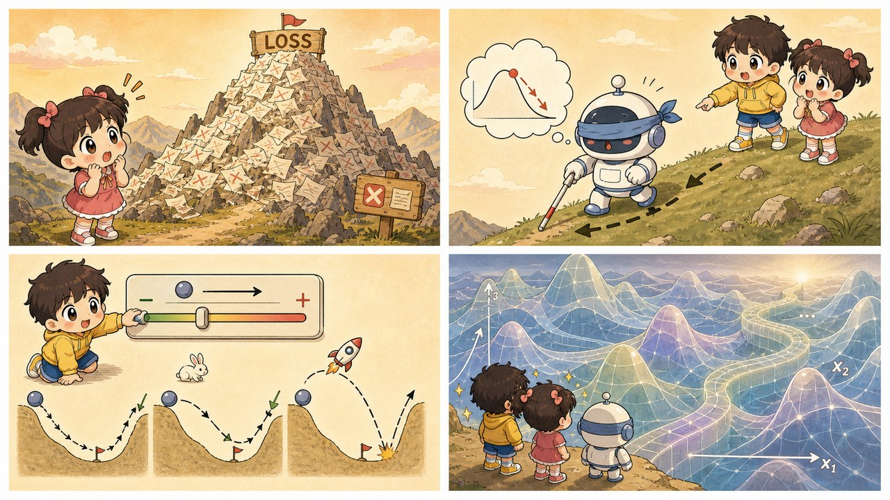

# 第 4 章 · 训练就是下山——损失函数与梯度下降

> ### 🎯 先别往下翻 · 这一章要破的题
>
> **🔥 痛点**：上一章那三个数（权重、偏置），机器**一开始全是瞎蒙的随机数**。它怎么自己把几十亿个随机数，调成有用的数？
> **🤔 换你来**：几十亿个旋钮，你会怎么找到"最好的那组组合"?
> **🧱 笨办法会撞墙**：你可能想"**把所有可能都试一遍**（穷举），挑最好的"——可哪怕每个参数只试 10 个值，10 亿个参数的组合数，**比宇宙里所有原子加起来还多**，试到世界末日也试不完。
> 穷举行不通，那聪明人怎么办？往下看一个绝妙的笨办法。👇

这一章，元元要把谜底揭了。机器拧参数的绝活，叫**"蒙着眼下山"**。听着玄乎，其实你小时候玩"盲人摸路"就无师自通了。来，元元这就蒙上小满的眼（￣▽￣）ノ。

---

## 第 1 节　先把"错"变成一座山

元元先抛出一个让小满意外的事实：

> 「上一章你认识了神经元，它用权重给输入打分。可你猜，**刚出厂时那些权重是多少？**——**全是随机数！** 模型一开始满嘴胡说八道。」

小满：「啊？那所谓'训练'……」

「就是把这亿万个随机数，**一点点调成有用的数**。」元元说，「整件事，只有三步棋。」

> **第 1 步 · 立一把尺子——损失函数（Loss）**
> 　给每一次"猜错"打分：错得越离谱，分数越高。有了它，"模型好不好"第一次变成了**一个能算出来的数字**。
>
> **第 2 步 · 定一个目标——把损失最小化**
> 　训练的全部目标就一句话：找到让损失尽可能小的那组参数。AI 没有"想学好"的愿望，它只是被算法推着往损失更低处挪。
>
> **第 3 步 · 选一种走法——梯度下降**
> 　把损失想象成**海拔**，训练就是**蒙着眼下山**：摸摸脚下哪边最陡，朝下坡迈一小步，再摸再迈——重复亿万次。

小满卡在第 1 步：「这把'尺子'，具体咋打分啊？」

元元举了个买房的例子，搬出最常用的一把尺子——**平方损失**：

> 　**损失 ＝（猜的值 − 真实值）²**
>
> 预测房价：实际 500 万，你猜 520 万，差 20，损失 = 20² = **400**；猜 510 万只差 10，损失 = 10² = **100**。

「为啥要平方？两个用意，」元元竖起俩指头，「**第一，抹掉正负号**——多猜、少猜都算错；**第二，狠狠放大离谱的错误**——你看，差 20 的罚分（400）是差 10（100）的整整 4 倍！平方损失就是故意的：它对大错格外严厉，逼着模型**优先去修那些离谱的错**。」

---

## 第 2 节　蒙眼下山：四个固定角色

「为啥老强调'蒙着眼'？」元元把眼罩往小满脸上一扣，「因为模型**永远看不见整座山的全貌**——它唯一能做的，是感知**自己脚下这一小块地**的坡度。」

这套下山法里，有四个雷打不动的角色。元元让小满记牢这四张卡，后面每一章都要反复用：

| 角色 | 行话 | 一句话 |
|---|---|---|
| **① 计分尺** | 损失函数 Loss | 把"错得多离谱"压成一个数，它定义了**那座山的形状** |
| **② 脚下的坡感** | 梯度 Gradient | 告诉你当前位置**哪边坡最陡**；它只摸得到脚下这一小块，看不见整座山——这就是"蒙眼"的含义 |
| **③ 步幅** | 学习率 Learning Rate | 每一步迈多大。太小磨蹭，太大……（待会儿你会笑出声） |
| **④ 小坑陷阱** | 局部最优 Local Minimum | 下进个小坑，四面全是上坡，蒙眼的你以为到底了，其实远处还有更深的谷 |

把下山的每个动作，翻译成训练术语，就是这张对照表——

| 下山时的你 | 训练中的模型 | 一句话点破 |
|---|---|---|
| 山的海拔 | 损失值 | 海拔越低，错得越少 |
| 你站的位置 | 当前参数（所有权重） | 挪位置 ＝ 改参数 |
| 脚下的坡度 | 梯度 | 指向最陡方向，只能感知脚下 |
| 一步的大小 | 学习率 | 由人提前设定，最重要的旋钮之一 |
| 走到走不动了 | 收敛 | 梯度≈0，训练到此为止 |

而整个深度学习**最核心的一行式子**，长这样——

> 　**新位置 ＝ 旧位置 − 学习率 × 梯度**

「翻译成人话，」元元说，「梯度指向**上坡**，所以前面取个负号，**朝反方向**（也就是下坡）走；走多远，由学习率说了算。GPT 那种级别的模型，**训练的本质就是这行式子重复亿万次**——没有顿悟，没有灵感，只有**挪步、挪步、再挪步**。」

---

## 第 3 节　元元推小球下山：亲手调步幅

理论齐活，上手玩！元元在桌上铺开一片**起伏的山谷地形**（它真有两个谷：一深一浅），放上一颗小球——**小球 ＝ 当前参数的位置**。每走一步，都严格按那行式子算。旁边还支了块小白板，画**损失下降曲线**，每走一步点一个点。

小满把眼罩戴上，开始下山。元元负责拧那个最关键的旋钮——**学习率（步幅）**。

**连环画开演，三个实验——**

🎬 **实验一：学习率 = 0.15（刚刚好）**

小球稳稳当当，一步一个脚印往谷底挪，白板上的曲线**平滑地往下滑**，最后稳稳停在谷底。

> 小满（摘下眼罩瞄一眼）：「漂亮！这下山姿势教科书级别。」

🎬 **实验二：学习率 = 0.03（太磨蹭）**

元元把步幅拧到很小。小球挪得**那叫一个肉**——挪半天还在半山腰晃悠。

> 小满：「急死了！这要走到啥时候？」
> 元元：「这就是步子太小的下场——**下降极慢**，磨磨蹭蹭。」

🎬 **实验三：学习率 = 1.2 以上（直接起飞）**

元元坏笑一下，把步幅拉满，还换了个起点。只见小球一脚迈过谷底，"哐"地踩到对面山壁上，比原来还高；再一步又弹回来……**在两侧山壁间来回弹跳，最后竟被一脚甩出了地形！**

> 小满笑出声：「哈哈哈它飞了！步子太大扯着……」
> 元元：「——扯着蛋了（￣▽￣）。这叫**震荡**甚至**发散**：山谷往往很窄，大步直接踩到对面墙上，损失越走越高。所以记住——**学习率不是越大越快，适中才快。**」

🎬 **彩蛋：多换几次起点**

元元又随机换了好几个出发点。大多数时候小球都滚进了**最深的谷**；可有一次，它滚进旁边那个**浅坑**就不动了——四面一摸全是上坡，它以为到底了。

> 元元：「看见没？这个浅坑，就是**局部最优**——蒙眼的小球被骗了，远处明明还有更深的谷。这是梯度下降**天生的局限**。」

---

## 第 4 节　诚实补一刀：真实的山有亿万个维度

元元忽然正色：「不过我得跟你说句实话——刚才那个 3D 地形，是个**善意的'谎言'**(；´∀｀)。」

小满：「啊？骗我？」

「真实的下山，发生在你**根本无法想象**的空间里。但好消息，恰恰也藏在那儿。听我慢慢说——」

> **🔹 维度的真相**
> 演示里只有 2 个参数（小球的横、纵坐标），所以山是三维的、能画出来。可真实大模型动辄**几十亿、上千亿个参数**——**每一个参数，都是一个能挪动的方向**。下山发生在**亿万维**的空间里。没有任何人"看见"过那座山，3D 地形只是把它压扁后给你的示意图。

> **🔹 高维的好消息（反直觉！）**
> 你直觉上肯定觉得：维度越高越容易迷路、越容易卡死坑里。**数学上恰恰相反！** 维度一高，"四面八方全是上坡"的真·死坑（真正的局部最优）反而**罕见得要命**——亿万个方向里，**总有几个还能往下走**。高维空间里更常见的是**鞍点**（一些方向上坡、另一些方向下坡），而实际用的下山算法，通常能从鞍点附近**晃出去**。

> **🔹 实践的共识**
> 所以工程师**从不执着于"全局最优"**。用改良版的梯度下降（比如大名鼎鼎的 **Adam**，它会替每个方向自适应地微调步幅），找到一个**足够低、泛化又好**的谷底，模型就够用了。"完美是好的敌人"——在 AI 训练里，这是字面意义上的真理。

> 小满松了口气：「原来那个吓人的'局部最优小坑'，在亿万维里其实没那么可怕……」
> 元元：「对喽。低维直觉，到高维经常翻车——这也是 AI 反直觉的迷人之处（★ω★）。」

---

## 第 5 节　这些坑，你八成也会踩

**坑一：「AI 训练像人一样会'开窍'、会'顿悟'」**

> ❌ 以为模型练着练着，某一刻"灵光一闪"突然就懂了。
> ✅ 真相是——训练只是"新位置 ＝ 旧位置 − 学习率 × 梯度"**重复亿万次**的数值优化，**没有任何灵光乍现的瞬间**。

病根：媒体偏爱"AI 学会了""AI 领悟了"这类拟人动词。可你打开真实的训练日志，只会看到**损失值一点一点往下掉**——哪怕模型最终表现出惊人的"涌现能力"（第 15 章），底层也只是这条平滑下山路的**日积月累**。

**坑二：「学习率越大，学得越快」**

> ❌ 把"步子大"等同于"进度快"。
> ✅ 真相是——**适中才快**：步子过大，一脚跨过谷底、在两侧山壁间来回震荡，甚至损失越走越高、彻底发散。

病根：你刚在演示里**亲眼看小球被甩出山谷**了——比任何解释都管用。山谷往往很窄，大步直接踩对面墙上，比原来还糟。

**坑三：「只要训练得够久，总能找到全世界最低点」**

> ❌ 把优化当成必须考满分的试卷。
> ✅ 真相是——梯度下降只保证"**一路向下**"，**不保证下到全世界最低点**；但实践上"**足够低**"就够好用。

病根：亿万维空间根本没法穷举。工程上的共识是：找到一个**泛化得好**的低谷，远比执着理论上的最优重要——至于"泛化"是个啥，嘿，下一章正好讲。

---

## 第 6 节　收尾大招：一行式子背天下

老规矩，秘籍 ＋ 大杀器。

### 下山四角色，一张表收干净

| 下山的你 | 训练的模型 | 干啥的 |
|---|---|---|
| 海拔 | **损失函数** | 给"错"打分，定义山的形状 |
| 脚下坡度 | **梯度** | 指出最陡的下坡方向（只摸得到脚下） |
| 步子大小 | **学习率** | 最重要的旋钮：太小磨蹭，太大飞出去 |
| 被困小坑 | **局部最优** | 低维里吓人，高维里其实罕见 |

### 收尾大招：把任何"训练"翻译成一句话

往后不管听到多唬人的 AI 训练新闻——"训了 3 个月""烧了几千张卡"——你都可以在心里默念这行式子，瞬间祛魅：

> 　🗣️ **新位置 ＝ 旧位置 − 学习率 × 梯度**
>
> 说穿了，再大的模型训练，也就是**蒙着眼，凭脚下坡度，一小步一小步往谷底挪**，重复亿万次。没有魔法，没有顿悟，只有**挪步**。

> 小满试着念了一遍，乐了：「这么一想，AI 训练突然就……没那么吓人了（´∀｀）」
> 元元：「这就对啦——**祛魅，正是看懂 AI 的第一步。**」

### 把整章拧成一句话塞进脑子

> **训练 = 把"错"变成一座山（损失函数），然后蒙着眼下山（梯度下降）。**
> 梯度指方向、学习率定步幅，"新位置=旧位置−学习率×梯度"重复亿万次。
> 真实的山有亿万个维度，没人见过它全貌；但好在高维里死坑罕见，下到"足够低"就够好用。

---

小满摘下眼罩，又冒出个新疑惑：「你刚说，训练目标是把损失降到尽量低……可万一它**太用功**了呢？把那 12 个练习点一个不差全背下来，损失降到 0，那不是更牛？」

元元眼睛一亮，竖起大拇指：「问到点子上了！'太用功'恰恰是 AI 最大的噩梦之一——它会变成一个**只会死记硬背、一考新题就翻车**的学霸。这个坑，叫**过拟合**。走，下一章，咱们就用'刷题 vs 高考'把它讲透（￣▽￣）」

---

## 🧰 装进你的工具箱

> **🔑 一句话方法**：训练 = 把"错"变成一座山（**损失函数**），然后**蒙着眼下山**（梯度下降）——梯度指方向、学习率定步幅，**"新位置 = 旧位置 − 学习率 × 梯度"** 重复亿万次。没有顿悟，只有挪步。
> **🎯 触发器 · 以后遇到这种情况就掏出它**：看到"训练了 3 个月、烧了几千张卡"，你知道它就在重复"蒙眼下山"这一件事；听到"AI 突然开窍/顿悟"，你知道底层只是损失值一点点往下掉。
>
> **✍️ 合上书自测**：
> 1. 既然目标是找最低点，为什么不让电脑把整座山看一遍、直接挑最低处？
> 2. 学习率设太大（比如 1.5）会发生什么？用"下山"解释。
> 3. 一句话说清损失函数、梯度、学习率各是下山里的什么。

> 🪜 **下一章预告**：第 5 章 · 数据与过拟合——别让 AI 变成死记硬背的学霸。

---

[← 上一章](../stage_1/chapter_03.md) ｜ [📖 目录](../README.md) ｜ [下一章 →](../stage_1/chapter_05.md)

> 在线阅读《看得见的 AI》· 全 30 章免费 —— 回到 [**项目首页**](../../README.md)，觉得有用点个 ⭐ Star 让更多人看到。
