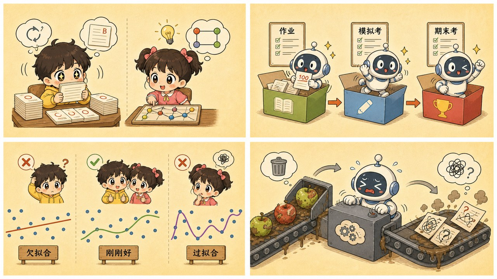
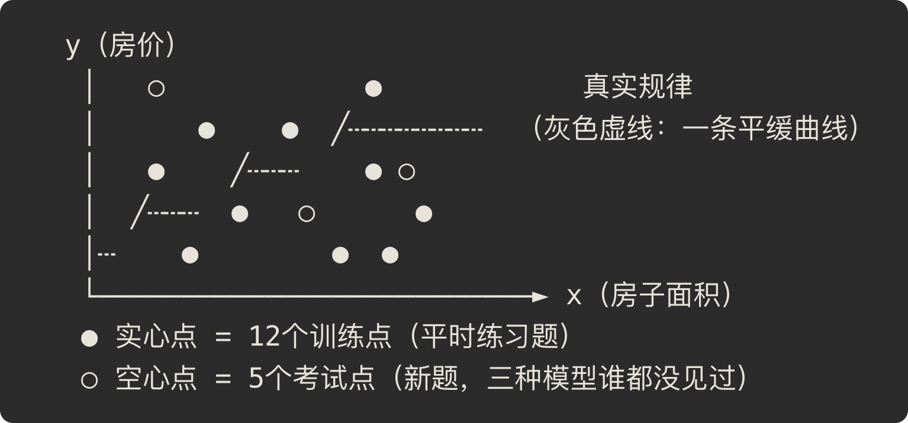

# 第 5 章 · 数据与过拟合——别让 AI 变成死记硬背的学霸

> ### 🎯 先别往下翻 · 这一章要破的题
>
> **🔥 痛点**：上一章说训练就是让"错"越降越小。那——**干脆让模型把练习题全背下来，错误降到 0，不就最牛了吗？**
> **🤔 换你来**：这么干，会有什么隐患？先想想。
> **🧱 笨办法会撞墙**：很多人一看"**训练准确率 99%**"就鼓掌，觉得模型超棒——可它很可能只是**把答案连噪声一起背死了**，一换新题就当场崩盘。
> "背答案"为什么是 AI 最大的噩梦？怎么一眼识破它？往下看。👇

元元却直摇头：「这恰恰是 AI 最大的噩梦之一啊！'太用功'会把模型练成一个**只会死记硬背、一考新题就翻车**的学霸。这个坑，叫**过拟合**。」

这一章是第一阶段的收官章，元元要用一个你再熟悉不过的场景——**刷题 vs 高考**——把它讲个底儿掉（￣▽￣）。

---

## 第 1 节　两个学霸的故事：背答案 vs 真学会

元元给小满讲了个段子，主角是两个备考的学生：

> **学生甲**：把练习册的每道题，**连答案一起背**得滚瓜烂熟。
> **学生乙**：做题时不背答案，专琢磨**方法**。

平时小测验，**背答案的甲回回满分**，把乙甩开一条街——

> 「直到高考，」元元故意顿了一下，「**换了一整批新题。**」

结果呢？

> 　**🅰️ 背答案的甲 · 过拟合**
> 　　平时刷题**全对**，高考**一塌糊涂**。
> 　　他记住的是每道题的标准答案，题目换个数字就傻眼。模型把训练数据**连噪声带巧合一起死记硬背**，这就是 **过拟合（overfitting）**。
>
> 　**🅱️ 真学会的乙 · 泛化**
> 　　平时偶有**小错**，高考**稳定发挥**。
> 　　他学到的是解题方法，没见过的题照样会做。模型在**没见过的数据**上依然靠谱，这叫 **泛化（generalization）**。

元元把桌子一拍，撂下一句全章最重的话：

> 「**AI 的目的，从来不是记住训练数据**——记数据，一块硬盘就够了！它存在的**全部意义就是泛化**：在没见过的数据上也能干对活儿。」

「所以，」他压低声音，「判断一个模型行不行，**只看一对数字**：

> 　**训练误差　vs　测试误差**

训练误差很小、测试误差很大 → 妥妥的过拟合。**这俩数字的差距，就是它'背答案'的程度。**」

---

## 第 2 节　三份数据：作业、模拟考、高考

「既然平时成绩（训练集表现）当不得真，」小满问，「那咋办？」

元元：「炼丹师们的办法特实在——**动手训练之前，先把手里的数据切成三份**，各干各的，互不掺和。」

| 这一份 | 对应考试 | 占比 | 干啥用 |
|---|---|---|---|
| **训练集** Training Set | 平时作业 | 约 70–80% | 模型**唯一**被允许用来学习的数据：看题、做题、对答案、拧权重。第 4 章那场"摸索下山"，就发生在这片山地上 |
| **验证集** Validation Set | 模拟考 | 约 10–15% | 不用来学，只用来**摸底**：调超参数（比如下山的步幅）、在几个候选模型里挑最好的。模拟考可以反复考 |
| **测试集** Test Set | 高考 | 约 10–15% | 模型从头到尾**没见过**的数据，**只许最后用一次**，给出最终成绩。只有这个分数，才代表真实水平 |

> 小满：「比例是死规定吗？70、15、15？」
> 元元：「不是！比例只是常见习惯。**真正的铁律只有一条——三份数据，绝不许互相掺和！** 这条要是破了，后面全完（╬￣皿￣）。」

---

## 第 3 节　元元拉棉线：一眼看穿三种学法

这一节是重头戏。元元在桌上钉了一排小钉子，又掏出一卷**棉线**，要给小满演一出"拉棉线"的好戏。

先把道具摆清楚：

▲ 图5-0 · 训练点与考试点散点示意

「注意，」元元指着那些点，「这 12 个**实心点**是练习题，它们背后真正的规律，是那条**灰色虚线**——一条平缓的曲线。点没正好落在线上，因为**现实数据总带噪声**（量房子哪能一毫米不差）。那 5 个**空心点**是新抽的考试题。」

现在，元元用棉线在钉子上拉出**三种**曲线，让小满每拉一种就盯住右边那两根**误差条**——

🎬 **第一拉 · 欠拟合（学得太浅）**

元元把棉线拉成**直直一根**，懒得拐弯。这条直线连大方向都没抓住，从点堆里"哐"地穿过去，离谱得很。

> 　**训练误差：高 😣　考试误差：高 😣**
>
> 元元：「这像上课只记了一句口诀的学生——练习题都做不对，考试自然也崩。**两根误差条都老高。**」

🎬 **第二拉 · 刚刚好（学到了规律）**

元元松松手，让棉线**平滑地贴住**那条灰色虚线的走势——它几乎和真实规律重合，但**不去较真每一个点的噪声**。

> 　**训练误差：低 😊　考试误差：低 😊**
>
> 元元：「看，它抓的是**趋势**，不是每个点。练习偶有小错，考试稳定发挥——**这就是泛化，我们要的就是它！**」

🎬 **第三拉 · 过拟合（背下了答案）**

元元使坏，把棉线**扭来扭去、九曲十八弯**，硬是让它**精确穿过每一个实心练习点**——训练误差直接归零，看着完美无瑕。

> 　**训练误差：≈0 🤩　考试误差：爆炸 💥**
>
> 小满盯着那 5 个空心考试点，倒吸一口凉气：「天呐，曲线在考试点上**错得离了大谱**！它明明每道练习题都对啊！」
> 元元：「因为它**背下的是噪声，不是规律**！为了穿过每个带噪声的练习点，它把曲线扭成了麻花——这麻花一遇到新题，立马原形毕露。**练习全对、考试稀烂，这就是过拟合的铁证。**」

> 小满彻底服了：「所以光看'练习全对'根本没用，**得看那两根误差条一起矮**才算真本事！」
> 元元：「悟了！这就是第 1 节那句话——**只看训练误差 vs 测试误差这一对数字。**」

---

## 第 4 节　垃圾进，垃圾出：数据的三大坑

元元话锋一转：「就算你三份数据切得干干净净，要是**数据本身有毛病**，照样白搭。工程师有句老话——**Garbage in, garbage out（垃圾进，垃圾出）**。模型是数据的镜子：数据里有啥，它就学啥，包括错误、偏见，和你不小心塞进去的'作弊小抄'。」

他给小满列了三大坑：

> **🕳️ 坑一 · 垃圾数据（Garbage In）**
> 标错的标签、重复的样本、满屏噪声——模型分不清对错，只会**照单全收**。错标 10% 的数据，就等于认认真真**教模型犯 10% 的错**。

> **🕳️ 坑二 · 数据偏见（Bias）**
> 要是训练数据里的医生**几乎全是男性**，模型就把"医生 ＝ 男性"当成铁律：翻译时默认医生是"他"，招聘模型甚至**压低女性简历的分数**。
> （这不是吓你——**亚马逊真踩过这个坑**，那个招聘模型最后被整个弃用了。）
> 记住一句狠话：**模型不会比喂给它的数据更公正。**

> **🕳️ 坑三 · 数据泄漏（Data Leakage）——最隐蔽的作弊**
> **考题混进了练习册！** 模型"考前见过题"，测试成绩虚高，一上线就现原形。典型翻车：测试样本不小心混进训练集、用"未来"的信息去预测过去、同一个病人的多条记录被同时分进了训练集和测试集……

---

## 第 5 节　这些坑，你八成也会踩

**坑一：「训练准确率 99%，这模型真棒！」**

> ❌ 一看 99% 就鼓掌。
> ✅ 真相是——**先问一句：测试集上多少？** 训练 99%、测试 70%，恰恰说明它在**背答案**。

病根：把"平时成绩"当成了"真实水平"。训练集成绩是**开卷考试**——模型见过这些题啊！**任何只报训练成绩的宣传，都等于零信息。**

**坑二：「数据越多越好，使劲堆就完了」**

> ❌ 把数据当体力活，越多越强。
> ✅ 真相是——**质量和分布优先**：错标数据越多越糟；分布不对，再多也白搭。

病根："大数据"宣传留下的惯性。一百万条标错的样本，是**一百万次认真的误导**；只用城市房价训练，再多也预测不了农村——**模型学的是数据的'分布'，不是数据的'体积'。**

**坑三：「测试集嘛，多考几次，挑成绩最好的那个上线」**

> ❌ 觉得反复用测试集挑模型，天经地义。
> ✅ 真相是——**测试集只许最后用一次！** 反复拿它调参，它就悄悄**变成了验证集**，成绩开始虚高。

病根：没意识到"**看一眼成绩、再回头改模型**"本身就是泄题。每根据测试成绩调一次，测试集的信息就漏进模型一分，它就再也代表不了"没见过的数据"。**高考只能考一次，道理一模一样。**

---

## 第 6 节　收尾大招：一对数字断生死

第一阶段的收官，秘籍 ＋ 大杀器，奉上！

### 三份数据，一张表收干净

| 数据 | 别名 | 能不能反复用 | 一句话 |
|---|---|---|---|
| **训练集** | 平时作业 | 可以（就靠它学） | 唯一用来学习、拧参数的数据 |
| **验证集** | 模拟考 | 可以（反复摸底） | 调超参数、挑模型 |
| **测试集** | 高考 | **只能一次！** | 最终成绩，代表真实水平 |

### 收尾大招：一对数字，断模型生死

往后不管谁向你吹一个 AI 模型多神，你都不用懂技术，**就追问一句**——

> 　🗣️ **「训练误差和测试误差，分别是多少？」**
> 　- 俩都低、且差不多 → **真学会了（泛化好）**，可以信。
> 　- 训练超低、测试很高 → **在背答案（过拟合）**，一上线准翻车。
> 　- 只肯报训练成绩、绝口不提测试 → **大概率有鬼**，扭头就走。

一对数字，断模型生死。比任何花哨的 PPT 都好使。不信你下回碰上"AI 项目汇报"就试试看 ^^。

### 把整章拧成一句话塞进脑子

> **AI 的目的不是记住见过的数据，而是泛化到没见过的数据。**
> 把数据切成"作业/模拟考/高考"三份、绝不掺和；判断好坏只看一对数字——训练误差 vs 测试误差。
> 再加一句保命的：垃圾进，垃圾出——数据的质量和公正，决定了模型的上限。

---

## 🎓 第一阶段 · 通关小结

小满长舒一口气：「这一阶段下来，我感觉……AI 没那么神秘了！」

元元笑着帮她把五章串成一条线：

> 1️⃣ **三个套娃**——AI ⊃ 机器学习 ⊃ 深度学习，分清了边界。
> 2️⃣ **箭头掉头**——机器学习就是"从数据＋答案里，自己反推规则"。
> 3️⃣ **一个神经元**——规则的最小零件，是一道"加权打分题"，参数（权重/偏置）就是被拧的对象。
> 4️⃣ **蒙眼下山**——训练就是顺着损失这座山，一步步往谷底挪。
> 5️⃣ **刷题 vs 高考**——目标不是背答案，而是泛化；一对误差数字断生死。

「你已经从一个'看 AI 新闻只会点头'的旁观者，」元元拍拍小满的肩，「变成一个**手里攥着好几把'追问大招'**的明白人啦（★ω★）。不过这才第一阶段——咱们一直把神经网络当'黑箱'在用。」

小满眼睛一亮：「下一阶段，是要拆开黑箱了？」

「正是！」元元搓搓手，「**深度学习的四大基石**——多层网络咋'层层抽象'认出一只猫、计算机咋'看'图、词咋变成数字、还有那个大模型的心脏'注意力'……一个比一个带劲。准备好了吗？」

---

## 🧰 装进你的工具箱

> **🔑 一句话方法**：AI 的目的**从来不是记住见过的数据，而是泛化到没见过的数据**；判断好坏只看**一对数字——训练误差 vs 测试误差**，差距大就是在"背答案"（过拟合）。数据要切成"作业/模拟考/高考"三份，**绝不掺和**。
> **🎯 触发器 · 以后遇到这种情况就掏出它**：谁吹"准确率 99%"，你就追问一句——**"测试集上多少？"**；只报训练成绩、绝口不提测试的，大概率有鬼。
>
> **✍️ 合上书自测**：
> 1. 模型 A 训练 99%/测试 72%，模型 B 训练 88%/测试 86%，上线选哪个？为什么？
> 2. "刷题 vs 高考"分别对应哪三份数据？为什么"高考"只能考一次？
> 3. 数据越多，模型一定越好吗？反例？

> 🪜 **下一阶段预告**：第二阶段 · 原理篇——深度学习的四大基石（第 6–10 章）。

---

[← 上一章](../stage_1/chapter_04.md) ｜ [📖 目录](../README.md) ｜ [下一章 →](../stage_2/chapter_06.md)

> 在线阅读《看得见的 AI》· 全 30 章免费 —— 回到 [**项目首页**](../../README.md)，觉得有用点个 ⭐ Star 让更多人看到。
