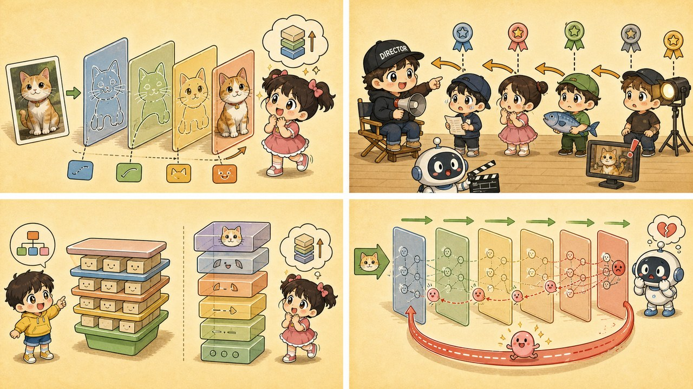

# 第 6 章 · 反向传播：犯了错？咱们来层层秋后算账

> ### 🎯 先别往下翻 · 这一章要破的题
>
> **🔥 痛点**：一个只会画直线的神经元，叠起来怎么就能认出一只猫？而且网络一开始全在瞎猜，它怎么知道**该怪哪个零件、各改多少**?
> **🤔 换你来**：一个上百人的剧组，片子拍砸了。导演怎么找出是谁的锅、各自改多少？
> **🧱 笨办法会撞墙**：你可能想"一把抓、所有人重罚"或"随机乱改参数"——可这样**永远没法精准改进**，改对的和改错的混在一起。
> 聪明的做法是"层层追责"。这正是反向传播的精髓——往下看。👇

第一阶段，元元一直把神经网络当"黑箱"在用：喂数据进去、规则跑出来。第二阶段第一章，他要带小满**把黑箱撬开**。

小满摩拳擦掌：「我等这一刻很久了！可话说回来——'**深度**学习'那个'深'，到底深在哪儿啊？」

元元一拍大腿：「问得正好！这一章咱们干两件大事：先看它**往前**怎么'层层抽象'认出一只猫，再看它**往回**怎么'秋后算账'改正错误。走起（￣▽￣）ノ」

---

## 第 1 节　"深度"二字，深在层层抽象

元元先回敬小满一个第 3 章的老结论：「还记得吧？单个神经元就一道'加权打分题'，画出来永远是**一条直线**——它连'圆形'都认不出来，更别说一只猫了。」

小满：「那它咋认猫的？把单个神经元变聪明？」

「不！」元元摇头，「秘诀是——**叠层**。每一层都站在上一层的肩膀上，把简单的发现，拼成更抽象的概念。我给你画一张'识猫流水线'：」

「你顺着看，」元元指着流水线，「照片在机器眼里**根本不是画面，是几十万个像素数字**。第 1 层只盯一小块、报告'这儿有条边'；第 2 层不看像素了，只看上一层报的边，几条边拼成花纹；第 3 层把花纹拼成耳朵、眼睛；最后'尖耳朵+竖瞳+胡须'一起亮，'猫'的灯泡就嗷一下亮到 92%！」

> 小满瞪大眼：「等等——是谁规定'第 1 层学边缘、第 3 层学耳朵'的？」
> 元元压低声音，说出本节最炸的一句：「**没有谁规定！这套分工，是训练中自己长出来的。**'深度'这俩字，说的就是这条抽象流水线有多长。」

更绝的是，元元把"扫描仪"对准了 ChatGPT：研究者像做"脑部扫描"一样逐层观察它读句子，发现**惊人相似的分工**——

| 网络层 | 识猫网络在干 | 大模型读句子在干 |
|---|---|---|
| 浅层 | 找边缘 | 把字读顺（认词形、词性、邻近搭配） |
| 中层 | 拼纹理、部件 | 把话读懂（「它」指的是猫、谁追谁） |
| 深层 | 拼成整只猫 | 把理想通（因为饿→所以追，调世界知识） |

> 「看图是'像素→边缘→部件→物体'，读句子是'文字→语法→语义→推理'，」元元总结，「**走的是同一条流水线！** 层不够深，就盖不出'推理'那层楼——这就是'深度'对大模型是命根子的原因。」

---

## 第 2 节　剧组拍戏穿帮了：导演的"层层追责"

抽象流水线讲的是"往前算出答案"。可网络**刚出厂时权重全是随机数**，把猫认成狗是家常便饭。它怎么从错误里改进？这就轮到本章的主角——**反向传播**登场了。

为了讲透它，元元给小满讲了个**剧组拍戏**的段子，活灵活现：

> 🎬 **第 0 幕 · 草台班子**
> 一个新剧组刚搭起来，导演、主演、配角、道具组全是新手，怎么拍全靠瞎蒙。这就是"权重全随机"的网络。

> 🎬 **第 ① 幕 · 前向传播：把片子拍出来**
> 全组层层协作，主演演、配角配、道具组布景，一条龙下来，**成片交付**：这场"猫戏"……拍成了"狗戏"。穿帮了！

> 🎬 **第 ② 幕 · 对答案：算这单亏多少**
> 正确答案是"猫"。导演把"成片和剧本的差距"压成一个数——这个数就是**损失**，正是第 4 章那座山的"当前高度"。

> 🎬 **第 ③ 幕 · 反向传播：从导演到道具组，层层倒查内鬼**
> 重头戏来了！导演开始**复盘追责**——但他不是一把抓，而是**从最终成片往回，一层一层倒推**：这个穿帮，主演要负几分责？顺着主演往下，配角的锅有多大？再往下，道具组摆错的那只假老鼠，又占多少责任？
> **每个人分到的那份"责任大小"，行话就叫梯度。**责任越大，待会儿改得越狠（图里线越粗）。

> 🎬 **第 ④ 幕 · 按责任补拍**
> 第 4 章的老朋友**梯度下降**登场：责任大的主演大改戏，责任小的群演微调一下走位。**谁影响大，谁改得多**——这就是反向传播的全部精神。

> 🎬 **第 ⑤ 幕 · 重拍亿万次，烂剧组熬成神剧组**
> 一场戏一场戏反复这么拍、这么追责、这么改，权重一点点成形：网络从瞎猜熬成识猫高手（92%）。**ChatGPT 的上万亿参数，也是被这同一套机械流程，一个一个调出来的。**

元元把术语和剧组一一对上，让小满彻底记牢：

| 网络里发生的 | 剧组里的对应 |
|---|---|
| 前向传播 | 全组协作把片子拍出来 |
| 损失 | 复盘会上算出这单亏了多少 |
| 反向传播 | 从导演逐级倒查到每个执行人 |
| 梯度 | 每个人的"责任大小" |
| 更新权重 | 责任大的大改，小的微调，下场戏再战 |

> 小满追问：「那导演咋算清每个人精确的责任的？」
> 元元：「靠一个叫**链式法则**的数学工具——说穿了就是'复合函数求导一层层往回乘'，本章不展开。你只要记死两点：① 它是**纯机械的求导计算**，全自动，**没有任何'思考'**；② 它和梯度下降是一对搭档——反向传播算出每人脚下的坡度，梯度下降照着坡往下走一步。」

「划重点，」元元补刀，「训练大模型烧掉的天价算力，**大头就烧在这一来一回上**：几万张 GPU 连转几个月，干的就是'前向→对答案→回传→微调'这一件事，没别的。」

---

## 第 3 节　同样多的神经元，为啥"深"赢过"宽"

小满冒出个机灵问题：「既然神经元多就本事大，那我把 1000 个神经元**铺成又宽又浅的一层**，跟**叠成 10 层、每层 100 个**，有区别吗？」

「区别大到吓你一跳！」元元摆出两张对比卡：

> **🟥 宽而浅：1 层 × 1000 个**
> 没有中间层可复用，**每个概念都得从像素直接学起**。想多认一种动物？就得再砌一大批全新神经元——需求随任务复杂度**爆炸式**增长。

> **🟩 窄而深：10 层 × 100 个**
> 底层零件**全员共享**：一条"斜线"既能拼猫耳朵，也能拼狗耳朵、拼屋顶。**复用让表达效率指数级提升。**

「这套'复用零件'的智慧，」元元神秘一笑，「你的母语里早就有了——**汉字的造字法，就是一张深度网络！**」

> 　几十种**笔画** → 几百个**偏旁** → 几千个**常用字** → 无穷的**词语**
> 　每一层都复用下一层的零件。要是不分层，每个词都得发明一个独一无二的符号，那要背的符号量……**直接爆炸**(°□°)。

「所以大模型也用脚投了票，」元元亮出一串数字，「**清一色选了'深'**——GPT-2 叠 48 层，GPT-3 叠 96 层，Llama 3 405B 叠 126 层。深度始终是底座，**没有深度就没有逐层抽象，再宽也只是个大号查表机**。」

---

## 第 4 节　伏笔：导演的批评，传到底层只剩耳语

深有深的代价。元元卖了个关子：「你想啊，导演的追责从成片往回传，**每过一层就衰减一截**。剧组要是有 100 层，传到最底层的道具小工那儿——批评声**几乎听不见了**。」

小满：「那他们不就不知道该改啥了？」

「正是！这叫**梯度消失**：底层参数收不到调整信号，**学不动了**。」元元说，「它曾经让'很深的网络'好多年都训不出来。工程师后来修了两条路救场，你先混个脸熟：」

> 🛠️ **神器一 · ReLU 激活函数**
> 把神经元的"开关"换成极简版：**负数归零、正数直通**。误差回传时衰减大大变缓。如今是各类网络的默认选择——下一章 CNN 里就会见到它。

> 🛠️ **神器二 · 残差连接（给底层拉一条"导演直通热线"）**
> 让导演的批评**绕过中间所有层，一条高速路直达底层道具组**。从上百层的 ResNet 到大模型的 Transformer（第 10 章），现代深网络几乎无它不立——**Transformer 每一层都内置残差连接，没有这条热线，就没有上百层的大模型。**

> 小满：「这俩名词先记着，反正后面还会见到？」
> 元元：「聪明！现在你已经知道它俩是**为谁、为什么而生**的了，到时候见面就是熟人（￣▽￣）。」

---

## 第 5 节　这些坑，你八成也会踩

**坑一：「反向传播 = AI 在'反思自己错在哪'」**

> ❌ 一听"追责""学习"，就以为 AI 在反省。
> ✅ 真相是——它只是**自动求导**：一套机械的链式计算，**没有任何'思考'发生**。

病根："传播""追责"这些拟人词太有画面感了。实际上反向传播是固定的微积分流程，计算机按公式逐层算数而已——**把它想成 Excel 自动算出每个单元格该改多少**，比想成"反思"接近真相得多。ChatGPT 训练时也一样：没有顿悟，只有亿万次机械微调。

**坑二：「层数越多，模型一定越强，往死里叠就完了」**

> ❌ 把"深度学习"误读成"越深越好"。
> ✅ 真相是——**梯度消失、过拟合、算力成本，三堵墙一起给层数设了上限。**

病根：盲目加层，轻则**训练不动**（梯度消失），重则把训练集背得滚瓜烂熟、一上考场就露馅（第 5 章的**过拟合**），算力账单还会先把你劝退。大模型动辄上百层不假，但那是海量数据、残差连接、天价算力**一起撑起来的**——合适的深度是试出来的工程活，不是越大越光荣。

---

## 第 6 节　收尾大招：一句话看穿"深度"

老规矩，秘籍 ＋ 大杀器。

### 一前一后，一张表收干净

| 方向 | 名字 | 干啥 | 一句话 |
|---|---|---|---|
| **往前 →** | 前向传播 / 逐层抽象 | 把输入一层层加工成答案 | 像素→边缘→部件→物体 |
| **往回 ←** | 反向传播 | 从错误倒查每人责任，按责任微调 | 导演层层追责到道具组 |
| 搭档 | 梯度下降 | 照着责任（坡度）往下走一步 | 第 4 章的老朋友 |

### 收尾大招：用"剧组追责"给任何人讲明白 AI 训练

往后谁要是被"AI 怎么学习的"问住，你就甩这套**剧组三连**：

> 　🗣️ **「拍片（前向）→ 复盘算亏多少（损失）→ 从导演倒查到道具组（反向传播）→ 责任大的大改（更新）→ 重拍亿万次（训练）。」**
>
> 一个段子讲完，连 ChatGPT 怎么炼成的都顺带说清了。而且你还能补一刀防忽悠：**这里头没有任何'反思'，全是机械求导**——谁要说"AI 会自我反省了"，你就笑笑。

### 把整章拧成一句话塞进脑子

> **"深度"= 逐层抽象的流水线长度；学习 = 反向传播这套"层层追责"重复亿万次。**
> 往前：像素→边缘→部件→物体（分工是自己长出来的，没人设计）。
> 往回：从输出层倒查到输入层，谁责任大谁改得多。深网络的命门是梯度消失，解药是残差连接这条"直通热线"。

---

小满意犹未尽：「识猫流水线第 1 层老说'找边缘'……可机器**到底咋在一堆像素数字里'找'出边缘**的呀？它又没长眼睛！」

元元咧嘴一笑，从兜里掏出一张**巴掌大的九宫格卡片**晃了晃：「问到下一章的题眼了！机器'看'图的秘密，全在这张小卡片上。走，下一章我拿它在《清明上河图》上挪一挪，教你机器是怎么**数出画里有几头驴**的（￣▽￣）ノ」

---

## 🧰 装进你的工具箱

> **🔑 一句话方法**："深度"= **逐层抽象的流水线**（像素→边缘→部件→物体）；学习 = **反向传播**——从最终的错倒查每个零件的责任（梯度），谁责任大谁改得多，重复亿万次。
> **🎯 触发器 · 以后遇到这种情况就掏出它**：听到"训练大模型烧天价算力"，你知道大头烧在"前向→对答案→反向追责→微调"这一来一回；听到"AI 会自我反思"，你知道那只是**机械的求导计算**，没有反思。
>
> **✍️ 合上书自测**：
> 1. 用"剧组追责"解释：为什么很深的网络，靠近输入的底层常常"听不到追责声音"?这叫什么？
> 2. 同样多的神经元，"深"为什么赢过"宽"?（想想汉字造字法）
> 3. 浅层、中层、深层在识猫/读句子时分别在干什么？

> 🪜 **下一章预告**：第 7 章 · 卷积神经网络 CNN——拿着九宫格放大镜去扫图。

---

[← 上一章](../stage_1/chapter_05.md) ｜ [📖 目录](../README.md) ｜ [下一章 →](../stage_2/chapter_07.md)

> 在线阅读《看得见的 AI》· 全 30 章免费 —— 回到 [**项目首页**](../../README.md)，觉得有用点个 ⭐ Star 让更多人看到。
