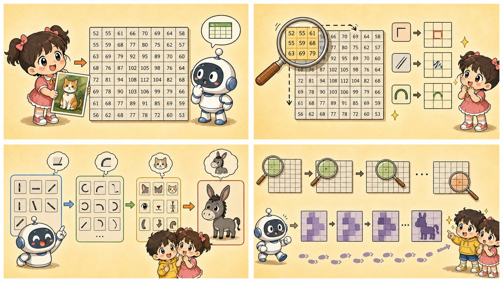
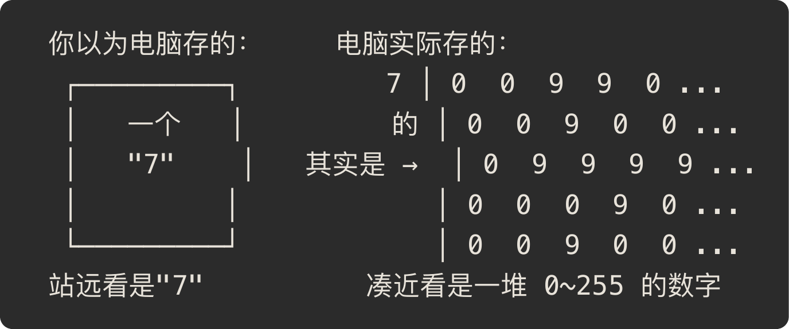

# 第 7 章 · 卷积神经网络 CNN：拿着九宫格放大镜去扫图

> ### 🎯 先别往下翻 · 这一章要破的题
>
> **🔥 痛点**：机器又没长眼睛，它到底怎么"看"出一张《清明上河图》里有几头驴？
> **🤔 换你来**：如果一张图在你眼里只是一大堆数字，你会怎么找出"这块地方有个东西"?
> **🧱 笨办法会撞墙**：你可能以为"电脑硬盘里存着一幅**画面**，睁眼就能看见"——**根本不是**!它存的只是一张表格：每格一个 0~255 的亮度数字，**压根没有"画面"这回事**。
> 那"看懂图"被翻译成了一道什么数学题？往下看元元的九宫格放大镜。👇

元元神秘兮兮掏出一张**巴掌大的九宫格卡片**：「答案全在这张小卡片上。今天我拿它在《清明上河图》上挪一挪，保管教你看懂机器是怎么**数出画里有几头驴**的（￣▽￣）ノ」

---

## 第 1 节　在机器眼里，图是一张数字表

动手之前，元元先给小满纠正一个**根深蒂固的错觉**。

「你以为，」他指着手机里一张照片，「电脑硬盘里存着一幅'画面'，对吧？睁眼就能看见图案、轮廓、一只猫？」

小满：「难道不是？」

「**根本不是！**」元元摇头，「计算机里**压根不存在'画面'**。打开任何一张图，存的只是一张**表格**——每个格子（像素）记一个亮度数字：**0 是纯黑，255 是纯白**。彩色图也只是红、绿、蓝三张这样的表叠在一起。」

▲ 图7-0 · '7' 在计算机里的数字网格

「关键来了，」元元敲黑板，「**计算机只有'凑近看'这一种视角**——它从没见过那个'7'，只看见一格一格的数字。所以'看懂图像'被翻译成一道数学题：**在数字网格里找模式**——哪里数字突然跳变（那是**边缘**），哪里有规律地重复（那是**纹理**），哪些模式总是结伴出现（那是眼睛、车轮这样的**部件**）。**卷积神经网络 CNN，就是为这道题造的机器。**」

---

## 第 2 节　九宫格放大镜：一枚扛着模板巡逻的小探测器

终于轮到那张卡片出场了。元元把《清明上河图》在桌上铺开，举起**九宫格卡片**：

「CNN 最小的零件叫**卷积核（kernel）**，就是这么一张 **3×3 的小表格**，里面装着它要找的'模式模板'。它从画的左上角出发，**一格一格往右挪**，每停一步就问一句——」

> 　🔍 **「我脚下这 9 个像素，长得像不像我的模板？」**
> 　- 像 → 输出一个**大数**（强烈响应！"这儿有货！"）
> 　- 不像 → 输出**接近 0**（"没我要的东西"）

「把所有落脚点的得分按原位置拼回去，」元元说，「就得到一张**特征图**——上面标着'画里哪些地方有我要找的东西'。说白了，卷积就是一次**相似度打分**：脚下图案越像模板，分越高。」

小满：「那它咋知道要找'驴'？」

「好问题！得**分步走**。换一换卡片里的 9 个数字，就换一种探测目标——同一张画，不同的核'看到'完全不同的东西：」

| 卡片（核） | 专找什么 | 比喻 |
|---|---|---|
| **边缘核** | 亮度跳变处 | 两侧数字一正一负，突变处响应最大——物体轮廓现形 |
| **角点核** | 两条边相交 | 桌角、窗框、驴耳朵尖，都逃不过它 |
| **纹理核** | 规律重复 | 条纹、斑点、驴身上的毛——毛发与布料的签名 |

> 元元亮出本节最关键的一句：「上面这些是**人**手工设计了几十年的经典滤波器。**CNN 真正的突破在于——核里那 9 个数字，不是人设计的，是'学'出来的！**」
> 小满：「又是第 4 章那套梯度下降？」
> 元元竖起大拇指：「悟了！任务需要什么探测器，网络就自己'**长出**'什么探测器。一层里几十上百个核**并行巡逻**，各找各的模式。」

---

## 第 3 节　三级跳：从一条边到一头驴

一个核只能找一种局部小模式。真正的魔法，还是上一章那招——**叠层**。

「下一层的核，扫描的不是原图，」元元比划着，「是**上一层吐出来的特征图**。于是探测目标**逐层升级**——这不就是上一章'逐层抽象'在图像上的完美实例嘛！」

| 层级 | 在找什么 | 好比汉字里的 |
|---|---|---|
| 第 1 层 | 边缘、色块、明暗突变 | **笔画** |
| 第 2 层 | 把边缘拼成纹理、圆弧、简单形状 | **部首** |
| 第 3 层 | 把形状拼成部件：眼睛、蹄子、耳朵 | **单字** |
| 更深层 | 把部件拼成整体：**一头驴！** | **词句** |

「所以你问的'数出几头驴'，」元元回到小满的问题，「机器是这么干的：第 1 层在《清明上河图》里找出无数条边 → 第 2 层拼成弧线、长耳朵形状 → 第 3 层拼出'长耳朵+四条腿+驮着货'的部件组合 → 深层一拍板：'这儿一头驴！那儿又一头！'**数完为止**。」

元元又补了一个常用小工序：

> 🔻 **池化（Pooling）：缩图保要点**
> 层与层之间常夹一步池化：每 2×2 格只留**最大响应**，特征图边长减半。好处俩——① 图变小、算得快；② 驴**往旁边挪两个像素照样认得**（这叫"抗位移"）。就像把地图缩小：细节丢了，地标还在。

「这条'边缘→纹理→部件→整体'的流水线，」元元环顾四周，「此刻正跑在你身边一堆设备里——」

> 📱 **人脸解锁**：提取你五官特征，毫秒级比对，第 1 层找的边缘最终拼成了"你"。
> 🏥 **医学影像读片**：在 CT、X 光里圈出疑似病灶，部分病种可达资深医师水平——但它是"提醒助手"，最终诊断仍归医生。
> 🚗 **自动驾驶感知**：从摄像头画面里框出车、人、车道线。
> 🏭 **工业质检**：流水线逐件拍照找划痕、缺件，比人眼快、不知疲倦，**也不会下午三点开始走神**(￣▽￣)。

---

## 第 4 节　亲眼看一次卷积：连环画

光说不练假把式。元元摆出演示台：左边一张 **12×12 的灰度小图**（画了个"7"），中间一张 **3×3 卷积核**，右边一张 **10×10 的特征图**（一开始全黑）。

**连环画开演——**

🎬 **第 1 帧**：元元把九宫格卡片摁在图的**左上角**（一片空白），问"像边缘吗？"——9 个数字几乎全相同，**响应≈0**。右边对应格子：**还是黑的**。

🎬 **第 2 帧**：卡片往右挪一格、再一格……扫到**"7"那一横的边上**！窗口里"上边亮、下边暗"，**砰**——响应飙高！右边对应格子"**啪"地点亮**。

🎬 **第 3 帧**：继续扫。凡是压在**笔画轮廓**上，右边就亮一格；凡是压在**空白或笔画内部**（数字都一样、没跳变），右边就一片漆黑。

🎬 **扫完一整遍**：右边的特征图上，**亮的全是"7"的轮廓线**，空白和笔画内部一片黑。

> 小满惊呼：「它把'7'的边给**描出来**了！」
> 元元：「对喽。换个核再扫——找纹理的核、找角点的核，点亮的地方就完全不同。这就是机器'看'的真相：**不是看见整体，是无数个小卡片各扫各的、各点各的灯。**」

🎬 **彩蛋小问**：小满发现个怪事：「为啥输入是 12×12，输出却是 **10×10**？」
元元：「巴掌大的窗口在 12 格宽的图上，只有 **12 − 3 + 1 = 10** 个落脚位置呀，纵向同理。真实 CNN 常在图四周补一圈 0（叫 padding），让输出保持原尺寸。」

---

## 第 5 节　这些坑，你八成也会踩

**坑一：「CNN 像人一样'看见'了一只完整的猫」**

> ❌ 以为机器脑子里浮现出一只完整的猫。
> ✅ 真相是——它只是把**成千上万个局部模式的响应**，统计性地组合成一个判断。

病根：拟人化想象。CNN 没有"整体印象"，只有层层叠加的**局部匹配分数**——耳朵尖的分 ＋ 胡须纹理的分 ＋ 毛发斑纹的分，加起来超过阈值就报"猫"。所以**背景诡异、姿势罕见、光线极端时它会翻车**：它认的是"模式组合"，不是"猫"这个概念。

**坑二：「识别准确率这么高，说明它真的理解图像了」**

> ❌ 把"统计拟合得好"当成"语义理解"。
> ✅ 真相是——**在停车标志上贴几张小贴纸，就可能让模型把它认成限速牌**——这叫**对抗样本**。

病根：对人眼几乎无影响的微小扰动，能让 CNN 满盘皆错——因为它依赖的是**像素层面的数字模式**，而不是"停车标志意味着必须停车"的含义。对抗样本是计算机视觉安全研究的核心课题，也时刻提醒我们：**识别 ≠ 理解。**

---

## 第 6 节　收尾大招：一句话看穿"机器视觉"

老规矩，秘籍 ＋ 大杀器。

### CNN 三件套，一张表收干净

| 零件 | 干啥 | 一句话 |
|---|---|---|
| **卷积核** | 一张 3×3 模板，滑动找局部模式 | 九宫格放大镜，像就亮、不像就黑 |
| **叠层** | 边缘→纹理→部件→整体 | 逐层抽象，复用零件 |
| **池化** | 缩图保要点 | 图变小、算得快、抗位移 |

### 收尾大招：一句话戳破"AI 看懂了图"

往后谁跟你吹"我们的 AI 能看懂图像"，你就笑眯眯反问：

> 　🗣️ **「它是真'看懂'了，还是在像素数字里找到了一组刚好对得上的模式？」**
>
> 提醒法门：**给它一张背景诡异、或被贴了小贴纸的图**，要是它当场翻车，就说明它认的从来是"模式组合"，不是"概念"。**识别 ≠ 理解**——这八个字，能帮你看穿一大半"AI 视觉"的牛皮。

### 把整章拧成一句话塞进脑子

> **在机器眼里图是一张 0~255 的数字表，"看懂"= 在表里找模式。**
> 卷积核是一枚 3×3 的滑动放大镜，像就强响应；核里的数字不是人设计的，是学出来的。
> 叠层让它从一条边一路拼出一头驴——但它认的永远是"模式组合"，不是"驴"本身。

---

小满玩着那张九宫格卡片，忽然皱眉：「图天生就是数字，机器好歹有的扫……可**文字**咋办？'猫'这个字在电脑里就一个字符编号，编号挨着的两个字意思可以八竿子打不着——机器咋知道'猫'和'狗'很像、和'民法典'很不像啊？」

元元眼睛一亮，从抽屉里摸出一盏小台灯：「问到下一章最浪漫的部分了！咱们得给每个字，在一片**3D 星空**里**买套房**——意思越近的，住得越近。走，下一章我点上灯，带你算算'猫'和'狗'到底是不是邻居（✦ω✦）」

---

## 🧰 装进你的工具箱

> **🔑 一句话方法**：在机器眼里图 = **一张数字网格**,"看懂"= 在网格里找模式；**卷积核** = 一张 3×3 的滑动放大镜，脚下图案像模板就强响应；**叠层**让它从一条边一路拼出一头驴。
> **🎯 触发器 · 以后遇到这种情况就掏出它**：AI 把背景诡异的图认错、或被贴张小贴纸就把停车牌认成限速牌（对抗样本），你立刻知道——**它认的是"像素模式组合"，不是"概念"**；记死八个字：**识别 ≠ 理解**。
>
> **✍️ 合上书自测**：
> 1. 一张 100×100 的灰度照片，在电脑里到底是什么？一共多少个数字？
> 2. 垂直边缘核扫过一片纯色天空，响应大约是多少？为什么？
> 3. 为什么 CNN 在"姿势罕见、光线极端"的图上容易翻车？

> 🪜 **下一章预告**：第 8 章 · 词向量 Embedding——给汉字在 3D 星空里买套房。

---

[← 上一章](../stage_2/chapter_06.md) ｜ [📖 目录](../README.md) ｜ [下一章 →](../stage_2/chapter_08.md)

> 在线阅读《看得见的 AI》· 全 30 章免费 —— 回到 [**项目首页**](../../README.md)，觉得有用点个 ⭐ Star 让更多人看到。
