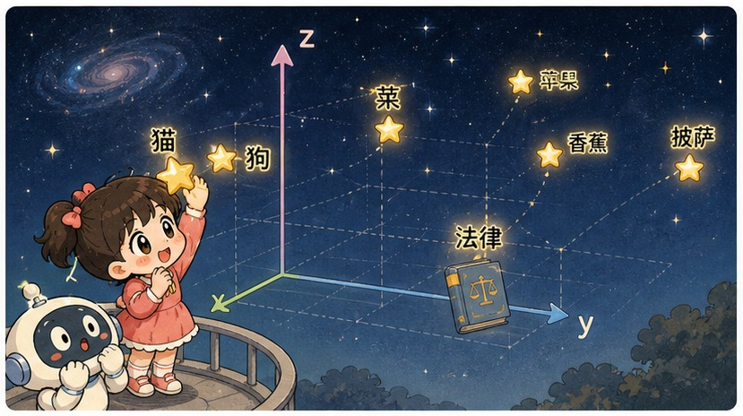
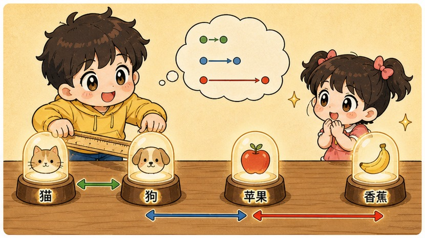
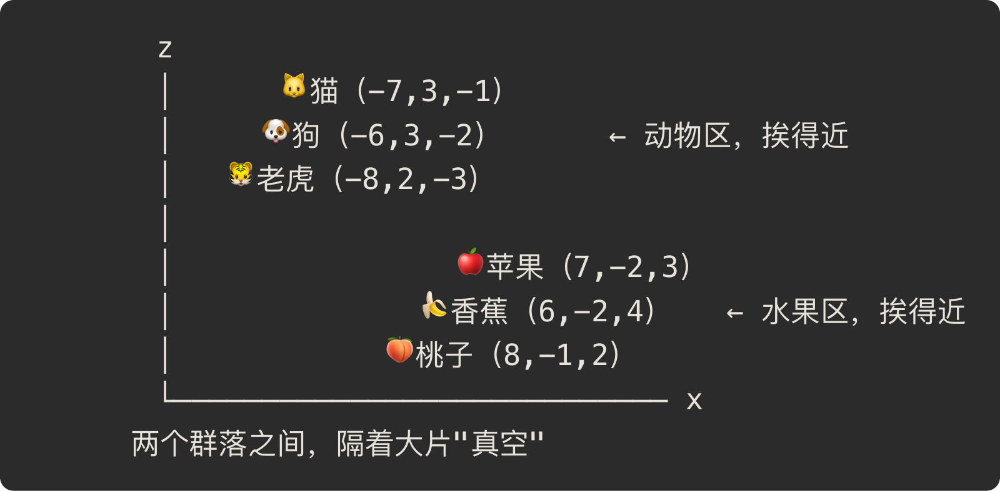
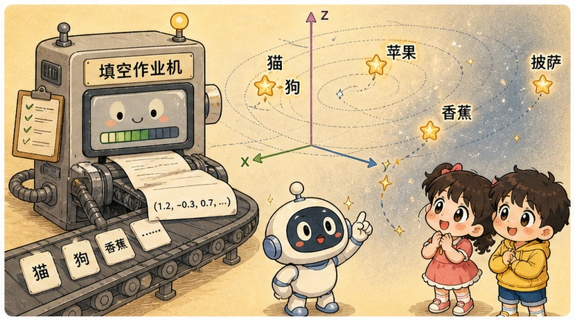

# 第 8 章 · 词向量 Embedding：给汉字在 3D 星空里买套房

> ### 🎯 先别往下翻 · 这一章要破的题
>
> **🔥 痛点**：图天生是数字，机器有的扫。可"猫"这个字在电脑里就一个字符编号，**编号挨着的两个字意思可以八竿子打不着**——机器怎么知道"猫"和"狗"很像、和"民法典"很不像？
> **🤔 换你来**：你会怎么让"意思的远近"变成机器能算出来的东西？
> **🧱 笨办法会撞墙**：像查词典那样"用别的词解释这个词"——查"猫"得查"哺乳动物"，查"哺乳动物"又得查别的，**循环不止，还是算不出"到底有多像"**。
> 聪明人的解法浪漫得很：给每个字在一片星空里买套房。往下看。👇

元元摸出一盏小台灯，"啪"地点亮，往桌上一摆：「这一章最浪漫了。咱们得给每个字，在一片 **3D 星空**里**买套房**——意思越近的，住得越近。走，我带你算算'猫'和'狗'到底是不是邻居（✦ω✦）」

---

## 第 1 节　把词钉进空间，"意思"第一次能算了

▲ 图8-1 · 把词钉进空间，"意思"第一次能算了

元元先把人和机器的两种"懂词"方式摆出来对比：

> **🧑 人类的方式 · 查词典**
> 「猫」=「一种哺乳动物，善捕鼠，会喵喵叫……」
> 用别的词解释这个词，**循环不止**：查"哺乳动物"又得查"哺乳"。计算机就算读完整本词典，**仍然算不出**"猫"和"狗"到底有多像。

> **🤖 机器的方式 · 给坐标**
> 「猫」=（0.82, −1.30, 2.41, …）
> 一个词 = 空间里的**一个点**。"像不像"不用任何解释——**量一下两点之间的距离就行**，距离是小学就会算的东西。

「这个坐标，」元元指着台灯照亮的桌面，「就叫这个词的 **embedding（嵌入）**。它干的事就一件：给每个词在空间里安排一个坐标点，并保证——**意思越近的词，坐得越近。**」

他把本章**唯一要背的一句话**写得老大：

> 　✨ **距离 = 语义相似度**

「猫和狗离得近，猫和披萨离得远，猫和'民法典'几乎在两个星系。」元元感慨，「'意义'这种最虚无缥缈的东西，**第一次变成了能计算的对象**——后面的注意力、Transformer、第 18 章的 RAG，**全踩在这块地基上**。」

> 小满恍然：「所以我给 ChatGPT 发消息，它第一件事不是'读'？」
> 元元：「对！是**把每个词换成这么一串数字**。词先变向量，神经网络才有的吃。**Embedding 是文字世界和数字世界之间唯一的海关。**」

---

## 第 2 节　桌上点灯：给"猫狗""苹果香蕉"安排邻居，算算距离

▲ 图8-2 · 桌上点灯：给"猫狗""苹果香蕉"安排邻居，算算距离

光说不练假把式。元元借着台灯，在桌面上摆开一个**3D 星空坐标系**，把几个词做成发光小球，挨个安排住处：

▲ 图8-0 · 3D 词向量星空坐标示意

「你看，」元元拨弄着小球，「**猫、狗、老虎挤在左上角**——因为它们总出现在相似的句子里（喂、养、毛茸茸、动物园）；**苹果、香蕉、桃子挤在右下角**。两堆之间隔着大片真空。」

小满来了兴致：「那它们的'距离'，真能拿尺子量？」

「当然！这才是重点。」元元现场算给她看：

> 🎬 **量一量：猫 🐱(-7,3,-1) 到 狗 🐶(-6,3,-2)**
> 　x 差 1、y 差 0、z 差 1 → 距离 ≈ √(1+0+1) ≈ **1.4**，**近邻！**
>
> 🎬 **量一量：猫 🐱(-7,3,-1) 到 苹果 🍎(7,-2,3)**
> 　x 差 14、y 差 5、z 差 4 → 距离 ≈ √(196+25+16) ≈ **15.4**，**两个星系！**

> 小满拍手：「'猫和狗像、猫和苹果不像'，居然真能算出一个数来比！」
> 元元：「这就是 embedding 的全部魔力。**意思的远近，被翻译成了空间里的距离。**」

> 小满又追一句：「这'距离'，是直愣愣量两点的直线长吗？」
> 元元：「直觉上先这么记没问题。但**工程上更常用的不是'直线长'，是比'方向'——两个向量的夹角，叫余弦相似度**：指向越同一个方向就越像，跟向量长短无关。第 28 章你亲手写检索时，代码里用的正是它。这一章先记住'近=像'这个画面就够了。」

不过元元立刻打了个预防针——这是 embedding **最容易被误解**的地方，他点出两条**关键澄清**：

> **🔬 澄清一 · 关于维度：3D 星空只是'降维示意'**
> 真实 embedding 通常是**几百到几千维**：word2vec 时代常用 300 维，如今大模型内部普遍上千维。维度高，才装得下一个词的**多重身份**——「苹果」要同时靠近水果、手机、还有"红色"。任何 3D 图都像把地球仪压成平面地图：方便看，**必有失真**。

> **🔬 澄清二 · 关于来历：坐标不是人标的，是学出来的**
> **没有任何语言学家给"猫"填过坐标。**模型在海量文本里反复做"预测邻居词"的填空题，用第 4 章的梯度下降把猜错的程度一点点压低——**谁总出现在相似的语境里，谁的坐标就被一点点推近**。全自动，零人工标注，坐标只是训练的副产品。

> 元元引了句语言学家 Firth 1957 年的名言：「'**看一个词总跟谁作伴，你就懂了它。**'——'猫'和'狗'都能填进'____ 在沙发上睡觉''带 ____ 去打疫苗'，于是被推到一起。这叫**分布假设**。」

---

## 第 3 节　明星算式：国王 − 男人 + 女人 ≈ 女王

▲ 图8-3 · 明星算式：国王 − 男人 + 女人 ≈ 女王

坐标既然是数字，**就能加减**。元元卖了个关子：「2013 年 word2vec 论文里有个发现，让全世界惊掉下巴——对词向量做**小学算术**，结果居然有意义！」

他在星空里拉出一支箭头：

> 　**国王 − 男人 + 女人 ≈ 女王**

「人话拆解，」元元比划，「**'女人 − 男人'这两点之间的箭头**，捕捉到的正是'**性别**'这层关系；把这支箭头**原样平移到「国王」头上**，落点离「女王」最近。换句话说——**词与词的'关系'，在这个空间里是一个可以搬运的方向！**」

更妙的是，同一种关系的箭头**互相平行**：

| 关系 | 箭头 A | 箭头 B | 几何特征 |
|---|---|---|---|
| 性别 | 男人 → 女人 | 国王 → 女王 | 方向近似平行 |
| 首都 | 中国 → 北京 | 日本 → 东京 | 方向近似平行 |
| 时态（英文） | walk → walked | go → went | 方向近似平行 |

> 小满瞪圆了眼：「没人教过它'首都'是啥，可'首都关系'自己作为一个方向**浮现**在空间里了？！」
> 元元：「就是这么神。不过我得校准一句——算式里是 **≈ 不是 =**。这种类比在真实模型里'经常成立、并不保证'，把它当**直觉的窗口，别当数学定理**。」

---

## 第 4 节　坐标是怎么"推"出来的：一道做了亿万遍的填空题

▲ 图8-4 · 坐标是怎么"推"出来的：一道做了亿万遍的填空题

小满追问：「'学出来'我懂了，可到底咋学？」元元把"学"字拆成四步连环画——第 4 章的梯度下降又来了：

> 🎬 **第 1 步 · 随机撒点**
> 训练开始，每个词领到一串**纯随机数字**。此刻「猫」可能紧挨着「民法典」——空间一片混沌。

> 🎬 **第 2 步 · 做题：用邻居猜空格**
> 读到「猫在沙发上打盹」，遮住「猫」，让模型拿"沙发""打盹"的坐标去猜空格——它给词表里每个词打一个"像不像答案"的分。

> 🎬 **第 3 步 · 错了就推一把**
> 猜错了，顺着"哪里错了"回头改坐标：把**正确答案往这个语境拉近**一点，把瞎猜的词**推远**一点。每次只动一丢丢——正是第 4 章下山的那一小步。

> 🎬 **第 4 步 · 重复亿万次**
> 「猫」和「狗」总出现在同款语境，于是被一次次推向同一片区。**群落、性别箭头、首都箭头——全是这个笨办法攒出来的副产品。**

小满盯着星空：「所以那些群落……是它自己'长'出来的，没人画过圈？」
元元点头：「**聚类是统计的副产品。**真实训练是几十亿句话、几百维坐标、万亿次做题，但原理和你看到的一模一样。」

可这老办法有个**致命死穴**，元元故意压低声音：

> ⚠️ **死穴：一个词只有一个点。**
> 「苹果真甜」和「苹果发布会」里的"苹果"明明是两个意思，**老式词向量却只能发给它一个坐标**——多义词被压扁成了平均值，卡在水果区和科技区中间的尴尬地带，哪边都沾、哪边都不像。

> 小满：「那咋破？」
> 元元眼神发亮：「让坐标**"活"起来**——同一个'苹果'，读到'甜'就漂向水果区，读到'手机'就漂向科技区。可它**到底怎么'参考'周围的词来更新自己**呢？嘿，那正是下一章注意力机制的全部剧情。先按下不表（￣ω￣）」

---

## 第 5 节　Embedding 在 ChatGPT 体内：第一站，而且是"活"的

word2vec 是 2013 年的老技术，为啥今天用 ChatGPT 还得懂它？元元一句话点破：「因为每个大模型体内都装着它的继承者，而且完成了一次**关键升级：坐标从'死'的变成了'活'的**。」他画出它在流水线里的位置：

| 位置 | 干啥 | 一句话 |
|---|---|---|
| **入口 · 第一站** | 每个词先**查表领坐标** | 你的话被切成 token，模型第一件事就是查 embedding 表换成向量。从此**只见数字，再不见文字** |
| **中段 · 几十层"调味"** | 向量被上下文**不断改写** | 几十层注意力让每个词参考邻居反复修正——读完整句，「苹果」可能已被「发布会」拽进科技区。这叫**语境化向量**，是大模型与 word2vec 的分水岭 |
| **出口 · 还是比距离** | 生成回答也靠**这片空间** | 模型吐下一个词，本质是拿当前语境向量去和词表里所有候选词比"匹配度"，谁匹配谁概率大 |

懂了"查表 + 改写"这条流水线，元元说，你平时那些"灵性瞬间"全有了解释：

| 你看到的现象 | 背后的向量空间机制 |
|---|---|
| 换种说法问，它照样懂 | 「怎么退货」和「如何申请退款」字面几乎不重合，**向量却近乎重合** |
| 打错字也大多能猜对 | 上下文把错字的向量"拉回"正确语义附近 |
| 中文提问，能用上英文世界的知识 | 多语言训练把「猫」和 cat 嵌到几乎同一个点——**知识挂在位置上，不挂在语种上** |
| 接上知识库就能答内部问题 | RAG：把文档切块算向量入库，按距离捞最近的几块塞给模型（第 18 章亲手搭） |

> 元元临了划一条**边界**：「记住——**距离近 = 语境像，不等于'事实对'**！「我爱你」和「我恨你」的向量相当近——句式、场景几乎一样。所以语义检索偶尔会捞回'长得像但答非所问'的段落；向量空间也分不清真话和谣言。这条坑，第 18、29 章还要反复用到。」

---

## 第 6 节　这些坑，你八成也会踩

**坑一：「每个维度都有明确含义，比如第 7 维代表'性别'」**

> ❌ 把 embedding 想象成一张人设计的表格：身高一栏、性别一栏。
> ✅ 真相是——**绝大多数维度没有人能读懂的含义**，"性别"这类概念散落在几百个维度的**组合方向**里。

病根：坐标系是训练**自动**形成的，单独抽一维看几乎全是噪声；像"性别方向"这种可解释的箭头，是研究者**事后**从整体里挖出来的维度组合，**不是某一根坐标轴**。

**坑二：「embedding 是查一本固定的'词→数字'词典查出来的」**

> ❌ "词变数字"听起来像查表。
> ✅ 真相是——它是模型在海量文本上**训练出来的统计产物**；换批语料、换个模型，坐标就完全不同。

病根：早期 word2vec 训完确实能存成静态表，但表里数值是**学**出来的，不是谁规定的；而现代大模型里，同一个词的向量还会**随上下文实时变化**——这正是下一章的故事。

**坑三：「两句话向量距离近，说明它们意思相同、内容可信」**

> ❌ 把"语义相似度"听成了"等价"。
> ✅ 真相是——距离近只说明"**语境相似**"，反义句、立场相反的句子常常是近邻。

病根：embedding 来自"看谁总出现在同款语境"，而「股价大涨」和「股价大跌」恰恰共享同款语境，距离反而很近。**做语义搜索和 RAG 时务必记住这条**，否则会把"看起来像"的错误答案当成正确答案。

---

## 第 7 节　收尾大招：万物皆可 embedding

老规矩，秘籍 ＋ 大杀器。

### 词向量核心，一张表收干净

| 概念 | 一句话 |
|---|---|
| **embedding** | 给每个词一个空间坐标，意思越近坐得越近 |
| **距离 = 语义相似度** | 全章唯一要背的等式 |
| **关系 = 方向** | 国王−男人+女人≈女王；同种关系的箭头互相平行 |
| **坐标怎么来** | 不是人标的，是亿万道填空题学出来的副产品 |
| **静态 → 语境化** | word2vec 一词一点；大模型里随上下文实时改写 |

### 收尾大招：万物皆可 embedding

这套"压成向量、按距离办事"的思路**完全不挑对象**——只要能定义"谁和谁该相近"，啥都能嵌进同一种空间。这正是它成为现代 AI 基础设施的原因：

> 　🗣️ **「能不能压成向量？能，就能按距离办事。」**
> - **语义搜索**：搜"便宜的住处"命中"经济型酒店"——一个字不重合，向量却很近。
> - **以文搜图**：CLIP 把图和文嵌进同一空间，"一只奔跑的狗"挨着狗狗照片。
> - **推荐系统**：把你的口味和千万件商品放进一个空间，你附近漂着啥就推啥——"猜你喜欢"猜的其实是**距离**。
> - **RAG**：公司文档切块入库，提问时按距离捞最相关的几块喂给模型（第 18、28 章亲手搭）。

到那时回头看，你会发现整套系统的灵魂，就是本章这一句：**距离 = 语义相似度。**

### 把整章拧成一句话塞进脑子

> **Embedding = 给每个词在高维空间买套房，意思越近住得越近，"意义"第一次能拿距离来算。**
> 关系是可搬运的方向（国王−男人+女人≈女王），坐标是亿万道填空题自己学出来的，没人标过。
> 老式词向量一词一点、装不下多义；大模型让坐标随上下文"活"起来——而让它活起来的，是下一章的注意力。

---

小满盯着那个在水果区和科技区之间来回飘的"苹果"小球，追问：「你老说'苹果'会**参考周围的词**来更新自己……可它到底怎么个'参考'法？是平均一下邻居？还是有重点地挑着看？」

元元一拍桌子：「问到下一章的命门了！它当然不是傻乎乎平均——它会像你上课**划重点**一样，掏出**好几支不同颜色的荧光笔**，给真正相关的词连线、重点吸收。走，下一章我教你大模型看'量大管饱'时，是怎么给'量'和'饱'连线的（✦ω✦）」

---

## 🧰 装进你的工具箱

> **🔑 一句话方法**：**Embedding** = 给每个词在高维空间安一个坐标，**意思越近、坐得越近**；全章只背一句——**"距离 = 语义相似度"**；关系是可搬运的方向（国王 − 男人 + 女人 ≈ 女王）。
> **🎯 触发器 · 以后遇到这种情况就掏出它**：看到"语义搜索""推荐系统""RAG 检索"，背后全是这一句"距离=语义相似度"；但务必记住边界——**距离近 = 语境像 ≠ 事实对**（"我爱你"和"我恨你"的向量很近）。
>
> **✍️ 合上书自测**：
> 1. 为什么搜"便宜的住处"能命中"经济型酒店"，哪怕一个字都不重合？
> 2. 仿照明星算式：巴黎 − 法国 + 日本 ≈ ?每一步在"搬运"什么？
> 3. 老式词向量给"苹果"只发一个坐标，会带来什么麻烦？

> 🪜 **下一章预告**：第 9 章 · 注意力机制——满篇荧光笔，到底谁才是重点。

---
[← 上一章](../stage_2/chapter_07.md) ｜ [📖 目录](../README.md) ｜ [下一章 →](../stage_2/chapter_09.md)

> 在线阅读《看得见的 AI》· 全 30 章免费 —— 回到 [**项目首页**](../../README.md)，觉得有用点个 ⭐ Star 让更多人看到。
