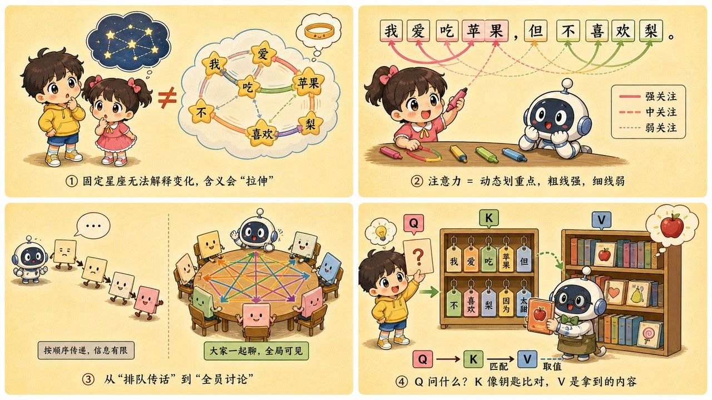
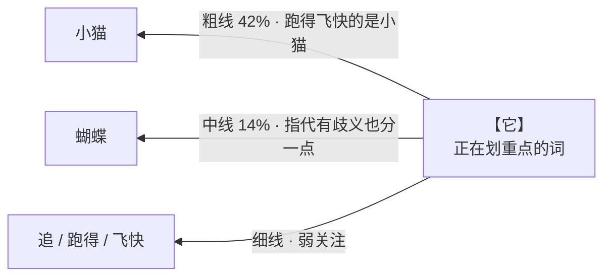

# 第 9 章 · 注意力机制：满篇荧光笔，到底谁才是重点

> ### 🎯 先别往下翻 · 这一章要破的题
>
> **🔥 痛点**：上一章给了每个词一个**固定**坐标。可"苹果发布了新手机"和"这个苹果真甜"里分明是**两个**苹果（公司/水果）——**一个固定的点，怎么装得下两个意思？**
> **🤔 换你来**：你会怎么让"苹果"读到不同邻居时，自己改变意思？
> **🧱 笨办法会撞墙**：老方法（RNN）像**逐词传纸条**，整句记忆压在一张小纸条上往后传——**传到后面就忘了前面**，还必须排队、不能并行。长句直接失忆。
> 怎么让每个词"环顾四周、当场重新定位"?这就是大模型的心脏。往下看。👇

元元从笔袋里"哗啦"倒出一把**不同颜色的荧光笔**：「当然不是傻乎乎平均！它会像你上课**划重点**一样，给真正相关的词**连线、重点吸收**。这一章的主角——**注意力机制**——就是大模型的心脏。走，我教你它看'量大管饱'时是怎么连线的（✦ω✦）」

---

## 第 1 节　固定的坐标，装不下流动的语义

元元先接上一章的尾巴：「第 8 章给了每个词一个坐标，可那坐标是**固定的**——像印进字典就不再改。问题来了——」

> **第 8 章的困境**：「苹果发布了新手机」和「这个苹果真甜」里，分明是**两个**"苹果"：一家公司、一种水果。**一个点，装不下两个意思！**

「注意力机制的使命，」元元说，「就是把这个'**字典坐标**'，升级成'**现场坐标**'：每个词**环顾四周、当场重新定位**。看见'发布''手机'，这个'苹果'就漂向科技公司；看见'甜'，那个'苹果'就漂向水果。」

它的做法说穿了**只有三步**，句中每个词都各做一遍：

| 步骤 | 干什么 | 一句话画面 |
|---|---|---|
| **① 打分** | 对句中所有词（**包括自己**）各打一个相关性分数 | "你和我有多大关系？" |
| **② 换算** | 把高低不一的分数换算成一组**总和 100%** 的"吸收比例" | "按关系亲疏分配预算" |
| **③ 吸收** | 按比例把所有词的信息混合，得到自己的新表示 | "重要的邻居多听，无关的少听" |

> 元元总结：「所谓'划重点'，本质就是**一次按相关性混合信息**的操作：比例大的词，在新表示里占的份额就大。你发给 ChatGPT 的每句话、每个词，都要过这道工序——而且**几十层、每层几十遍**地反复过。」

---

## 第 2 节　荧光笔连线：看"量大管饱"，给"量"和"饱"牵线

光说不练假把式。元元把"量大管饱"四个字写在桌上，掏出荧光笔，教小满像划重点一样**给词连线**——线越粗，代表注意力权重越大。

不过他先换了个更经典的例句来演透"划重点"的精髓：**「小猫追蝴蝶，它跑得飞快」**。

> 元元：「来，你当模型。读到'它'这个字，你脑子里冒出的第一个问题是啥？」
> 小满：「呃……'它'到底指谁？是小猫还是蝴蝶？」
> 元元：「满分！这就是'它'要划的重点。看我连线——」

🎬 **荧光笔连线现场（点亮"它"的视角）**：

「看见没？」元元指着粗线，「'它'把**最重的 42% 注意力，压回了'小猫'**——模型于是'知道'了：跑得飞快的是小猫。注意'蝴蝶'也分到 **14%**——**指代有歧义时，权重也会犹豫着分裂，不会全押一边**，这特聪明。」

回到"量大管饱"，元元快速演了一遍：「'饱'这个字，荧光笔会重重连向'**量**'和'**管**'——因为'管饱'是靠'量大'实现的。同一支笔，给真正相关的词牵线，无关的虚词就淡淡带过。」

> 小满玩上瘾了：「那同一个'苹果'，在两句话里连的线不一样吧？」
> 元元：「一点就透！'苹果发布了新手机'里，'苹果'重重连向'发布''手机'，吸收完偏向'公司';'这个苹果真甜'里，它重重连向'甜'，吸收完偏向'水果'。**同一个词，因为邻居不同，划完重点后的新表示，完全不同。**」

---

## 第 3 节　为什么非它不可：从"传纸条"到"圆桌会议"

小满：「这么好用的东西，以前没有吗？」

「这就得说注意力为啥是**换代神器**了。」元元摆出两种读法对比：

> **🐢 老方法（RNN）· 传纸条游戏**
> 2017 年以前，主流方法从左到右**逐词读**：整句记忆压在一张'小纸条'上，一棒一棒往右传，**每传一棒丢一点**。

> **⚡ 注意力 · 圆桌会议**
> 把"接力"改成"圆桌"：人人直连，一步到位。

这一改，**一口气治好两处致命伤**：

> **致命伤一 · 远距离失忆**
> "我小时候在外婆家养的那只总爱晒太阳的猫……**它**"——传纸条读到'它'时，开头的'猫'早被一路新词冲淡了。注意力让'它'**直接回头看'猫'：隔 3 个词和隔 3 万个词，都是一步直达、零磨损**。这就是大模型能"读"几十万字长文的根基。

> **致命伤二 · 必须排队**
> 传纸条是串行的：第 4 棒必须等第 3 棒。几万词的文章就得老实传几万棒，GPU 上千个计算单元只能干瞪眼。注意力让**所有词同时环顾、同时开工**——训练速度起飞，才堆得起后来的千亿参数（第 15 章）。

> 元元敲黑板：「2017 年那篇论文标题，狂得像宣言——**《Attention Is All You Need》（注意力就是你的全部所需）**。它催生的架构，就是下一章的主角 Transformer。」

---

## 第 4 节　Q、K、V：到图书馆借一次书

小满：「那第 1 步'打分'，具体咋打的？」

「问到工程核心了！」元元说，「每个词的向量会分别过三道训练学出来的'变身工序'，**分裂成三个角色**——就像同一个人在图书馆里，既是提问的读者，又是被检索的藏书。想象你走进一座图书馆：」

| 角色 | 是什么 | 一句话 |
|---|---|---|
| **Q · Query 提问单** | 这个词作为"读者"发出的问题 | 「它」的 Q 在问：**我指代的是谁？** |
| **K · Key 索引标签** | 每个词挂出的检索标签 | 「小猫」的 K 写着：**我是动物名词、本句主角** |
| **V · Value 书的内容** | 真正被吸收的信息本体 | 匹配成功后**借走的是 V**——标签只用来找书，内容才是收获 |

拿"它"当读者，元元把**借书全程**走一遍连环画：

> 🎬 **第 1 步 · 递出提问单（Q）**
> 「它」的单子写着："我指代谁？最好是个会动的、刚被提到的家伙。"——这提问方式是训练中**自己学出来的**。

> 🎬 **第 2 步 · 逐一对标签（K），各打一个分**
> 拿单子对全馆标签：「小猫」标签"动物·本句主角"→**高分**；「蝴蝶」"动物·配角"→中等；「追」"动作"→低分。提问和标签越对路，分越高。

> 🎬 **第 3 步 · 换算借阅比例**
> 高低分换算成借阅配额：小猫 42%、蝴蝶 14%、其余拿零头。**注意：谁都不会被完全拒借**——分低只是借得少，模型不会武断地"一票否决"。

> 🎬 **第 4 步 · 按比例摘抄（V），汇成新笔记**
> 按配额从每本书摘抄内容，汇成一份新笔记——这就是「它」的**上下文化新表示**。从这一刻起，「它」的向量里流着 **42% 的「小猫」**：模型"知道"了它指谁。

元元亮出全章**唯一一行公式**，并立刻安慰小满：「看不懂完全不影响！它说的就是上面四步——」

> 　**Attention(Q, K, V) = softmax( QKᵀ / √d ) · V**

| 公式片段 | 图书馆里的动作 |
|---|---|
| **QKᵀ** | 拿提问单逐一对照所有书的标签，每对词打个相关性分 |
| **÷ √d** | 管理员把分数整体压一压，免得一家独大、训练不稳 |
| **softmax** | 把分数换算成"借阅比例"，总和 100% |
| **· V** | 按比例从每本书摘抄内容，汇编成笔记（=新表示） |

> 小满：「为啥非把一个词拆成三个角色？」
> 元元：「因为'我想找什么'和'我能提供什么'**经常不是一回事**！'它'最想找的是别人（主语），自己能提供的信息却很少。拆开 Q 和 K，模型才能学会这种**不对称的眼神**。」

---

## 第 5 节　多头注意力：几支不同颜色的荧光笔

「现在揭晓你最开始那把荧光笔的秘密。」元元把那一把不同颜色的笔摊开，「**一次注意力 = 一种'看法'**。可语言里值得关注的关系远不止一种！于是把向量切成几份，让多个'**头**'并行，**各用一支颜色的笔，各划各的重点**——这叫**多头注意力**。」

同一句「苹果发布了新手机，它很轻薄」，三支笔划出三张完全不同的重点图：

> 🖊️ **黄色笔 · 语法头**（搭句子骨架）
> 「新」挂上「手机」、「发布」左手牵「苹果」右手牵「手机」——先把句子的承重墙立起来。

> 🖊️ **粉色笔 · 指代头**（「它」指谁）
> 最重的一条线把「它」连回「手机」——轻薄的是手机，不是苹果公司。它还试探地瞄了眼「苹果」：指代常有歧义，不全押一边。

> 🖊️ **蓝色笔 · 语义头**（谁和谁一伙）
> 「苹果」「发布」「手机」「轻薄」互相拉紧成"科技一伙"——正是这股拉力，把这句里的「苹果」拽向科技公司，而不是水果摊。

> 🖊️ **三支笔拼起来 = 多头注意力**
> 三个头各画各的线、**互不商量**，各得一份小笔记；最后**拼接、融合**成这一层的输出。

> 小满：「为啥不用一支'超级大头'一次划完？」
> 元元：「一个头一次只能学**一种看句子的方式**。多头并行，视角互补——好比**多位编辑各划各的重点再汇总**，比一位编辑一支笔划到底，捕捉的关系丰富得多。真实大模型一层往往就有几十个头、再叠几十层——**一句话被翻来覆去'划重点'的次数，远超任何人类读者。**」

> 元元补一句诚实备注：「头的分工是训练中自己'长'出来的，**没人规定'3 号头管指代'**。研究者只是事后观察到，确实有不少头呈现这类清晰职能——也有大量头的职能至今没人看得懂。」

---

## 第 6 节　这些坑，你八成也会踩

**坑一：「注意力机制 = 人类的注意力，模型在'有意识地聚焦'」**

> ❌ 名字太拟人，以为 AI 长出了人类式注意力。
> ✅ 真相是——它只是**按相似度混合信息**：一套机械的打分加权流程，**没有意识，也没有'聚焦'的主观体验**。

病根："Attention"只是研究者借人类认知打的比方，机制本身就是那三步：打分→换算比例→加权吸收。把它当成"AI 长出了人类注意力"，会**高估模型对世界的理解**。

**坑二：「模型像人一样，从左往右一个词一个词地读句子」**

> ❌ 把自己的阅读习惯投射给了模型。
> ✅ 真相是——**所有词同时并行处理**；谁先谁后的顺序信息，靠"位置编码"额外补进向量里。

病根：注意力对全句**一视同仁、一次算完**——这正是"圆桌会议"的第二个卖点：能在 GPU 上大规模并行。顺序到底怎么补？下一章 Transformer 见分晓。

**坑三：「看一张注意力权重图，就能解释模型'为什么这么回答'」**

> ❌ 弧线图太直观，以为模型脑内真有一张"重点清单"。
> ✅ 真相是——权重只是亿万个中间计算值里的一小撮；"注意力能不能当解释"在研究界**至今争论不休**。

病根：单个头的权重和最终答案之间，还隔着几十层的混合与改写——**拿一张权重图断言模型的"理由"，就像凭一帧监控画面给整部电影写剧情梗概**。

---

## 第 7 节　收尾大招：一句话看穿"长对话为啥越聊越慢越贵"

老规矩，秘籍 ＋ 大杀器。

### 注意力核心，一张表收干净

| 概念 | 一句话 |
|---|---|
| **注意力三步** | 打分 → 换算成 100% 比例 → 按比例吸收 |
| **Q / K / V** | 提问单 / 索引标签 / 书的内容——到图书馆借一次书 |
| **多头** | 几支颜色荧光笔，各划各的重点，再拼接融合 |
| **为啥换代** | 圆桌会议治好"记不住"（零磨损）和"算不快"（全并行）两大病 |

### 收尾大招：用"握手账单"看穿长对话的贵

圆桌会议有个代价——**握手次数**：每个词都要和每个词打一遍分。10 个词握 100 次，100 个词握 1 万次，**词数翻倍、账单翻四倍**（平方增长）。记住这条，很多现象当场祛魅：

> 　🗣️ **「为啥聊到第 200 轮，AI 越回越慢、费用还按长度涨？」**
> —— 不是服务器不行！是注意力的天性：**每生成一个新词，都要跟前文所有词握一遍手**。对话越长，每步握的手越多，而且按平方恶化。
>
> 这也是**上下文窗口必有上限**的根本原因（第 17 章细讲），各家"百万 token 长上下文"的竞赛，比的就是谁更会在这张**平方账单**上省钱。

### 把整章拧成一句话塞进脑子

> **注意力 = 每个词环顾四周、按相关性给所有词"划重点"，再按比例吸收信息，当场刷新自己的含义。**
> 打分靠 Q/K/V（图书馆借书）；多头 = 几支荧光笔各划各的重点再拼起来。
> 它一举治好老方法"记不住、算不快"两大病，代价是握手次数按平方涨——这是上下文有上限的根。

---

小满把荧光笔收好，若有所思：「注意力这么牛，是大模型的心脏……可'心脏'不等于'全身'吧？它光负责'把相关信息搬到一起'，搬完之后呢？这些零件到底怎么拼成一个完整的 ChatGPT 啊？」

元元一拍大腿：「问到下一章的总装车间了！注意力只负责'搬运'，不负责'消化'。把它和别的零件拼成一支**所有乐手同时开奏、谁也不用排队等的'超级乐团'**——那就是 **Transformer**。走，下一章带你进总装车间（￣▽￣）ノ」

---

## 🧰 装进你的工具箱

> **🔑 一句话方法**：**注意力** = 每个词环顾四周、按相关性给所有词"划重点"，再按比例吸收信息、当场刷新自己的含义；打分靠 **Q/K/V**（到图书馆借一次书）,**多头** = 几支荧光笔各划各的重点再拼起来。
> **🎯 触发器 · 以后遇到这种情况就掏出它**：长对话越聊越慢、越聊越贵、上下文还有上限——根子全在注意力的**"平方握手账单"**（词数翻倍、握手翻四倍）；而它能记住几万字前的开头，靠的是"一步直达、零磨损"。
>
> **✍️ 合上书自测**：
> 1. 两个"苹果"，在 embedding 层输出相同吗？过了注意力层之后呢？为什么？
> 2. 用"图书馆借书"解释 Q、K、V 各是什么。
> 3. 为什么聊到第 200 轮会越来越慢越来越贵？替 AI"喊个冤"。

> 🪜 **下一章预告**：第 10 章 · Transformer 架构——不用排队的终极超级乐团。

---

[← 上一章](../stage_2/chapter_08.md) ｜ [📖 目录](../README.md) ｜ [下一章 →](../stage_2/chapter_10.md)

> 在线阅读《看得见的 AI》· 全 30 章免费 —— 回到 [**项目首页**](../../README.md)，觉得有用点个 ⭐ Star 让更多人看到。
