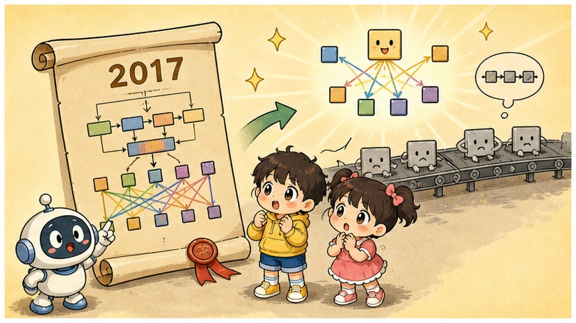
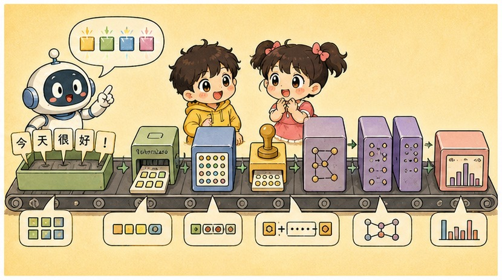
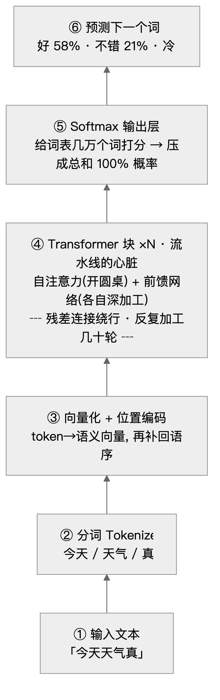
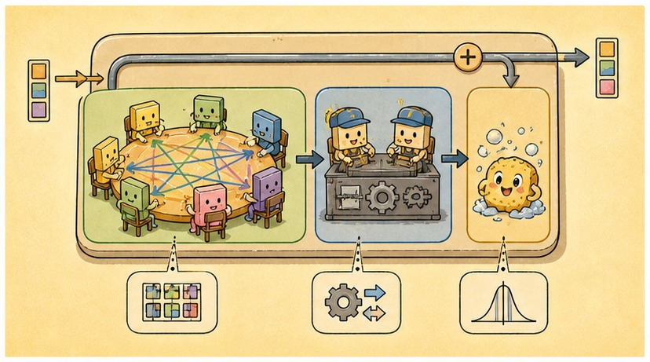
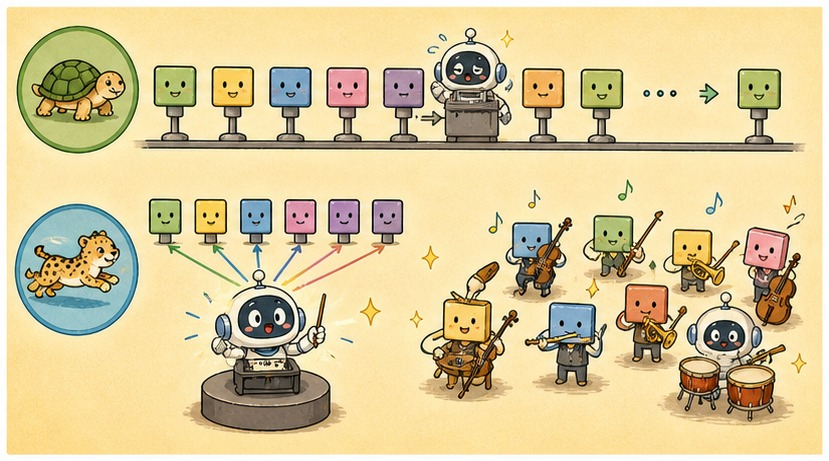

# 第 10 章 · Transformer 架构：不用排队的终极超级乐团

> ### 🎯 先别往下翻 · 这一章要破的题
>
> **🔥 痛点**：注意力是大模型的心脏——可"心脏"不等于"全身"。这些零件到底怎么拼成一个**能并行、还能逐字写出一整篇**的完整 ChatGPT?
> **🤔 换你来**：老方法像传纸条要一个个排队，你会怎么让一句话**所有词同时处理**、还不乱套？
> **🧱 笨办法会撞墙**：继续用老的循环网络（RNN）串行传——**必须等上一个词算完才能算下一个**,GPU 上千个计算单元只能干瞪眼，**根本喂不饱、训不动**互联网级的数据，排不进大模型的赛道。
> 2017 年一篇论文把这道墙推倒了。往下看"不排队的超级乐团"。👇

元元搓搓手，一脸郑重：「问到第二阶段的**压轴大戏**了。把注意力和别的零件拼起来，就是一支**所有乐手同时开奏、谁也不用排队等的'超级乐团'**——它的名字，叫 **Transformer**。今天带你进总装车间（￣▽￣）ノ」

---

## 第 1 节　一篇狂得像宣言的论文

▲ 图10-1 · 一篇狂得像宣言的论文

「2017 年，」元元讲起来像说书，「Google 的八位研究员发了篇论文，标题狂到没边——**《Attention Is All You Need》：注意力就是你需要的一切**。」

潜台词是：**统治语言 AI 多年的循环网络（RNN）可以扔了**，光靠上一章的注意力机制，就能搭出更强的架构。他们造的新架构，就叫 **Transformer**。

> 小满：「这牛吹得有点大吧？」
> 元元：「事实证明这不是狂言——**GPT 的 T、BERT 的 T，都是 Transformer**；Claude、Gemini 也是它的后代。**你今天用到的几乎每个大模型，骨架都是这一副。**」

为啥它能掀翻老乐团 RNN？元元摆出对比：

> **🐢 2017 之前 · RNN 时代（像传纸条）**
> 一个词一个词往后传，**传到后面忘了前面**；必须按顺序逐词处理，**没法并行**。

> **⚡ 2017 之后 · Transformer（像开圆桌会 / 超级乐团齐奏）**
> 整句话**同时入场，任意两词直接对话**；整句并行计算，GPU 火力全开——这才喂得下整个互联网的文本。

它对每句话做的事，能浓缩成**四步流水线**，元元让小满先记个轮廓：

| 步 | 名字 | 干啥 |
|---|---|---|
| **① 切** | 分词 Token | 把句子切成 token，查词表换成编号 |
| **② 变** | 向量 + 位置 | 每个 token 变成语义向量，再盖个"位置戳"补回语序 |
| **③ 磨** | N 个块反复加工 | 自注意力交换信息 + 前馈网络各自深加工，叠几十轮 |
| **④ 猜** | 输出概率分布 | 给词表里所有 token 打分：下一个词最可能是谁？ |

---

## 第 2 节　走一遍总装流水线：从"今天天气真"到"好 58%"

▲ 图10-2 · 走一遍总装流水线：从"今天天气真"到"好 58%"

元元把演示台支起来，输入「今天天气真」，让小满看一条 Transformer 流水线**自下而上**把它加工成"下一个词"的概率——

▲ 图10-1 · Transformer 自下而上的处理流水线

元元逐层点给小满看，重点讲了第 ③ 步那个**容易被忽略的关键**：

> 🎬 **第 ③ 层的小机关 · 位置编码**
> 「每个 token 先变成语义向量（就是第 8 章的 embedding）。但注意——Transformer 是**整句并行处理**的，天生**不知道词的先后**！这样'我打他'会等于'他打我'。所以每个向量还得**叠加一个'位置戳'**①②③……把并行丢掉的语序补回来。」

> 小满：「哦——所以它不是按顺序读，是把整句话拆成一袋词、再给每个词贴个号？」
> 元元：「精辟！记住这点，第 5 节有道题就考它（￣ω￣）」

> 🔧 **这个'位置戳'到底怎么打？**（想深一层的看，跳过不影响主线）：早期做法是用一组**正弦/余弦波**，给每个位置生成一串独特的"数字指纹"——频率高低错落，模型一看就知道"这是第几个、彼此隔多远"；如今主流大模型多改用 **RoPE（旋转位置编码）**：把每个词的向量按它的位置**旋一个角度**，隔得越远转得越开，于是"相对距离"被天然编进了注意力的打分里。不管哪种花样，目的只有一个——**把并行丢掉的"谁先谁后、隔多远"重新塞回去。**

---

## 第 3 节　拆开发动机舱：块里的"三件套"

▲ 图10-3 · 拆开发动机舱：块里的"三件套"

流水线第 ④ 层是整个架构的心脏：几十个一模一样的"块"首尾相接（GPT-3 叠了 **96 个**）。每个块里只有三样东西。元元把发动机舱拆开，一件件给小满看：

> **🎻 第 1 件 · 自注意力（圆桌会议：所有乐手交换情报）**
> 就是第 9 章那套"划重点"的全员版：每个词环顾整句，决定重点参考谁、参考多少，把对方信息按比例"吸"过来更新自己。
> **为啥非它不可？**没有它，"苹果"永远分不清自己是水果还是手机公司——**语义藏在词与词的关系里，必须有个交换信息的环节。**

> **🛠️ 第 2 件 · 前馈网络 FFN（独立车间：每个词各自深加工）**
> 一个小型神经网络，每个词**单独**通过它，词与词互不打扰。
> **为啥非它不可？**只开会不消化，信息就只是被反复搅拌。**注意力负责"交流"，前馈网络负责"思考"**：把刚收集的情报提炼成更抽象的判断——从"苹果旁边有个甜字"提炼出"这是正面评价的食物"。
> 🥚 **彩蛋**：研究者发现，模型大量的"**事实记忆**"——比如"巴黎"是"法国首都"——主要就**存在各层前馈网络的参数里**！它不只是加工车间，还是模型的"知识仓库"。

> **🛗 第 3 件 · 残差连接（直达电梯：保证叠 96 层也训得动）**
> 就是上一章见过的那条"跳层高速路"。本章唯一值得记的"式子"，人话版：**这一层的输出 = 原件 + 本层的批注**。每层只在原文件上贴便利贴，而不是重写一遍。
> **为啥非它不可？**没有它，几十层连续"重写"会把原始信息越磨越淡、训练纠错信号也传不回底层——**深网络直接训崩**（这正是第 6 章的梯度消失！）。有了它，最坏不过"这层批注没价值，原件原样上传"，**深度变成只赚不赔的买卖**。

> 元元总结：「三件套本身**不'理解'任何东西**——它们做的是超大规模的统计与变换，'懂语言'是这些机制堆到足够规模后**涌现**出来的表现（第 12 章细说）。」

---

## 第 4 节　两记重拳：它凭什么淘汰 RNN

▲ 图10-4 · 两记重拳：它凭什么淘汰 RNN

「学术界从不缺新架构，」元元说，「Transformer 能横扫一切，靠的不是巧思，是**两个实打实的工程优势**——」

| 较量回合 | 🐢 RNN · 串行传纸条 | ⚡ Transformer · 并行圆桌会 |
|---|---|---|
| **训练速度** | 必须等上一个词算完才能算下一个，昂贵 GPU 大半时间在围观 | 整句同时算，GPU 并行算力被吃满——互联网级语料从"训不动"变"训得完" |
| **长距离依赖** | 第 1 个词传到第 1000 个词，像传话游戏，传着传着就忘了 | 第 1 个词和第 1000 个词通过注意力**直接对话**，再远也不衰减 |
| **各自的账单** | 结构简单、推理省内存，优点到此为止 | 注意力计算量随句长**平方**增长——上下文窗口有限的根源（第 17 章） |

> 元元敲黑板：「第一拳尤其致命：大模型时代的入场券是'**用海量数据训练超大网络**'，而 RNN 的串行天性让它**根本排不进这个赛道**。**不是 RNN 不够聪明，是它喂不饱。**'喂得饱'这个工程优势，最终滚成了智能上的代差——这是 AI 史反复上演的剧本：**赢在算力友好，而不是赢在精巧。**」

---

## 第 5 节　亲手让模型"蹦字"：自回归生成器

「可流水线一次只产出**一个** token，」小满疑惑，「那 ChatGPT 一大段一大段的回答是哪来的？」

「问得好！答案叫'**自回归**'。」元元摆出生成器演示，「选一个字接到句尾，把**新句子重新跑一遍流水线**，再选下一个——下面亲手跑：每点一次按钮 = 流水线完整运转一次。」

**连环画开演——提示词「今天天气真」：**

🎬 **第 1 步**：跑完流水线，"真"后面大概率接形容词，掷骰子选中概率最高的「好」。**此刻它对再下一个字毫无概念。**

🎬 **第 2 步**：整句「今天天气真好」从底到顶**重新跑一遍**，标点也是 token——逗号胜出。

🎬 **第 3 步**：注意分布**变平了**！逗号之后路有很多条，模型把握没刚才大——"分布平缓处"正是 AI 回答多样性的来源。这次选中「适合」。

🎬 **第 4、5 步**：「出去」「走走」……模型自己生成的字，此刻也通过自注意力**参与了下一次预测——它在接自己的龙**。

🎬 **第 6 步**：句号概率最高，模型判断这句说完了。（真实大模型里还有个看不见的「结束」token，生成到它就停笔。）

> 元元揭晓颠覆直觉的真相：「写「好」的那一刻，模型**完全不知道**后面会出现「走走」。**整句话是六次互相独立的预测拼出来的！**ChatGPT 逐字蹦出回答——**不是打字机特效，是它真实的工作节奏。**这也解释了它为啥偶尔'说到一半把自己绕进去'：每一步只对'下一个字'负责，没谁在监督全文。」

---

## 第 6 节　两大家族：会读的 BERT，会写的 GPT

「原始论文里的 Transformer 是'编码器 + 解码器'两半拼的，」元元补了段家族史，「后来研究者各取一半，分出两条路线。全部分歧浓缩成一个问题——**预测一个词时，允许看哪边？**」

> **📖 BERT · 理解型（完形填空）**
> 挖掉句中一个词，让模型看**前后双向**的上下文把它填回来。擅长理解类任务——搜索相关度、文本分类、情感判断。
>
> **✍️ GPT · 生成型（文字接龙）**
> 只许看**左边**，预测下一个 token。看似比 BERT"瞎了一只眼"，但**会接龙就能写出一切**——ChatGPT、Claude、Gemini，今天的大模型基本都是这条路线。

> 小满：「为啥'瞎了一只眼'的反而笑到最后？」
> 元元：「因为'预测下一个词'**逼着模型理解一切**：要接好'这道题的答案是____'，就得真的会做题！规模上去后，连理解类任务也能用'生成答案'来完成——让 GPT 判断一条评论好差评，只需问它'这是好评还是差评？'，它接龙写出'好评'，分类就做完了。**一个接龙模型通吃读写**，而 BERT 永远写不了长文。」

---

## 第 7 节　这些坑，你八成也会踩

**坑一：「Transformer 是某个 AI 产品 / 某个具体模型」**

> ❌ 新闻里它总和产品名连在一起，以为它就是个模型。
> ✅ 真相是——它是**一张架构蓝图**，像"内燃机"之于汽车。

病根：记住三层关系——**架构**是设计图（Transformer），**模型**是按图训出的成品（GPT-4、Claude），**产品**是包装好的服务（ChatGPT）。说"Transformer 发布了新版本"，就像说"内燃机出了新款轿车"。（各家模型的差异主要在块数多少、训练数据和调教方式，发动机舱里的三件套**大同小异**。）

**坑二：「GPT 回答时已经想好了整句话，逐字蹦只是'打字机动画'」**

> ❌ 人说话前有腹稿，于是以为 AI 也这样。
> ✅ 真相是——它**一次只预测一个 token**，拼到句尾再跑一遍流水线预测下一个，**逐字蹦就是它真实的工作节奏**。

病根：你刚在生成器里**亲手验证过了**——写第 100 个字时，它自己也不知道第 101 个字是啥。第 14 章的温度采样、第 23 章的"先打草稿再回答"，全建立在这个事实上。

---

## 第 8 节　收尾大招：一句话把现象连回流水线

老规矩，秘籍 ＋ 大杀器。

### Transformer 三件套，一张表收干净

| 零件 | 干啥 | 一句话 |
|---|---|---|
| **自注意力** | 所有词互换情报 | 圆桌会议，第 9 章的心脏 |
| **前馈网络 FFN** | 每个词各自深加工 | 独立车间 + 知识仓库 |
| **残差连接** | 输出 = 原件 + 批注 | 直达电梯，叠 96 层也训得动 |

### 收尾大招：你见过的怪现象，全能连回流水线

往后在 ChatGPT 里撞见任何"怪现象"，都能用流水线一键解释——这张表也是**防忽悠指南**：

> | 你看到的现象 | 流水线上的根源 |
> |---|---|
> | 回答逐字往外蹦、越长越慢 | **自回归**：一次预测一个 token，100 字 = 100 次完整计算 |
> | 聊太长就"忘"开头、窗口有硬上限 | 自注意力**平方账单**，超出部分被截掉、真没看见（第 17 章） |
> | 同一问题问两遍，答案不一样 | 终点是**概率分布**，回答是"掷骰子"挑的（第 14 章） |
> | 中文按 token 计费常比英文"贵" | 第一道工序**分词**，中文常被切得更碎（第 11 章） |
> | 让它"一步步想"答案就变聪明 | 多写的每个字都是新一轮计算——**草稿纸就是追加算力**（第 23 章） |

> 🗣️ 一招防忽悠：看到"我们的 AI 会通篇构思再下笔"的宣传，对照第一行——**只要是 Transformer 自回归路线，就是一个字一个字蹦的。**

### 把整章拧成一句话塞进脑子

> **Transformer = 一支"所有乐手同时开奏、谁也不排队"的超级乐团：整句并行入场，任意两词直接对话。**
> 发动机舱三件套：自注意力（交流）+前馈网络（思考/记知识）+残差连接（直达电梯），叠几十块。
> 它靠"并行训练 + 长距离依赖"淘汰了 RNN；回答则是自回归地一个 token 一个 token 蹦出来的。

---

## 🎓 第二阶段 · 通关小结

小满长舒一口气，瘫在椅子上：「四大基石……我感觉脑子被塞得满满的，但是**通透**！」

元元笑着把五章串成一条线：

> 6️⃣ **反向传播**——往前逐层抽象认出猫，往回层层追责改错误。
> 7️⃣ **CNN**——九宫格放大镜在数字网格上滑，从一条边拼出一头驴。
> 8️⃣ **Embedding**——给每个词在高维空间买套房，"意义"能用距离算了。
> 9️⃣ **注意力**——每个词掏出荧光笔环顾四周划重点，按比例吸收。
> 🔟 **Transformer**——把注意力装进"不排队的超级乐团"，并行碾压 RNN。

「你发现没有，」元元意味深长，「第 8、9、10 这三章，**层层递进**：词先变成空间里的点（embedding）→ 点之间靠注意力互相划重点、刷新含义 → 注意力又被装进 Transformer 这台总装机。**到这儿，你已经把一个大模型的'引擎'彻底拆明白了！**」

小满眼睛发亮：「引擎我懂了……那下一步，是看这台引擎**怎么被造出来、灌进知识、调教成 ChatGPT** 的吧？」

「正是！」元元一拍桌子，「第三阶段——**大模型篇 · 一个 LLM 是怎么炼成的**！从 Token 到预训练，再到被调教成你熟悉的样子。引擎装好了，该点火了（★ω★）」

---

## 🧰 装进你的工具箱

> **🔑 一句话方法**：**Transformer** = 一支"所有乐手同时开奏、谁也不排队"的超级乐团（整句并行 + 任意两词直连）；发动机舱三件套——**自注意力**（交流）+**前馈网络**（思考/记知识）+**残差连接**（直达电梯）；回答则是**自回归**，一个 token 一个 token 蹦出来的。
> **🎯 触发器 · 以后遇到这种情况就掏出它**：见到 GPT、BERT、Claude、Gemini，它们都是**这同一张架构蓝图的不同型号**；而"回答逐字蹦/上下文有上限/同题不同答/中文按 token 更贵"，全都能一句话连回这条流水线。
>
> **✍️ 合上书自测**：
> 1. Transformer 并行处理整句，它怎么分得清"我打他"和"他打我"?
> 2. 三件套里，哪个负责"交流"、哪个负责"思考"、哪个保证叠 96 层也训得动？
> 3. GPT 写第 100 个字时，知道第 101 个字是什么吗？这说明它怎么工作？

> 🪜 **下一阶段预告**：第三阶段 · 大模型篇——一个 LLM 是怎么炼成的（第 11–15 章）。

# 🏔️ 第三阶段 · 大模型篇 —— 一个 LLM 是怎么炼成的

---
[← 上一章](../stage_2/chapter_09.md) ｜ [📖 目录](../README.md) ｜ [下一章 →](../stage_3/chapter_11.md)

> 在线阅读《看得见的 AI》· 全 30 章免费 —— 回到 [**项目首页**](../../README.md)，觉得有用点个 ⭐ Star 让更多人看到。
