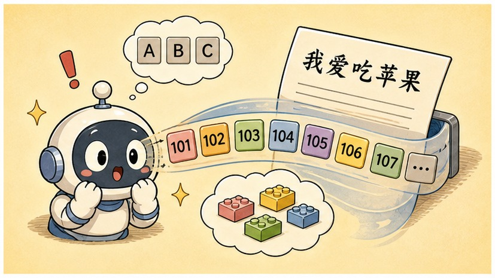
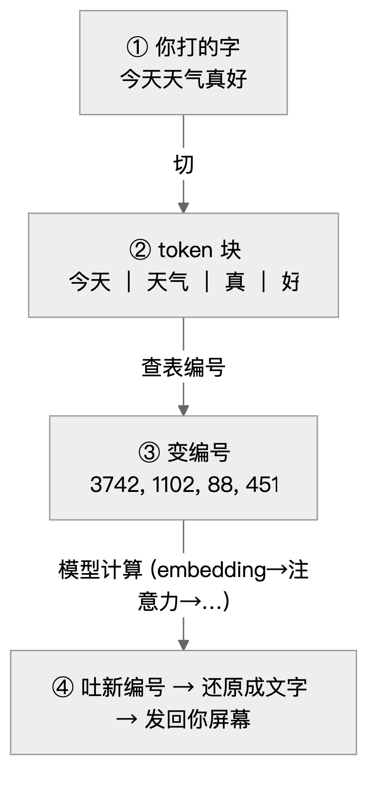
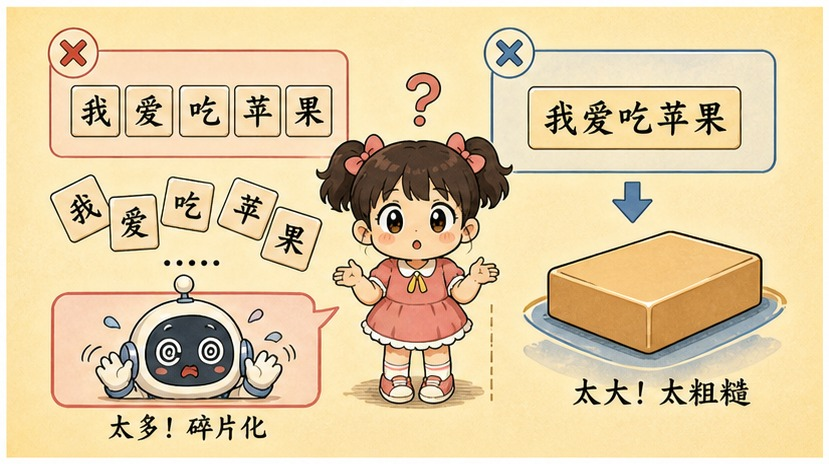
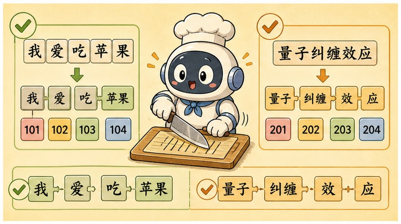
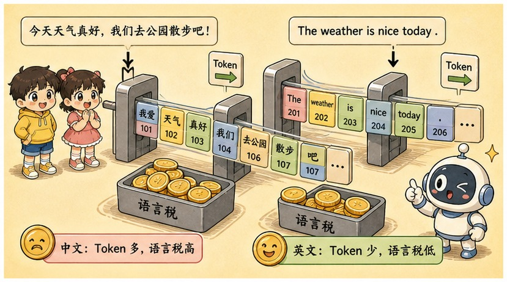

# 第 11 章 · Token 切分器：把语言切成碎片的"汉字绞肉机"

> ### 🎯 先别往下翻 · 这一章要破的题
>
> **🔥 痛点**：上一章把引擎拆透了。可第一步——模型"把每个词换成数字"——到底**咋换的**?
> **🤔 换你来**：如果让你把一句话喂给只认数字的机器，你会怎么切？整词切？还是一个字一个字切？
> **🧱 笨办法会撞墙**：① 一个字一个字切 → 一篇千字文上千步，**算力直接撑爆**;② 按整词切 → 新梗、人名、错别字**根本造不完**，词表外的词全丢。两条都是死路。
> 那大模型走的是哪条活路？往下看元元的"切词小刀"。👇

第二阶段，元元带小满把大模型的"引擎"——Transformer——彻底拆明白了。第三阶段第一章，该给引擎**加燃料**了。

小满：「我记得你说过，模型'第一件事不是读，是把每个词换成数字'……可它到底咋换的？」

元元从抽屉里"唰"地抽出一把小刀，刀背上贴着张标签写着"**切词小刀**"：「问得好！加燃料之前，得先把语言**切成模型嚼得动的碎块**。今天我拿这把刀，教你看懂大模型嘴里的'token'到底是个啥（￣▽￣）ノ」

---

## 第 1 节　模型从不"看字"，它看的是一串编号

▲ 图11-1 · 模型从不"看字"，它看的是一串编号

元元先纠正小满一个根深蒂固的错觉：

> **你以为**：模型在逐字阅读「今天天气真好」——仿佛屏幕对面坐着个识字的人。
> **实际上**：它收到的是 **[3742, 1102, 88, 451]** —— 一串**编号**。

「大模型从不'看字'，」元元说，「你打的每句话，进模型前都被切成一块块文本积木——**token**，每块对应词表里的一个编号。模型吃进去的是编号序列，吐出来的也是编号序列，**最后一步才被还原成文字给你看**。」

他画了一句话的完整旅程：

▲ 图11-1 · 一句话的 token 编号往返之旅

「负责'文字↔编号'来回翻译的程序，」元元指着流程，「叫**分词器（tokenizer）**。记死一点——**它不是模型的一部分，是站在模型门口的翻译官。**」

> 小满：「所以 ChatGPT 回答时字一小段一小段往外蹦……」
> 元元：「正是！模型每算完**一个**新编号，系统就立刻翻译成文字发给你。蹦出来的最小单位是 **token 块、不是字**，所以偶尔先蹦半个词，下一拍才补全——一点不奇怪。」

---

## 第 2 节　为什么非"切块"不可：两条死路逼出的活路

▲ 图11-2 · 为什么非"切块"不可：两条死路逼出的活路

小满：「直接逐字读、或者按整词读，不行吗？干嘛费劲切块？」

「还真不行！」元元摆出两条死路，「token 是被两头逼出来的活路——」

> **🚫 死路① · 逐字看（字符级）**
> 每个字一块，一篇千字文就是上千步。而模型内部"每块都要和每块打招呼"（第 9 章那张**平方账单**），队列一长，算力和工作记忆**迅速撑爆**。像用米粒砌墙：啥都能砌，就是太慢太贵。

> **🚫 死路② · 整词看（词级）**
> 网络新梗、人名、错别字、代码变量名……**词是造不完的**！凡是词表外的词，只能统统标成"不认识"，整段信息当场丢失。像只用预制房间盖楼：图纸上没有的户型就盖不了。

> **✅ 活路 · 高频整块、低频拆碎（BPE）**
> 常见词焊成整块（省步数），生僻词拆到字节（任何输入都拼得出来，**永远不会"不认识"**），词表大小还能精确控制。**两头的好处都要！**

「所以'切块'不是设计者的洁癖，」元元总结，「是工程上的**最优折中**。理解了这点，BPE 的每一步都顺理成章——它要做的，无非是**自动找出'哪些组合值得焊成整块'**。」

---

## 第 3 节　切词小刀实操：把"中"和"文"焊成一块新积木

▲ 图11-3 · 切词小刀实操：把"中"和"文"焊成一块新积木

终于轮到那把小刀出场了。元元说：「切块方案不是人拍脑袋定的，是从海量语料里**统计**出来的。主流做法叫 **BPE（字节对编码）**，思想简单到一句话——**谁总挨在一起，就把谁焊成一块。**」

他在桌上铺满最碎的单字积木，开始连环画演示：

> 🎬 **第 0 步 · 全部拆碎**
> 词表里只有几百个最小单元（字符或字节）：`中` `文` `真` `棒` `中` `文` `很` `难`……任何文字都能拼出来，只是切得稀碎。

> 🎬 **第 1 步 · 数频率**
> 元元拿刀挨个比划："哪两块最常贴在一起？"——扫一遍语料，发现 `中`+`文` 这一对，竟然出现了**几十亿次**，遥遥领先！

> 🎬 **第 2 步 · 焊接成新块**
> "啪"地一刀，元元把 `中` 和 `文` **焊成一整块** `中文`，注册进词表、发一个**新编号**。这个高频高赞的新 token 从此**整块出场，再不拆开**！

> 🎬 **第 3 步 · 重复几万次**
> "数频率 → 焊接""数频率 → 焊接"……重复几万到几十万轮，最终攒出一张几万到二十几万块的词表。**高频词成了大整块，低频词只能用碎块拼。**

元元拿这把刀，当场把同一句话从 **17 块碎渣**一步步焊成 **9 块积木**给小满看。

> 小满恍然：「所以'中文''今天'这种天天用的，早被焊成一整块了；冷僻的就还是碎渣？」
> 元元：「一点就透！于是有了一条**铁律**——**越常见，块越大；越生僻，越碎。**」

---

## 第 4 节　中文的"语言税"：为啥按 token 算账更贵

▲ 图11-4 · 中文的"语言税"：为啥按 token 算账更贵

那条铁律，直接决定了不同语言的"token 密度"。元元掏出账本给小满算：

| 切的是 | 一块 token 装下 | 举例 |
|---|---|---|
| **英文** | 约**四分之三个词** | 常见词整块（the、token），长词拆子词（un·break·able）；1000 token≈750 个英文词 |
| **中文** | 一个字花 **1～2 个 token** | 高频词整块（"今天"），多数字单字一块，生僻字拆字节 |
| **生僻字 / emoji** | 一个字符花 **2～3 个 token** | 词表里没整块，退回字节层拼凑——"饕餮""🍲"都要交"运费" |

「看出来没？」元元敲账本，「**同样意思的一段话，中文切出来的 token 数，通常比英文多！**而 API 是**按 token 计费**的，模型的工作记忆（上下文窗口）也按 token 数算——所以中文天然要交一笔'**语言税**'(￣ヘ￣)。」

> 小满：「那干嘛不把块焊得更大、词表做得更猛，让一句话只占两三块？」
> 元元：「两头都有代价！**块太大**：每块在语料里出现次数变少，模型攒不下足够'语感'，词表还臃肿；**块太小**：又退回死路①，队列变长、每步更贵。主流词表停在几万到二十几万块——**不是理论真理，是工程反复权衡试出来的甜点区。**」

---

## 第 5 节　三个怪现象，一副 token 眼镜全看穿

「很多'大模型怎么连这都不会'的新闻，」元元神秘一笑，「换上 token 眼镜一看，立刻不奇怪了——」

> 🔍 **怪现象① · 数不清 strawberry 里有几个 r**
> 它看到的不是 10 个字母，而是 `[str][aw][berry]` **三个编号块**！问它字母数，就像隔着电话问你"我刚说的那句话一共多少笔画"——字母信息在切块时就被**封进块里**了。

> 🔍 **怪现象② · 认为 9.11 比 9.9 大**
> 切块后是 `[9][.][11]` 对 `[9][.][9]`。逐块对照时「11」压过「9」——**像版本号、像日期，就是不像小数**。数字被切块后，比较并不天然按数值进行。

> 🔍 **怪现象③ · 为啥按 token 计费**
> token 是模型每一步计算的基本单位：吃进多少块、吐出多少块，算力就花多少。所以 API 按 token 收费，上下文窗口也按 token 数算（第 17 章细讲）。

> 元元传授一个**破案口诀**：「以后再看到大模型犯莫名其妙的错，先问一句——**'它看到的块，和我看到的字，是一回事吗？'**多数谜团到这儿就解开了。」

---

## 第 6 节　这些坑，你八成也会踩

**坑一：「一个 token 就是一个单词 / 一个汉字」**

> ❌ "词元"这译名太像"词"了。
> ✅ 真相是——token 可能是半个词、一个词组、一个标点，甚至只是一个字节，**完全由出现频率决定**。

病根：BPE **只认频率不认语法**——"今天"够高频就是一整块，"饕餮"太冷门就被拆成字节碎渣。**块的边界和人类的"词"边界经常对不上。**

**坑二：「模型认识每一个汉字，理解它的字形和笔画」**

> ❌ 拟人化想象。
> ✅ 真相是——模型只认识 token 编号，**"字"这个概念对它根本不存在**。

病根：模型收到的永远是 [3742, 1102, …] 这样的编号序列，字长啥样、几笔写成，它无从得知。所以**拆字、数笔画、玩字形谜语，恰恰是它的天然盲区**。（新一代模型常靠调用代码工具绕过去。）

**坑三：「分词器是模型的一部分，会在使用中跟着变聪明」**

> ❌ 把"翻译官"当成了"大脑"。
> ✅ 真相是——分词器在模型训练开始前就**定稿冻结**了，它只是一张查频率定下来的"切块对照表"。

病根：流程是先用语料统计出词表、冻结分词器，然后整个训练和之后所有对话都用这同一张表。所以**一个新梗火起来后，老模型依然按旧表把它切成碎块**——这也是模型带"年代感"的原因之一。

---

## 第 7 节　收尾大招：一副 token 眼镜破万案

老规矩，秘籍 ＋ 大杀器。

### Token 核心，一张表收干净

| 概念 | 一句话 |
|---|---|
| **token** | 文本的乐高积木块，每块一个编号；模型只见编号不见字 |
| **分词器** | 门口的翻译官，训练前冻结，不是模型的一部分 |
| **BPE** | 谁总挨一起就焊成一块：高频整块、低频拆碎 |
| **token 密度** | 英文 1 块≈0.75 词；中文 1 字≈1～2 块（语言税） |

### 收尾大招：戴上 token 眼镜，怪现象秒破案

往后大模型犯任何"低级错误"，你都先戴上这副眼镜追问一句：

> 　🗣️ **「它看到的'块'，和我看到的'字'，是一回事吗？」**
> - 数不清字母 → 它看的是 `[str][aw][berry]`，字母被封进块里了。
> - 9.11 比 9.9 大 → 它看的是 `[9][.][11]`，按版本号规律接龙。
> - 中文更费钱 → 中文 token 密度低，交的是语言税。
>
> 一副眼镜破万案。连"为啥逐字蹦""为啥按 token 计费"都顺带解释了。

### 把整章拧成一句话塞进脑子

> **大模型不看字，只看 token 编号——文字先被"切词小刀"按 BPE 切成积木块，高频整块、低频拆碎，再换成一串数字喂进去。**
> 中文 token 密度低于英文，所以按 token 算账更贵（语言税）。
> 数不清字母、9.11>9.9 这些怪事，戴上 token 眼镜全不奇怪——它看到的块，和你看到的字，从来不是一回事。

---

小满把切词小刀还给元元，追问：「好，现在燃料切成 token 块、灌进引擎了……可引擎**到底拿这几十万亿块 token 干嘛**？它咋就从一堆碎块里，学出'床前明月光'后面接'光'的本事的？」

元元眼睛一亮：「问到第三阶段的心脏了！答案朴素到你不敢信——它就玩**一个游戏**，玩上**万亿次**。走，下一章带你看这台'**吞下整个互联网的超级复读机**'是怎么炼成的（★ω★）」

---

## 🧰 装进你的工具箱

> **🔑 一句话方法**：大模型**不看字，只看 token 编号**；文字先被按 **BPE** 切成积木块（**高频整块、低频拆碎**），再换成一串数字喂进去。中文 token 密度低于英文，所以**按 token 算账更贵**（语言税）。
> **🎯 触发器 · 以后遇到这种情况就掏出它**：大模型犯任何"低级错误"，先戴上 token 眼镜追问——**"它看到的'块'，和我看到的'字'，是一回事吗？"** 数不清字母、说 9.11>9.9、中文更费钱，全都不奇怪了。
>
> **✍️ 合上书自测**：
> 1. 为什么它数不清 strawberry 里有几个 r?
> 2. 同样意思，中文和英文哪个更费 token?这对账单意味着什么？
> 3. 分词器是模型的一部分、会越用越聪明吗？

> 🪜 **下一章预告**：第 12 章 · 预训练——吞下整个互联网的超级复读机。

---
[← 上一章](../stage_2/chapter_10.md) ｜ [📖 目录](../README.md) ｜ [下一章 →](../stage_3/chapter_12.md)

> 在线阅读《看得见的 AI》· 全 30 章免费 —— 回到 [**项目首页**](../../README.md)，觉得有用点个 ⭐ Star 让更多人看到。
