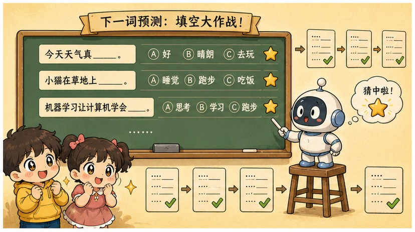
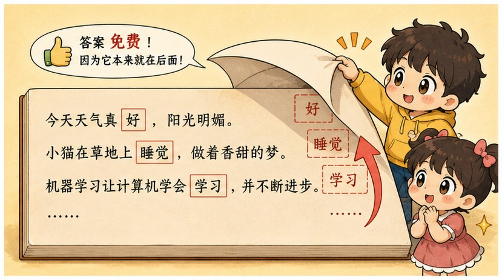
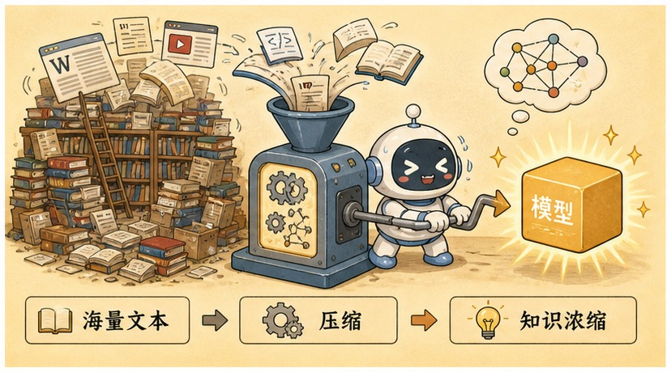
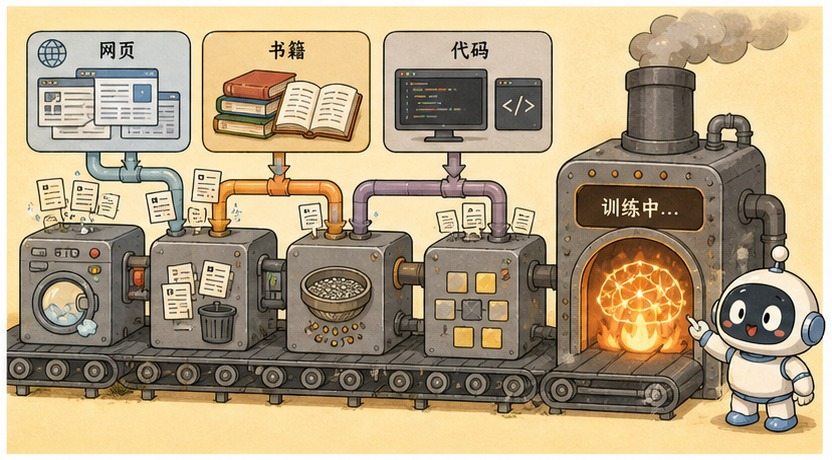
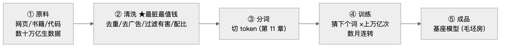

# 第 12 章 · 预训练：吞下整个互联网的超级复读机

> ### 🎯 先别往下翻 · 这一章要破的题
>
> **🔥 痛点**：燃料切成 token 灌进去了——引擎**到底拿这几十万亿块 token 干嘛**?它咋就学出"床前明月光"后面接"光"的本事？
> **🤔 换你来**：如果只让你做一种"作业"、重复亿万次，就能让机器学会语言、知识、甚至写代码，你猜是哪种作业？
> **🧱 笨办法会撞墙**：你可能以为得**雇人把每条数据的答案都标好**（像第 2 章标垃圾邮件）——可几十万亿个词，**雇多少人都标不完**，成本直接劝退。
> 聪明人找到一种"答案免费自带"的游戏。往下看。👇

元元搓搓手，一脸"接下来是好戏"的表情：「答案朴素到你不敢信——整个预训练，**只玩一个游戏：文字接龙。**只不过，它把这游戏玩了**上万亿次**。走，看这台'吞下整个互联网的超级复读机'怎么炼成（★ω★）」

---

## 第 1 节　一个游戏，玩上万亿次

▲ 图12-1 · 一个游戏，玩上万亿次

「上一章说了，大模型眼里世界是一串 token。」元元起头，「这一章回答下一个问题：拿到几十万亿个 token，它到底在学啥？」

他把"文字接龙"拆成三步，给小满演：

> 🎬 **第一步 · 出题**
> 从语料里随手截一段：「床前明月光，疑是地上____」——让模型猜下一个 token。它吐的不是一个词，而是一张**概率表**：霜 92%、雪 3%、水 1%……每个候选都押个注。

> 🎬 **第二步 · 对答案**
> 原文的下一个字「霜」**就是标准答案**——不用出题老师，不用阅卷员！**文本每个位置都天然自带答案**，这叫**自监督学习**。

> 🎬 **第三步 · 微调**
> 猜偏了？用反向传播（第 6 章）算出每个参数该负多少责，各拧一丢丢——正是第 4、6 章那套"猜→比对→微调"的循环。然后换下一段文字，**重复上万亿次**。

「全部训练目标，一行就写完，」元元写下，「**让 P（下一个 token | 前文） 越高越好**。」看小满皱眉，他赶紧翻译：「**P 就是'概率'，中间那根竖线读作'在……条件下'**。人话就是：看着这段前文，原文里真正出现的那个词，你给它报的概率要越来越高。猜得越离谱，参数拧得越狠。**整个预训练，没有第二个目标。**」

元元又拖了拖想象中的"训练量"滑块，给小满演四道接龙题的成长：

> 🎬 **训练量 = 0**：千亿个旋钮停在出厂随机位，每个候选纯瞎猜。
> 🎬 **百万级**：最常见规律先冒头——哪些字总挨一起。
> 🎬 **十亿级**：语法基本过关，常见事实开始记住。
> 🎬 **万亿级**：冷门事实、代码套路也渐渐到位。
> 🎬 **十万亿级**：四道题全接得又稳又准——语法、事实、记忆、编程，**没一样是单独教的**。

> 小满发现个细节：「这四道题进步速度**不一样**啊？语法学得快，世界事实（'法国首都是巴黎'）慢，太冷门的甚至记不牢？」
> 元元竖大拇指：「火眼金睛！**语料里越常见的规律，学得越早**——这条记住，下一节有大用。」

---

## 第 2 节　这游戏真正的妙处：答案免费

▲ 图12-2 · 这游戏真正的妙处：答案免费

小满：「就这么个破游戏，凭啥能撑起整个大模型？」

「妙就妙在**第二步**！」元元拔高声音，「第 2 章说过，监督学习最贵的环节是**人工标注答案**——标一百万张猫片要雇一支队伍，标到一百万张就到头了。可文字接龙的答案是**文本自带**的，标注成本**直接归零**！」

「于是，」他一字一顿，「训练规模的天花板，从'**雇得起多少标注员**'，一下子变成了'**互联网有多大**'。这就是大模型能'大'起来的第一个秘密——**不是游戏多高级，而是这个游戏可以无限供货。**」

> 元元补刀：「换别的任务都做不到！让模型学'翻译'，你得先雇人配好百万句对照；学'摘要'，得先雇人写百万篇摘要；只有'预测下一个词'——**整个互联网每一句话，都是现成考题。**」

---

## 第 3 节　压缩即智能：接龙怎么就接出了"理解"

▲ 图12-3 · 压缩即智能：接龙怎么就接出了"理解"

小满还是将信将疑：「这么简单的游戏，咋可能玩出智能？」

「关键在'**接对**'二字！」元元说，「互联网语料无奇不有，想把各种句子都接对，**光靠背是不够的**——每类接龙题，都在逼模型学会一种真本事：」

| 语料里真会遇到的接龙题 | 想接对，就必须…… |
|---|---|
| "他学习非常努力，因此成绩____" | **掌握语法和常识因果**（接"提高了"，不是"下降了"） |
| "法国的首都是____" | **记住世界事实**（肚里得存着"巴黎"） |
| 侦探小说最后一页："凶手就是____" | **长程推理**（读懂前文几万字伏笔，自己破案） |
| "def add(a, b): return ____" | **会写代码**（看懂函数名和参数，接出 a+b） |

「现在把尺度拉满，」元元讲到关键，「几十万亿 token 的语料，要装进只有**千亿级**参数的'脑容量'——**差着两个数量级，原文根本存不下！**」

他打了个绝妙的比方：

> 🎓 **学霸备考**：教科书三千页，小抄只许带一页。他不可能把原文缩印上去，只能**提炼**——把一万道例题浓缩成几条解法，把整章史实浓缩成因果脉络。

「模型面对的正是同一道选择题，而且它**别无选择**：与其背下一万种'巴黎是法国首都'的说法，不如存一条事实；与其背下 GitHub 所有代码，不如学会语法和套路。」

「更狠的一层，」元元压低声音，「**死记硬背在这个游戏里根本拿不到高分！**明天截出来的前文几乎必然没见过——背原文的模型一出考场就露馅（第 5 章的过拟合）。**只有提炼出规律，才能在没见过的句子上照样接对。预测得越准，说明提炼得越深**——这就是那句行话：**压缩即智能。**」

> 小满一拍大腿：「难怪它能'用李白风格写程序员的诗'！这诗互联网上根本没有……」
> 元元：「正是！它存的不是哪首诗的原文，而是'李白风格'这条**规律本身**。语法、事实、逻辑、翻译、编程——**没一样是单独开的章，全是把一个游戏玩到极致的副产品。**」
> 元元又补一句：「不过得说两句公道话。其一，'压缩即智能'是眼下**最有说服力的一种解释，不是盖棺定论的定律**——压缩到底能不能完全说清'推理''世界模型'这些本事是怎么冒出来的，学界还在争；但当**直觉**用，它足够好使。其二，硬币有反面——压缩是**有损**的，细节会被揉混记错。这笔账先记下，'误区'里再算。」

---

## 第 4 节　数据车间：脏活累活与天文数字

▲ 图12-4 · 数据车间：脏活累活与天文数字

「'用整个互联网训练'听着浪漫，」元元话锋一转，「车间现场全是脏活累活。」他摆出五站流水线：

▲ 图12-1 · 预训练数据五步流水线

「第②站最不起眼，却最要命。」元元强调，「原始网页满是广告、乱码、模板、垃圾站的胡话——直接喂进去，模型学到的就是这些。各家在这步投入的工程量，**不比训练本身少**：」

> 🧹 **去重**：同一篇爆款被转载几万次，不去重模型就会死记硬背它（过拟合换马甲）。
> 🧹 **过滤**：剥广告导航、剔有害隐私、低质页整页扔——**淘汰率高得惊人**。
> 🧹 **配比**：像调配方一样定代码、多语言、百科各占几成。**多喂代码，逻辑通常更强**（业内公认）。
> 🧹 **结论**：第 5 章"数据为王"在这应验——**同样的架构与算力，数据更干净的那家赢。模型天花板在清洗这步就定下了。**

最后元元让小满感受这场游戏的尺度（2025 年前后旗舰模型**数量级示意**）：

| 维度 | 量级 | 体感 |
|---|---|---|
| 训练数据 | 十万亿级 token | 一个人每天读 8 小时，要读上几万年 |
| 参数规模 | 千亿级参数 | 千亿个可学习的"旋钮"（第 3 章的权重） |
| 训练时长 | 连跑数月 | 数万张顶级 GPU 昼夜连轴，崩了从检查点爬起重跑 |
| 训练成本 | 百万美元级电费 | 整体成本更高一个量级——牌桌上只剩少数玩家 |

---

## 第 5 节　刚出炉的基座模型：满腹经纶，却不会聊天

「烧掉几个月电费，」元元说，「你得到的**并不是 ChatGPT**，而是一个'**基座模型**'。给它一个最准的心智模型——**宇宙文档补全器**：无论你输入啥，它都假设这是互联网某篇文档的开头，然后竭尽全力把这篇文档'写完'。」

「不信你问它个问题——」元元演了一段：

> **你以为它会答**："中国的首都是哪里？" → **北京。**（有问有答，这是"助手"行为）
> **基座模型可能接**："中国的首都是哪里？" → **这是小学二年级的试题。请从下列选项中选出正确答案：A. 上海 B. 北京……**

「看！」元元指着，「问题**不在于它不知道，而在于它不听话**：它只有'续写'这一种行为模式，根本不懂'你在提问、我该回答'这个社交契约。」

他又演了一个**骗术**让小满惊叹：

> 🎬 把输入摆成"中国的首都是____"（留半句），基座模型立刻接："**北京。北京是中华人民共和国的首都……**"
> 🎬 或者排成"问：……换行 答："，它为了把这篇"问答体文档"续写得像样，**只能乖乖写出答案**。

> 小满：「神了！知识明明在肚子里，只是要'摆对姿势'才掏得出来？」
> 元元：「精辟！这个骗术正是**提示工程的雏形**（第 16 章）。但骗术终究是骗术——时灵时不灵，还骗不出'礼貌''拒绝有害请求''承认不知道'这些助手品质。把这台接龙机器真正调教成有问必答、还懂规矩的助手，靠的是另一套手术——**下一章的主角。**」

---

## 第 6 节　这些坑，你八成也会踩

**坑一：「模型内部存了个原文数据库，回答就是去里面'查资料'」**

> ❌ 把模型当成了搜索引擎。
> ✅ 真相是——参数里**没有一篇原文**，只有有损压缩后的统计规律，**回答是现场生成的，不是查出来的**。

病根：几十万亿 token 压进千亿参数，注定有损压缩。好处是学会举一反三，代价是细节会"**记混**"——把相似的人名、日期、论文标题揉在一起，一本正经编出不存在的东西。**幻觉的一大根源就在这里**（第 29 章细讲）。

**坑二：「模型每天联网冲浪，持续学习新知识」**

> ❌ 把产品的"联网搜索"功能当成了模型本身的能力。
> ✅ 真相是——**训练截止那一刻，参数就被冻结了**，之后的新闻、新梗它一概不知。

病根：重新训练一次贵到没法天天做，所以每个模型都有"**知识截止日期**"。想让它聊最新消息，得把资料**现场喂进上下文**——这套"外挂知识库"的玩法叫 **RAG**（第 18 章专讲）。

---

## 第 7 节　收尾大招：一句话看穿"AI 在查资料"

老规矩，秘籍 ＋ 大杀器。

### 预训练核心，一张表收干净

| 概念 | 一句话 |
|---|---|
| **预训练 = 文字接龙** | 猜下一个 token，猜错拧参数，重复上万亿次 |
| **自监督** | 答案是文本自带的，标注免费——规模才能干到整个互联网 |
| **压缩即智能** | 存不下原文，只能提炼规律；预测越准=提炼越深 |
| **基座模型** | 宇宙文档补全器：满腹经纶却只会续写，不会聊天 |

### 收尾大招：一句话戳破"AI 在查资料"

往后谁说"它肚子里存着维基百科原文，回答就是查出来的"，你就用"**压缩**"二字反驳：

> 　🗣️ **「几十万亿 token 装进千亿参数，差两个数量级，原文根本存不下——它只能做有损压缩、提炼规律。」**
> - 所以回答是**现场重新生成**，不是查找原文。
> - 所以它能"用李白风格写程序员的诗"（存的是规律不是原文）。
> - 也所以它会**一本正经编出不存在的引文**（压缩有损，细节记混）——这就是幻觉。

一句"压缩有损"，连大模型为啥会"一本正经胡说八道"都顺带解释了。

### 把整章拧成一句话塞进脑子

> **预训练 = 在整个互联网上玩"猜下一个词"的接龙游戏，玩上万亿次。**
> 答案文本自带（自监督），所以能无限供货；语料大过脑容量，逼它把原文压缩成规律——压缩即智能。
> 产出的"基座模型"满腹经纶却只会续写，是个宇宙文档补全器——把它调教成听话的助手，是下一章的事。

---

小满盯着那个只会续写、还把提问当考卷的基座模型，又好气又好笑：「这家伙……知识满满，脾气却野得很啊！你给它'中国的首都是哪里'，它还反过来给你出选择题（╯▽╰）」

元元大笑：「你算说着了！刚出炉的基座模型，就是一头**野性未驯的'狂暴巨兽'**——只会顺着话茬接龙，你跟它对骂它能陪你骂一整天。怎么给这头巨兽套上**两道紧箍咒**，磨成贴心助手？下一章，重头戏来了（★ω★）」

---

## 🧰 装进你的工具箱

> **🔑 一句话方法**：预训练 = 在整个互联网上玩"**猜下一个词**"接龙，玩上万亿次；答案是**文本自带**的（自监督），所以能无限供货；语料大过脑容量，逼它把原文**压缩成规律**——**压缩即智能**。产出的"基座模型"满腹经纶却只会续写。
> **🎯 触发器 · 以后遇到这种情况就掏出它**：谁说"它肚子里存着维基百科原文、回答是查出来的"，你就用"**压缩**"反驳——参数装不下原文，只能提炼规律、**现场生成**；也正因压缩**有损**，它会一本正经**编出不存在的引文**（幻觉）。
>
> **✍️ 合上书自测**：
> 1. 预训练号称"不要人工标注"，可它一直在对答案——矛盾吗？
> 2. 用"压缩"两个字解释：为什么它存不下原文、还会产生幻觉？
> 3. 给刚出炉的基座模型发"怎么煮溏心蛋？"，它最可能输出什么？为什么？

> 🪜 **下一章预告**：第 13 章 · 指令微调与强化学习——从狂暴巨兽到贴心助手的两道紧箍咒。

---
[← 上一章](../stage_3/chapter_11.md) ｜ [📖 目录](../README.md) ｜ [下一章 →](../stage_3/chapter_13.md)

> 在线阅读《看得见的 AI》· 全 30 章免费 —— 回到 [**项目首页**](../../README.md)，觉得有用点个 ⭐ Star 让更多人看到。
