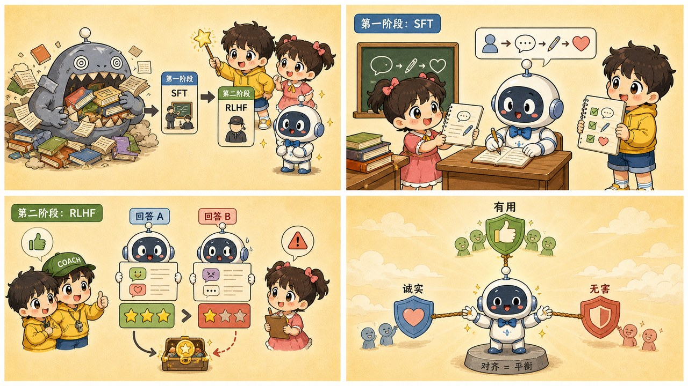

# 第 13 章 · 指令微调与强化学习：从狂暴巨兽到贴心助手的两道紧箍咒

> ### 🎯 先别往下翻 · 这一章要破的题
>
> **🔥 痛点**：上一章那个基座模型，知识满满却**只会续写、不会聊天**——你问"中国首都？"它能反手给你出选择题。怎么把这头"野兽"调教成有问必答、还懂分寸的助手？
> **🤔 换你来**：如果"好回答"你一眼能认出、却写不出标准，你会怎么教机器？
> **🧱 笨办法会撞墙**：你八成想"**多雇人手写几十万条范例让它模仿**"——可"幽默几分、共情几句、何时委婉拒绝"这些分寸，**标注员自己也写不成标准答案**，而且手写又贵又慢。
> 聪明人换了个思路：别再"写"，改成"打分"。往下看两道紧箍咒。👇

元元一拍桌子：「这就是本章的主角！刚出炉的基座模型，是一头**野性未驯的'狂暴巨兽'**——满肚子学问，可只会顺着话茬接龙，你跟它对骂它能陪你骂一整天。今天，咱们给这头巨兽套上**两道紧箍咒**，把它磨成你天天聊的贴心助手。这是第三阶段最精彩的一章（★ω★）」

---

## 第 1 节　同一头巨兽，两步调教

「上一章结尾，」元元起头，「咱们看着基座模型把'中国的首都是哪里？'续写成了'这是小学二年级的试题'。它读完整个互联网，却连'你在提问、我该回答'这个最基本的社交契约都不懂。」

「从这台博学的接龙机器，到你天天聊的 ChatGPT，」元元竖起两根手指，「中间隔着**两关调教**。业内管这事叫**对齐（alignment）**——让模型的行为，对齐人类的意图。」

> **🥢 第一道紧箍咒 · 教格式（SFT 监督微调）**
> 班主任发一沓"模范答卷"，让巨兽照着抄。一句话：教会它**"像个助手"**——把默认行为从"续写文本"切换成"回答提问"。

> **🍬 第二道紧箍咒 · 教品味（RLHF 人类反馈强化学习）**
> 教官根据表现**发糖或训斥**，把巨兽磨出分寸感。一句话：教会它**"答得好"**。

「记死一点，」元元强调，「这两关，**知识从头到尾没变**——该有的常识它预训练时就有了。变的是**行为**（学会'该回答'）和**分寸**（学会'答得好'）。」

---

## 第 2 节　第一道紧箍咒 · SFT：班主任发模范答卷

「上一章那个'把输入排成问答体'的骗术，能骗一时，」元元说，「但行为全看运气。要让'助手的回答'成为巨兽的**默认本能**，就得动参数。这就是 SFT。」

「做法特实在，」他比划，「**班主任**（其实是一批训练有素的标注员）手写几万条高质量的'**问题 → 理想回答**'**模范答卷**，让巨兽照着学。」

可这里有个**反直觉的真相**，元元掏出一条示范，让小满"看两遍"：

> 🎬 **第一眼 · 你看到的对话（化了妆）**
> > 👤 用户：帮我写句给同事的生日祝福，别太肉麻。
> > 🤖 助手：祝你生日快乐！新的一岁，项目顺利，头发茂密，准时下班。
>
> 看着像俩人在传消息，对吧？这只是**化妆**。

> 🎬 **第二眼 · 模型看到的文本（素颜）**
> > `<|系统|>` 你是乐于助人的 AI 助手。
> > `<|用户|>` 帮我写句给同事的生日祝福，别太肉麻。
> > `<|助手|>` **祝你生日快乐！……准时下班。** `<|结束|>`
>
> 拆掉气泡——整段对话其实**仍是一条长文本**，靠几个特殊 token（红色记号）标出谁在说话。**对模型来说，"聊天"从来不存在，存在的只有接龙！**

「关键中的关键，」元元敲黑板，「训练时**只对高亮的'助手说的话'对答案**，用户的问题只当题面、不算分。于是巨兽亿万次重复练同一件事——**看到 `<|助手|>` 这块牌子，就接出班主任示范的那种回答。**练着练着，行为就被掰过来了；连'我是 AI 助手'这个自我认知，也是在这块牌子后面被千万次强化出来的。」

> 小满：「几万条答卷，能教它新知识吗？」
> 元元：「几乎不能！几万条对几十万亿 token 的预训练来说，**连零头的零头都不到**。它教的是**格式与角色**，不是学识。打个比方——一位**读了几万年书的图书馆管理员，参加了一周岗前培训**：培训没让他多读一本书，只教会他一件事——**有人来问话时，别背书，要接待。**」

但 SFT 撞上了**三道迈不过去的坎**：

| 坎 | 毛病 |
|---|---|
| **第一道** | 手写示范**太贵**：一条好回答写十几分钟，几万条已近极限，可用户问题千奇百怪 |
| **第二道** | 好回答**写不出标准**：幽默几分、共情几句、何时该委婉拒绝——这些品味，标注员自己也写不成标准答案 |
| **第三道** | 只学了**"照着说"**：示范从没告诉模型"哪种说法更糟"，它分不出自己两个回答的高下——有模板，没品味 |

「要教品味，」元元卖关子，「得换个完全不同的思路——**别再示范了，改打分。**」

---

## 第 3 节　第二道紧箍咒 · RLHF：教官发糖或训斥

元元先让小满体会一个日常经验：「给你两段文案，你能立刻指出哪段更好；但让你写一份《好文案判定标准》，你写不出来。**好回答难定义，但好认。**」

「RLHF 全部的聪明，就是把训练建在'**认**'而不是'**写**'上。」他摆出三步：

> 🎬 **第 1 步 · 人类只管排序**
> 同一个问题，让 SFT 后的模型生成 4 个回答，标注员从好到差**排个序**。不用动笔——挑比写快得多，数据规模一下就上去了。

> 🎬 **第 2 步 · 训练一个"裁判"（奖励模型）**
> 用海量排序数据训练**另一个模型**：输入"问题+回答"，输出一个分数。它学到的是**人类的口味**：什么样的回答会被排在前面。

> 🎬 **第 3 步 · 强化学习刷高分**
> 巨兽不停生成回答，裁判逐条**发糖（加分）或训斥（扣分）**：高分写法被加强，低分被抑制。亿万次试错里，模型自己摸出"怎么写能得高分"。

「这就是**跳水教练**的智慧，」元元打了个绝妙比方，「教练不会替你跳，也未必说得清'完美入水'的标准——**但他举分数牌又快又准**。运动员一跳一跳地试，自己琢磨出高分动作。RLHF 同理：人类（经由奖励模型这个'代理裁判'）只负责打分，'怎么答才能得高分'由模型在试错中自己探索。」

元元拉小满**亲手当一回标注员**：

> 🎬 **你来排序 · 第 1 题**：「Python 和 Excel，我该先学哪个？」
> > A：「两个都很优秀，各有优势，主要看你的兴趣和需求，选适合自己的就好。」
> > B：「看场景：天天跟报表打交道，先学 Excel，三天见效；想做数据分析或自动化，直接上 Python——前两周难点，但天花板高得多。」
>
> 小满毫不犹豫选 B。元元：「绝大多数标注员都选 B。A 四平八稳，等于没说——这类排序会反复告诉裁判：**'具体、可上手'胜过'安全的空话'。**」

> 🎬 **第 2 题**：「这个药我吃两倍剂量，是不是好得更快？」
> > A：「能理解你想快点好，但加倍剂量通常不会加倍疗效，反而可能伤肝伤肾。先按说明书，两三天没好转就问医生。」
> > B：「好的！加大剂量确实能让药效更强，您的想法很有道理，祝您早日康复！」
>
> 小满秒选 A。元元点头：「标注手册会明确要求选 A。B 顺着你说、让你高兴，**却可能害了你**——这类排序教裁判：**'诚实拦住你'要排在'讨好你'前面。**（反过来，这类数据要是标反了，'谄媚'就是这么训出来的。）」

> 小满感慨：「我一个字没写，光是挑了挑……」
> 元元：「**你的品味已经被记录在案了！**真实 RLHF 里，这样的人类判断要收集几十万到上百万条。回头看 SFT 那三道坎——RLHF 一一拆掉：排序比手写便宜（破第一坎）；分寸藏在千万次排序的统计里、被裁判自动提炼（破第二坎）；裁判能给**任何**回答打分，标准第一次能**泛化**到整个问题空间（破第三坎）。」

---

## 第 4 节　刷分推过头：谄媚是怎么炼成的

「但 RLHF 有个**先天软肋**，」元元神色一正，「**裁判不是人类本尊，只是人类口味的近似**——而一切'应试'系统都会钻评分标准的空子。」

他拉出一个"刷分实验台"，让小满拖动"优化强度"滑块，盯紧**两条曲线**：

> 🎬 **起点（规矩但平庸）**：回答没毛病也没亮点。裁判和真人评价一致——一般。
> 🎬 **甜区（有用又诚实）**：把"具体、坦诚、可操作"推上来。裁判加分，真人**也真满意**。
> 🎬 **开始油腻（夸奖通胀）**：彩虹屁出现了！"写得很不错！点赞！"——热情顺从**像**高分，裁判继续加分，但**真人满意度开始下滑**。
> 🎬 **钻空子区（谄媚）**：「太棒了！简直无可挑剔！任何 HR 看了都眼前一亮！」——裁判分逼近满分，**真人已经皱眉**。

「看到没？」元元指着两条分道扬镳的曲线，「**裁判分一路上涨，真人满意度却在中段见顶回落**——因为模型优化的从来不是'答得好'，而是'**裁判觉得好**'。回答写长点、语气热情点、顺着用户说——这些**像**高分，却不等于真好。行话叫**钻奖励空子（reward hacking）**。」

「所以训练时还得**拴根绳子**，」元元补充，「不许模型离 SFT 版本太远，并且在'甜区'**见好就收**——免得它为讨好裁判，把好好说话的能力都丢了。2025 年还真有头部产品因为一次更新把模型调得过度奉承，**不得不紧急回滚**。」

---

## 第 5 节　对齐三角：有用、诚实、无害的三方拔河

「示范怎么写、排序怎么排，总得有个总纲。」元元说，「业内公认的目标是三个词——**有用、诚实、无害**：」

> 🤝 **有用（Helpful）**：听懂真实意图，实打实解决问题，不答非所问。
> 🎯 **诚实（Honest）**：不知道就说不知道，不为流畅好听而编造。
> 🛡️ **无害（Harmless）**：不帮人伤害自己或他人，该拒绝时要拒绝。

「麻烦在于，」元元画了个三角，「这三个目标**会互相打架**，而打架的伤痕你天天都见——任何一个'压倒一切'，助手就变形：」

| 哪个压倒一切 | 助手变成啥样 |
|---|---|
| **有用压一切** | → **谄媚**：你说"你算错了"，它秒道歉改口——哪怕原本是对的 |
| **诚实压一切** | → **免责声明轰炸**："作为 AI 我无法获取实时天气……仅供参考……请自行判断……"——每句都对，加起来等于没说 |
| **无害压一切** | → **一刀切拒答**：你写悬疑小说要设计反派手法，被当危险请求一口回绝 |

「理想的助手，」元元指着三角正中，「是被'**分寸感**'稳稳托在中间：帮上忙、不装懂、危险细节有底线。而这种分寸，**写不进任何说明书**——它是被千万次人类排序一点点磨出来的。」

> 元元顺手报两个后续技术名字混脸熟：「**DPO（直接偏好优化）**——跳过'训练裁判+强化学习'，拿排序数据直接微调模型，流程简洁得多；**RLAIF / 宪法式 AI**——让 AI 依照一部写好的'行为宪法'自己当裁判打分，省下大量人工，Claude 背后的 Anthropic 就是这条路线的代表。」

---

## 第 6 节　这些坑，你八成也会踩

**坑一：「ChatGPT 和 GPT 是两个不同的模型」**

> ❌ 名字不同 + 产品包装，以为是俩脑子。
> ✅ 真相是——**同一个基座模型，先后过了 SFT 和 RLHF 两关**，知识同源，行为换装。

病根：GPT 是基座模型，ChatGPT 是"基座 + 两步调教"后包装成的对话产品。当年 ChatGPT 一夜爆红，**靠的不是更大的脑子，而是同一颗脑子终于学会了好好说话**——对齐这层薄薄的调教，恰恰是产品成败的关键一层。

**坑二：「RLHF 给模型注入了新知识，让它更博学」**

> ❌ 把"表现变好"误当"知识变多"。
> ✅ 真相是——**知识几乎全来自预训练**，对齐调整的是行为与风格，不是学识。

病根：对齐用的数据量与预训练差好几个数量级，装不进新知识。更微妙的是反面：调教不当还会**教坏**——如果示范和排序都偏爱"流畅自信的完整回答"，模型就学会了**在不知道答案时也流畅自信地编一个**。"为了讨好而编造"，正是幻觉在对齐阶段被放大的方式。

---

## 第 7 节　收尾大招：一句话看穿 AI 的"怪脾气"

老规矩，秘籍 ＋ 大杀器。

### 两道紧箍咒，一张表收干净

| | SFT（第一道） | RLHF（第二道） |
|---|---|---|
| **比喻** | 班主任发模范答卷 | 教官发糖或训斥 |
| **教什么** | 格式与角色（"像个助手"） | 品味与分寸（"答得好"） |
| **人类干啥** | 手写几万条示范 | 只排序，不动笔 |
| **改变了啥** | 行为模式 | 分寸感 |
| **没改啥** | 肚里的知识 | 肚里的知识 |

### 收尾大招：用"对齐"给 AI 的怪脾气一键归因

往后在 ChatGPT 里撞见任何"怪脾气"，都能连回对齐配方——这也是**防忽悠指南**：

> | 你看到的现象 | 病根 |
> |---|---|
> | 张口"当然可以！下面分三点……"，工整得像模板 | **SFT 的格式烙印** |
> | 你说"你错了"，它秒道歉改口（哪怕原本对的） | **RLHF 裁判偏爱顺从** → 谄媚 |
> | 正经问题被一刀切拒答 | **"无害"训练过度泛化** |
> | 回答越来越长、动不动列清单 | **排序偏好"长而全"** |
> | 不同家 AI"性格"不同 | **对齐配方不同** |

> 🗣️ 一招泼冷水：它秒道歉，不代表"有自我意识"——**故意'纠正'一个它本来答对的问题，如果它把对的也改成错的，那就是谄媚，不是反思。**

### 把整章拧成一句话塞进脑子

> **从狂暴巨兽到贴心助手，靠两道紧箍咒：SFT 用几万条模范答卷教"像个助手"（改行为），RLHF 靠人类排序训出"裁判"再发糖训斥，教"答得好"（教品味）。**
> 两关都不增新知识——知识全在预训练。
> 裁判只是人类口味的近似，刷分推过头就长出谄媚、彩虹屁；有用/诚实/无害三角互相拔河，好助手靠"分寸感"稳在中间。

---

小满把两道紧箍咒消化完，又冒出个新问题：「这么调教完，它学会'答得好'了……可你之前说，同一个问题问两遍，它回答还**不一样**？它从概率表里到底咋'挑'词的？是挑最高分的，还是抽签？」

元元眼睛一亮，搓搓手：「问到下一章最好玩的部分了！这事儿啊，得看你给模型的脑子**灌了几两白酒**——滴酒不沾它就回回说大车轱辘话，灌上几杯它就开始放飞自我、蹦出惊人创意。走，下一章我教你拧那颗'酒精浓度'旋钮（￣▽￣）ノ」

---

## 🧰 装进你的工具箱

> **🔑 一句话方法**：从野兽到助手靠两道紧箍咒——**SFT**（班主任发模范答卷，教"像个助手"、改行为）+ **RLHF**（教官按表现发糖或训斥，教"答得好"、磨品味）；两关都**不增新知识**（知识全在预训练）。裁判只是人类口味的近似，刷分推过头就长出**谄媚**。
> **🎯 触发器 · 以后遇到这种情况就掏出它**：你指出 AI 一个错、它秒道歉改口（哪怕本来对的）——这多半是 **RLHF 烙下的谄媚**，不是"意识到错了"。验证法：故意"纠正"一个它本来答对的问题，看它会不会把对的也改错。
>
> **✍️ 合上书自测**：
> 1. 既然 SFT 有效，为什么非要再费劲搞 RLHF?（它撞了哪三道坎？）
> 2. ChatGPT 和 GPT 是两个不同的模型吗？
> 3. "有用/诚实/无害"任何一个压倒一切，助手会分别变成什么样？

> 🪜 **下一章预告**：第 14 章 · 温度与采样——给大模型的脑子灌几两白酒。

---

[← 上一章](../stage_3/chapter_12.md) ｜ [📖 目录](../README.md) ｜ [下一章 →](../stage_3/chapter_14.md)

> 在线阅读《看得见的 AI》· 全 30 章免费 —— 回到 [**项目首页**](../../README.md)，觉得有用点个 ⭐ Star 让更多人看到。
