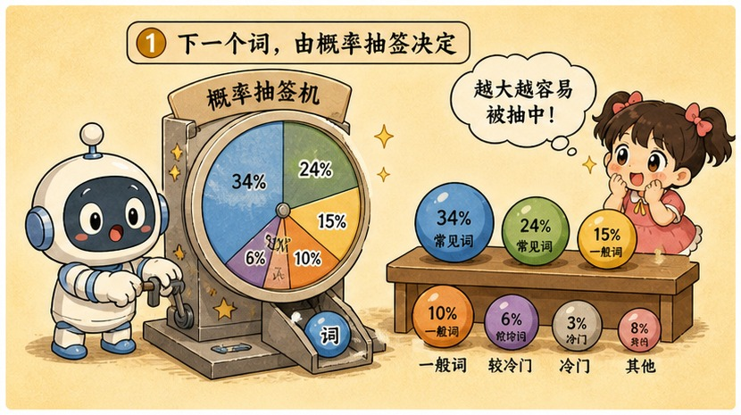
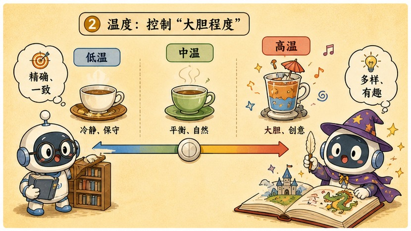
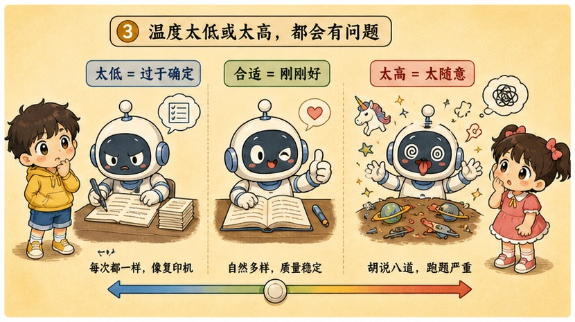
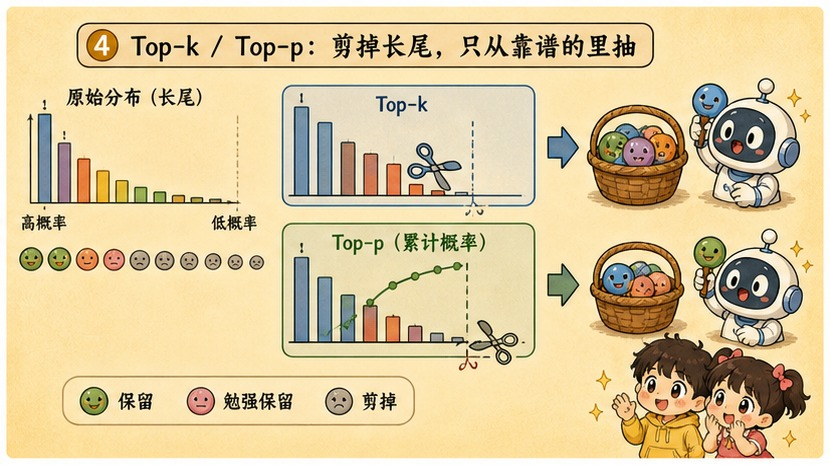

# 第 14 章 · 温度与采样：给大模型的脑子灌几两白酒

> ### 🎯 先别往下翻 · 这一章要破的题
>
> **🔥 痛点**：同一个问题问 ChatGPT 两遍，**得到两版不同回答**；点"重新生成"它又换个说法。程序不是"同样输入、同样输出"吗？它到底怎么"挑"词的？
> **🤔 换你来**：模型每一步其实交出的是一张"候选词概率表"。从这张表里挑词，你会挑最高分的、还是抽签？
> **🧱 笨办法会撞墙**：永远挑最高分（贪心）看着最稳——可研究者发现，这样写出的长文**僵硬、空洞、还爱复读**（"我觉得很好。我觉得很好。…"陷入死循环）。可完全照概率乱抽，长文又迟早**蹦出胡话词**。
> 一头复读机、一头醉汉，怎么办？往下看那颗"酒精浓度"旋钮。👇

元元神秘一笑，从桌底摸出一小瓶白酒晃了晃：「这事儿啊，全看你给模型的脑子**灌了几两白酒**！滴酒不沾，它回回说大车轱辘话；灌上几杯，它就放飞自我、蹦出惊人创意——也可能开始胡言乱语。今天我教你拧那颗'酒精浓度'旋钮，行话叫 **temperature（温度）**(￣▽￣)ノ」

---

## 第 1 节　答案不是"想"出来的，是"抽"出来的

▲ 图14-1 · 答案不是"想"出来的，是"抽"出来的

元元先点破一个反直觉的真相：「你一定见过——同一个问题问 ChatGPT 两遍，得到两版回答；不满意还能点'重新生成'，它又换个说法。程序不是'同样输入、同样输出'吗？」

「谜底第 10 章就埋好了，」他说，「Transformer 一路加工到最后，**交出来的不是一个词，而是一张概率表**：词表里十几万个 token，每个分到一份概率，加起来正好 100%。**模型的工作到此为止。**」

> **直觉印象**：想好答案 → 逐字打出来。（那"重新生成"按钮根本不该存在）
> **真实机制**：每个词，都是从概率表里**按概率抽签**抽出来的。

「'接下来选哪个词'，」元元强调，「是**另一道独立工序**，叫**采样（sampling）**。同一张概率表，**抽签方式不同，模型表现出的'性格'就完全不同**。」

他用一个具体场景贯穿全章：让模型续写「今天天气真__」。它交出的概率表前几名大概长这样：

> 　好 43% · 不错 22% · 晴朗 14% · 舒服 10% · 糟糕 4% · 冷 3% · 热 2% · 怪 1%

「注意'怪'只是**长尾的开始**，」元元提醒，「真实词表里它后面还排着十几万个更冷门的词。而**温度**这颗旋钮，干的就是一件事——**决定这张概率表被抽签前，长什么样。**」

---

## 第 2 节　温度 = 酒精浓度：从滴酒不沾到酩酊大醉

▲ 图14-2 · 温度 = 酒精浓度：从滴酒不沾到酩酊大醉

「想象修图软件的**对比度**滑块，」元元打比方，「往右拉，亮处更亮、暗处更暗，主角跳出来；往左拉，整张图灰成一片。**temperature 就是概率表的对比度滑块，只是方向相反——温度越低，对比越强。**」

「不过咱今天用我更爱的比方——**酒精浓度**！」他拧起想象中的旋钮，给小满演三档醉态：

> 🎬 **T ≈ 0 · 滴酒不沾（绝对清醒，固执）**
> 把分数差**疯狂放大**，第一名碾压全场。「好」的概率被推到接近 100%，「怪」彻底出局。模型趋向"**每步必选第一名**"的**贪心模式**——连抽十次，基本十次都是「好」。**稳，但呆，回回说大车轱辘话。**

> 🎬 **T ≈ 1 · 微醺（原样发挥）**
> 分数原封不动交给抽签。这就是模型的"原始判断"：第一名占优但不垄断，长尾有微小机会。**稳中有变，偶尔换个说法。**

> 🎬 **T ≈ 2 · 酩酊大醉（放飞自我）**
> 分数差被**抹平**，概率趋向"人人有份"。连「怪」都分到可观概率——**多抽几次，怪词必现**。鲜活、时而冒出惊人创意，**但也随时口吐狂言。**

「为啥一颗旋钮能改变'性格'?」元元揭原理，「关键在抽签前那步 **softmax** 对'分数差'极其敏感。拿真数字说话：场景里「好」比「怪」高 3.8 分，概率比约 **45:1**；把 T 调到 0.5（分数全翻倍），差距变 7.6 分，概率比暴涨到约 **2000:1**——「怪」彻底没戏；反过来 T 调到 2（分数减半），差距缩到 1.9 分，概率比缩到约 **7:1**——冷门词翻身，怪话登场。」

> ⚠️ 元元划一条**重要边界**：「**温度改变的只是'怎么抽'，不是'模型知道什么'！**你拧旋钮时，模型的参数、知识、推理能力**一丝没变**——升温逼不出它没有的知识，降温也补不上它缺的能力。它只是同一颗大脑的两种**出牌方式**。」

---

## 第 3 节　为什么非要这颗旋钮：复读机 vs 醉汉

▲ 图14-3 · 为什么非要这颗旋钮：复读机 vs 醉汉

小满：「那干嘛不固定在某一档？」

「因为**两个极端各有各的死法！**」元元说。

> **🤖 永远选第一名（T→0）的死法：复读机**
> 研究者很早发现，贪心写出的长文**僵硬、空洞、爱复读**——一句话一旦出现过，就进入上下文，反过来抬高自己再次出现的概率，模型于是陷进「我觉得很好。我觉得很好。我觉得很好。」式的死循环。

> **🍺 完全照原始概率抽（高温）的死法：醉汉**
> 每一步都给长尾留门，长文写下来**迟早抽中一个胡话词**。

「一头是复读机，一头是醉汉，」元元摊手，「所以才需要一颗**连续可调的旋钮**，让你在'稳'和'活'之间自己挑位置。」

他列了张表，同样的「今天天气真__」，三档温度的体感：

| 温度 | 第一名「好」 | 第八名「怪」 | 体感 |
|---|---|---|---|
| T = 0.1 | ≈100% | ≈0% | 复读机：抽一百次基本都是「好」 |
| T = 1.0 | 43% | 1% | 原始判断：稳中有变 |
| T = 2.0 | 27% | 4% | 放飞：连抽几次「怪」「糟糕」就蹦出来 |

---

## 第 4 节　先剪长尾再抽签：top-k 与 top-p

▲ 图14-4 · 先剪长尾再抽签：top-k 与 top-p

「温度有个管不住的死角——**长尾**。」元元说，「演示里只画 8 个词，但「怪」后面还排着十几万个词：「葡萄糖」「函数」「申报单」……每个概率微乎其微，可十几万个'微乎其微'加起来，常凑出好几个百分点。一篇 500 字回答=连抽几百次签，**单次 1% 的事故率，几百次下来踩雷几乎必然**。」

他举了个翻车现场：

> 🍲 红烧肉做法：五花肉切块、冷水下锅焯水，加冰糖炒糖色，然后倒入**……海关申报单**。

「一次长尾事故毁掉整段专业感！」元元说，「**截断策略**要做的，就是抽签前先把概率表的尾巴**剪掉**，只在'靠谱区'里抽。两种剪法：」

> ✂️ **top-k · 定额截断**：只留概率**最高的 k 个**词（实际常用 40、50），其余清零，剩下的按比例重新分摊再抽。规则简单，但"一刀切"，不看分布长啥样。

> ✂️ **top-p · 自适应截断（核采样）**：从第一名往下**累加概率，刚凑够 p（比如 90%）就停**，圈外清零。**分布尖时自动收紧、分布平时自动放宽**——跟着模型的"把握"走。

「这就是 top-p 后来居上、成为多数系统默认的原因，」元元总结，「实际系统里温度和 top-p 几乎总搭着用，**完整流水线四步：调形状（温度）→ 剪长尾（top-p）→ 幸存词重新归一化 → 抽签**。温度管'敢不敢冒险'，top-p 管'底线在哪'。」

> 元元划一条**局限**：「截断防得住'明显的胡话词'，**防不住'流畅的错话'**。一句概率很高、语法完美的错误陈述，能轻松穿过所有截断——这就是第 29 章要讲的'**幻觉**'：截断管得住怪词，管不住一本正经的胡说。」

---

## 第 5 节　实战：这颗旋钮该拧到哪

「没有'最佳温度'，只有'合适的温度'。」元元说，「拧之前先问一句：这个任务要的是**对**、**自然**，还是**广**?」

| 档位 | 求什么 | 适合的活儿 |
|---|---|---|
| **低温 0~0.3** | 求**对** | 改 bug、翻译合同、按格式提数据——答案空间小、容错低，要稳定可复现 |
| **中温 0.5~0.8** | 求**自然** | 聊天、写邮件、总结文章——既靠谱又不像模板。多数对话产品默认档 |
| **高温 0.8~1.2** | 求**广** | 起名、想 slogan、编故事开头——一次出 20 个让人挑。高温负责发散，把关交还给人 |

> 元元补两个提醒：「① 各家 API 默认值和范围不一样（有的默认 1.0、最高 2.0），动手前以官方文档为准；② **网页版 ChatGPT/Claude 不开放这颗旋钮**，厂商替你选好了折中值——所以'同一个模型'在不同产品里手感不同，往往不是模型变了，**是采样设置变了。**」

---

## 第 6 节　这些坑，你八成也会踩

**坑一：「temperature 是'创造力'开关，调高 AI 就更有创意」**

> ❌ "创造力"是厂商和自媒体爱用的拟人词。
> ✅ 真相是——它只调**概率表的平滑度**，高温让冷门词更容易被抽中，**不会带来任何新知识**。

病根：模型的知识和能力在预训练时已定型（第 12 章），温度只改"从已有判断里怎么抽"。**高温下的"惊喜"全部来自长尾词——而惊喜和胡话，本来就是同一批词。**

**坑二：「T = 0 时模型最严谨，答案一定正确」**

> ❌ 把"确定性"误当"准确性"。
> ✅ 真相是——T=0 只保证"每步选概率最高的词"，**概率高不等于事实对，错也错得更自信**。

病根：如果模型对某个错误说法本来就最看好（训练语料里错误写法更常见），T=0 反而保证它**每次都犯同一个错**。**温度解决的是"稳定"，从来解决不了"正确"。**

**坑三：「每次回答不一样，说明 AI 有情绪、有自由意志」**

> ❌ 拟人化投射。
> ✅ 真相是——只是从同一张概率表里**重新抽了一次签**，随机数不同，词就不同。

病根：人类行为多变源于心情，于是我们把模型的多变也归因于"它在想"。**验证很简单：把温度调到接近 0，"自由意志"立刻消失**——真正的心情可没有开关。

---

## 第 7 节　收尾大招：一句话看穿"重新生成"

老规矩，秘籍 ＋ 大杀器。

### 采样核心，一张表收干净

| 旋钮 | 管什么 | 一句话 |
|---|---|---|
| **温度 temperature** | 概率表的形状（酒精浓度） | 低温清醒固执、高温放飞冒险 |
| **top-k** | 定额剪长尾 | 永远只留前 k 名 |
| **top-p（核采样）** | 自适应剪长尾 | 累加到 90% 就停，跟着把握走 |

### 收尾大招：一句话祛魅"AI 的创造力"

往后谁吹"调高温度 AI 就更有创造力"，你就笑眯眯纠正：

> 　🗣️ **「温度只调概率表的平滑度，不增一丁点新知识——高温的'惊喜'全来自长尾词，而惊喜和胡话，本就是同一批词。」**
> - 想要**对**（代码、事实）→ 低温，但记住：稳定≠正确，事实还得人核对。
> - 想要**广**（头脑风暴）→ 高温，配 top-p 兜底防胡话。
> - 看到"每次回答不一样就说 AI 有自由意志"→ 把温度调到 0，"自由意志"当场消失。

### 把整章拧成一句话塞进脑子

> **模型每步只交一张概率表，"挑哪个词"是独立的采样工序；温度=酒精浓度，调的是概率表的形状，不是模型的知识。**
> 低温滴酒不沾、贪心固执（爱复读）；高温酩酊放飞、冒创意也吐狂言。top-k/top-p 先剪长尾再抽签，防长尾事故。
> 温度只管"稳不稳"，管不了"对不对"——而流畅的错话（幻觉），截断也拦不住。

---

小满拧着那颗想象中的酒精旋钮玩得不亦乐乎，忽然抬头：「等等……你说温度只是'怎么抽'，模型的本事是预训练时定的。那它的**本事**到底是哪来的？为啥一代比一代强？是不是……参数堆得越多就越聪明？这有谱吗？」

元元"啪"地掏出一块白板和马克笔，眼里放光：「问到第三阶段压轴的题眼了！这事儿还真有'谱'——一条**'大力出奇迹'的暴兵曲线**！走，下一章我给你画白板，讲明白为什么堆参数**真的有用**(★ω★)」

---

## 🧰 装进你的工具箱

> **🔑 一句话方法**：模型每步只交一张概率表，"挑哪个词"是独立的**采样**工序；**温度 = 酒精浓度**，调的是概率表的**形状**（低温清醒固执、高温放飞冒险）,**不是模型的知识**;top-k/top-p 先剪长尾再抽签，防胡话词。
> **🎯 触发器 · 以后遇到这种情况就掏出它**：谁吹"调高温度 AI 更有创造力"，你纠正——温度只让冷门词更容易被抽中，**惊喜和胡话本就是同一批词**；要"对"（代码/事实）就低温，要"广"（头脑风暴）就高温；但温度只管"稳不稳",**管不了"对不对"**。
>
> **✍️ 合上书自测**：
> 1. 为什么"答案不是想出来的、是抽出来的"?
> 2. T=0 时模型最严谨、答案一定正确吗？
> 3. 为什么诗歌生成器敢开高温，客服机器人却压低温？

> 🪜 **下一章预告**：第 15 章 · 扩展定律 Scaling Laws——大力出奇迹的终极暴兵公式。

---
[← 上一章](../stage_3/chapter_13.md) ｜ [📖 目录](../README.md) ｜ [下一章 →](../stage_3/chapter_15.md)

> 在线阅读《看得见的 AI》· 全 30 章免费 —— 回到 [**项目首页**](../../README.md)，觉得有用点个 ⭐ Star 让更多人看到。
