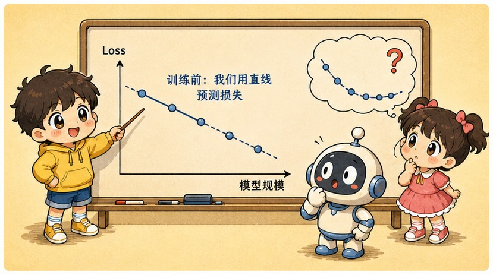
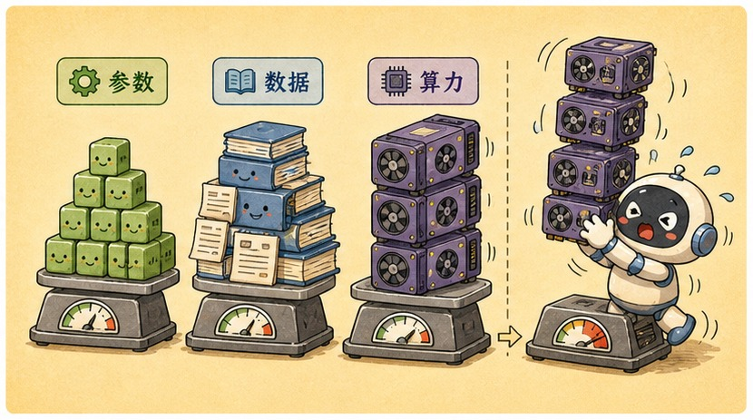
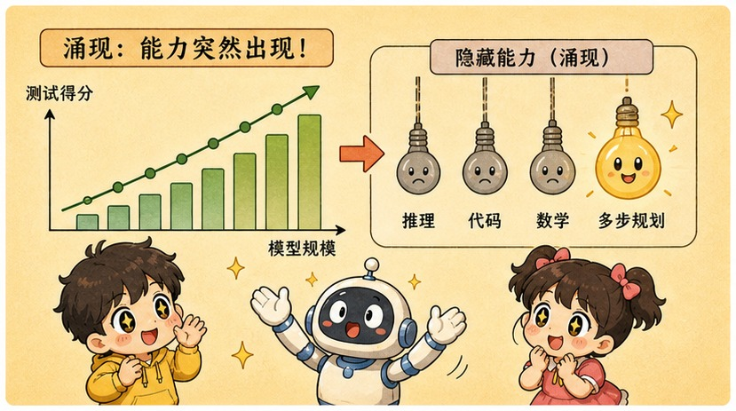
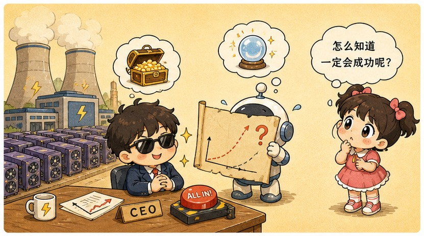

# 第 15 章 · 扩展定律 Scaling Laws：大力出奇迹的终极暴兵公式

> ### 🎯 先别往下翻 · 这一章要破的题
>
> **🔥 痛点**：某公司宣布烧十亿美元、训半年、中途不能重来，去训下一代模型——钱还没花，CEO 已经敢向投资人**保证新模型会强多少**。这种"赌局"凭什么敢开？
> **🤔 换你来**：如果训一次贵到不能试错，你会怎么"提前知道"大模型训出来有多强？
> **🧱 笨办法会撞墙**：你以为"训大模型像炼丹，开炉前谁也不知道结果"——可要真这样，**没人敢在训练前向董事会承诺性能**，可厂商偏偏一代接一代地敢。
> 凭的是一条能"预读未来"的直线。往下看。👇

元元"啪"地支起一块白板，抄起马克笔，眼里放光：「太有谱了！这是第三阶段的压轴大戏——一条**'大力出奇迹'的暴兵曲线**。今天我给你画白板，讲明白为什么堆参数**真的有用**，而且强多少**能提前算出来**(★ω★)」

---

## 第 1 节　开炉之前，结果已经写在直线上

▲ 图15-1 · 开炉之前，结果已经写在直线上

元元先抛个让外行费解的新闻现象：「某公司宣布融资几十亿美元，要建'十万卡集群'训下一代模型——钱还没花，CEO 已经敢向投资人**保证新模型会强多少**。一次旗舰训练烧上亿美元、跑几个月、中途不能重来，这种'赌局'怎么敢开？」

「答案是，」元元一字一顿，「**这根本不是赌局。**」

他在白板上画了个坐标系：「2020 年，OpenAI 的研究者（Kaplan 等人）做了件笨功夫的事——**训练一大批从小到大的模型，记下每个的损失**，然后发现了本章的主角。」

> **直觉印象**：训大模型像炼丹 → 开炉前没人知道结果。
> **真实机制**：损失沿**幂律**平滑下降，小模型画线、大模型**外推**。

「先复习一个词，」元元说，「**损失（loss）**，就是'猜下一个词'那场考试的平均错误程度（第 12 章），越低说明语言功力越深。Kaplan 他们发现：把模型放大，损失下降**惊人地规律**——**参数量每扩大 10 倍，损失就按一个固定比例再降一截；数据量、算力也各自如此。**」

「这种'每翻 10 倍、按固定比例改善'的规律，数学上叫**幂律（power law）**。」元元边画边说，「你不用记定义，只记它最值钱的性质——**把坐标纸换成对数刻度（每格代表 ×10），幂律曲线就变成一条笔直的线。而直线，是可以拿尺子往右延长的！**」

于是整个流程变成四步暴兵法：

> 🎬 **第 1 步 · 便宜**：从小到大训一串小模型，每个都便宜，几天出结果——成本只是目标大模型的千分之一、万分之一。
> 🎬 **第 2 步 · 描点**：对数纸上，横轴规模、纵轴损失，把每个小模型的成绩点上去。
> 🎬 **第 3 步 · 连线**：幂律保证这些点**近乎完美排成一条直线**。
> 🎬 **第 4 步 · 外推**：把直线延长 100 倍、10000 倍，**读出还没训的大模型会"考多少分"**，再决定砸不砸钱。

「这不是纸面理论！」元元敲白板，「最有名的验证来自 **GPT-4**：技术报告称，用**算力不到它万分之一**的小模型做实验，**提前准确预测了 GPT-4 训完后的最终损失**。上亿美元的训练还没开始，结果已经先被'算'出来了。」

> 小满恍然：「难怪敢砸钱！'万卡集群''百亿融资'听着像疯狂豪赌，其实……」
> 元元：「**是工程预算，不是赌博！**敢砸钱，是因为**回报可以预读**。这就是整个大模型军备竞赛的底层逻辑。模型名字里的 7B、70B、405B——那个 B（Billion，十亿）就是参数量，幂律三轴之一，规模最直观的标尺。」

---

## 第 2 节　龙猫的复仇：光堆参数不够，得配平

▲ 图15-2 · 龙猫的复仇：光堆参数不够，得配平

「不过，」元元话锋一转，「'参数、数据、算力'三个轴该**按什么比例**加大，2020 年的论文给了个**误导业界两年**的答案。」

「一次训练烧的算力，大致由两样相乘决定：**模型多大（参数量）× 喂了多少数据（token 数）**。」他解释，「预算固定时，这是道分配题——要更大的脑袋，还是让脑袋多读书？2020 年的答案偏向'**脑袋优先**'，于是业界掀起一场纯参数竞赛：GPT-3 1750 亿、Gopher 2800 亿、Megatron-Turing 5300 亿……**参数翻几倍，喂的数据却几乎停在原地**（几千亿 token）。」

「2022 年，DeepMind 决定重做这道分配题，」元元讲到关键，「训练 **400 多个**不同'大小×饭量'组合的模型，逐一比同样预算下谁最强。结论震动业界——**最优配比大约是：每 1 个参数，配 20 个 token！**」

「按这把尺子一量，当时所有巨无霸集体露馅：」

> 📊 **Gopher**：2800 亿参数，按配比该喂约 5.6 万亿 token——**实际只喂了约 3000 亿，不到所需的二十分之一！**

「一身巨人骨架，没吃过几顿饱饭，」元元说，「这就是'**营养不良**'——钱大量花在撑大脑容量上，脑子里却没装进足够的世界。**参数是潜力，数据才是把潜力填满的东西。**」

DeepMind 顺手来了次"公开处刑"，训了个叫 **Chinchilla（龙猫）**的模型打脸：

| | Gopher（2021） | Chinchilla（2022） |
|---|---|---|
| 参数量 | 2800 亿 | **700 亿（只有 1/4）** |
| 训练数据 | 约 3000 亿 token | **约 1.4 万亿 token（4 倍多）** |
| 训练算力 | 相同 | 相同 |
| 成绩 | 营养不良的巨人 | **吃饱饭的小个子，全面胜出！** |

「同样的钱，换个分法，白捡一截性能！」元元感慨，「此后所有前沿实验室的训练配方都被改写。教训就一句：**Scaling 不是无脑堆某一个轴，三个轴要配平着一起放大。**」

> 元元补个反转：「不过 20:1 是'**训练预算固定**'下的最优解。后来大家发现真正该算的是另一本账——模型训完要被**调用亿万次**，小模型每次调用便宜得多。于是厂商开始故意'**过量喂养**'：给几十亿参数的小模型喂上十几万亿 token（每参数上千个，远超 20:1），多花的训练费靠之后亿万次便宜调用赚回来。你手机上能离线跑的小模型，多半就这么喂出来的——**法则没变，账本变了。**」

---

## 第 3 节　涌现：平均分平滑涨，某些题突然会做

▲ 图15-3 · 涌现：平均分平滑涨，某些题突然会做

「用过不同代模型的人都有个体感，」元元说，「给上一代出道多步应用题，它一本正经胡说；换下一代，**突然就会一步步算了**。能力似乎不是'渐渐变好'，而是'某天突然开窍'。这和幂律的'平滑'矛盾吗？」

他举了个现场：

> 🧮 **题目**：筐里 23 个苹果，先拿走 7 个，剩下平分给 4 人，每人几个？
> - **规模不够的模型**：「每人 5 个。」——张口就答，自信且错。
> - **跨过临界规模的模型**：「先算剩余：23 − 7 = 16；再平分：16 ÷ 4 = 4。每人 4 个。」——不仅答对，还自发列步骤。

「这类任务的得分曲线**长期贴着 0%，跨过某个规模后陡然蹿高**，」元元说，「研究者管这叫**涌现（emergence）**。」

「为啥平均分平滑、单项却会跳？」他揭原理，「关键在——**损失是几十万道猜词题的平均成绩，平均分稳步涨，完全不妨碍'某一类题'原地踏步很久再猛涨。**把多步题想成**走钢丝**就懂了——」

> 🎪 **走钢丝效应**：四步推理，一步踩空就满盘皆输，而评测通常只认"全对"。
> 让单步把握从五成→八成→九成五平滑爬升：
> - 每步五成 → 四步连对机会**不到一成**
> - 每步八成 → 也才**四成左右**
> - 每步九成五 → 四步连对一下到**八成多**！
>
> **单步能力在平滑爬坡，"全对率"却先趴地板很久，然后猛地起跳**——平滑的内功，配上"全对才得分"的考法，天然长出一条 S 形跳变曲线。

> 元元泼一盆**冷水**：「2023 年斯坦福一篇论文标题就很挑衅——《涌现能力是海市蜃楼吗？》：同一批模型、同一任务，把'全对才得分'换成'按步骤给部分分'的平滑指标，**不少著名的陡峭跳变立刻变回平缓爬坡**。**跳的可能不是能力，是量尺。**」
> 元元总结：「对你真正重要的结论只有一条——**平均损失可以提前算，单项能力何时出现，至今没人能提前算。**幂律给军备竞赛上了保险，涌现给它留了悬念。」

---

## 第 4 节　天花板之争：大力还能出多久的奇迹

▲ 图15-4 · 天花板之争：大力还能出多久的奇迹

「故事讲到 2024 年，画风变了。」元元说，「三条幂律线数学上依然成立——问题是，沿线往右走的'**路费**'开始失控。业界开始公开讨论：纯堆参数这条路，是不是快到头了？」

他在白板上画了三堵墙：

> 🧱 **第一堵墙 · 数据**：幂律要的是**优质** token，而公开互联网的高质量文本**有限**——前沿模型一次训练吞掉的数据量，已与'全网精华存量'同一数量级。复印更多低质网页，喂不出更聪明的模型。
> 🧱 **第二堵墙 · 成本**：对数轴右移一格 = 真金白银 ×10。旗舰训练已是亿美元级，下一代普遍估计要到**十亿美元级**，电力和芯片同样吃紧。
> 🧱 **更扎心 · 收益变钝**：这其实是幂律自己的预言——越往右，同样 ×10 的投入换来的损失下降**越小**。损失还在降，但用户那一声"哇"**越来越贵**。

「于是从 2024 年起，前沿竞争转向了新轴线，」元元说，「**不是放弃 Scaling，而是换地方 Scaling：**」

> 🆕 **新轴线① · 测试时计算（答题时多想）**：与其把算力全砸训练，不如让模型答题前多"思考"几步——2024 年底 OpenAI 的 o 系列、2025 年初 DeepSeek-R1 把这条路推成主流（第 23 章细讲）。**规模竞赛没结束，只是从"训练时堆"转向"回答时堆"。**
> 🆕 **新轴线② · 数据质量与合成数据**：从"喂更多"转向"喂更好"——精筛、改写，甚至用强模型生成"教材级"数据喂给下一代。**同样算力，一份好数据顶几份烂数据。**

> 元元下个公允结论：「'Scaling 已死'和'Scaling 万岁'都是标题党。2025 年的公认现状是——**大力仍然出奇迹，但奇迹的单价在飞涨；前沿一边继续堆规模，一边把更多筹码押向新轴线。力气还得使，关键变成了往哪使。**」

---

## 第 5 节　这些坑，你八成也会踩

**坑一：「幂律这么可靠，规模无限堆下去必然到达 AGI」**

> ❌ 把"损失"这张平均成绩单错当成"智能"本身。
> ✅ 真相是——幂律只保证"猜词平均错误"平滑下降，**不等于所有能力线性变强**；数据、成本、电力也各有物理上限。

病根：损失逼近极限时还剩多少能力提升，**没人能从幂律里读出来**——涌现之争恰恰说明单项能力与平均分不同步。而且直线往右每走一格都要真金白银 ×10：**数学上的直线，撞的是物理上的墙。**

**坑二：「Scaling 时代，小模型没有价值」**

> ❌ 只盯着"最强"，忘了"够用、便宜、离线"。
> ✅ 真相是——**蒸馏后的小模型 + 端侧部署是另一条重要战线**，手机、汽车、隐私场景全指着它。

病根：让大模型当老师，把本事"蒸馏"进小模型（第 27 章细讲），再配 Chinchilla 式"过量喂养"，几十亿参数就能覆盖大量日常任务——单次调用成本差几个数量级，端侧运行还不用上传数据。**前沿在堆规模，产业在缩规模，两条战线同时成立。**

**坑三：「'涌现'说明模型某一刻突然开窍，甚至萌生了意识」**

> ❌ 拟人化 + 媒体偏爱戏剧性叙事。
> ✅ 真相是——涌现描述的是**评测分数的跳变**；模型内部能力是连续爬坡的，部分跳变还可能是评分方式造出的假象。

病根：模型没有"开窍瞬间"——单步能力一直平滑提升，是"全对才得分"的考法把平缓爬坡显示成了起跳（走钢丝效应）。**把分数跳变脑补成"觉醒"，就从科学滑进了科幻。**

---

## 第 6 节　收尾大招：一句话看穿"百亿豪赌"

老规矩，秘籍 ＋ 大杀器。

### Scaling 核心，一张表收干净

| 概念 | 一句话 |
|---|---|
| **幂律 / Scaling Laws** | 对数纸上损失随规模走直线，小模型画线、大模型外推 |
| **Chinchilla 配平** | 每 1 参数约配 20 token；光堆参数=营养不良 |
| **涌现** | 平均分平滑涨，全对率走钢丝式跳变（真假仍有争议） |
| **2024 转向** | 数据墙+成本墙→押注测试时计算 & 数据质量 |

### 收尾大招：替 CEO 回答"你怎么保证训出来不翻车"

往后看到"十亿美元训模型"的新闻，你就知道这不是豪赌——

> 　🗣️ **「先小后大、画线外推：先训一排成本千分之一的小模型，把损失点在对数纸上，幂律保证它们排成直线；延长到目标规模，开训前就读出最终损失。」**
> - GPT-4 正是这么干的（万分之一算力提前锁定答案）。
> - 但诚实的 CEO 还得补一句：**能预测的是平均损失，某项具体能力（如多步推理）何时涌现，至今没人能提前算。**
> - 再泼一盆冷水：听到"我们的模型涌现了 X 能力"，先问两句——**评分是不是"全对才得分"?换成给部分分，曲线还跳吗？**

### 把整章拧成一句话塞进脑子

> **Scaling Laws = 损失随参数/数据/算力按幂律平滑下降，对数纸上是直线，能从小模型外推大模型——大力出奇迹第一次有了数学保证。**
> 但要配平（每参数约 20 token，光堆参数=营养不良的龙猫）；平均损失能预测，单项能力的"涌现"却像走钢丝、还可能是量尺造的假象。
> 2024 年后撞上数据墙和成本墙，竞赛转向"答题时多想"和"喂更好的数据"——力气还得使，关键是往哪使。

---

## 🎓 第三阶段 · 通关小结

小满瘫在椅子上，长出一口气：「从一堆碎块，到能聊天的 ChatGPT……这一路我算是看全乎了！」

元元笑着把五章串成一条"炼成记"：

> 1️⃣1️⃣ **Token**——切词小刀把语言切成积木块，模型只看编号不看字。
> 1️⃣2️⃣ **预训练**——在整个互联网上玩万亿次文字接龙，压缩即智能，炼出"狂暴巨兽"基座。
> 1️⃣3️⃣ **SFT + RLHF**——两道紧箍咒，把巨兽磨成有问必答、还懂分寸的贴心助手。
> 1️⃣4️⃣ **温度采样**——给脑子灌几两白酒，调的是"怎么抽词"，不是知识。
> 1️⃣5️⃣ **Scaling Laws**——大力出奇迹有数学保证，但要配平、还撞上了天花板。

「你发现没有，」元元意味深长，「这五章是一条**完整的生产线**：切料（Token）→ 浇筑知识（预训练）→ 调教听话（对齐）→ 调出牌方式（采样）→ 而整条线为啥越做越强，有 Scaling Laws 兜底。**到这儿，一个 LLM 从无到有怎么炼成的，你全程围观完了！**」

小满眼睛发亮：「引擎装好了、点着火了、还会好好说话了……那下一步，是教我**怎么把它用起来**吧？」

「正是！」元元一拍桌子，「第四阶段——**应用篇 · 把大模型用起来**！从写好提示词，到给 AI 外挂知识库和工具，再到搭出能自己干活的智能体。**炼成神兵，该出鞘了（★ω★）**」

---

## 🧰 装进你的工具箱

> **🔑 一句话方法**：**Scaling Laws** = 损失随参数/数据/算力按**幂律**平滑下降，在对数纸上是**一条直线**，能用小模型**外推**出大模型成绩——"大力出奇迹"第一次有了数学保证。但要**配平**（每参数约 20 token，光堆参数=营养不良的龙猫）；而单项能力何时"涌现"，至今没人能提前算。
> **🎯 触发器 · 以后遇到这种情况就掏出它**：看到"万卡集群/百亿融资"别当疯狂豪赌，那是**幂律算得出回报的工程预算**；看到"某模型涌现了 X 能力"，先追问两句——**评分是不是'全对才得分'?换成给部分分，曲线还跳吗？**（涌现可能是量尺造的假象）
>
> **✍️ 合上书自测**：
> 1. CEO 怎么在开训前就保证模型不翻车？（GPT-4 怎么做的？）
> 2. 用龙猫（Chinchilla）反驳"预算固定就全砸参数"。
> 3. 为什么平均分平滑上涨，某些题却像"突然会做"?（走钢丝效应）

> 🪜 **下一阶段预告**：第四阶段 · 应用篇——把大模型用起来（第 16–20 章）。

# 🏔️ 第四阶段 · 应用篇 —— 把大模型用起来

---
[← 上一章](../stage_3/chapter_14.md) ｜ [📖 目录](../README.md) ｜ [下一章 →](../stage_4/chapter_16.md)

> 在线阅读《看得见的 AI》· 全 30 章免费 —— 回到 [**项目首页**](../../README.md)，觉得有用点个 ⭐ Star 让更多人看到。
