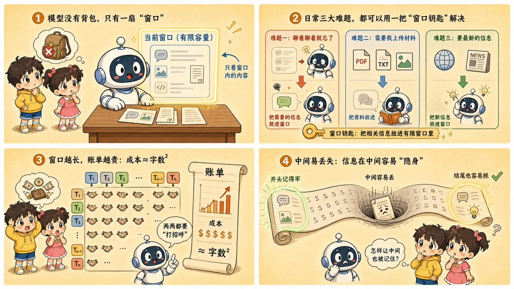

# 第 17 章 · 上下文窗口：金鱼记忆与平方账单的拉锯战

> ### 🎯 先别往下翻 · 这一章要破的题
>
> **🔥 痛点**：你跟 AI 聊久了，它开始"忘记"开头说过的设定；换个新会话更是**完全不认识你**了。它不是号称很聪明吗？
> **🤔 换你来**：你觉得 AI 是把你说过的话"记在脑子里"了吗？如果不是，那"连续聊天"是怎么做到的？
> **🧱 笨办法会撞墙**：你八成以为"它一直在线、记着我们聊过的一切"——可这样它就该越聊越懂你、换会话也认识你，而**这两件事恰恰都不成立**。
> 真相反直觉：大模型**没有记忆体，只有一扇窗**。往下看。👇

元元掏出手机晃了晃：「这事儿得把第 9 章留下的那张**'平方级握手账单'**重新算一遍。来，咱俩打个**长途电话**，从第 1 句聊到第 200 句——你就明白啥叫'金鱼记忆'和'物理硬上限'了（￣▽￣）」

---

## 第 1 节　大模型没有记忆体，只有一扇"窗"

元元先抛个反直觉的事实：「大模型**没有任何'记忆体'**。它不会把你说过的话'记在脑子里'；严格说，它连'上一轮'这个概念都没有——**每次回答，对它而言都是第一次读到这场对话。**」

> **直觉印象**：AI 在和我连续聊天 → 它一直"在线"，记着我们聊过的一切。
> **真实机制**：模型只有一扇"窗" → 每轮回答，它能看见的**只有窗内的 token**。

「这扇窗就是**上下文窗口（context window）**,」元元说，「模型一次能'看见'的 token 数上限。最贴切的比喻是一张**大小固定的书桌**：所有要参考的资料必须摊在桌面上，模型才看得见；桌面之外没有抽屉、没有书架——**放不下的纸，等于不存在。**」

「为啥非这么设计？两个根源你都学过：」

> 🔒 **根源一（第 12 章）**：知识**冻结**在参数里。预训练一结束，千亿参数就封板。你跟它聊天**不会改动任何一个参数**——对话内容在模型内部**根本没地方可存**。能存的只有窗。
> 🔒 **根源二（第 9 章）**：注意力需要**边界**。"每个词看所有词"——"所有词"必须有个上限，否则算力撑不住。这个硬上限，就是窗口尺寸。

那"连续聊天"是怎么做到的？元元用咱俩的长途电话还原：

> 🎬 **你按下发送**：屏幕上看，你只发出一行字。
> 🎬 **客户端打包**：网页/APP 把【系统提示 + 之前全部问答 + 你的新消息】拼成一个长文本。
> 🎬 **整包发给模型**：模型从第一个 token 读到最后——**就像第一次读到这场对话**。
> 🎬 **接龙生成回答**：逐 token 输出（老朋友了）。
> 🎬 **读完即忘**：回答存进聊天记录，模型立刻回到"白纸"状态。下一轮？**从第 1 步重来，只是包裹又长了一截。**

> 元元点睛：「所谓'聊天'，是**客户端每轮替你把全部历史重发一遍**而维持的幻觉。第 11 章的伏笔现在能收了：API 按 token 计费，而每轮都重发全部历史——**第 50 轮的提问，要为前 49 轮的所有 token 再付一次钱**。'越聊越贵'不是定价套路，是机制使然。」

---

## 第 2 节　三个日常谜团，一把钥匙全开

「这三件事你大概率都遇到过，还多半以为是'AI 抽风',」元元说，「用'窗'重新看一遍——**全是同一个机制的三张面孔：**」

> 🐟 **谜团一 · 窗满了 → 聊久了忘记开头**
> 窗装满后再来新对话，最早的内容就被**挤出窗外**。模型不是"忘了"开头——**是发给它的包裹里已经没有开头了**。这就是"金鱼记忆"。

> 🐟 **谜团二 · 窗是会话级的 → 新开会话全忘了**
> 新会话 = 一扇全新的空窗。旧会话历史不会被打包进来，模型也没有任何跨会话存储——**它不是装失忆，是真的第一次见你。**

> 🐟 **谜团三 · 窗有上限 → 长文档塞不进**
> 文档 token 数超过窗口尺寸，模型物理上读不到——于是"文件过长"报错，或者更隐蔽：被**悄悄截断**，后半本书它压根没读过，却照样自信作答。

「这时一定有人举手，」元元模仿小满，「'不对啊，ChatGPT 明明记得我是程序员！'好问题——」

> 🧠 这是产品层的**"记忆功能"**（ChatGPT 的 Memory、各家的"自定义指令"）：产品把你以往对话的要点提炼成**小纸条存进自己的数据库**，开新会话时再悄悄把纸条**塞回窗内**。**模型本身依然零记忆——是产品在替它递小抄。**

> 元元敲黑板：「记住这个分层——**'记忆'是产品功能，不是模型能力**。所有看起来像'记住了'的体验，本质都是同一招：**把信息存在窗外，用的时候塞回窗内**。记住这招，下一章的 RAG 你会觉得似曾相识。」

---

## 第 3 节　平方握手账单：长途电话为啥越打越贵

「现在重算第 9 章那张账单，」元元拿起电话，「为啥窗口这么金贵？第 9 章的'每个词看所有词'这时露出獠牙了。」

> 🤝 **握手账单**:10 个人开圆桌会，两两关系约 **45 对**；换成 100 人的大会，两两关系约 **5000 对**——**人数翻 10 倍，'互看'次数翻了约 100 倍！**
> 注意力一模一样：**窗口长度翻 10 倍，计算量按平方涨到约 100 倍。**

「咱这通长途电话聊到第 200 轮，」元元演给小满看，「三张账单一起来：」

> 📈 **账单一 · 算力**：长度×10，互看×100——显存、电费、芯片照单全收。
> 💸 **账单二 · 钱包**：每问一句都要为**全部历史的 token 再付一次钱**（第 11 章）。
> ⏱️ **账单三 · 时间**：贴完超长文档 AI 半天不开口？它在**从头读完整个窗口**，才能接第一个字。

元元又列了张军备竞赛战况：

| 窗口量级 | 大约能装下 | 时代 |
|---|---|---|
| 4k token | 一篇几千字长文 | 2020 前后，第一代水平 |
| 128k token | 一本中篇小说 / 一个项目核心代码 | 2023 起旗舰标配 |
| 1M+ token | 几部长篇 / 一整个代码库 | 2024–2025 头部模型 |

> 小满：「那窗口做大不就行了？」
> 元元：「**又贵、又慢，中间还容易看丢**（下一节讲）。所以工程师的共识不是'窗越大越好'，而是——**让进窗的每个 token 都值回票价**。两条省窗路线：① **滚动摘要**：把久远对话压成一小段摘要留在窗内；② **RAG 按需检索**：资料放外部，每轮只检索最相关几段塞进窗（下一章整章讲）。」

---

## 第 4 节　中间迷失：窗口大，不等于看得清

「按前面的逻辑，窗够大似乎就万事大吉，」元元话锋一转，「但 2023 年斯坦福等机构做了个实验，给所有人泼了盆冷水。」

> 🎬 **实验现场**：给模型几十份文档，其中**只有一份**藏着答案，然后把这份关键文档放在上下文的**不同位置**——开头、中间、结尾——问同一个问题。
> 🎬 **结果**：放**开头**或**结尾**时，大概率答对；放**中间**时，正确率明显下滑——最差甚至不如不给文档、让它闭卷瞎答！
> 🎬 准确率画出来是一条 **U 形曲线**，论文标题就叫 **Lost in the Middle**（迷失在中间）。

「为啥？」元元解释，「两个直觉解释叠加：其一，**训练数据的统计**——文章开头点题、结尾总结，对话里最新几句最相关，重要信息天然爱待在两头；其二，训练语料里超长文本本来就少，模型对'中段远处'的注意力分配**缺乏练习**。」

落到实战三个习惯：

> ✅ **重要约束放两头**:prompt 开头定调、结尾重申——第 16 章"重点放两头"的机制就在这条 U 形曲线里。
> ✅ **长材料先瘦身**：先摘出相关章节再提问，别把 200 页原文一股脑塞进去——**塞得进，不代表读得清**。
> ✅ **提问点名引用**:"根据第 3 节的退款条款……"比"根据上面的文档……"更能把注意力拽到正确位置。

---

## 第 5 节　亲手把"过敏史"挤出窗外

光说不练假把式。元元摆出一扇最多装 **4 轮对话**（外加一条钉死的系统提示）的窗，演了出"失忆现场":

> 🎬 **第 1 轮**：小芸说"我对花生过敏"。关键信息**入窗**。
> 🎬 **第 2、3、4 轮**：照常聊。AI 主动避开花生——不是它"记得"，是这一轮打包时第 1 轮**还在包裹里**，它重新读到了。
> 🎬 **窗满了**:4 个位置全占满。真实产品里这一刻**通常悄无声息，没有任何"即将失忆"的提醒**。
> 🎬 **第 6 轮（新对话进来）**：最早的第 1 轮被**挤出窗外、变灰飘走**。聊天记录里它还在（你翻得到），但**发给模型的包裹里已经没有它了**。
> 🎬 **失忆现场 ⚠**：你问"能吃花生酱吗？"，窗内已没有过敏史。模型不是撒谎也不是变笨——**它是真的看不见**，于是按常识热情推荐花生酱。**这就是长对话翻车的标准剧本。**

> 元元给了三条对策：「① 关键信息**时不时重申一遍**，把它放回窗的最新位置；② 长对话**定期让 AI 总结要点**，用摘要开新会话；③ 重要约束别指望它'记得',**每次都带上**。」

---

## 第 6 节　这些坑，你八成也会踩

**坑一：「AI 记得我们上次的对话，聊得越多它越懂我」**

> ❌ 产品界面太像"和一个人聊天"。
> ✅ 真相是——**模型本身零记忆、零成长**，所有"记得"都是产品把信息存在窗外、再塞回窗内的小抄。

病根：会话列表一直在、记忆功能偶尔显灵，容易让人脑补出"认识我的 AI"。拆穿它两步：**关掉记忆功能开新会话**——它真的第一次见你；**打开设置里的"记忆"列表**——那些小纸条就是它"懂你"的全部家当，删掉即忘。**分清模型能力和产品功能，是这一阶段最重要的鉴别力。**

**坑二：「窗口越大越好，选模型就挑窗口最大的那个」**

> ❌ 把"装得下"误当"读得好"。
> ✅ 真相是——**大窗贵、慢、中间易看丢**；把对的信息放进窗，胜过把所有信息塞进窗。

病根：窗口翻 10 倍，计算量平方上涨、每轮按 token 全额计费、首字延迟变长，而 lost in the middle 告诉你：塞进去越长，埋中间的关键信息越容易看丢。**大窗口是宝贵的能力上限，不是默认用法**——日常更优解是瘦身材料、重点放两头，资料多了上 RAG。

---

## 第 7 节　收尾大招：把对的信息放进窗

老规矩，秘籍 ＋ 大杀器。

### 上下文窗口核心，一张表收干净

| 概念 | 一句话 |
|---|---|
| **上下文窗口** | 模型一次能看见的 token 上限，一张固定大小的书桌 |
| **连续聊天** | 客户端每轮重发全部历史维持的幻觉，所以越聊越贵 |
| **金鱼记忆** | 窗满挤出开头、新会话归零——记忆是产品功能不是模型能力 |
| **中间迷失** | 关键信息埋中段最易看丢，重点放两头 |
| **平方账单** | 窗口×10，算力×100——窗大就贵、慢 |

### 收尾大招：一句话戳破"AI 记得我"

往后谁说"AI 越聊越懂我、记得我们聊过的一切"，你就用"窗"反驳：

> 　🗣️ **「模型零记忆——它能看见的只有这一次打包发进窗的 token。所有'记得'，都是产品把要点存在窗外、用时再塞回窗内的小抄。」**
> - 验证：关掉记忆功能开新会话，它立刻第一次见你。
> - 长文档答错？不是它笨，是关键信息埋在窗中段被看丢了（中间迷失）。
> - 越聊越贵？平方握手账单——每轮重发全部历史。

一句话收束全章，也是最该带走的一句：**把对的信息放进窗，胜过把所有信息塞进窗。**

### 把整章拧成一句话塞进脑子

> **大模型没有记忆体，只有一扇固定大小的"窗"；连续聊天是客户端每轮重发全部历史撑起来的幻觉。**
> 窗满挤出开头（金鱼记忆）、新会话归零、关键信息埋中段易看丢（中间迷失）；窗口×10、算力×100（平方账单），所以又贵又慢。
> 破局不是把窗做到无限大，而是"把对的信息放进窗"——滚动摘要和 RAG，就是干这个的。

---

小满消化完，顺着问下去：「'把对的信息放进窗'……可我公司有几百份文档、上千页手册，**到底哪几段是'对的信息'**?难道每次提问我都手动去翻、手动复制粘贴进窗？那也太累了吧！」

元元眼睛一亮：「问到下一章的核心了！当然不用你手动翻——咱们给模型请一位**'非常会翻书的秘书'**。说白了，就是把闭卷考试改成**开卷考试**：考场上直接塞它一本'外挂操作手册'，教它'**先翻书、再对着抄**'。走，下一章我亲手给你演 RAG 怎么拆块、入库（★ω★）」

---

## 🧰 装进你的工具箱

> **🔑 一句话方法**：大模型没有记忆体，只有一扇固定大小的**上下文窗口**;"连续聊天"是客户端**每轮把全部历史重发一遍**撑起来的幻觉（所以越聊越贵）。窗满挤出开头（金鱼记忆）、关键信息埋中段易看丢（中间迷失）、窗口×10 算力×100（平方账单）。
> **🎯 触发器 · 以后遇到这种情况就掏出它**：谁说"AI 越聊越懂我、记得我们聊过的"，你就反驳——**模型零记忆，所有"记得"都是产品把要点存窗外、用时再塞回窗内的小抄**；长文档答错不是它笨，是关键信息埋在中段被看丢了——**重点放两头**。
>
> **✍️ 合上书自测**：
> 1. 新开会话它就"全忘了"，是 bug 吗？给两条对策。
> 2. 200 页合同明明装得下，问第 87 页条款却答错，为什么？
> 3. 同一问题，放 100 轮长对话末尾问 vs 新开会话问，哪个更贵？

> 🪜 **下一章预告**：第 18 章 · 检索增强生成 RAG——大模型的终极开卷考试指南。

---

[← 上一章](../stage_4/chapter_16.md) ｜ [📖 目录](../README.md) ｜ [下一章 →](../stage_4/chapter_18.md)

> 在线阅读《看得见的 AI》· 全 30 章免费 —— 回到 [**项目首页**](../../README.md)，觉得有用点个 ⭐ Star 让更多人看到。
