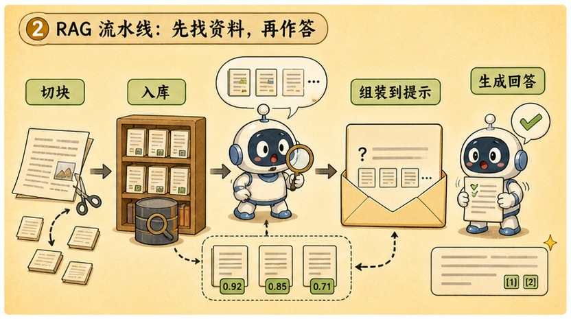
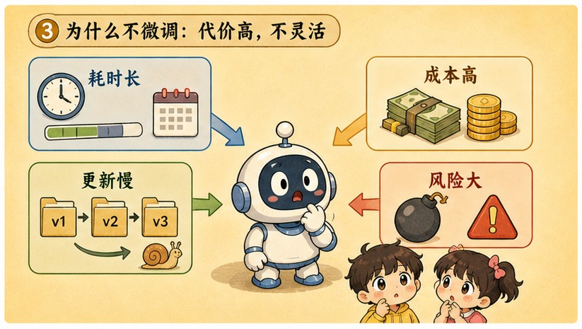
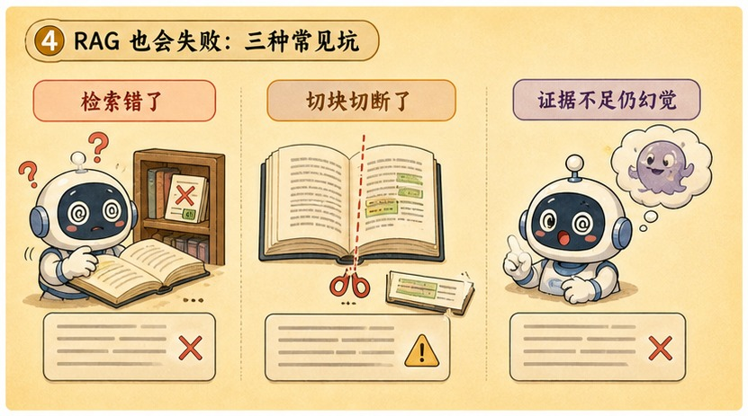

# 第 18 章 · 检索增强生成 RAG：大模型的终极开卷考试指南

> ### 🎯 先别往下翻 · 这一章要破的题
>
> **🔥 痛点**：你想让 AI 回答**你自己公司的文档**（请假制度、产品手册）——可这些它从没学过，怎么问都问不出真的，只会编。
> **🤔 换你来**：让 AI 学会你的私有文档，你会怎么做？
> **🧱 笨办法会撞墙**：两条直觉路都撞墙——① 把文档**训练进参数**：太贵、还可能学新忘旧；② 把全部文档**塞进上下文**：贵、慢，关键内容还会在中间被看丢（第 17 章）。
> 聪明人走第三条路：把闭卷考试改成**开卷考试**。往下看怎么"先翻书、再对着抄"。👇

元元摆摆手：「当然不用你手动翻！咱们给模型请一位**'非常会翻书的秘书'**。说白了——把**闭卷考试**改成**开卷考试**：考场上直接塞它一本'外挂操作手册'，教它'**先翻书、再对着抄**'。今天我亲手给你演这套 RAG 怎么拆块、入库（★ω★）」

---

## 第 1 节　三堵墙：为什么非"开卷"不可

▲ 图18-1 · 三堵墙：为什么非"开卷"不可

「上一章最后一句是'把对的信息放进窗'，」元元起头，「这一章就讲那套**自动找出'对的信息'、再塞进窗**的工程系统。先把动机算清——你想让 AI 回答自家文档的问题时，面前横着**三堵墙**：」

> 🧱 **墙一（第 12 章） · 知识有截止日**：预训练一结束参数就封板。训练截止日之后的世界——昨天发布的新品、今早改的价格——模型一概不知。
> 🧱 **墙二 · 私有文档是盲区**：你公司的请假制度、项目文档从没进过训练语料，参数里压根没有——**怎么问都问不出真的，只能问出编的**。
> 🧱 **墙三（第 17 章） · 窗口塞不下**：把全部文档塞进上下文？贵、慢，关键内容还容易在中间被看丢（lost in the middle）。

「三堵墙堵死了两条直觉路，」元元说，「往参数里'教'，教不进也教不起；往窗里'塞'，塞不下也读不清。主流解法走了**第三条路**——」

> **直觉方案**：让 AI"学会"我的文档 → 训练太贵，全塞进窗又放不下。
> **真实主流方案**：文档放窗外，**按题检索** → 每次只把最相关的几段塞进窗。

「这就是 **RAG（Retrieval-Augmented Generation，检索增强生成）**，」元元写下，「用**检索（R）**到的资料，**增强（A）**模型的**生成（G）**。」

他给了那个最准的比喻：

> 📖 **开卷考试**：闭卷靠背（知识冻结在参数里）注定答不了新题；开卷可以带一整箱资料进考场，但考试只有两小时——**决定成绩的不是带了多少，而是能不能快速翻到对的那一页**。"翻页"就是检索，"照着资料组织答案"就是生成。**整门 RAG 工程，一句话：练习翻书。**

> 元元补一句：「你其实早就用过 RAG，只是产品没把流水线亮给你看——给 ChatGPT 传 PDF 它能答内容还给页码、AI 搜索的回答下面挂一排来源链接、企业客服答得出上周刚改的退货政策……**都是同一套机制。**」

---

## 第 2 节　亲手跑一遍：切块、入库、翻书、对着抄

▲ 图18-2 · 亲手跑一遍：切块、入库、翻书、对着抄

光说不练假把式。元元搬来三份公司文档——《员工手册》《报销制度》《考勤规定》——亲手演 RAG 全管线。他强调：「这是**两条**流水线：一条**离线建库**（跑一次就好），一条**在线问答**（每题跑一遍）。」

**🏗️ 阶段一 · 建库（离线，只做一次）连环画：**

> 🎬 **第 0 步 · 三份文档、一个空库**：左边三份制度文档，右边一座空向量库。
> 🎬 **第 1 步 · 切块（chunk）**：每份文档被切成几个**语义完整的小段**。元元边切边讲：「块太大，一块混着多个话题，检索容易拿错、塞窗费 token；块太小，一句话被拦腰截断。**切块质量直接决定最后答得好不好——这是 RAG 工程的第一道关。**」
> 🎬 **第 2 步 · 向量化（第 8 章回归！）**：9 个块各交给 embedding 模型，变成一串数字坐标——**在"语义地图"上有了座位**：讲休假的块彼此挨着，讲报销的抱团在另一边。
> 🎬 **第 3 步 · 存入向量库**：一种专门按"谁离谁近"做查询的数据库；**存块的同时记下出处**（来自哪个文档、哪一节）——这条出处，就是最后能"给引用"的原料。

**🔍 阶段二 · 问答（在线，每题跑一遍）连环画：**

用户问「年假有几天？」——

> 🎬 **第 4 步 · 问题向量化**：问题用**同一个** embedding 模型变成一个点（必须同一个，两套坐标系没法比距离）。
> 🎬 **第 5 步 · 最近邻检索 top-3**：问题这个点落进同一张地图，找离它**最近的 3 个块**。元元指着结果：「看！问题里只有'年假'俩字，没提'休假'也没提'考勤'——可两条年假条款＋**考勤规定里那条'休假需提前申请'**都被命中了！报销类的块纹丝不动。**按意思找，不按字面找，还能跨文档命中**——老式关键词搜索做不到这个。」
> 🎬 **第 6 步 · 拼装 prompt**：系统提示（"只根据下方资料回答并注明出处"）＋命中的 3 块原文＋用户问题，拼成一个 prompt。「对模型来说，这只是一次普通的'**带资料阅读理解**'——它不知道向量库的存在，只看见窗内这几段文字（第 17 章）。」
> 🎬 **第 7 步 · 带出处的回答**：模型基于片段作答并标来源——「入职满 1 年有 5 天年假，满 5 年增至 10 天；休假记得提前 3 天在 OA 申请。**出处：员工手册 §2、§3；考勤规定 §1**」。

> 元元画一条重点线：「**整条流水线没改模型的任何一个参数！**所以严格说，RAG 没'教会'模型什么——它只是给模型配了一位**非常会翻书的秘书**。由此立刻两个推论：① **知识更新 = 换文档重建索引，分钟级生效**；② **模型答完即忘，下一题秘书重新翻书**。」

---

## 第 3 节　为什么不直接微调？算四笔账

▲ 图18-3 · 为什么不直接微调？算四笔账

小满：「干嘛不直接把文档**微调**进参数（第 13 章）？一劳永逸多好。」

「这条路看着更'彻底'，」元元说，「但工程界在'知识注入'上几乎**一边倒选 RAG**。账本摆开——」

| 比什么 | RAG · 外挂知识库 | 微调 · 练进参数 |
|---|---|---|
| **知识更新** | 改文档、重建索引，**分钟级** | 重训一轮，天级起步，还可能"学新忘旧" |
| **可溯源** | 每个回答**附出处**，点开核对原文 | 知识揉散进亿万参数，**说不清哪句从哪学** |
| **成本** | 一次建库＋每次检索，开销量级低 | GPU、清洗、调参、回归测试——一支团队的活 |
| **数据安全** | 文档留自家库，**可按权限检索** | 练进参数收不回、没法按人隔离，还可能被"套"出来 |

> 元元平衡了一句：「这不是说微调没用——**微调的主场在行为与风格**（让模型说话像客服、输出固定格式、熟悉行业黑话）。一句话分工：**知识事实问 RAG，言行举止靠微调**，成熟系统经常两者并用——微调教它'怎么答'，RAG 喂它'答什么'。」

---

## 第 4 节　三种翻车现场：上了 RAG 怎么还会编

▲ 图18-4 · 三种翻车现场：上了 RAG 怎么还会编

「流程图上的 RAG 人人会画，线上跑得稳的凤毛麟角，」元元说，「差距全在失败模式里。三种翻车现场，做 RAG 的工程师每天都在修——」

> 🔧 **现场一 · 检索不准（用户和文档不说同一种话）**
> 用户问「电脑坏了找谁修？」，文档写「IT 设备故障请通过工单系统报修」——关键词一个不对。语义检索正为此而生：「电脑坏了」和「设备故障报修」在向量空间是近邻。**但它也不万能**——在产品型号、人名、编号这类"字面必须精确"的查询上，语义检索反而常输给关键词搜索，所以成熟系统多用**混合检索**（语义＋关键词各跑一遍再合并）。记住因果链：**检索拿错了页，后面模型再强也只能照着错页答。**

> 🔧 **现场二 · 切块切碎语义（一句话被拦腰截断）**
> 原文「年假 10 天（注：仅适用于工作满 5 年的员工）」，切块恰好从括号前断开——检索只命中前半块，机器人自信回答「年假 10 天」。**块切坏了，后面神仙难救**。对策朴素：按标题段落边界切、相邻块留重叠、关键文档人工抽查切块结果。

> 🔧 **现场三 · 模型无视小抄（片段就在窗里，它照样编）**
> 片段明明写「本产品不支持 Windows 7」，模型却热情回答「支持的，安装方法是……」。**预训练的统计惯性（第 12 章）有时会压过窗内的事实**。对策：系统提示写死"只根据资料回答，没有就明说"、要求逐条标出处、把 temperature 调低（第 14 章）。但这些只能**压低概率，不能归零**——这正是出处必须可点开核查的原因。

> 元元总结：「三个现场分别对应管线三段：检索、切块、生成——**修 RAG 第一步永远是先定位翻车在哪一段**。第 28 章《实战 RAG》会带你亲手写代码搭一个，把这三个坑挨个踩一遍、再爬出来。」

---

## 第 5 节　这些坑，你八成也会踩

**坑一：「上了 RAG，模型就'学会'了我的文档」**

> ❌ 把"答对了文档内容"误当成"学会了"。
> ✅ 真相是——**模型一个参数都没变**，只是答题时临时看了几页小抄，下一题就忘。

病根：RAG 的全部"知识"都装在每次进窗的那几个片段里：回答一结束、窗一清，模型回到出厂状态（第 17 章：读完即忘）。**一个拆穿它的实验：把向量库删掉，它立刻"全忘"**——真学进参数的东西，不会因为删个库就消失。

**坑二：「上了 RAG 就不会幻觉了，回答还带引用，可以放心抄」**

> ❌ 把 RAG 当成了"幻觉杀毒软件"。
> ✅ 真相是——**检索错页、片段不全时照样编**；引用机制不是消灭幻觉，是让你能核查。

病根：管线三段各有翻车方式（检索拿错页、切块丢限定条件、模型无视小抄）。**出处的真正价值是可验证**：拿到带引用的回答，顺着出处点开原文核对一眼，永远胜过盲信任何 AI——这也是 RAG 比微调多给你的那份安全带，**记得系上**。

---

## 第 6 节　收尾大招：先翻书，再对着抄

老规矩，秘籍 ＋ 大杀器。

### RAG 核心，一张表收干净

| 概念 | 一句话 |
|---|---|
| **RAG 本质** | 开卷考试：模型不背文档，答题时现场翻到对的几页 |
| **两条流水线** | 离线建库（切块→向量化→入库） + 在线问答（检索→拼prompt→带出处回答） |
| **RAG vs 微调** | 知识事实问 RAG（可更新、可溯源、便宜、安全），言行举止靠微调 |
| **三种翻车** | 检索不准 / 切块切碎 / 模型无视小抄 |

### 收尾大招：一句话看穿"AI 学会了我的文档"

往后谁说"我把手册传进 AI，它已经学会我们产品了，回答直接转发客户"，你就泼两盆冷水：

> 　🗣️ **「第一，它没'学会'——参数分毫未动，每次只是检索几页临时塞进窗，答完即忘（删库即失忆）。第二，进窗的只有命中的几块、不是全文——检索没命中、切块切碎、模型无视小抄，任何一段翻车都会产出一本正经的错答案。」**
> - 正确姿势：要求回答**带出处**，**转发前顺着引用核对原文**。
> - 知识要变（改了制度）？RAG 换文档重建索引分钟级生效，微调得重训一轮。

### 把整章拧成一句话塞进脑子

> **RAG = 把闭卷改成开卷：文档放窗外切块入库，提问时检索最相关的几段塞进窗，让模型"先翻书、再对着抄"——全程不改一个参数。**
> 知识注入几乎一边倒选 RAG：可更新、可溯源、便宜、安全；微调则管"言行举止"。
> 但它会翻车——检索不准/切块切碎/无视小抄，所以出处可核查才是 RAG 真正的安全带。

---

小满大呼过瘾，又想到个新场景：「翻书能解决'**资料里有的**'问题……可有些问题资料里也没有啊！比如'上海**明天**会下雨吗'——这答案不在任何文档里，在**外面的世界**；还有'帮我**订**一张机票'，这根本不是'回答'，是要**动手做**！而且……我让它算个 3.14159 × 2.71828，它居然算错了？！」

元元一拍桌子，从工具箱里掏出一个计算器：「问到下一章的命门了！大模型是**接龙机器，不是计算器**，算数翻车太正常了。这种时候，不能让它'脑补'——得给这颗聪明的脑子**装上一双机械手**：把任务打包成标准 JSON 传给真正的工具，拿到结果再接龙！走，下一章（★ω★）」

---

## 🧰 装进你的工具箱

> **🔑 一句话方法**：**RAG** = 开卷考试——文档放窗外**切块入库**，提问时**检索最相关的几段塞进窗**，让模型"先翻书、再对着抄",**全程不改一个参数**；知识在库里、不在参数里，所以更新文档=重建索引、分钟级生效。
> **🎯 触发器 · 以后遇到这种情况就掏出它**：要让 AI 回答"它没学过的私有/最新资料"，就上 RAG（而不是死磨 prompt）；但它会翻车（检索不准/切块切碎/无视小抄），所以**回答必须带出处、转发前点开核对**——这是 RAG 比微调多给你的安全带。
>
> **✍️ 合上书自测**：
> 1. 上了 RAG，模型就"学会"你的文档了吗？（删掉向量库会怎样？）
> 2. 知识注入，为什么工程界几乎一边倒选 RAG 而非微调？（算四笔账）
> 3. 资料里明明有，它却答"未找到"，最可能坏在哪一环？

> 🪜 **下一章预告**：第 19 章 · 函数调用 Function Calling——给聪明的脑子装上一双机械手。

---
[← 上一章](../stage_4/chapter_17.md) ｜ [📖 目录](../README.md) ｜ [下一章 →](../stage_4/chapter_19.md)

> 在线阅读《看得见的 AI》· 全 30 章免费 —— 回到 [**项目首页**](../../README.md)，觉得有用点个 ⭐ Star 让更多人看到。
