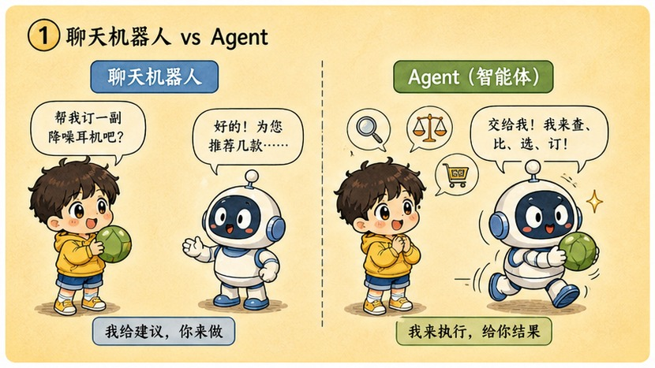
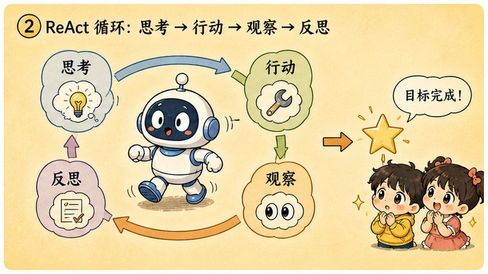
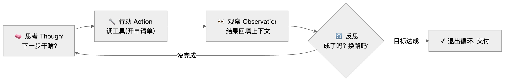
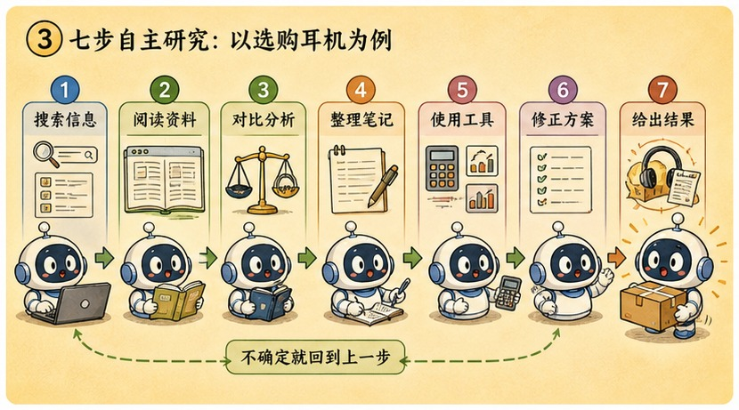
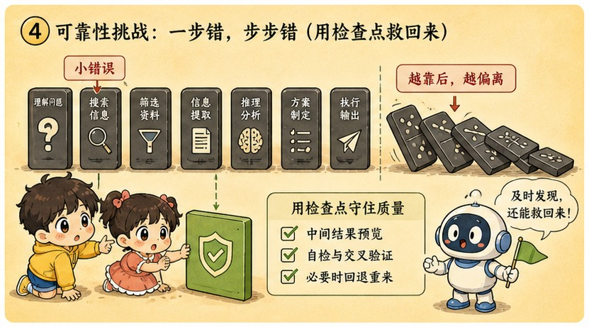

# 第 20 章 · 智能体 Agent：ReAct 循环，让 AI 自己去打工

> ### 🎯 先别往下翻 · 这一章要破的题
>
> **🔥 痛点**：一个任务要**连着开好几张申请单**（查三款耳机评测→对比→给建议），它能**自己一轮一轮地查、查完再决定下一步**，不用你每步都发指令吗？
> **🤔 换你来**：你给实习生派活"周五交报告"，他会每查一个网页就跑来问"下一步干嘛"吗？
> **🧱 笨办法会撞墙**：你可能以为"模型够强，聊着聊着就升级成 Agent 了"——可只要每一步都得**你发起、球回到你手里**，它再强也只是"带工具的 Chatbot"，不是 Agent。
> 差别不在大脑多聪明，而在外面那圈架构。往下看那个会转圈圈的循环。👇

元元一拍大腿，眼睛锃亮：「问到第四阶段压轴的题眼了！把'开单回合'**装进一个循环**里，让它**自己跟自己对话、自己转圈圈**把活干完——这就是终极打工人 **Agent 智能体**！今天我让一个 Agent 去打一次工，你看它在终端里自己转圈圈（★ω★）」

---

## 第 1 节　Chatbot vs Agent：球在谁手里

▲ 图20-1 · Chatbot vs Agent：球在谁手里

「先盘点前四章攒齐的零件，」元元说，「第 16 章你学会指挥模型，第 17 章摸清记忆边界，第 18 章给它外挂资料，第 19 章它学会开工具申请单。但这些场景有个共同点——**每个回合都由你发起，答完一轮，球就回到你手里**。哪怕模型再强，这种'一问一答'的形态都叫 **Chatbot**。」

> **直觉印象**：Agent 就是一个**更聪明的**聊天机器人。
> **真实机制**：Agent 是把大模型**装进循环里**——给定目标后，它自主规划、调工具、看结果、再决策，**干完才把球还给你**。

「模型本身可以一模一样，」元元强调，「差别在外面那圈架构：循环、工具、记忆。最贴切的画面是——**给实习生派活**:」

> 🧑‍💼 你说"调研一下竞品，周五给我报告"——他不会每查完一个网页就跑来问"下一步干嘛"，而是**自己列提纲、自己搜资料，链接挂了自己换关键词，实在卡死才来找你**。

「**Chatbot 是'事事请示'，Agent 是'给目标、交结果'**，」元元总结，「注意：变化的未必是大脑的聪明程度——**是协作方式变了**。判断标准就一句话：**球在谁手里**。」

拆开任何一个 agent，里面都是同一副**四件套**，每一件你都见过：

| 件 | 来自 | 干啥 |
|---|---|---|
| 🧠 **大脑 = LLM** | 第 10–14 章 | 唯一会"想"的零件：规划、选工具、读结果、做判断 |
| 🔧 **手脚 = 工具** | 第 19 章 | 搜索、读网页、跑代码——"模型开单、宿主执行"原封不动 |
| 💓 **心跳 = 循环** | 本章主角 | 宿主里一个朴素的 while：没完成就把结果喂回去再跑一轮 |
| 🗂️ **工作台 = 记忆** | 第 17 章 | 上下文窗口摆着目标、计划、每轮足迹；长任务还要外挂笔记 |

---

## 第 2 节　ReAct 闭环转盘：思考→行动→观察→再思考

▲ 图20-2 · ReAct 闭环转盘：思考→行动→观察→再思考

「'循环'放大到帧，是怎么转的？」元元画了个**转盘**，「经典模型叫 **ReAct**——每一轮心跳就这么几拍：」

▲ 图20-1 · Agent 的 ReAct 循环

「**全章最重要的一句话**，」元元敲黑板，「**上一拍的输出，就是下一拍的输入。**Agent 并没有长出新器官——每一轮做决策的，仍是那台接龙机器：读上下文、续写下一段。唯一变化是上下文里装的东西：不再只有你的问题，而是它自己一路留下的**足迹**——计划、申请单、工具结果、报错、反思。**模型在自己的足迹上持续决策。**」

「为什么非循环不可？」元元解释，「因为多步任务的关键信息是'**走到那一步才出现**'的：不先搜一次，不知道该查哪三款；不点开链接，不知道页面早已 404。**再聪明的模型也无法在第 0 秒写出一份永不需修改的完美计划**——计划赶不上变化时，唯一的办法是走一步、看一步、改一步。单次生成给不了'看一步'的机会，循环可以。」

---

## 第 3 节　围观一个 Agent 打工：调研耳机的 7 轮心跳

▲ 图20-3 · 围观一个 Agent 打工：调研耳机的 7 轮心跳

光说不练假把式。元元派了个 agent 干活——任务：「调研三款降噪耳机并给出购买建议」，工具有 search、open_page、read_notes。终端里，agent 开始**自己跟自己对话、转圈圈**：

> 🎬 **第 1 轮 · 规划**
> 　🧠思考：「拆成三个子任务：① 找口碑前三型号 ② 逐一收集价格评测 ③ 汇总写建议。先做 ①。」
> 　🔧行动：`search("降噪耳机 口碑排行 评测")`
> 　👀观察：「反复点名三款：A 牌旗舰、B 牌轻巧、C 牌性价比。子任务①完成✓」
> （元元插话：「'拆成三个子任务'看着像深思熟虑，其实就是一次普通文本生成——思维链的近亲。」）

> 🎬 **第 2 轮 · 标准节拍**
> 　🧠思考：「查 A 牌旗舰，要价格、降噪、佩戴、续航四项。」
> 　🔧行动：`open_page("A牌旗舰深度评测")`
> 　👀观察：「要点入笔记：降噪最强、佩戴舒适、约两千元档；短板偏重。」
> （「注意'要点入笔记'——**工作记忆在累积**，这就是四件套里的'工作台'。」）

> 🎬 **第 3 轮 · 现实反击**
> 　🧠思考：「如法炮制，查 B 牌评测页。」
> 　🔧行动：`open_page("B牌轻巧款评测")`
> 　👀观察：「**请求失败：404，页面不存在！**」
> （「404 了——**这正是循环必须存在的理由**：页面打不打得开，是'走到这一步才知道'的信息，完美计划料不到。失败结果照样回填——关键看它下一轮怎么办。」）

> 🎬 **第 4 轮 · 反思修正（本剧高光！）**
> 　🔄反思：「上一轮失败——**别再撞同一堵墙**。换策略：不开具体页面，改用搜索词直接要结论。」
> 　🔧行动：`search("B牌轻巧款 降噪耳机 评测 优缺点")`
> 　👀观察：「要点：降噪接近 A、轻不少、约一千五；短板续航一般。进度 2/3。」
> （「**报错也是养料！**失败记录躺在上下文里，模型读着自己的失败足迹，生成了新策略——全程无人介入。这就是'上一轮输出=下一轮输入'最值钱的一幕。」）

> 🎬 **第 5 轮 · 经验被继承**
> 　🧠思考：「还差 C 牌。**沿用刚验证过的搜索词策略**，更稳。」→ 查到要点，子任务②完成（3/3）✓
> （「注意'沿用刚验证过的'——第 4 轮的成功经验也留在足迹里，**agent 在任务内会'长记性'**。但只在本次上下文内有效，关窗即忘。」）

> 🎬 **第 6 轮 · 自查**
> 　🧠思考：「进子任务③。先自查：三款×四项要点的笔记齐全吗？」
> 　🔧行动：`read_notes() → 逐格核对` → 「12 格全在位，无缺漏。」
> （「交付前先核对清单——错误当场拦截，而不是带病冲到终点。」）

> 🎬 **第 7 轮 · 判断完成，退出循环**
> 　🧠思考：「信息齐全，收口：生成购买建议，结束任务。」→ 交付：预算充足选 A / 通勤优先选 B / 预算有限选 C。**目标达成 → 退出循环 ✓**
> （「'目标达成'同样是模型生成的一个判断——它也可能判错，所以成熟产品常在这里设**人工验收**。复盘这一生：7 轮、5 次工具调用、1 次失败重试。」）

> 元元连现象带机制：「你在产品里见过的——Deep Research 跑十几分钟提示'已阅读 14 个来源'、Claude Code 改完代码自己跑测试、测试红了又接着改——**那不是装饰动画，是循环每一拍的实时日志，产品把心跳播给你看。**」

---

## 第 4 节　连乘的暴政：为什么 Agent 没那么神

▲ 图20-4 · 连乘的暴政：为什么 Agent 没那么神

「到这儿 agent 听起来近乎完美，」元元话锋一转，「是时候泼冷水了——**这是全章最诚实的部分**。」

「病根埋在第 14 章：模型每次输出都是**概率采样**，单步再准也只是'大概率对'。聊天里无所谓——错了你看得见，下一句就纠正。但 agent 把几十步串成一条链，**每一步都踩在上一步的输出上**，麻烦就来了：错误不是平均分摊，而是**连乘累积**!」

他算了笔吓人的账（假设每步九成五把握）:

| 连续步数 | 全程不出错的把握 | 体感 |
|---|---|---|
| 1 步 | 约 95% | 很稳 |
| 5 步 | 约 77% | 开始心虚 |
| 10 步 | 约 60% | 将将过半 |
| 20 步 | 约 36% | **大概率中途已出错** |
| 50 步 | 约 8% | **几乎必然翻车** |

「**链路越长，'全程顺利'越接近抽奖**，」元元说，「错误累积之外，还有三种常见死法：」

> 💀 **死法一 · 死循环**：同一个失败动作反复重试——像 NPC 卡墙角原地踏步，烧着 token、产出为零。
> 💀 **死法二 · 跑偏**：第 3 轮一个小误读（把"降噪耳机"看成"降噪音箱"），被后面十几轮当既定事实继承，越走越远。
> 💀 **死法三 · 成本爆炸**：每轮都要把越滚越长的足迹整个重读一遍（第 17 章，按 token 计费），轮数×足迹长度，账单飙升远超直觉。

工程界的**三件套解法**（共同思路：别让错误活过一轮，别让链条长到失控）:

> ✅ **人把关（human-in-the-loop）**：删文件、花钱、对外发送——必须停下等人签字。
> ✅ **子任务拆分**：把 20 步长链切成几段 5 步短链，每段交付一个能快速检查的小成果。**连乘的链条越短，活下来概率越高——算术如此，没有魔法。**
> ✅ **可验证中间产物**：写代码就跑测试，做调研就留来源链接。错误当场拦截。

> 元元答了个现象级问题：「**为什么写代码的 agent 最先成熟？**因为代码天生自带免费验证器——编译器和测试。每轮'观察'拿到的都是客观硬信号，错误活不过一轮就被发现，改错了还能一键回滚。而'全自动炒股''全自动谈判'反馈慢、噪声大、错误不可逆。一条经验法则：**结果越容易被便宜验证、错误越可逆的领域，agent 越早能用。**下次看 agent 新品发布，先问这两个问题，比看 demo 视频靠谱。」

---

## 第 5 节　这些坑，你八成也会踩

**坑一：「Agent 有自主意识——它'想要'完成目标，失败了还'不甘心'地重试」**

> ❌ 围观它连续干活、碰壁还换路重试，太像"有意志"了。
> ✅ 真相是——**"目标"只是你写进 prompt 的一段文字，"不达目的不罢休"是程序里写死的 while 循环。**

病根：两个拆穿它的实验：① 把 prompt 里的目标换成任意别的字符串，它对新目标**同样"执着"**，毫无偏好；② 让宿主不再把结果回填（拔掉循环），"意志"**当场消失**，它退化成普通一问一答。**执着是架构的属性，不是心灵的属性**——欲望写在你的 prompt 里，毅力写在工程师的 while 里。

**坑二：「Agent 已经能全自动替代人类工作了」**

> ❌ 你刷到的 agent 演示视频，都是从无数次运行里**挑出的成功案例**剪的。
> ✅ 真相是——**长链路成功率连乘衰减**，目前最稳的形态是**人机协作**:AI 跑短链，人把关节点。

病根：失败的那些不会出现在你的时间线上。真实工程里长任务依旧会死循环、跑偏、烧预算，所以成熟产品全保留人工确认闸（Claude Code 每次删文件、跑命令都要先问你）。**当下最能打的用法不是"全自动"，而是把 agent 当一个不知疲倦的实习生**：你定方向、切任务、验收中间产物——它出手速，你出判断。

---

## 第 6 节　收尾大招：球在谁手里

老规矩，秘籍 ＋ 大杀器。

### Agent 核心，一张表收干净

| 概念 | 一句话 |
|---|---|
| **Chatbot vs Agent** | 一问一答 vs 给目标自主多步——判断标准：球在谁手里 |
| **四件套** | 大脑（LLM）+手脚（工具）+心跳（循环）+工作台（记忆） |
| **ReAct 循环** | 思考→行动→观察→反思，上一拍输出=下一拍输入 |
| **连乘暴政** | 每步95%,50步只剩8%——链越长越像抽奖 |

### 收尾大招：两个问题，看穿一切"Agent 新品"

往后看到任何"全自动 Agent"发布，别看 demo 视频，先问两句：

> 　🗣️ **「① 这个领域的结果，容易被便宜地验证吗？② 它犯的错，可逆吗？」**
> - 都"是"（写代码：编译器测试当场验、改错能回滚）→ **agent 早成熟、能用**。
> - 都"否"（炒股谈判：反馈慢、噪声大、错不可逆）→ **连乘衰减无人拦截，离谱**。
>
> 再配一句祛魅：**它的"执着"是写死的 while 循环，不是意志**——把目标换成别的字符串，它同样"执着"；拔掉循环，"意志"当场消失。

### 把整章拧成一句话塞进脑子

> **Agent = 把大模型装进 ReAct 循环（思考→行动→观察→反思），给定目标后让它在自己的"足迹"上持续决策、自主调工具、走完多步才交付——四件套 = 大脑+手脚+心跳+工作台。**
> 上一拍输出就是下一拍输入，所以报错也是养料（能自我纠错），但错误也会连乘累积——50 步几乎必翻车。
> 它没有意志（执着是写死的 while）、也没法全自动替代人；最稳的形态是人机协作，而代码 agent 因"验证便宜+错误可逆"最先成熟。

---

## 🎓 第四阶段 · 通关小结

小满长舒一口气，掰着指头数：「这一阶段，我感觉自己从'会聊天'变成'会调度'了！」

元元笑着把五章串成一条"应用进阶链":

> 1️⃣6️⃣ **提示词**——在高维空间画圈、套性格面具，把模型拽进对的知识群落。
> 1️⃣7️⃣ **上下文窗口**——模型只有一扇窗（金鱼记忆+平方账单），把对的信息放进窗。
> 1️⃣8️⃣ **RAG**——开卷考试：文档放窗外，按题检索最相关的几段塞进窗。
> 1️⃣9️⃣ **Function Calling**——给脑子装机械手：开处方（JSON），宿主抓药（执行）。
> 2️⃣0️⃣ **Agent**——把开单回合装进 ReAct 循环，让 AI 自己转圈圈打工。

「你发现没有，」元元意味深长，「这五章是**一条能力跃迁链**：先会'说'（提示词）→ 懂'记'的边界（上下文）→ 给它'外挂知识'(RAG)→ 给它'手'（工具）→ 把这一切'装进循环让它自主'(Agent)。**每一步都踩在上一步的零件上，最后拼出一个能自己干活的智能体——这正是当下 AI 产品最热的前线！**」

小满眼睛发亮：「应用我会搭了……那 AI 的**最前沿**呢？那些文生图、会'思考'的推理模型、还有什么 MCP……」

「正合下一阶段！」元元一拍桌子，「第五阶段——**前沿篇 · 多模态与推理**!图像生成的去噪魔法、AI 同时看懂图文音、会'先打草稿再回答'的推理模型、还有工程生态全景。**看懂今天新闻里的每一个热词（★ω★）**」

---

## 🧰 装进你的工具箱

> **🔑 一句话方法**：**Agent** = 把大模型装进 **ReAct 循环**（思考→行动→观察→反思），给定目标后让它在自己的"足迹"上持续决策、自主走完多步；四件套 = 大脑（LLM）+手脚（工具）+心跳（循环）+工作台（记忆）。**上一拍的输出就是下一拍的输入**——所以报错也是养料，但错误也会**连乘累积**（50 步几乎必翻车）。
> **🎯 触发器 · 以后遇到这种情况就掏出它**：看任何"全自动 Agent"发布，先问两句——**①这领域的结果容易便宜地验证吗？②它犯的错可逆吗？**（都"是"如写代码=早成熟；都"否"如炒股=离谱）；它的"执着"是写死的 while 循环、不是意志。
>
> **✍️ 合上书自测**：
> 1. 用"四件套"和"球在谁手里"判断：接了搜索工具的聊天机器人，是 Agent 了吗？还缺什么？
> 2. Agent 跑到第 15 轮还在反复访问打不开的网站，这是哪种死法？怎么救？
> 3. 为什么"写代码"的 Agent 比"全自动炒股"的 Agent 先成熟？

> 🪜 **下一阶段预告**：第五阶段 · 前沿篇——多模态与推理（第 21–25 章）。

# 🏔️ 第五阶段 · 前沿篇 —— 多模态与推理

---
[← 上一章](../stage_4/chapter_19.md) ｜ [📖 目录](../README.md) ｜ [下一章 →](../stage_5/chapter_21.md)

> 在线阅读《看得见的 AI》· 全 30 章免费 —— 回到 [**项目首页**](../../README.md)，觉得有用点个 ⭐ Star 让更多人看到。
