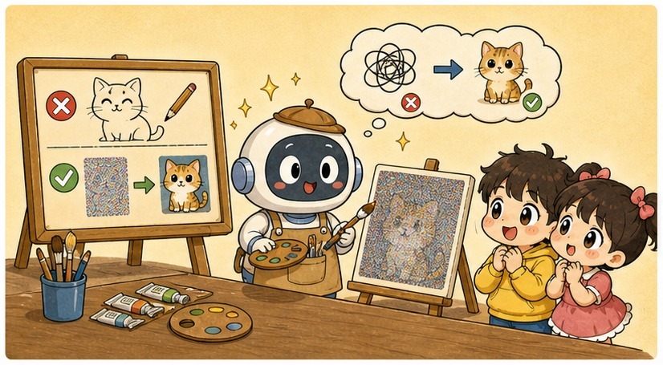
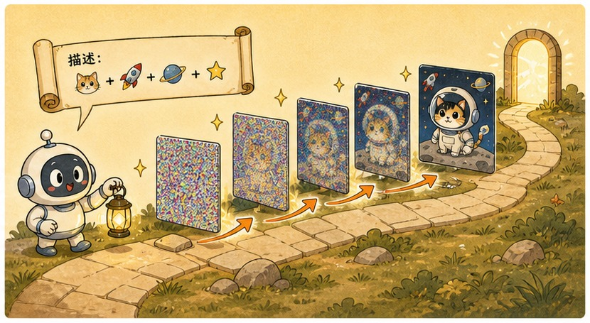
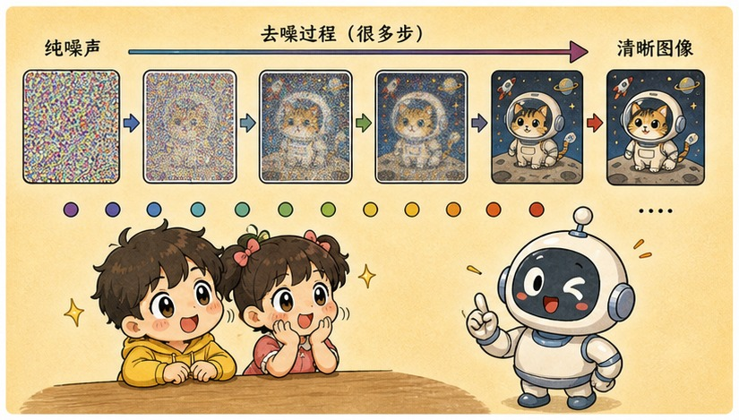
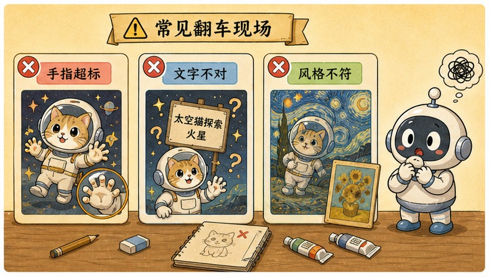

# 第 21 章 · 扩散模型：从噪声中逐渐擦拭出图像的魔法

> ### 🎯 先别往下翻 · 这一章要破的题
>
> **🔥 痛点**：你打一句"一只戴头盔的太空猫",AI 就**无中生有**画出一张世上从没有过的图。它是从哪个图库里抠图拼出来的吗？
> **🤔 换你来**：如果让你从一片纯雪花噪点里"变"出一幅画，你会怎么变？
> **🧱 笨办法会撞墙**：你以为 AI 像画家一样"从空白画布起笔、一笔笔画上去"——**完全不是**。而"从图库里抠图拼贴"也是误解（画面里没有任何一张被拼的原图）。
> 真相反直觉：它学的根本不是"画画"，是"擦掉一点噪声"。往下看那面落灰的镜子。👇

第四阶段，元元带小满把大模型从"会聊天"用到了"会调度"。第五阶段——**全书最终高潮，前沿篇**！第一站：文生图。

小满早就好奇得不行：「Midjourney、那些 AI 画图……它咋就**无中生有**画出一只我脑子里想的'太空猫'的？是从哪个图库里抠出来拼的吗？」

元元神秘一笑，从桌底掏出一面**落满灰尘、脏得照不出人**的旧镜子：「真相比拼图怪多了！它根本不'画'——它在**擦镜子**。今天我用这面脏镜子，给你讲明白机器怎么从一片雪花里，一点点'擦'出一只太空猫（✦ω✦）」

---

## 第 1 节　它学的不是画画，是"修复"

▲ 图21-1 · 它学的不是画画，是"修复"

「看到 AI 画图，所有人第一反应都是'它学会了绘画'，」元元说，「**错。**它学会的事小得多、也怪得多——但正是这件小事，重复几十次就成了魔法。」

> **直觉印象**：学"怎么画" → 从空白画布起笔，打底稿、勾线、上色，一笔笔把画"画"出来。
> **真实机制**：学"怎么**去掉一点噪声**" → 拿到一张被噪声污染的图，把噪声**恢复一点点**。把这一步重复几十次，一幅画就从雪花屏里浮现。

元元擦了擦那面脏镜子，引了句雕塑家的传说：

> 🗿 「雕像本来就在石头里，我只是去掉多余的部分。」
> **扩散模型是数字时代的雕塑家**：画"藏"在那张纯噪声里，去噪器一步步凿掉多余的随机，直到画显形。**它从不"添加"任何笔画——它只做减法。**
> 　不过有一层得说透，免得误会："只做减法"是说**画面不是从空白处一笔笔画上去的**；但它**减的是噪声，凭的却是脑子里学过的"画该长什么样"**——每一步其实是先用学到的**先验**猜出"干净的画大概是这样"，再据此把噪声往回收一点。所以与其说凭空擦出，不如说：**一边擦噪声，一边按学过的规律把画"认"出来。** 新图的信息，归根到底来自模型权重里那套先验，不是来自那张随机噪声。

「这件事拆开看，是**两个完全分离的阶段**:」

> 🎬 **训练时 · 学会去噪**（加噪 → 猜噪声）
> 拿一张真实照片，随机加上**不同程度**的噪声——轻则略糊，重则面目全非——然后让神经网络猜："刚才加进去的是什么噪声？"猜对了，就等于会把这一步噪声减掉。在**亿万张图**上重复这道练习题，网络就成了去噪高手。

> 🎬 **生成时 · 反复用它**（纯噪声 → 几十步 → 画）
> 生成新图根本不需要任何"原图"：随机抽一张**纯噪声**，把去噪器**连续调用几十步**，每步只擦掉一点点。因为起点的噪声每次都不同，每次"浮现"出的画都是**世界上从未存在过的一张**。

> 小满：「为啥不一步到位、直接擦干净？」
> 元元：「因为'从雪花直接猜出整幅画'太难，网络猜不准；而'只把噪声减轻一点点'是个简单得多的小问题，**每一步都能做得很准**。几十个小而准的步骤串起来，胜过一个大而离谱的跳跃——这和第 4 章梯度下降'**小步快走**'的智慧一脉相承。」

---

## 第 2 节　画一只太空猫：文字怎么给每一步指路

▲ 图21-2 · 画一只太空猫：文字怎么给每一步指路

「光会去噪，只能从噪声里浮现出'随便一张图'，」元元说，「要让它画'**一只戴头盔的太空猫**'，得把你的文字变成**每一步去噪的导航**。」他一边擦镜子一边演连环画：

> 🎬 **第 1 步 · 文字变向量**
> 你的描述"太空猫"先经过一个**文本编码器**，变成一串数字向量——还记得第 8 章吗？向量就是机器能比较、能计算的"语义坐标","太空""猫""头盔"的含义都被编了码。

> 🎬 **第 2 步 · 每步去噪时指路**
> 这串向量作为**条件**，在每一步擦镜子时都喂给去噪器，把去噪方向"掰"向符合描述的图像区域：同样是擦掉噪声，**往'有太空猫的那类图'的方向擦**。文字不画画，**文字只导航**。

> 🎬 **第 3 步 · CFG：听话程度的杠杆**
> 引导强度（CFG）决定模型**多大程度服从你的文字**:
> - 杠杆**拧大** → 更听话、更贴题，但拧过头容易**颜色过饱和、画面发"塑料"**——像把导航音量开到最大，司机紧张得开不好车。
> - 杠杆**拧小** → 画面自然，但可能跑题、糊成一片。

元元又补了一段"省钱秘诀":

> 💡 **潜空间：在小草图上构思，最后再上色放大**
> 直接在像素上做扩散太贵：一张 1024×1024 的图有**上百万个像素**，几十步去噪每步都得全算一遍。Stable Diffusion 的聪明做法是先用压缩器把图压进小得多的**潜空间（latent space）**，全部几十步扩散都在这张"小草图"上进行，**最后一步才解码放大回像素**——就像画家先在小稿上构思布局，定稿后才上色放大，省下的算力是数量级的。（它论文名就叫"潜在扩散"Latent Diffusion）

> 元元连上同路线名角：「Midjourney（审美调校出名）、Stable Diffusion（开源开放）、DALL·E（OpenAI 出品）——产品气质各异，**底层同属扩散这条路线**。再把'对一张图去噪'扩展成'对一串帧在时间维度上一起去噪'，画面动起来还前后连贯——这就是 **Sora 类视频生成**的主流思路。」

---

## 第 3 节　亲眼看：从雪花里擦出一幅画

▲ 图21-3 · 亲眼看：从雪花里擦出一幅画

光说不练假把式。元元把那面脏镜子立在桌上，拖动一个"去噪步数"滑块，演整个过程：

> 🎬 **步数 0 / 50 · 噪声 100%**：一整面**纯雪花**，啥也看不出。
> 🎬 **步数 10**：先**定大色块**——上半深、下半浅，隐约有个"上天下地"的布局。
> 🎬 **步数 25**:**轮廓开始浮现**——一个圆头、两只尖耳朵的影子，背景透出星星点点。
> 🎬 **步数 40**:**细节清晰**——头盔的反光、猫的胡须、漂浮的姿态。
> 🎬 **步数 50**：一只**戴头盔、飘在星空里的太空猫**，清清楚楚。世界上从没有过这张图。

> 小满看呆了：「它是**先定大色块、再浮现轮廓、最后才清晰**的……跟冲洗老照片一样！」
> 元元：「精辟！**每一步都只擦掉一点点，从模糊到清晰**。这就是'画'的真相——不是从无到有地画，是从一片混沌里，把早已'藏'在噪声里的那张图，一点点擦出来。」

---

## 第 4 节　这些坑，你八成也会踩

▲ 图21-4 · 这些坑，你八成也会踩

**坑一：「AI 画图是在素材库里搜图、拼贴、缝合」**

> ❌ "它看过几十亿张图"听起来就像存了个巨大素材库。
> ✅ 真相是——**画面从纯噪声逐步生成，不存在被"拼贴"的某张原图**；但训练数据里的风格确实会被学进权重。

病根：权重里存的是**统计规律，不是图片本身**——生成时唯一的"原料"是那张随机噪声。**但要诚实地说**：艺术家的风格可以被模仿这件事是真的，训练数据是否侵权、风格该不该受保护，是**至今仍在诉讼和立法中拉锯的争议**。

**坑二：「AI 是'唰'地一下把图画出来的」**

> ❌ 产品界面只给你看最终结果，中间几十步被藏起来了。
> ✅ 真相是——**标准流程是几十步迭代去噪，每步只擦掉一点点噪声**。

病根：确实有"秒出图"的产品——但那靠的是**蒸馏、一致性模型**等加速技术，把几十步压缩到几步甚至一步，**那是工程提速，原理仍然是去噪**。

---

## 第 5 节　收尾大招：它在擦镜子，不在画画

老规矩，秘籍 ＋ 大杀器。

### 扩散模型核心，一张表收干净

| 概念 | 一句话 |
|---|---|
| **它学了啥** | 不是画画，是"把加噪的图恢复一点点"（去噪/修复） |
| **两阶段** | 训练：真图加噪→猜噪声；生成：纯噪声→几十步去噪→画 |
| **文字控制** | 描述变向量（第8章）→每步去噪指路；CFG=听话程度杠杆 |
| **潜空间** | 在小草图上扩散，最后解码放大，省数量级算力 |

### 收尾大招：一句话戳破"AI 抠图拼贴"

往后谁说"AI 画图就是从图库里抠图拼起来的"，你就用"擦镜子"反驳：

> 　🗣️ **「它学的不是画画，是'把一张被加噪的图恢复一点点'。生成时唯一的原料是一张随机噪声——从雪花里几十步擦出一幅画，没有哪张原图被拼贴。」**
> - 验证：同样的提示词生成两次，出来是两张**世界上从没有过**的不同图（起点噪声不同）。
> - CFG 拉满图却辣眼睛、发塑料？——杠杆拧过头，在"贴题"和"自然"之间调回中间档。
> - 但风格确实会被学进权重——版权争议是真的，这事别和稀泥。

### 把整章拧成一句话塞进脑子

> **扩散模型 = 数字时代的雕塑家：它不"画"图，而是学会"去掉一点噪声"，从一张纯噪声出发、几十步迭代去噪，把早已"藏"在雪花里的画一点点擦出来。**
> 文字不画画、只导航：描述变向量后在每一步去噪时指路，CFG 杠杆调"听话程度"；潜空间让它在小草图上构思、最后放大，省下数量级算力。
> Midjourney/SD/DALL·E 同属这条路线，Sora 是它的时间维版本——而"抠图拼贴"是误解，"唰一下出图"也是（真相是几十步）。

---

小满消化完，又冒出个反向的问题：「它会**画**图了……那它会**看**图吗？我发一张照片问它'这是什么品种的猫'，它是真'看见'了，还是……?而且它咋能**同时**看懂图、又听懂我说话的语音的？这不是俩完全不同的器官吗？」

元元眼睛一亮，掏出一个电焊面罩晃了晃：「问到下一章的命门了！AI 当然不是长了俩器官——它玩的是**'物理接驳'**：用一个视觉编码器把图**压成一串特殊的向量**，直接**'焊'**进文本输入流里，让它把图片当成一种特殊的"外语"来读！走，下一章我给你演这场焊接（★ω★）」

---

## 🧰 装进你的工具箱

> **🔑 一句话方法**：扩散模型是数字时代的雕塑家——它不"画"图，而是学会"**去掉一点噪声**"，从纯噪声出发、**几十步迭代去噪**，把早已"藏"在雪花里的画一点点擦出来；文字不画画、只**导航**（每步指路）,CFG 是"听话程度"杠杆。
> **🎯 触发器 · 以后遇到这种情况就掏出它**：谁说"AI 画图就是抠图拼贴"，你用"擦镜子"反驳——唯一原料是一张随机噪声，所以同样提示词每次出的都是**世上没有过的新图**;CFG 拉满图却辣眼睛发塑料，就是杠杆拧过头了。
>
> **✍️ 合上书自测**：
> 1. 一句话说清扩散模型"学了什么"，训练和生成阶段各在做什么？
> 2. CFG 拉到最大，为什么颜色会过饱和、画面发"塑料"?
> 3. Stable Diffusion 是直接在上百万像素上去噪的吗？潜空间帮它省了什么？

> 🪜 **下一章预告**：第 22 章 · 多模态——把视觉编码器"焊"进大模型的眼睛。

---
[← 上一章](../stage_4/chapter_20.md) ｜ [📖 目录](../README.md) ｜ [下一章 →](../stage_5/chapter_22.md)

> 在线阅读《看得见的 AI》· 全 30 章免费 —— 回到 [**项目首页**](../../README.md)，觉得有用点个 ⭐ Star 让更多人看到。
