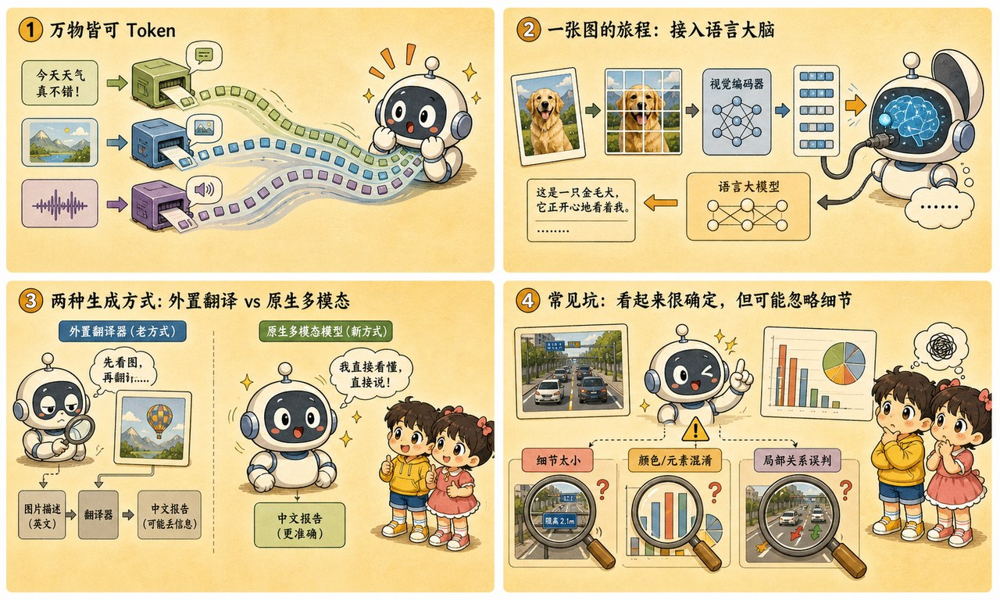

# 第 22 章 · 多模态：把视觉编码器"焊"进大模型的眼睛

> ### 🎯 先别往下翻 · 这一章要破的题
>
> **🔥 痛点**：AI 会画图了，那它会**看**图、还能**同时**听懂语音吗？看图和听音不是俩完全不同的"器官"吗？
> **🤔 换你来**：要让一个只会读文字的模型也能看图听音，你会给它**再造一个视觉大脑**，还是别的办法？
> **🧱 笨办法会撞墙**：你八成想"每多一种感官就造一套全新系统，图、文、音三个大脑再互相开会"——可这样**又笨又难拼**。
> 聪明人发现：根本不用造新大脑。往下看怎么把图"焊"进文本流。👇

元元掏出一个电焊面罩晃了晃：「AI 当然不是长了俩新器官——它玩的是**'物理接驳'**！用一个视觉编码器把图**压成一串特殊向量**，直接**'焊'**进文本输入流，让它把图片当成一种特殊的**'外语'**来读。今天我给你演这场焊接（★ω★）」

---

## 第 1 节　万物皆可 token 化：不造新大脑，只造新"打印机"

「前几章我们把 ChatGPT 的'读字'系统拆了个遍，」元元起头，「第 11 章讲文字怎么切 token，第 9、10 章讲注意力和 Transformer 怎么处理这串 token。现在问题来了：要让它看照片、听语音，是不是得**另起炉灶造一个全新的'视觉大脑'**？」

> **直觉印象**：看图、听音是全新能力 → 得给 AI 装"眼睛""耳朵"，再造一个新大脑。
> **真实机制**：Transformer **只认 token，不问出身** → 把图和声音**变成 token**，原来的大脑照常工作。

「为啥行得通？」元元揭关键，「回想第 11 章——文字进模型前先被切成 token、再换成向量。也就是说，**Transformer 真正吃进去的从来不是'字'，而是一串向量**！它从头到尾**不检查向量的'出身'**——这就是突破口：**只要为每种信号发明一种合适的'切法'，万物皆可 token 化。**」

「**不造新大脑，只造新的'入场券打印机'**，」元元说，「每种信号配一个编码器，把自己变成 token。三种切法摆一起看：」

| 信号 | 切法 | 一句话 |
|---|---|---|
| **文字**（第 11 章复习） | 分词器切词块 | 一句话 → 十几个 token |
| **图像**（ViT 思想） | 切成棋盘小方块 **patch**（常见 16×16 像素），每块压成一个向量 | 一张图 → **几百个"图像 token"** |
| **音频**（波形切片） | 连续声波按几十毫秒切薄片，每段编码成向量 | 一秒语音 → 几十个"音频 token"，**语气、停顿都藏在向量里** |

> 元元强调焊接的妙处：「统一成 token 有个**无可替代的好处——注意力可以跨模态直接计算**!你问'图里是什么天气'，'天气'这个文字 token 的注意力可以**直接落在天空那几个 patch 上**，中间不经过任何翻译。你的问题，**引导它的眼睛往哪看**。」

---

## 第 2 节　一张照片的旅程：焊接现场连环画

光说不练假把式。场景：你在 ChatGPT 里上传一张猫的照片，问"这只猫是什么品种？"。元元戴上电焊面罩，演这场五步焊接：

> 🎬 **第 1 步 · 预处理切块**
> 照片先被**缩放**到模型规定尺寸，再切成棋盘格——几百个 patch。「注意：原图再高清，**超出规定尺寸的像素这一步就没了**。」

> 🎬 **第 2 步 · 视觉编码器上场**
> 每个 patch 被压成一个向量。这一摞向量就是**图像 token**——**规格和文字 token 完全相同**，排在队伍里谁也认不出谁来自照片。

> 🎬 **第 3 步 · 焊进同一条序列**
> 【图像 token × 几百】＋【"这只猫是什么品种？"的文字 token × 几个】**排成一队**，整队送进 Transformer。「对模型来说，这就是一段'长 prompt'——只是前几百个 token 碰巧来自照片。」

> 🎬 **第 4 步 · 注意力跨模态扫描**
> 生成回答时，'品种'相关的注意力**大量落在猫脸、毛色花纹对应的 patch 上**——和第 9 章判断"它指代谁"的机制一模一样，只是对象从词换成了图块。

> 🎬 **第 5 步 · 接龙输出文字**
> "这是一只英国短毛猫……"逐 token 生成，第 12 章的老规矩。

> 元元敲下本章最重的一句：「注意第 2 步的分量——**AI 看见的不是图，是几百个向量！**它没有视网膜、没有'画面感'，照片在进门时就被压缩成了一串数字印象。」

这个事实一口气解释了一堆现象：

| 你在产品里看到的现象 | 背后机制 |
|---|---|
| 发几张图，回答明显变慢、额度掉得快 | 一张图折合几百上千 token，注意力对象暴增（第9章）、计费按token（第11章） |
| 长对话塞很多截图后它开始忘事 | 图像 token 大口吃掉上下文窗口，早期内容被挤出"书桌"（第17章） |
| 把图裁剪放大再问，它突然答对了 | 裁剪=把同样 token 预算集中花在关键区域，每个 patch 变"高清"了 |
| 同一张图问不同问题，侧重不同 | 注意力由问题引导落在不同 patch——它不是"先看完再答"，是"边被问边看" |

---

## 第 3 节　两代分水岭：外挂翻译官 vs 原生双语者

「'把图变 token'听着顺理成章，但业界绕了段路才走到这，」元元说，「早期'能看图的 AI'多数是**拼接**出来的：」

> **第一代 · 拼接式**：外挂一个识图模型，先把图**翻成一句文字描述**，再喂给 LLM。
> 　→ LLM 本体从没"见过"图。**像隔着电话听朋友描述照片——朋友没提的细节，你永远不知道。**信息损失大，问深一点就露馅（你问"键盘角落的 logo 是什么牌子"，描述里没提它就永远不知道）。

> **第二代 · 原生多模态**：训练时图文就**混在一起学**，图直接变 token 进同一条序列。
> 　→ **GPT-4o、Gemini 这一路线**。看图是"亲眼看"；而且输出端同样能接龙生成图像 token、语音 token——**理解与生成打通**。

「关键差别在**训练阶段**（第 12 章），」元元说，「原生多模态预训练时就把图文混排数据喂给同一个模型——它读网页时既读文字也'读'配图。于是'金毛'这个词的向量，和金毛照片的 patch 向量，**在同一个向量空间里靠在了一起**（第 8 章的老地图，多了几个新大陆）。」

这个分水岭在**语音对话**上最戏剧化：

> 🎬 **三段式（老）**：你的语音 → ①听写成文字 → ②LLM 只读文字稿 → ③文字配音 → AI 语音
> 　**死穴**：延迟三段相加（等一两秒才开口、不能打断）;**你叹的那口气、那声笑，在第①步就被丢光了**——这就是老语音助手永远慢半拍、永远播音腔的原因。

> 🎬 **原生语音（新）**：你的语音 → 切成音频 token **直进模型** → 语音 token **直出** → AI 语音
> 　**优势**：中间没有文字稿这一站，延迟大幅下降、可随时打断；**它能听出你在笑、能压低声音回你**（GPT-4o / Gemini Live 路线）。

> 元元一句话点透：「**三段式听到的是你说了什么字，原生听到的是你怎么说这些字**——延迟和语气，输在同一个地方。」

---

## 第 4 节　这些坑，你八成也会踩

**坑一：「AI 像人一样'看见'了我的照片」**

> ❌ 把"能描述照片"等同于"拥有视觉"。
> ✅ 真相是——它"看见"的是**几百个 patch 压成的向量序列**，分辨率和细节受 **token 预算的硬限制**。

病根：照片进门时就被缩放、切块、压缩成向量，**预算之外的细节（角落小字、远处人脸）根本没进过它的"脑子"**。所以"它怎么没看到水印上的字"不是态度问题，是 token 预算问题——**把关键区域裁剪放大再发，往往立竿见影**。

**坑二：「它能看懂图，那数清图里 17 只鸟肯定不在话下」**

> ❌ 以为"看懂"就能"精确数数"。
> ✅ 真相是——**细粒度计数和小字 OCR 是多模态最常见的翻车点**——和第 11 章"数不清 strawberry 里的 r"**同一个病根**。

病根：计数需要逐个、精确、不重不漏地对齐每只鸟，而模型拿到的是**整体压缩后的向量印象**——挤在一起的几只鸟可能被压进同一个 patch，就像文字模型看不见字母只看见 token。它擅长"整体是什么、大概什么关系"，不擅长"精确到第几只"。**要紧的数数和读小字，放大裁剪分块问，或交给专门工具核对。**

---

## 第 5 节　收尾大招：它看见的不是图，是几百个向量

老规矩，秘籍 ＋ 大杀器。

### 多模态核心，一张表收干净

| 概念 | 一句话 |
|---|---|
| **核心心法** | 万物皆可 token 化：Transformer 不问出身，图/音变成 token 即可 |
| **图像怎么进** | 切 patch → 视觉编码器压成向量 → 焊进文本序列 |
| **跨模态注意力** | "天气"的注意力直接落在天空的 patch 上——你的问题引导它的眼睛 |
| **两代分水岭** | 拼接式（外挂翻译官） vs 原生（图文混训的双语者） |

### 收尾大招：一句话戳破"AI 真的看见了"

往后看到 AI"看图说话、听声辨意"，你都知道真相只有一句：

> 　🗣️ **「AI 看见的不是图，是几百个 patch 压成的向量——它没有视网膜，照片进门就被切块压缩成了一串数字印象。」**
> - 它没看到水印小字？不是态度问题，是 token 预算——**把关键区域裁剪放大再发**。
> - 让它数清图里 17 只鸟？别——这是它的天然盲区（和数不清 r 同根），**交给专门工具核对**。
> - "多模态=先转文字描述再处理"?过时了——**原生多模态图直接变 token**，细节不经文字瓶颈。

### 把整章拧成一句话塞进脑子

> **多模态 = 不造新大脑、只造新"打印机"：用视觉/音频编码器把图切成 patch、声音切成片，压成和文字同规格的 token，"焊"进同一条序列——Transformer 不问出身，注意力跨模态照常计算。**
> AI 看见的不是图、是几百个向量，所以受 token 预算硬限制（看不清小字、数不准数量）。
> 原生多模态（图文混训）取代了拼接式（外挂识图）——看图是"亲眼看"，语音是"听你怎么说"而非"说了什么字"。

---

小满把电焊面罩摘下来，又抛出一个更深的问题：「它会看、会听、会说、会画了……可这些都是'**反应**'啊。它会**想**吗？我让它解一道绕了好几个弯的难题，它能像人一样**先在草稿纸上算一算、错了再改**，而不是张口就来吗？」

元元"啪"地一拍桌子，眼睛锃亮：「问到 **2026 年当之无愧的绝对主角**了！AI 训练的重心，已经从'**老老实实背书**'变成了'**答题时在草稿纸上疯狂纠错**'!走，下一章我让你看一个推理模型在后台**自己跟自己较劲、自己推翻自己再重来**的样子（★ω★）」

---

## 🧰 装进你的工具箱

> **🔑 一句话方法**：多模态 = **不造新大脑、只造新"打印机"**——用编码器把图切成 **patch**、声音切成片，压成和文字**同规格的 token**,"焊"进同一条序列；Transformer 不问出身，注意力跨模态照常计算。**AI 看见的不是图，是几百个向量**（所以受 token 预算硬限制）。
> **🎯 触发器 · 以后遇到这种情况就掏出它**：AI 没看清图里的水印小字、或数不准图里 17 只鸟——你立刻知道是 **token 预算/压缩**的锅（把关键区域裁剪放大再问）;"多模态=先转文字描述再处理"已经过时，原生多模态是**图直接变 token**。
>
> **✍️ 合上书自测**：
> 1. "多模态靠先把图转成文字描述再喂模型"——这句话哪里过时了？
> 2. 用"书桌"比喻：为什么连发 30 张截图后它开始忘事、还变慢变贵？
> 3. 为什么"数清图里 17 只鸟"是它的天然盲区？

> 🪜 **下一章预告**：第 23 章 · 推理模型——思维链草稿纸与追加"测试时计算"。

---

[← 上一章](../stage_5/chapter_21.md) ｜ [📖 目录](../README.md) ｜ [下一章 →](../stage_5/chapter_23.md)

> 在线阅读《看得见的 AI》· 全 30 章免费 —— 回到 [**项目首页**](../../README.md)，觉得有用点个 ⭐ Star 让更多人看到。
