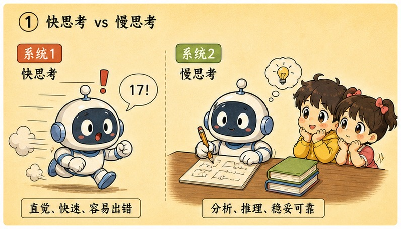
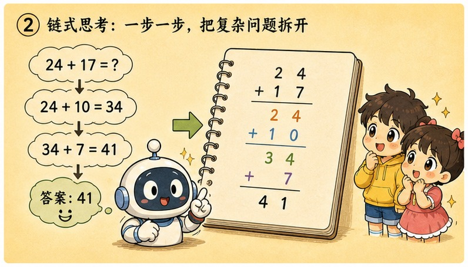
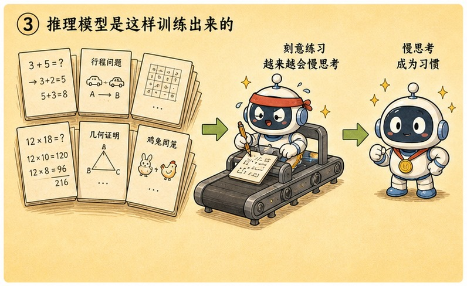
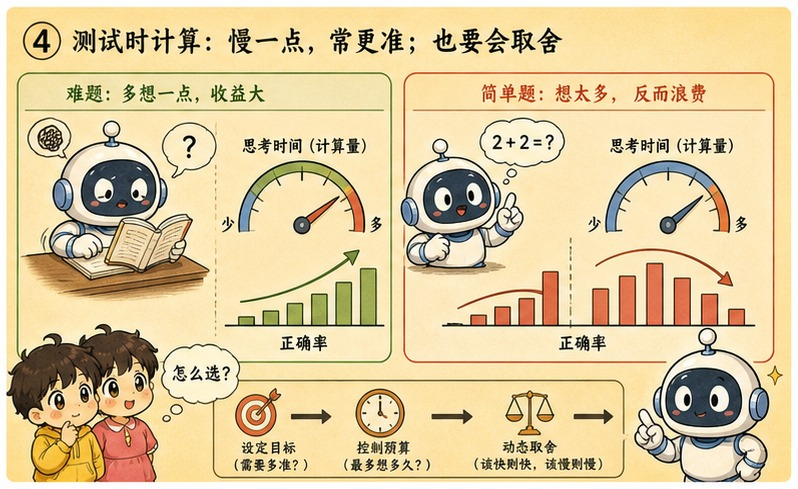

# 第 23 章 · 推理模型：思维链草稿纸与追加"测试时计算"

> ### 🎯 先别往下翻 · 这一章要破的题
>
> **🔥 痛点**：给 AI 出一道绕几个弯的应用题（鸡兔同笼），它常常**张口就答、还答错**。明明知识都在，为什么一到多步推理就翻车？
> **🤔 换你来**：等一下正文里有一道"一秒陷阱题"在等你——先想想：你凭直觉脱口而出的答案，和慢下来打张草稿算出来的，真会一样吗？
> **🧱 笨办法会撞墙**：你以为难题它"想一会儿"就行——可前面所有模型**每个 token 的思考量是恒定的**，一次前向就得吐答案，**根本没有"多想一会儿"的资格**，几步连环全挤进一次计算，一步踩空满盘皆输。
> 怎么给它一张"草稿纸"?这是 2026 年的绝对主角。往下看。👇

元元"啪"地一拍桌子，眼睛锃亮：「问到 **2026 年当之无愧的绝对主角**了！这两年 AI 训练的重心，已经从'**老老实实背书（预训练）**'，变成了'**答题时在草稿纸上疯狂纠错（推理时计算）**'！今天我让你看一个推理模型在后台**自己跟自己较劲、自己推翻自己再重来**的样子（★ω★）」

---

## 第 1 节　系统 1 抢答，系统 2 打草稿

▲ 图23-1 · 系统 1 抢答，系统 2 打草稿

「先拿你自己做个实验，」元元出了道题，「**一秒内**作答：球拍和球一共 1.1 元，球拍比球贵 1 元，球多少钱？」

小满脱口：「0.1 元！」

元元笑：「再慢下来打个草稿——如果球 0.1 元，球拍就得 1.1 元，俩加起来变成 **1.2 元**了！正确答案是**0.05 元**。」

「心理学家卡尼曼把脑内这两套流程命名为**系统 1 和系统 2**，」元元说，「这正是本章的钥匙：」

> ⚡ **系统 1 · 快思考**：脱口而出——快、省力，**但遇到陷阱题就栽**。认人脸、读母语、答"法国首都"全靠它，只会顺着直觉里最顺滑那条路走。
> 🐢 **系统 2 · 慢思考**：打草稿——慢、费力，**一步步可靠推进**。算 17×24、做行程规划时才上线，**把中间结果写下来、随时回头检查**——草稿纸是它的外接内存。

「现在说本章最重要的一句话，」元元敲黑板，「**前 22 章讲的所有模型，默认都活在系统 1 里！**机制第 10 章就埋好了——模型每生成一个 token，就是把整条上下文过一遍**固定层数**的网络：**一次前向计算，不多不少**。题目再难，它也没法'多想一会儿再开口'。」

> 🟢 「法国首都是哪？」→ 一次前向**绰绰有余**（训练里见过千万遍，概率最高的下个 token 就是"巴黎"）。
> 🔴 「鸡兔同笼，头 35、脚 94，各几只？」→ 还是一次前向，**挤不下了**!（"假设全是鸡→算脚差→换算"是一条几步连环的链，直接开口=把整条链压进吐出第一个数字前的那一次计算——第 15 章"走钢丝"讲过：一步踩空，满盘皆输）。

「这不是模型'笨'，」元元强调，「是**架构分给每个 token 的思考预算就是恒定的一份——难题没资格多领**。」这一下解释了一串现象：问常识秒答秒对、问应用题"秒答"却常错；加句"请一步步想"正确率肉眼涨；开"深度思考"后转圈良久……

---

## 第 2 节　思维链：一句话，把心算变笔算

▲ 图23-2 · 思维链：一句话，把心算变笔算

「既然难题败在'思考预算恒定'，最朴素的解法就摆在眼前，」元元说，「2022 年谷歌研究者发现：**不动模型一个参数**，只在提问时让它'把步骤写出来'——给几个带步骤的范例，或干脆加一句'**让我们一步一步想**'——数学应用题答对率**立刻大涨，部分测试集翻了两三倍**!这招叫**思维链（Chain of Thought, CoT）**，就是第 16 章技法③的本尊。」

> 🔴 **直答**：「外套先涨价一成、再降价一成，比原价贵还是便宜？」→「一样。」✗
> 　（涨完再降基数已变，但"一样"是直觉里最顺滑的下文，系统 1 一口咬下）
> 🟢 **思维链**：同一题 + "请一步步想"→「设原价 100；涨一成到 110；再降一成要降 11，得 99——**比原价便宜**。」✓
> 　（同一个模型，一个参数没动，唯一区别：答案前面多了三行字）

「为啥'多写几行字'就能救命？」元元拆成三层（每层都是前面埋好的机制，这里接上电）:

> 🔌 **第一层 · 草稿进上下文**：模型写的每个 token 都排进上下文（第 17 章的书桌）。**自己写的草稿和你打的问题享受同等待遇**——后续所有生成都以它为条件。
> 🔌 **第二层 · 心算变笔算**:"涨一成到 110"一旦写出来，下一步就不用在"脑中"硬记——**注意力直接回头看这行字**（第 9 章）。不靠记忆靠纸面，错误率骤降。
> 🔌 **第三层 · 大题化小**：四步的题拆成四次"只走一步"的生成，**每步难度都落回一次前向能稳吃的范围**——一串系统 1，接力模拟出了系统 2。

> 元元总结思维链，顺带点出软肋：「它**没让模型变聪明，只是让每一步都退回系统 1 能稳吃的难度**。但作为 prompt 技巧，它有**三个天生软肋**:① **得靠你提醒**（忘了这句咒语就回到抢答）;② **一条道走到黑**（接龙不回头，第二步写错了极少主动擦掉重来）;③ **不会换思路**（走进死胡同不会退回岔口试另一条）。'会打草稿'和'草稿打得好'是两回事——把后者也教给模型的，是下一幕。」

---

## 第 3 节　推理模型：把打草稿炼成本能

▲ 图23-3 · 推理模型：把打草稿炼成本能

「2024 年 9 月，OpenAI 发布 **o1**：第一个**不用任何提醒、自己先写长草稿再作答**的主流模型，」元元讲起来像说书，「2025 年 1 月，**DeepSeek-R1** 跟上，还把训练方法连同模型权重一起**摊开给所有人**。」

「如果你在 DeepSeek 里勾过'深度思考'，对这一幕不会陌生——」元元演了段后台连环画：

> 🎬 提问后先滚出一大段**灰色小字**：「嗯，用户问的是排期冲突……先试着按依赖排序……**等等，这里不对**，A 和 B 不能并行，我重新算一下……」几十秒后才出现正式回答。

「那段灰色小字就是草稿——**不是表演给你看的，是它答题的真实工序**，」元元说，「ChatGPT 的'思考中…'、Claude 的扩展思考，同理。」

「怎么把'打草稿'从技巧炼成本能？」元元揭训练思路，「最直觉的路是第 13 章的 SFT：雇人写几百万份完美草稿让模型模仿。但这条路有两个死结——教科书级草稿**又贵又少**；更要命的是，**人类的解题路径未必是对模型最顺手的路径**（逼它模仿，像逼左撇子照右手字帖练字）。」

「突破口藏在任务本身，」元元眼睛发亮，「**数学题的答案，机器能自动判分；代码对不对，跑一遍测试就知道！**对错既然不需要人评，就可以让模型**放开手脚自己试——试对了给糖**。这正是强化学习的用武之地：」

> 🎬 **出题**：从可自动验证的题库抽题（数学配标准答案，编程配单元测试）。
> 🎬 **放手生成**：让模型自由写"草稿+答案"，同一道题采样很多份，思路五花八门。
> 🎬 **机器判分**：只看最终答案对不对，**不评判草稿写得"像不像人"**——没有人类阅卷员，规模想多大就多大。
> 🎬 **强化**：引向正确答案的草稿被奖励，模型朝"那样打草稿"的方向更新（和第 13 章 RLHF 同门，只是奖励来自"对不对"的硬标准）。
> 🎬 **循环成千上万轮**：草稿越来越长、越来越"会"——哪些招式有用，**由答对率说了算**。

> 元元讲到本章高光——**顿悟时刻**：「整个流程里，**没有人教过模型任何一个'思考动作'**。但训练到中段，奇妙的事发生了：R1 的训练记录显示，模型**自发**写出'**等等，让我重新检查这一步**'，然后真的回头找到错误、换一条思路重来——研究团队把这一刻称作'**顿悟时刻（aha moment）**'。」
> 「**反思、验算、回溯、换思路**——恰好补上思维链三个软肋的招式，全是在'答对才有糖'的压力下**自己长出来的**，像第 15 章的涌现一样，没人把它们写进任何一行代码。」

---

## 第 4 节　第二条曲线：答题时多想一会儿

▲ 图23-4 · 第二条曲线：答题时多想一会儿

「现在可以兑现第 15 章结尾埋的钩子了，」元元说，「那一章说：纯堆参数收益放缓，前沿把筹码押向'测试时计算'。**推理模型就是这枚筹码落地的样子**——在'把模型养大'之外，AI 多了**第二条提升曲线**:」

> 📈 **第一条曲线 · 训练时计算**：把模型**养大**（更多参数、数据、GPU）。第 15 章的主角，投入以月、以亿美元计——一次性的"教育投资"。
> 📈 **第二条曲线 · 测试时计算**：答题时**多想一会儿**（草稿额度越足，难题得分越高）。投入以秒、以 token 计——按题付费的"临场发挥"。

「但第二条曲线**不是免费午餐**，」元元算账，「账单分两栏：**延迟**（转圈几十秒，闲聊场景足以劝退）;**费用**（草稿 token 和答案 token 一样逐个生成、一样计费，一道难题的草稿常比最终答案长**几倍到几十倍**）。于是'该不该开慢思考'成了真功夫：」

| 值得多想一会儿 | 杀鸡不用牛刀 |
|---|---|
| 数学、代码、多约束规划 | 闲聊、摘要、翻译改写 |
| 链条长、错一步全错、对错常可验证 | 一步到位的"直觉题" |
| 草稿每行都在换答对率，钱花得值 | 普通模型一次前向就稳，更快更便宜 |

> 元元演了道经典题对比：「鸡兔同笼——**直答模式**一次前向直接押答案，'鸡 12 兔 23'，**正好写反**✗;**慢思考模式**逐行打草稿：①摆条件→②假设全是鸡→③换算→④得鸡 23 兔 12→**⑤等等，验算一下**（头23+12=35✓，脚46+48=94✓）→⑥作答✓。**同一个模型，多花几十个 token 的'测试时计算'，答对率从约三成抬到约九成。**」

---

## 第 5 节　这些坑，你八成也会踩

**坑一：「推理模型全面碾压普通模型，以后什么任务都该用它」**

> ❌ 把"新一代"理解成"全面替代"。
> ✅ 真相是——它的优势**集中在长链条、可验证的难题**；简单任务上更慢更贵，还可能"想多了"绕弯。

病根：慢思考的收益来自"把大题拆小"，可闲聊、改写、翻译本来就是一步到位的小题——草稿带来的额外 token 纯属成本。研究还发现"**过度思考**"现象：简单问题生成大段草稿，偶尔把本来正确的第一直觉**推翻成错的**。**普通模型与推理模型是工具箱里的两把工具，不是新旧交替**——这也是各家产品都保留"快/慢"两条路的原因。

**坑二：「展开的那段思考过程，就是模型脑子里真实的思考」**

> ❌ 拟人化加字面化。
> ✅ 真相是——草稿是"**被奖励出来的有用文本**"，它确实帮模型答对题，**但不保证如实反映内部计算**。

病根：草稿和答案一样是逐 token 接龙生成的文本（第 12 章），训练只奖励"草稿引向正确答案"，**从没奖励过"草稿如实汇报计算过程"**。可解释性研究发现两者可能不一致：模型有时**先"心里有了"倾向的答案，再生成一段看起来合理的推导**（事后合理化）。诚实地说：**草稿非常有用，但把它当"思维直播"看，目前证据不够**——这仍是开放研究问题。

---

## 第 6 节　收尾大招：什么题值得多想一会儿

老规矩，秘籍 ＋ 大杀器。

### 推理模型核心，一张表收干净

| 概念 | 一句话 |
|---|---|
| **系统1 vs 系统2** | 普通模型抢答（每token思考量恒定），推理模型先打草稿 |
| **思维链CoT** | 写步骤=草稿进上下文，把心算变笔算、大题化小 |
| **推理模型炼成** | 在可自动验证的任务上做强化学习，反思/验算自己涌现 |
| **第二条曲线** | 测试时计算：答题时多想，用token和延迟换答对率 |

### 收尾大招：两笔账，决定该不该"开慢思考"

往后选不选推理模式，别凭感觉，算**两笔账**:

> 　🗣️ **「① 时间账：这任务等得起几十秒的草稿吗？② 金钱账：草稿常比答案长几倍到几十倍，这钱换得来答对率提升吗？」**
> - 数学/代码/多约束规划（链条长、对错可验证）→ **开**，每行草稿都在换答对率。
> - 闲聊/摘要/翻译（一步到位的直觉题）→ **别开**，普通模型更快更便宜，还防"想多了"绕弯。
> - 看 R1 滚动的思考过程别当"内心独白"——它是**被奖励出来的有用文本**，未必如实反映内部计算。

### 把整章拧成一句话塞进脑子

> **推理模型 = 把"打草稿"从 prompt 技巧（思维链）炼成模型本能：在数学/代码这类"机器能自动判分"的任务上做强化学习，让模型自己先写长草稿、反思验算、推翻重来，再作答。**
> 它兑现了第二条 scaling 曲线"测试时计算"——用答题时的 token 和延迟，换难题的答对率（系统1→系统2）。
> 但它不是全面替代普通模型（简单题更慢更贵、会"想多了"），那段思考过程也未必是"思维直播"（是被奖励出来的有用文本）。

---

## 🎓 阶段过渡

小满彻底通了，感慨：「会画、会看、会想……AI 这身本事是越来越全了！」

元元点头，又话锋一转：「但你有没有发现——它越强，**想给它接的工具就越多**?查数据库、连浏览器、读本地文件……可第 19 章我留了个尾巴：模型会'开申请单'了，**每家工具的接口却长得五花八门**，应用方天天写胶水代码、还总接错。这事儿太混乱了！」

小满：「那有统一标准吗？」

元元从兜里摸出一个标准的 **USB 插座**晃了晃，神秘一笑：「正合下一章！当下最火的 **MCP**，就是来给全天下的工具装一个**统一的 USB 接口**的——任何大模型，一插即用（★ω★）」

---

## 🧰 装进你的工具箱

> **🔑 一句话方法**：推理模型 = 把"打草稿"从 prompt 技巧（思维链）**炼成模型本能**——在"机器能自动判分"的数学/代码上做强化学习，让它**先写长草稿、反思验算、推翻重来**再作答；这兑现了第二条曲线"**测试时计算**"（用答题时的 token 和延迟换答对率）。
> **🎯 触发器 · 以后遇到这种情况就掏出它**：选不选"深度思考"算两笔账——**①等得起几十秒草稿吗？②草稿常比答案长几倍、这钱换得来答对率吗？** 数学/代码/多约束规划=开；闲聊/摘要/翻译=别开（更慢更贵还可能"想多了"）。看 R1 的思考过程别当"内心独白"，它是**被奖励出来的有用文本**。
>
> **✍️ 合上书自测**：
> 1. 用本章机制解释：为什么加一句"先写出每一步"就常能救回陷阱题？
> 2. "AI 思考的样子和人一模一样、这是它的内心独白"——两处要打折扣，分别是什么？
> 3. 三件事（客服FAQ/跨部门排期/文案润色），哪个值得开推理模式？

> 🪜 **下一章预告**：第 24 章 · MCP 生态——给 AI 工具箱装上标准的 USB 接口。

---
[← 上一章](../stage_5/chapter_22.md) ｜ [📖 目录](../README.md) ｜ [下一章 →](../stage_5/chapter_24.md)

> 在线阅读《看得见的 AI》· 全 30 章免费 —— 回到 [**项目首页**](../../README.md)，觉得有用点个 ⭐ Star 让更多人看到。
