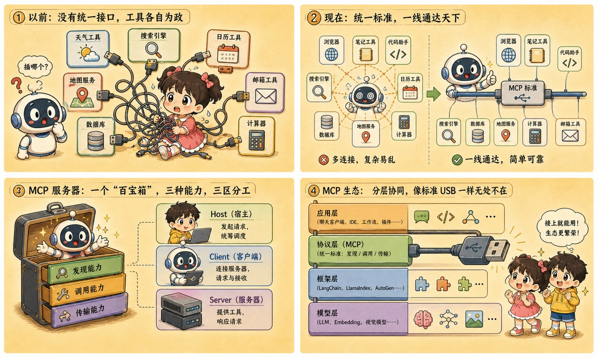
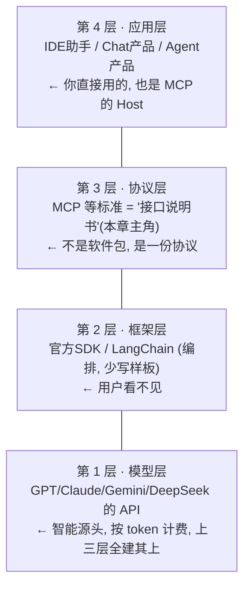

# 第 24 章 · MCP 生态：给 AI 工具箱装上标准的 USB 接口

> ### 🎯 先别往下翻 · 这一章要破的题
>
> **🔥 痛点**：第 19 章模型学会"开申请单"了，可**每家工具的接口都长得不一样**，应用方天天写胶水代码、还总接错。N 个应用要接 M 个工具，这事儿怎么收场？
> **🤔 换你来**：以前每台设备都配专属充电器和数据线，后来是怎么解决"线一大堆"的？
> **🧱 笨办法会撞墙**：没有标准时，**每个应用为每个工具单独写一套接入**:4 个应用×5 个工具=20 套；工具一升级所有应用跟着改，新应用入场所有工具重接一遍——**N×M 的蜘蛛网，生态根本长不大**。
> 答案就是给全世界的工具装一个统一插口。往下看那个 USB-C。👇

小满：「那有统一标准吗？」

元元从兜里摸出一个标准的 **USB-C 插座**，往桌上一墩：「正合这一章！当下最火的 **MCP**，就是来给全天下的工具——本地系统、浏览器、数据库——装一个**统一的 USB 接口**的。任何大模型，**一插即用**(★ω★)」

---

## 第 1 节　插口统一之前：每台设备自带一套线

「接着第 19 章往下说，」元元起头，「那一章结论是：模型只开'申请单'，真正执行工具的是宿主程序。但有个问题当时按下没表——**宿主和每个工具之间的对接代码，谁来写？**」

「查天气要对接天气 API、读文件要对接文件系统、连仓库要对接 GitHub……」元元说，「在没有标准的年代，**每个应用团队都得为每个工具单独写一套'胶水代码'**。数一数账就知道这条路走不远：」

> **没有标准 · 蜘蛛网**：
> 　**N 个应用 × M 个工具 = N×M 套胶水代码**
> 　4 个应用 × 5 个工具 = 20 套专线。工具一升级，所有应用跟着改；新应用入场，所有工具重接一遍——**谁都不堪重负，生态没法长大**。

> **有了统一插口 · 总线**：
> 　**各自只接一次 = N+M 次接入**
> 　工具方写一次 server、应用方接一次 client:4+5=9。**新工具上线只加 1，所有应用立刻可用**——增长从**乘法变加法**，生态才滚得起来。

「这就是 **MCP（Model Context Protocol，模型上下文协议）**要解决的，」元元说，「2024 年底由 Anthropic 开源，2025 年起 OpenAI、Google 等主流玩家相继跟进，如今已是行业事实标准之一。它做的事一句话——**在 AI 应用与外部世界之间，定义一个统一插口。**」

他举起那个 USB-C 插座：

> 🔌 **MCP 之于 AI 应用，就像 USB-C 之于电子设备。**
> 插口统一之前，每台设备配专属充电器和数据线；统一之后，**设备方和配件方各自适配一次 USB-C，互相即插即用**。MCP 同理：工具方按协议写一次 MCP server，所有支持 MCP 的应用都能直接用——**不需要认识彼此，只需要认识插口**。

---

## 第 2 节　数一数：蜘蛛网 vs 总线（连环画）

光说不练假把式。元元在桌上摆开：左边 **4 个 AI 应用**（聊天应用、IDE 助手、Agent 产品、办公插件），右边 **5 个工具**（文件系统、数据库、浏览器、GitHub、日历），演两种世界：

> 🎬 **第 1 幕 · 没有标准的世界（蜘蛛网）**
> 元元用红线把每个应用和它要用的每个工具**两两连起来**……桌面瞬间被**密密麻麻的红线**糊满。「'IDE 助手'要用 5 个工具，就得写 **5 套接入代码**；任何一个工具升级，这些代码都可能要跟着改！」

> 🎬 **第 2 幕 · 上线一个新工具（蜘蛛网版）**
> 元元放上第 6 个工具"搜索引擎":「**4 家应用每家都得再写一套接入**——蜘蛛网一下多了 4 条线！工具方更惨：一个工具要服务 4 个应用，就要被接入 4 次，每家一套，谁来维护？」

> 🎬 **第 3 幕 · 有了 MCP 的世界（总线）**
> 元元把那个 USB 插座往中间一放——这是 **MCP 总线**。每个应用只往总线接**1 条线**（实现一次 MCP client），每个工具也只往总线接**1 条线**（写一个 MCP server）。桌面一下清爽了：**4+5=9 条线**。

> 🎬 **第 4 幕 · 上线新工具（总线版）**
> 再放第 6 个工具：「工具方写 **1 个 MCP server** 挂上总线，**4 个应用立刻全部可用**——只多 1 条线！」

> 元元敲那个插座：「**MCP 总线本身不含任何模型**——它只是一份'怎么对话'的协议，**像 USB-C 插口不发电，却让所有设备互通**。」

---

## 第 3 节　拆开一个 MCP server：三种能力，三个角色

「统一插口里到底流过什么？」元元问，「MCP 规定 server 可以向应用提供**三类东西**——第一类你其实已经认识了：」

> 🔧 **能力一 · Tools（工具）**：可调用的动作——发消息、查数据库、跑代码。**就是第 19 章 function calling 那一套**，只是工具现在长在 server 里、按统一格式自我介绍。
> 📄 **能力二 · Resources（资源）**：可读取的数据——文档、表格、日志。应用把它拉进上下文（第 17 章的书桌）供模型阅读，**读数据不必再伪装成"调一次工具"**。
> 📝 **能力三 · Prompts（提示模板）**：预置的问法——工具方最懂"怎么问自家工具效果最好"（第 16 章的手艺），干脆把成熟问法打包成模板挂出来，**用户即选即用**。

再认**三个角色**（文档和新闻里高频出现，人话一句话就够）:

| 角色 | 人话：它是谁 | 例子 |
|---|---|---|
| **Host 宿主** | 你正在用的那个 AI 应用本体——决定接哪些 server、放行哪些操作（第 19 章"签字执行"的就是它） | Claude Desktop、IDE 助手 |
| **Client 客户端** | Host 体内的"连接器"，专职和某个 server 通话，一对一配对（用户感觉不到它） | 应用内置的 MCP 连接模块 |
| **Server 服务器** | 工具方写的"提供方"：把工具/数据/模板按协议包装好挂出来，本地或远程都行 | 文件系统 server、GitHub server |

---

## 第 4 节　生态全景：四层地图，找到你的位置

「把镜头拉远，」元元说，「MCP 只是 AI 工程生态里的**一层**。从模型到你手里的产品，中间隔着清晰的**四层分工**。从地基往上看：」

> 元元给小满定位：「两句话——**第 26~28 章动手时，你主要打交道的是模型层 API**（申请 key、发请求、读响应）；而想给手边的 AI 应用快速加能力（查 GitHub、连数据库、读本地文件），**用现成的 MCP server 是低代码捷径**：社区已有大量现成 server，装上即用，**一行胶水代码都不用写**。」

把你在产品里见过的现象，和这套总线连上线——很多"新功能"其实就是 MCP 在背后接线：

| 你在 AI 产品里看到的现象 | 背后的机制 |
|---|---|
| Claude/Cursor 设置里多了个"添加 MCP server"，装完它就会查 GitHub 了 | 应用是 **Host**，你装的是一个 **Server**，它即插即用挂上总线——能力是接进来的，不是模型新学的 |
| 同一个"连数据库"的 server，在好几个不同 AI 应用里都能用 | 工具方只写了**一次 server**，所有支持 MCP 的 Host 共享——这就是"N+M"省下来的红利 |
| 某 AI 助手昨天还不会读你的本地笔记，装个插件就会了 | 不是模型升级了，是给它**接了一条新线**（笔记 server）——拔掉线，能力立刻消失 |
| 新闻说"某模型现已支持 MCP" | 指它的应用实现了 **Client**、能接入 MCP 总线——和模型本身"变没变聪明"是两码事 |

---

## 第 5 节　这些坑，你八成也会踩

**坑一：「MCP 是 Anthropic 发布的一个新模型」**

> ❌ 名字里带 Model 二字，新闻又常把它和模型发布混在一起报道。
> ✅ 真相是——**MCP 是协议（接口标准），里面不含任何模型**：它规定"怎么对话"，不负责"谁来思考"。

病根：判断方法回到比喻——**USB-C 插口本身不发电、不存数据，只是让设备互通**;MCP 同理，换用任何支持它的模型或应用，**协议本身一个字都不用改**。它属于生态地图的**协议层**，而模型住在**模型层**。

**坑二：「接了 MCP，AI 就能随便动我的电脑」**

> ❌ 把"接口打通"误当"权限全开"。
> ✅ 真相是——**AI 能做什么，由 server 暴露什么、host 授权什么共同决定**——权限始终在用户手里。

病根：回忆第 19 章的安全边界——模型只开申请单，执行前有宿主把关，**MCP 没有改变这一点**。server 只暴露被允许的目录和动作，host 对危险操作仍要弹窗让你确认，两道闸缺一不可。**真正要警惕的是装来路不明的 server——就像别把捡来的 U 盘往电脑上插。**

---

## 第 6 节　收尾大招：把乘法变成加法

老规矩，秘籍 ＋ 大杀器。

### MCP 核心，一张表收干净

| 概念 | 一句话 |
|---|---|
| **MCP 是什么** | AI 应用与外部世界之间的统一插口（USB-C），是协议不是模型 |
| **解决什么** | N×M 套胶水代码 → N+M 次接入，乘法变加法 |
| **三种能力** | Tools（动作）/Resources（数据）/Prompts（问法模板） |
| **三个角色** | Host（应用本体）/Client（连接器）/Server（工具提供方） |

### 收尾大招：一句话看穿"AI 工具生态"

往后看到"某 AI 支持 MCP""接入 XX 的 MCP server"，你都知道它在说什么：

> 　🗣️ **「MCP 是 AI 世界的 USB-C——工具方写一次 server 挂上总线，所有支持 MCP 的应用即插即用，把 N×M 的蜘蛛网变成 N+M 的总线。它是协议、不是模型，本身不思考、不发电。」**
> - "MCP 是新模型？"→ 错，它是接口标准，换任何模型协议都不改。
> - "接了就能随便动我电脑？"→ 不，权限由 server 暴露什么 + host 授权什么决定，危险操作仍要你签字。
> - 想给 AI 加能力又不想写代码？→ 装一个现成 MCP server，即插即用（但**别装来路不明的**）。

### 把整章拧成一句话塞进脑子

> **MCP（模型上下文协议）= AI 世界的 USB-C 统一插口：工具方按协议写一次 MCP server，所有支持 MCP 的应用一插即用，把 N×M 的蜘蛛网胶水代码变成 N+M 的总线。**
> 它提供三种能力（Tools/Resources/Prompts）、三个角色（Host/Client/Server），住在生态四层地图的"协议层"——它是协议不是模型，本身不思考。
> 安全没变：权限由 server 暴露 + host 授权共同决定，危险操作仍要人签字，别装来路不明的 server。

---

小满把那个 USB 插座转来转去，忽然望向那张四层生态地图的**最顶层**:「插口统一了，工具随便接了……可地图最上面那么多模型——GPT、Claude、Gemini、Llama、DeepSeek……**我到底该选谁啊？**它们是不是越贵越好、越大越强？」

元元把地图一收，掏出一张**世界地图**铺开，上面画满了花花绿绿的格子：「问到全书通识课的**完美收官**了！这是一张 **2026 年的'神仙大格子'**——开源派和闭源派正在成本、隐私、商业上**神仙打架**。下一章，我教你怎么在这个江湖里**选对自己的兵器**(★ω★)」

---

## 🧰 装进你的工具箱

> **🔑 一句话方法**：**MCP** = AI 世界的 **USB-C 统一插口**——工具方按协议写一次 server，所有支持 MCP 的应用一插即用，把 **N×M 的蜘蛛网变成 N+M 的总线**（乘法变加法）；它是**协议、不是模型**，本身不思考、不发电。
> **🎯 触发器 · 以后遇到这种情况就掏出它**：看到"某 AI 支持 MCP""接入 XX 的 MCP server"，你知道是它给工具装了统一插头；但"MCP 是新模型"=错（换任何模型协议都不改）,"接了就能随便动我电脑"=错（权限由 server 暴露+host 授权决定，**别装来路不明的 server**）。
>
> **✍️ 合上书自测**：
> 1. 10 个应用×8 个工具，没标准要写多少套？走 MCP 呢？第 9 个工具上线两边各做什么？
> 2. 为什么说"MCP 里不含任何模型"?用 USB-C 比喻。
> 3. Host / Client / Server 分别是谁？

> 🪜 **下一章预告**：第 25 章 · 开源与闭源——神仙打架的 2026 全景大格局。

---

[← 上一章](../stage_5/chapter_23.md) ｜ [📖 目录](../README.md) ｜ [下一章 →](../stage_5/chapter_25.md)

> 在线阅读《看得见的 AI》· 全 30 章免费 —— 回到 [**项目首页**](../../README.md)，觉得有用点个 ⭐ Star 让更多人看到。
