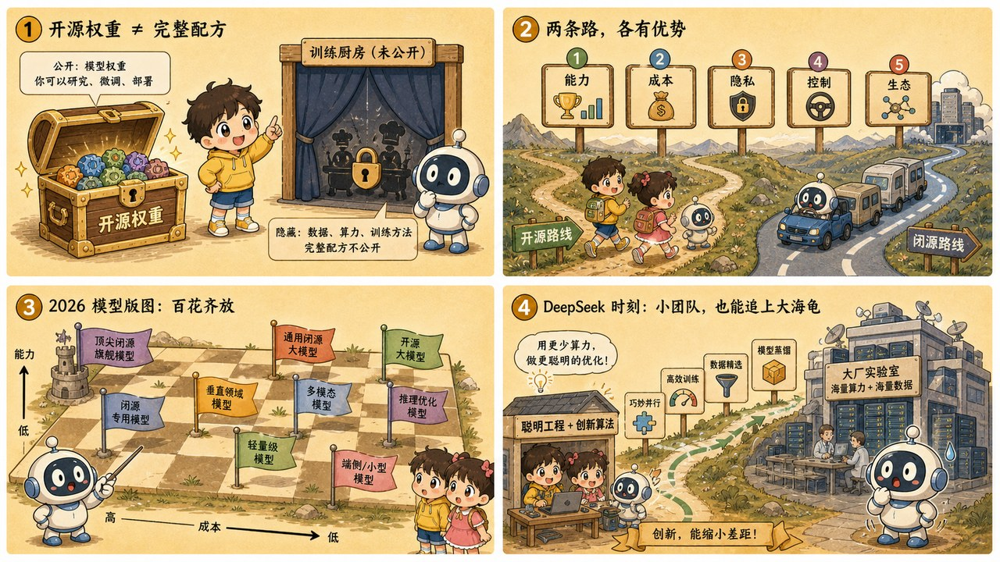

# 第 25 章 · 开源与闭源：神仙打架的 2026 全景大格局

> ### 🎯 先别往下翻 · 这一章要破的题
>
> **🔥 痛点**：GPT、Claude、Gemini、Llama、DeepSeek……这么多模型，真要给一个项目选，你到底**该选谁**?是不是越贵越好、越大越强？
> **🤔 换你来**：医院要做内部病历问答，和你给自己装个写作助手——会选同一个模型吗？
> **🧱 笨办法会撞墙**：只盯排行榜"选最强的那个"——可"最强"未必合规（数据不能出网）、未必划算（用量小时 API 反而更便宜）,**笔试状元未必会做你这台手术**。
> 选型该问的不是"哪个最强"，是"哪个最合适"。往下看那张神仙大格子。👇

元元把一张画满花花绿绿格子的**世界地图**铺开：「问到全书通识课的**完美收官**了！这是一张 **2026 年的'神仙大格子'**——开源派和闭源派正在成本、隐私、商业上**神仙打架**。今天，我教你怎么在这个江湖里**选对自己的兵器**(★ω★)」

---

## 第 1 节　正名：你听到的"开源模型"，多数是"开放权重"

「动手之前先正个名，」元元说，「这事儿九成的人搞错。**开源软件**（Linux、Python）的'开源'指**源代码全公开**——拿到的是菜谱，每行都能检查，理论上能从头复现。可新闻里的'**开源大模型**'，九成给你的只是**权重文件**——那几十亿个'旋钮'（第 3 章的权重）训练完成后的最终读数。」

> 🍽️ **开放权重 = 给你做好的菜，不给菜谱**
> 你能**下载、部署、微调**（能加热、能改刀），但它是一盘做好的菜：**训练数据（食材）、训练代码与配方（火候），统统不公开**。准确的叫法是**开放权重（open weights）**。

「为啥大家都藏菜谱？」元元说，「训练数据既是商业公司**最贵的底牌**，又埋着**版权地雷**——'开放权重'正是商业利益与开放精神之间的折中。」他摆出"开放程度三档阶梯":

| 档位 | 给你什么 | 比喻 | 代表 |
|---|---|---|---|
| **闭源 API** | 只租能力，模型住厂商服务器 | 点外卖：菜好吃，厨房不让进、菜也不让带走 | GPT、Claude、Gemini |
| **开放权重** | 模型文件本体，可本地部署、微调 | 买到做好的菜：能加热改刀，但菜谱不给 | Llama、Qwen、DeepSeek、Mistral |
| **全开源** | 权重+训练代码+训练数据全公开 | 连菜谱食材都给，可从零复现 | OLMo(Allen AI)——少数派，科研驱动 |

> 元元强调：「本章从此统一用语：**开放权重 vs 闭源 API**。业内说的'开源模型'，九成其实在中间那档。」

---

## 第 2 节　两条路线，五个维度

「**闭源 API 像点外卖**：随点随吃、按量付费，但厨房在别人家；**开放权重像自己开伙**：菜（模型）免费拿，但锅碗瓢盆（GPU）、水电（运维）全得自己置办，」元元摆出五维对照表：

| 维度 | 闭源 API | 开放权重 |
|---|---|---|
| **获取方式** | 注册账号、照文档发请求，几分钟跑通（第26章动手） | 下载权重，部署到自己的 GPU/服务器（第27章动手） |
| **数据隐私** | 数据必须**发到厂商服务器**（出网） | 可**完全本地运行，数据一步不出门** |
| **能力上限** | 前沿能力通常**率先**出现在闭源旗舰 | 紧追，且差距**快速缩小**（见下文 R1 时刻） |
| **成本结构** | 按 token 计费，用多少付多少（**OPEX**） | 权重免费，但 GPU、电费、运维是真金白银（**CAPEX**） |
| **可定制** | 受限：提示词 + 厂商开放的有限微调接口 | 自由：可微调、可裁剪、可"魔改"到任何形状 |

---

## 第 3 节　神仙大格子：谁在哪条线上（截至 2026）

「这是截至 2026 年的格局快照，」元元指着世界地图，「**这领域更新极快，名单与排位请以各家最新发布为准**——一句话记定位，不背跑分。先看**闭源三巨头**：模型不出门，能力当服务卖。」

> 🇺🇸 **OpenAI · GPT**：ChatGPT 的缔造者，把大模型带进大众视野；对话、多模态、推理产品线最全，至今是行业风向标。
> 🇺🇸 **Anthropic · Claude**：以 AI 安全研究立身，长文本、代码与 Agent 能力是口碑招牌，工程师群体粘性极高。
> 🇺🇸 **Google · Gemini**：原生多模态路线，背靠搜索、安卓与办公全家桶——论分发渠道无人能敌。

「再看**开放权重阵营**：模型文件给你，部署随你——**中国力量在这一边格外密集**。」

> 🇺🇸 **Meta · Llama**：把"开放权重"变成行业惯例的带头人，衍生生态最庞大（注意其许可证带商用条款，并非传统开源协议）。
> 🇨🇳 **阿里 · Qwen（通义千问）**：尺寸谱系最全、迭代最勤的开放权重系列之一，全球开发者社区采用量名列前茅。
> 🇨🇳 **DeepSeek（深度求索）**：以极致工程效率著称的"性价比之王"，R1 一夜改写了"开放权重永远慢半拍"的叙事（下节细说）。
> 🇪🇺 **Mistral**：欧洲独苗级代表，以"小而高效"起家，开放权重与商业 API 两条腿走路。
> 🇨🇳 **月之暗面 · Kimi / 智谱 · GLM**：前者以超长上下文出圈，后者清华系出身、最早一批做中英双语大模型——都在持续开放迭代。

> 元元点一句**重要趋势**：「阵营边界正在**变模糊**!闭源三家也各有开放权重支线：Google 有 Gemma，OpenAI 也放出了 gpt-oss。**两条路线是一道光谱，不是两座阵地**——同一家公司常常两头下注。」

---

## 第 4 节　DeepSeek-R1 时刻：差距可以被急剧压缩

「第 23 章讲过推理模型——让模型先打草稿再回答，」元元说，「**2025 年 1 月，这条故事线在开放权重阵营炸响**——DeepSeek-R1 以**开放权重 + 宽松许可**发布，推理能力**直逼当时最强的闭源推理模型**，而训练投入远低于外界对'前沿模型'的想象（具体数字有争议，'便宜得多'是共识）。」

「一周之内它冲上多国应用商店榜首，甚至引发**美股科技股震荡**，」元元说，「震动的原因不是它'最强'，而是它证明了一件事：**闭源领先的护城河，可能比所有人以为的浅得多。**」

> **R1 之前的默认假设**：开放权重永远落后闭源**一到两年**。于是选型逻辑很粗暴：要最强，就得交钱、交数据。
> **R1 之后的新共识**：差距可以被**急剧压缩**。两条路线的距离不再是"代差"，而是会被随时拉近的"身位"。

> 元元总结：「选型问题，从'**哪个最强**'，变成了'**哪个最合适**'——下一节给你四问。」

---

## 第 5 节　选型方向仪：四问拨一拨

「真实项目里**不需要背榜单**，只需要回答四个问题，」元元摆出一个"方向仪"，「点选项，看指针往哪边摆——**注意第一问是一票否决项**:」

> 🧭 **① 数据能出网吗？**
> 　能 → 偏闭源 API；**不能（太敏感）→ 一票否决，必须可本地部署的开放权重！**
> 🧭 **② 预算偏好哪种？**
> 　按量付费（OPEX）→ 偏闭源；一次性投入（CAPEX）→ 偏开放权重。
> 🧭 **③ 需要深度定制吗？**
> 　提示词就够 → 偏闭源；要微调魔改 → 偏开放权重。
> 🧭 **④ 团队有运维能力吗？**
> 　没人管 GPU → 偏闭源；有 GPU 团队 → 偏开放权重。

元元拉小满做了几道场景练手：

> 🎬 **医院内部病历问答** → **开放权重**：病历最敏感，"不能出网"一票否决，本地部署是唯一方向。
> 🎬 **个人写作助手** → **闭源 API**：没隐私硬约束、用量小，按 token 付费几乎零门槛；为写作文自购 GPU，连电费都不划算。
> 🎬 **创业公司两周做 MVP** → **闭源 API**：第一要务是验证需求，OPEX 起步最快、零运维；跑通了再评估迁移。
> 🎬 **车间离线工业质检** → **开放权重**：产线常物理断网，API 根本调不通，只能把模型搬进本地设备。

> 元元点睛：「看出来没？**第一问'数据出不出网'是一票否决**——它一旦触发，其余三问只决定'怎么落地'，不再决定'选哪边'。其余情况，多数信号指向哪边就偏哪边；打平了，工程界的常见做法是**先用闭源 API 最快跑通，少绑定厂商私有功能、留好切换余地**，后续随用量再迁移。」

---

## 第 6 节　这些坑，你八成也会踩

**坑一：「开源（开放权重）= 免费」**

> ❌ 把"下载免费"当成"使用免费"（手机 App 时代的思维惯性）。
> ✅ 真相是——**权重不要钱，但跑模型的 GPU、电费、运维人力都是钱**——用量大才划算。

病根：大模型是**吞电的重资产**。小用量时，按 token 付费的闭源 API 往往**反而更便宜**；开放权重省下的是按量付费，换来的是固定投入——**翻盘点在"量"**。

**坑二：「闭源一定更强，开放权重是'将就用'」**

> ❌ 只盯着排行榜头部。
> ✅ 真相是——**分场景**：前沿推理常由闭源旗舰领跑，但**大量日常任务开放权重早已绰绰有余**。

病根：翻译、摘要、客服、内部问答这类任务根本用不到"最强"，**够用、合规、便宜才是赢家**——R1 时刻更证明头部差距随时可能被压缩。**选型看的是"任务够不够用 + 约束满不满足"，不是榜单第一名。**

---

## 第 7 节　收尾大招：从"哪个最强"到"哪个最合适"

老规矩，秘籍 ＋ 大杀器。

### 开源闭源格局，一张表收干净

| 概念 | 一句话 |
|---|---|
| **正名** | "开源模型"九成是"开放权重"（给做好的菜，不给菜谱） |
| **两条路线** | 闭源API（点外卖，OPEX，零运维） vs 开放权重（自己开伙，CAPEX，可魔改） |
| **R1 时刻** | 开放权重直逼闭源，差距可被急剧压缩 |
| **选型四问** | 数据出网？预算OPEX/CAPEX?要微调？有运维？（第一问一票否决） |

### 收尾大招：选模型，别问"哪个最强"，问"哪个最合适"

往后给任何项目选模型，别被榜单带跑，走一遍**四问**:

> 　🗣️ **「① 数据能出网吗？（不能→一票否决，锁开放权重本地部署） ② 预算是按量付费还是一次性投入？ ③ 要不要深度微调？ ④ 团队有没有 GPU 运维？」**
> - "DeepSeek 权重免费下载=一分钱不花"?→ 错，**GPU、电费、运维都是钱**，小用量 API 往往更省。
> - "闭源一定更强，开放权重将就用"?→ 错，**日常任务开放权重早已够用**，够用合规便宜才是赢家。
> - 信号打平？→ 先用闭源 API 最快跑通，留好切换余地。

### 把整章拧成一句话塞进脑子

> **AI 江湖两条路线：闭源 API（点外卖——按量付费、零运维、数据出网、前沿领跑） vs 开放权重（自己开伙——权重免费但 GPU/运维自付、数据不出门、可深度魔改）；业内说的"开源"九成是"开放权重"，给菜不给菜谱。**
> DeepSeek-R1 时刻证明：开放权重能直逼闭源，差距可被急剧压缩——选型从"哪个最强"变成"哪个最合适"。
> 选型只需四问（数据出网？预算？定制？运维？），第一问"数据能不能出网"是一票否决——不背榜单，只答约束。

---

## 🎓 第五阶段 · 通关小结

小满把世界地图叠好，长舒一口气：「前沿这五章……我感觉自己终于能看懂今天 AI 新闻里的**每一个热词**了！」

元元笑着把五章串成一条"前沿全景":

> 2️⃣1️⃣ **扩散模型**——文生图不是画画，是从噪声里"擦"出一幅画。
> 2️⃣2️⃣ **多模态**——把图/音切成 token "焊"进序列，AI 把图片当外语读。
> 2️⃣3️⃣ **推理模型**——2026 主角：从"背书"转向"答题时打草稿疯狂纠错"。
> 2️⃣4️⃣ **MCP**——给全天下工具装统一 USB 插口，乘法变加法。
> 2️⃣5️⃣ **开源闭源**——神仙大格子，选型四问从"最强"到"最合适"。

「你发现没有，」元元意味深长，「这五章把**今天 AI 的最前沿**全扫了一遍——会画、会看、会想、能接万物、还知道江湖格局。**从第 1 章那个'三个套娃'的小白，到现在能给项目拍板选模型——你已经脱胎换骨了！**」

小满眼睛发亮：「可……我还没**亲手**做过任何东西啊！这些原理我都懂了，能不能真的**写代码搭一个出来**?」

「正是最后一阶段要干的事！」元元一拍桌子，「第六阶段——**实战篇 · 亲手构建 AI 应用**!调第一个 API、本地跑大模型、亲手搭一个 RAG 知识库、还有上线前必须懂的评估与安全。**学了 25 章的概念，终于要变成能跑起来的应用了——这是从学习者到构建者的最后一跃（★ω★）**」

---

## 🧰 装进你的工具箱

> **🔑 一句话方法**：两条路线——**闭源 API**（点外卖：按量付费、零运维、数据出网、前沿领跑）vs **开放权重**（自己开伙：权重免费但 GPU/运维自付、数据不出门、可深度魔改）；业内说的"开源"九成是"开放权重"（给菜不给菜谱）。**DeepSeek-R1 时刻**证明：差距可被急剧压缩，选型从"哪个最强"变成"哪个最合适"。
> **🎯 触发器 · 以后遇到这种情况就掏出它**：给任何项目选模型，走**四问**——①数据能出网吗（**不能=一票否决，锁开放权重本地部署**）②预算 OPEX 还是 CAPEX ③要不要深度微调 ④有没有 GPU 运维；别背榜单，只答约束。
>
> **✍️ 合上书自测**：
> 1. "DeepSeek 权重免费下载，所以换它一分钱不用花"——哪对哪错？
> 2. 律所做敏感合同问答、团队零运维经验，用四问走一遍给方向。
> 3. 前沿能力通常在____率先出现；大量日常任务____早已够用；所以选型问题变成了____。

> 🪜 **下一阶段预告**：第六阶段 · 实战篇——亲手构建 AI 应用（第 26–30 章）。

---

[← 上一章](../stage_5/chapter_24.md) ｜ [📖 目录](../README.md) ｜ [下一章 →](../stage_6/chapter_26.md)

> 在线阅读《看得见的 AI》· 全 30 章免费 —— 回到 [**项目首页**](../../README.md)，觉得有用点个 ⭐ Star 让更多人看到。
