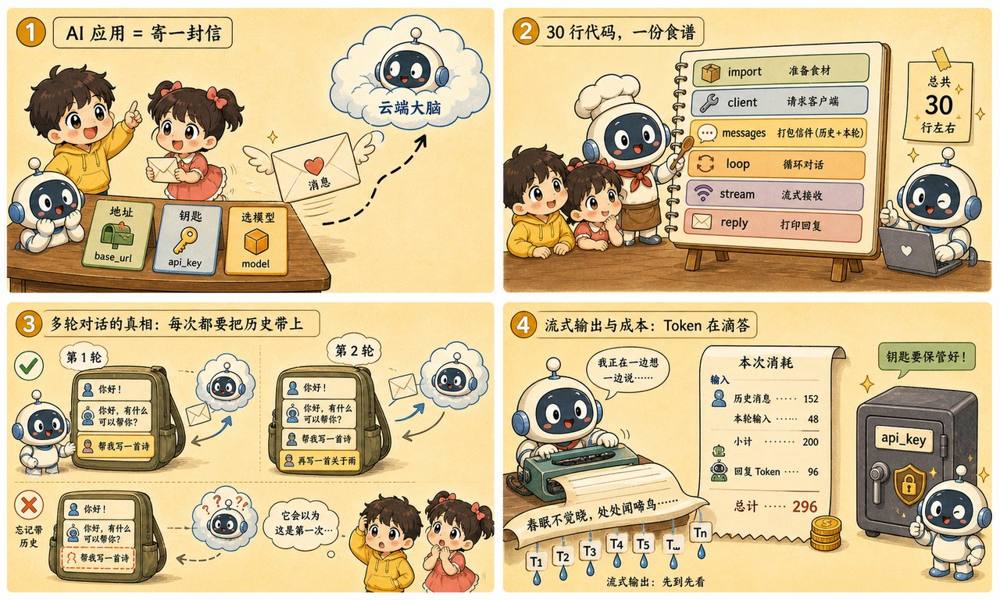
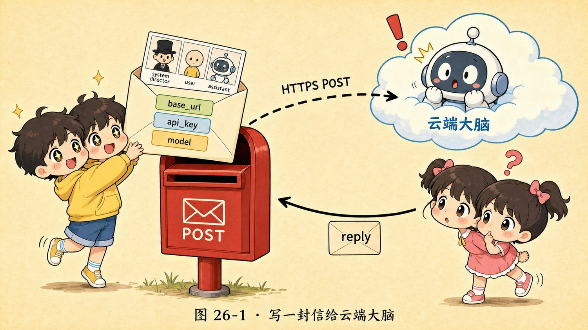

# 第 26 章 · 第一次调用 API：用几行代码叫醒云端大脑



> ### 🎯 先别往下翻 · 这一章要破的题
>
> **🔥 痛点**：前 25 章都在"看懂"，现在要真刀真枪了——**到底怎么把一段文字发给云端大模型、再把回答收回来？** 听起来好像要读论文、买显卡？
> **🤔 换你来**：你觉得"做一个 AI 应用"，最少需要几行代码？
> **🧱 笨办法会撞墙**：你以为"做 AI 应用 = 读论文、训练模型"——那是**造模型**的人（烧大厂的钱）的事，**轮不到你操心**。
> 用模型的人只需会一件事：寄一封信、收一封回信。往下看 30 行代码。👇


第五阶段，元元带小满把今天 AI 的最前沿全扫了一遍。第六阶段——**整本书的最终决战，实战篇**！前 25 章全是"看懂"，从这一章起，**真刀真枪写代码**。

小满搓着手，又有点怵：「我……我连代码都没写过，真能搭出 AI 应用？」

元元咔咔在终端里敲了几下，屏幕上蹦出一串 `sk-` 开头的字符，他眼睛发亮：「看！你人生第一个 **API Key** 生成了！别怕——**'用模型'和'造模型'是两码事**。造模型是大厂烧电的事；用模型，你只需会一件事：**把一段文字寄给云端，再把生成的文字收回来**。整件事，30 行 Python 写完。今天我教你**给云端那颗大脑写第一封信**(★ω★)」

---

## 第 1 节　所谓"做 AI 应用"，本质是寄一封信

「前 25 章你看着别人造模型——万亿 token 预训练、RLHF 对齐、烧掉的电够一座城用，」元元说，「**好消息是：那都是'造模型的人'的事。**」

> **想象中**：做 AI 应用 = 读论文、买显卡、训练模型。（那是第 12、13 章"造模型"的剧情）
> **实际上**：做 AI 应用 = **寄一封信，拿回一段回信**。（模型早训练好、部署好，按 token 出租，你只管"点菜"）

「剥掉所有 SDK 的糖衣，」元元揭真相，「一次 API 调用，本质就是一个 **HTTPS POST 请求**：把一段 JSON 寄到厂商服务器，几秒后收到一段 JSON 回信。」他把这封"信"拆成**写信三件套**:

| 代码里的零件 | 寄信比喻 | 干啥 |
|---|---|---|
| **client + base_url** | 收件人地址 | 这封信寄给哪家云端大脑（改这行就能连别家） |
| **api_key** | 你的寄信卡 | **同时是身份证 + 银行卡**：服务器靠它认出你、也靠它扣费 |
| **model** | 点哪道菜 | 用哪个型号（能力、价格差几十倍——第 25 章的版图派上用场了） |
| **messages** | 信件内容 | 你要说的话，一个列表（一场三人剧本，下节细说） |

> 元元提前立下**第一条纪律**：「那串 `sk-` 开头的 Key，**绝不能写死在代码里**!它是你的银行卡——代码可以发给任何人看，Key 不行。先把它藏进'环境变量':」

```bash
# 终端里执行(macOS / Linux):
pip install openai                    # 装官方 SDK，一行搞定
export API_KEY="sk-…你的密钥…"        # 把 key 存进环境变量(仅当前终端生效)
# Windows PowerShell: $env:API_KEY = "sk-…"
```

---

## 第 2 节　30 行代码逐段拆：信怎么写、怎么寄

「先把完整的信端上来——一个能在终端里持续对话的聊天机器人，」元元说，「看不懂没关系，逐段拆：」

```python
import os
from openai import OpenAI

client = OpenAI(
    api_key=os.environ["API_KEY"],     # ← 收件人 + 寄信卡:运行时再去环境里取 key
    # base_url="https://…/v1",         # ← 想连别家模型?通常改这行 + key 即可
)

messages = [                           # ← 信件内容:从"人物小传"(system)开始
    {"role": "system", "content": "你是一位耐心的中文 AI 助教，回答简洁。"}
]

while True:                            # ← 多轮对话 = 一个循环 + 一个 list
    user_input = input("\n你：")
    if user_input.strip() == "quit":
        break
    messages.append({"role": "user", "content": user_input})   # 你说的，存进信里

    stream = client.chat.completions.create(
        model="gpt-4o-mini",           # ← 点哪道菜:写模型名就行
        messages=messages,             # ← 注意:每轮都把"全部"历史寄过去
        stream=True,                   # ← 边写边送(流式)
    )
    reply = ""
    print("AI：", end="")
    for chunk in stream:               # ← 一小块一小块地收回信
        piece = chunk.choices[0].delta.content or ""
        print(piece, end="", flush=True)
        reply += piece
    messages.append({"role": "assistant", "content": reply})   # 它说的，也存进信里
```

「整封信的核心，就是那个 **messages 列表**——它是一场**三人剧本**，」元元讲透 role:

> 🎭 **system = 导演**：给模型的"人物小传"（身份、语气、规矩）。第 16 章的提示工程，主战场就在这一条。
> 🎭 **user = 用户**：你（或你的用户）每一轮说的话。
> 🎭 **assistant = 模型**：模型以前的回复。**注意：多轮对话时，是'你的代码'把它塞回列表里的。**



<p class="figcap">▲ 图26-1 · 写一封信给云端大脑</p>

---

## 第 3 节　多轮对话的真相：自己存 list，每轮全量重发

「第 17 章埋的伏笔在这里兑现，」元元神色一正，「**API 服务器完全无状态**——每个请求都是孤立的，处理完即忘，它连'上一轮'这个概念都没有！」

「那它怎么'记得'我们聊过啥？」小满问。

「**它根本不记得！**」元元指着代码，「想'接着聊'，唯一的办法是**你自己维护 messages 列表，每一轮把全部历史原封不动重发一遍**。两个直接推论：**一，越聊越贵**（历史越长，寄过去的 token 越多）;**二，把历史从 list 里删掉，它当场失忆**。」

他演了个"失忆实验"连环画：

> 🎬 **第 1 轮**：小满说"我叫小拓"。代码把这句 `append` 进 list。
> 🎬 **第 2 轮**：小满问"我叫什么？"——AI 答"你叫小拓"。「它'记得'，不是记性好，是**带名字的那条消息刚刚又被你的代码原封不动重发了一遍**。」
> 🎬 **第 3 轮（动剪刀✂️）**：元元在发送前加一行 `messages = [messages[0], messages[-1]]`（只留 system + 最新一句），再问"我叫什么？"——AI 答"**这段对话里没出现过你的名字……**」
> 　「**失忆实锤！**带名字的消息被你删了，而模型那头**从来就没存过任何东西**。所谓'记忆'，就是你代码里那个 list——第 17 章验证完毕。」

---

## 第 4 节　流式、三厘钱与三条保命规则

**流式输出**：第 10 章讲过，模型本来就**一个 token 一个 token**往外吐。`stream=False`=等它全吐完打包发你；`stream=True`=吐一点立刻推一点。**总耗时几乎一样，但'第一个字出现的时间'天差地别**——ChatGPT 的打字机效果不是装酷，是体验刚需。

**价格直觉**：账单只看两个数——**寄进去多少 token + 它新生成多少 token**。本章唯一的式子：

> **费用 = 输入 token × 输入单价 + 输出 token × 输出单价**

「拿数量级示例算一笔，」元元说，「设输入 ¥2/百万、输出 ¥8/百万，一次普通问答（输入 500 + 输出 300 token）≈ **¥0.003，三厘钱**!单次对话通常不到几分钱。」他话锋一转：「**但真正烧钱的是第 20 章的 Agent 循环**——一次任务自己跑几十轮、每轮还塞大段工具结果，消耗直接跳一到两个数量级。**写循环调 API 前，先在控制台设好用量上限！**」

> 🏆 **【黄金秘籍盒 · API Key 三条保命规则】**
> 每年都有新手把 Key 写进代码传上 GitHub，**几分钟内被扫 key 爬虫捡走，醒来收到天价账单**。别做下一个：
> - **规则一 · Key 不进代码仓库**：环境变量或密钥管理服务才是它的家。一旦 push 到公开仓库，就当它已泄露——爬虫比你同事先看到。
> - **规则二 · Key 不进前端页面**：网页/小程序的代码人人可看。正确姿势：前端只跟你自己的后端说话，由后端拿着 Key 代发请求。
> - **规则三 · 泄露立刻吊销重发**：控制台一键吊销旧 key、生成新 key，再检查账单——流程对标"银行卡密码泄露"。

---

## 第 5 节　这些坑，你八成也会踩

> 🏆 **【黄金秘籍盒 · 避坑指南】**
>
> **坑一：「调 API 就等于把我的数据送去训练模型了」**
> ❌ 把"免费聊天产品"和"API"混为一谈。
> ✅ 真相：**主流厂商的 API 数据默认不用于训练**——但各家政策不同，务必读数据条款。
> 　病根：面向消费者的免费产品有的会用对话改进模型（通常可关闭）；而 API 走商用条款，主流厂商默认不拿请求数据训练。涉及公司机密时别靠印象，**打开数据政策逐条核对**。
>
> **坑二：「代码在我电脑上跑，所以模型也在我电脑上跑」**
> ❌ 回复打印在自己终端里，造成"计算就在本地"的错觉。
> ✅ 真相：**推理发生在云端 GPU 集群**，你的 30 行代码只是寄了一封信。
> 　病根：你的代码是"点菜"，做菜的是厂商机房里成排的 GPU——**这也是断网就用不了、每次调用都花钱的原因**。想让模型真在自己电脑上跑？正是下一章的主题。

---

## 第 6 节　收尾大招

> 🏆 **【黄金秘籍盒 · 收尾大招：一句话戳破"做AI应用很难"】**
>
> 往后谁说"做 AI 应用得读论文、买显卡、训模型"，你就笑眯眯纠正：
> 　🗣️ **「用模型 ≠ 造模型。做 AI 应用，本质就是寄一封信（HTTPS POST）：写信卡（key）+收件人（base_url）+点菜（model）+信件内容（messages）,30 行 Python 收工。」**
> - "AI 记得我们聊过啥？"→ 不，服务器无状态，**记忆只是你代码里那个 list**，每轮全量重发（所以越聊越贵、删了就失忆）。
> - Key 泄露=银行卡泄露：**不进仓库、不进前端、泄露立刻吊销**。
> - 写 Agent 循环前**先设用量上限**——单聊三厘钱，几十轮循环×用户数就是另一回事。

### 本章总结表

| 零件 | 寄信比喻 | 一句话 |
|---|---|---|
| **client/base_url** | 收件人地址 | 寄给哪家云端大脑 |
| **api_key** | 寄信卡 | 身份证+银行卡，绝不进代码 |
| **model** | 点哪道菜 | 型号决定能力与价格 |
| **messages** | 信件内容 | system/user/assistant 三人剧本，自己维护 |
| **stream** | 边写边送 | 总耗时不变，但首字快 |

> **把整章拧成一句话**：调 API = 给云端大脑寄一封信——身份靠 key、寄给谁靠 base_url、点哪道菜靠 model、说什么靠 messages 列表；服务器无状态，"多轮记忆"只是你代码里全量重发的那个 list，所以越聊越贵、删了就失忆。Key 是银行卡，务必藏进环境变量。

---

小满成功跑通第一个程序，兴奋得直拍手，但很快又皱眉：「不过……这聊天机器人有两根'**脐带**'啊——一根**网线**（断网就废），一根**账单**（每句话都计费）。要是我想处理点隐私文档，或者想可劲儿白嫖……能不能把这俩脐带**剪了**?」

元元一拍大腿：「问到下一章了！当然能剪——把整个模型**搬进你自己的电脑**!不要 API key、不要网络、不要钱。走，下一章我带你敲一行 `ollama run`，在自己电脑里安个**离线小助手**(★ω★)」


---

## 🧰 装进你的工具箱

> **🔑 一句话方法**：调 API = 给云端大脑**寄一封信**(HTTPS POST)——身份靠 key、寄给谁靠 base_url、点哪道菜靠 model、说什么靠 **messages 列表**；服务器**无状态**,"多轮记忆"只是你代码里**全量重发**的那个 list（所以越聊越贵、删了就失忆）。
> **🎯 触发器 · 以后遇到这种情况就掏出它**：动手写任何 AI 应用，记死三条保命规则——**key 不进代码仓库、不进前端、泄露立刻吊销**（它是你的银行卡）；写 Agent 循环前**先在控制台设用量上限**。
>
> **✍️ 合上书自测**：
> 1. 把 system 改成"毒舌影评人"，会变什么、不变什么？
> 2. "AI 记得我们聊过的"——用一行代码就能戳破这个幻觉，怎么戳？
> 3. 代码在我电脑上跑，所以模型也在我电脑上跑吗？

> 🪜 **下一章预告**：第 27 章 · 本地跑 Ollama——在自己电脑里安个离线小助手。


---

[← 上一章](../stage_5/chapter_25.md) ｜ [📖 目录](../README.md) ｜ [下一章 →](../stage_6/chapter_27.md)


> 在线阅读《看得见的 AI》· 全 30 章免费 —— 回到 [**项目首页**](../../README.md)，觉得有用点个 ⭐ Star 让更多人看到。
