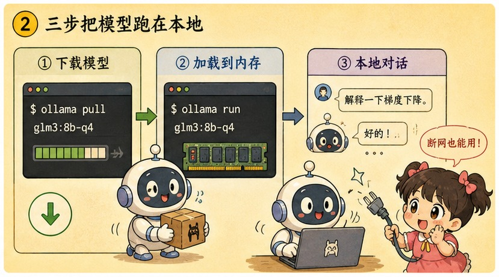
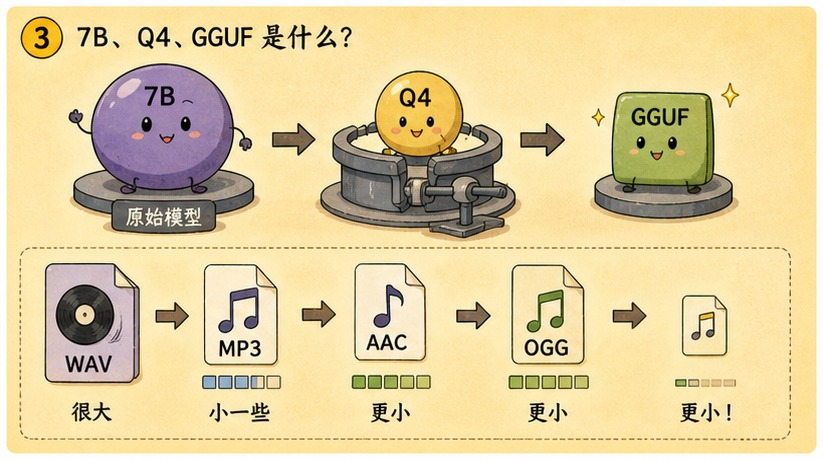
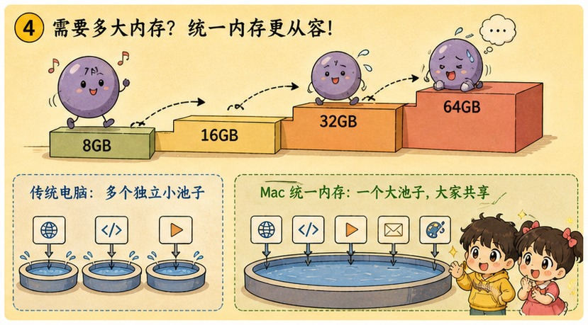

# 第 27 章 · 本地跑 Ollama：在自己电脑里安个离线小助手

> ### 🎯 先别往下翻 · 这一章要破的题
>
> **🔥 痛点**：上一章那个聊天机器人有两根"脐带"——**网线**（断网就废）和**账单**（每句话都计费）。想处理隐私文档、或可劲儿白嫖，能把这俩脐带剪了吗？
> **🤔 换你来**：动辄几百亿参数的庞然大物，怎么塞进你这台内存有限的电脑？
> **🧱 笨办法会撞墙**：你可能以为"得有块顶级 NVIDIA 显卡才行"——其实**推理只要装得进内存就能算**，把"训练"和"推理"混为一谈是常见误区。
> 一行 `ollama run` 就能把模型请回家。往下看。👇


元元把笔记本电脑往她面前一推：「这就剪给你看！把整个模型**搬进你自己的电脑**——推理全程发生在你的内存里，断网照样跑，一个字节都不上传，电费就是全部成本。今天我带你敲一行 `ollama run`，**三步开聊**(★ω★)」

---

## 第 1 节　把大模型"请回家"的三个理由


<p class="figcap">▲ 图27-1 · 把大模型"请回家"的三个理由</p>

「上一章的脐带，值得这么折腾去剪吗？」元元自问自答，「三个硬理由：」

> 🔒 **理由一 · 隐私**：病历、合同、日记、公司代码——**推理全程在你的内存里，断网照样跑，一个字节都不上传**。这是任何云端条款都给不了的硬保证。
> 💰 **理由二 · 成本**：第 26 章算过，全量重发让重度使用越聊越贵、Agent 一跑账单起飞。**本地模型下载一次随便造，电费就是全部成本。**
> 🎮 **理由三 · 乐趣**：换模型、改人设、拆开做实验——没有限速、没有审核、没有"服务调整公告"。第 25 章的开源版图，从这里开始变成你的玩具。

「这扇门是被**开源权重模型**（第 25 章）推开的，」元元说，「Llama、Qwen、DeepSeek 们把训练好的参数公开放出来，谁都能下载。于是只剩一个问题——**动辄几百亿参数的庞然大物，怎么塞进你这台内存有限的电脑？**这正是本章的主线。」

---

## 第 2 节　三行命令，模型进家门



<p class="figcap">▲ 图27-2 · 三行命令，模型进家门</p>

「先尝甜头再讲原理，」元元说，「**Ollama** 是目前最省心的本地模型管家：下载、运行、管理一条龙。」他在终端敲起来：

```bash
# ① 安装:打开 ollama.com 下载安装包，一路下一步(Mac/Windows/Linux 都有)

# ② 拉起一个模型 —— 一条命令，下载和运行全包了
ollama run qwen3:8b

# ③ 没有第三步，已经可以聊了:
>>> 帮我把这段话翻译成英文:今天天气不错
Sure! "The weather is nice today."
```

> 🎬 **本地吞内存连环画**：小满敲下回车那一刻——
> 　🎬 **下载**：进度条哗哗跑，几个 GB 的模型文件落进硬盘（首次运行才下，之后秒开）。
> 　🎬 **加载**：小模型"咕咚"一下被**整个吞进内存**——任务管理器里内存占用瞬间涨了好几个 GB。
> 　🎬 **吐字**:`>>>` 提示符亮起，小满打一句话，本地小助手**唰唰**回字。小满拔掉网线再问一句——**居然还能答！**「它真在我电脑里跑！」

「接着是本章最爽的一刻，」元元眼睛发亮，「**Ollama 装好后，会在你电脑的 11434 端口常驻一个服务，对外说的正是'OpenAI 兼容 API'这门普通话**！也就是说，第 26 章那 30 行 chat.py，**改两行就从云端切到了本地**:」

```python
client = OpenAI(
    base_url="http://localhost:11434/v1",  # ← 原来指向云端，现在指向你自己的电脑!
    api_key="ollama",                       # ← 本地不计费不验身份，填个非空字符串即可
)
# 再把 model 改成 "qwen3:8b",流式输出、messages 列表……一切照常工作
```

> 元元总结：「这就是'OpenAI 兼容'五个字的全部含义——**应用代码一行不改，模型随便换**!开发调试用本地免费试错，上线再换回云端旗舰；下一章搭 RAG，这个开关还会再扳一次。」

---

## 第 3 节　黑话解码：7B、Q4、GGUF 到底啥意思



<p class="figcap">▲ 图27-3 · 黑话解码：7B、Q4、GGUF 到底啥意思</p>

「打开 Ollama 模型库，一排让人头大的名字：`qwen3:8b`、`llama3.3:70b-q4_K_M`……别慌，」元元说，「黑话总共就四个：」

| 黑话 | 一句话人话 | 多说一句 |
|---|---|---|
| **7B / 70B** | 参数量：70亿/700亿个可调"旋钮" | B=Billion。第 15 章规模法则：参数越多通常越聪明，**也越吃内存**。挑模型先看这个数 |
| **Q4 / Q8** | 量化：每个参数从 16 位压到 4/8 位 | **相当于把无损音乐压成 mp3**:Q4 体积只剩 1/4，精度只损一点点 |
| **GGUF** | 本地推理通用的模型文件格式 | 你下载的那个几 GB 的文件就是它——模型界的"通用集装箱" |
| **上下文 32K** | 能记多长的对话——这也吃内存 | 聊越长，KV cache（第 17 章）越大；内存吃紧时调小上下文是隐藏的省内存开关 |

「四个里头**量化**最值得亲眼看一遍，」元元掏出"量化显微镜"演：

> 🔬 **量化显微镜连环画**：
> 　🎧 **FP16 原版**：每参数 16 位（2 字节），7B 本体≈14 GB——**录音棚无损 WAV**，一点不丢，体积最大，多数笔记本直接装不下。
> 　🎧 **压成 Q8**：每参数 8 位（1 字节），7B≈7 GB——**高码率 mp3**，体积减半，耳朵基本听不出。
> 　🎧 **压成 Q4**：每参数 4 位（0.5 字节），7B≈3.5 GB——**普通 mp3**，体积只剩 1/4，日常对话照样香。**这就是 Q4 成为本地玩家默认档的原因。**

> 元元解释敢砍的底气：「模型的'知识'**分摊在几十亿个参数的整体分布里**，单个参数粗一点，大局几乎不受影响——和 mp3 砍掉人耳不敏感的细节是同一种聪明。」

---

## 第 4 节　口算"我的电脑能跑多大模型"



<p class="figcap">▲ 图27-4 · 口算"我的电脑能跑多大模型"</p>

「本地跑模型第一道门槛不是显卡多强，而是**模型能不能整个装进内存**，」元元说，「好消息：看名字就能口算。本章唯一的式子——」

> **所需内存（GB） ≈ 参数量（B） × 每参数字节数 × 1.2**

「三个数：**参数量**就是名字里的 7、14、70;**每参数字节数**由量化档定（FP16=2、Q8=1、Q4=0.5）;**×1.2** 是给运行时开销留两成余量。例：7B 的 Q4 版 ≈ 7×0.5×1.2 ≈ **4.2 GB**——8GB 内存的电脑就能跑！」

接着元元揭一个**反常识**，正好接上之前的伏笔：

> 💡 **跑本地模型，Mac 反而是甜点机器！**
> 台式机的独立显卡，**显存和内存是两块分开的**（显卡标 12GB 显存，那就是上限）；而 Mac 的 **Unified Memory（统一内存）显存内存一体**，买 64GB 就能拿出一大半喂给模型。
> **更关键的是带宽**:Apple M 系列芯片的统一内存带宽极高，CPU/GPU 直接共享同一块高速内存、不用来回搬数据——所以**一个 8B 模型在 Mac 上跑得飞快**，吐字流畅得像在线服务。这正是"为什么 Mac 玩家能点亮 64GB 那一档"的底层原因。


<p class="figcap">▲ 图27-1 · 内存标尺上的小球</p>

---

## 第 5 节　诚实预期：跑得起 ≠ 跑得好

「第 25 章说开源在追赶，但请认清，」元元正色，「你电脑里跑的 **7B 量化版**，既不是开源最强（最强那档你也装不下），更不是云端前沿——中间隔着明显代差。**它像一台家用打印机：印作业、印合同利索得很，别指望印出版级画册。**」

> 🏠 **交给本地**：量大、简单、**敏感**的活——批量打标签、抽取信息、改写润色、总结隐私文档（不限量、不要钱、数据不出门），外加最重要的一项：**随便折腾着学**。
> ☁️ **留给云端**：复杂、烧脑、**要质量**的活——多步推理、长程 Agent、高质量长文。本地 7B 硬刚，只会刷新你对"幻觉"的认识。

「幸运的是你已掌握两全的姿势，」元元说，「同一份代码 **base_url 一换就在本地和云端之间切换**。敏感数据走本地，硬骨头丢云端——**这才是工程师的答案，而不是站队。**」

---

## 第 6 节　这些坑，你八成也会踩

> 🏆 **【黄金秘籍盒 · 避坑指南】**
>
> **坑一：「装上 Ollama，等于白嫖了一个 ChatGPT」**
> ❌ 都叫"大模型"，名字相似掩盖了规模差距。
> ✅ 真相：**本地小模型和云端前沿模型有明显代差**——它是"够用的助手"，不是免费的 Claude/GPT。
> 　病根：你跑的是 7B 量化版，云端旗舰参数量大它**一到两个数量级**，身后还站着整个机房。翻译总结感觉不出差距，一到复杂推理就原形毕露。预期摆正了，它反而处处是惊喜。
>
> **坑二：「没有 NVIDIA 显卡，本地大模型与我无缘」**
> ❌ 把"训练"和"推理"混为一谈。
> ✅ 真相：**Mac 统一内存是公认甜点，纯 CPU 也能跑**——区别只是每秒吐字的速度。
> 　病根：训练确实离不开机房级显卡（第 12 章），但**推理只要模型装得进内存就能算**。llama.cpp 生态把 CPU 推理优化到了可用程度；Mac 统一内存更让"显存不够"这个老大难直接消失。

---

## 第 7 节　收尾大招

> 🏆 **【黄金秘籍盒 · 收尾大招：看名字就知道跑不跑得动】**
>
> 往后看到任何本地模型名字，你不用下载就能下结论：
> 　🗣️ **「所需内存 ≈ 参数量（名字里的数字） × 每参数字节数（FP16=2/Q8=1/Q4=0.5） × 1.2。算出来比你的内存小，就能跑。」**
> - 16GB 想跑 32B-Q4? 32×0.5×1.2≈19.2GB，**超了**——退到 14B-Q4(≈8.4GB)。
> - Q4 还是 Q8? 默认 **Q4**：省下的内存能换更长上下文、甚至换大一号模型（**参数量优先于精度**，是本地圈常见经验）。
> - 没独显也别灰心：**Mac 统一内存高带宽是甜点机器**，纯 CPU 也跑得起，只是慢点。
> - 验证"数据不出门"最硬核的一招：**拔掉网线再聊一句**——还能答，就证明推理真发生在你电脑里。

### 本章总结表

| 黑话 | 人话 | 选型提示 |
|---|---|---|
| **7B/70B** | 参数量 | 先看它，越大越聪明也越吃内存 |
| **Q4/Q8** | 量化（压mp3） | 默认 Q4，体积省 3/4、精度损一点点 |
| **GGUF** | 模型文件格式 | 下载的那个几 GB 文件 |
| **统一内存** | Mac 甜点 | 显存内存一体+高带宽，8B 跑得飞快 |

> **把整章拧成一句话**：本地跑模型 = `ollama run` 一行命令把开源权重模型搬进自己电脑（剪掉网线和账单两根脐带）；看名字口算内存（参数×字节×1.2）、量化像压mp3（Q4 默认）、Mac 统一内存高带宽是甜点机器。它跑得起≠跑得好（7B 是够用助手不是免费 GPT），敏感/量大的活走本地、硬骨头丢云端——base_url 一换即可切。

---

小满拔着网线玩得不亦乐乎，忽然想起个正经事：「等等！第 18 章你给我演过 RAG 的原理图——切块、向量化、检索……现在我会调 API 了、也能本地跑模型了，**能不能真的写代码，亲手搭一个会查我自己文档的知识库**?」

元元把袖子一撸，露出"终于等到这一刻"的表情：「正合下一章！这是**全书最硬核的代码动手章**——咱们手写几十行清爽的 Python，完整走一遍切块、算距离、回填 prompt 的闭环。我还会**故意把块切碎、让 AI 当场翻车**，再带你修好！走（★ω★）」


---

## 🧰 装进你的工具箱

> **🔑 一句话方法**：本地跑模型 = `ollama run` 一行命令把**开放权重模型**搬进自己电脑（剪掉网线和账单）；看名字就能口算内存——**参数量×每参数字节数×1.2**；量化像把无损音乐压成 mp3（Q4 默认）,**Mac 统一内存高带宽是甜点机器**。
> **🎯 触发器 · 以后遇到这种情况就掏出它**：看到任何本地模型名字，不用下载就能判断跑不跑得动（16GB 跑 32B-Q4?19.2GB，超了→退 14B）;**敏感/量大的活走本地、硬骨头丢云端**——同一份代码 base_url 一换就切。验证"数据不出门"最硬的一招：**拔网线再聊一句**。
>
> **✍️ 合上书自测**：
> 1. 16GB 内存想跑 32B 的 Q4 版，口算可行吗？不行退到哪一档？
> 2. 同一个模型 Q4 和 Q8 都装得下，该选哪个？
> 3. 没有 NVIDIA 显卡，本地大模型就与我无缘吗？

> 🪜 **下一章预告**：第 28 章 · 实战 RAG——手写一个外挂知识库管线。

---
[← 上一章](../stage_6/chapter_26.md) ｜ [📖 目录](../README.md) ｜ [下一章 →](../stage_6/chapter_28.md)

> 在线阅读《看得见的 AI》· 全 30 章免费 —— 回到 [**项目首页**](../../README.md)，觉得有用点个 ⭐ Star 让更多人看到。
