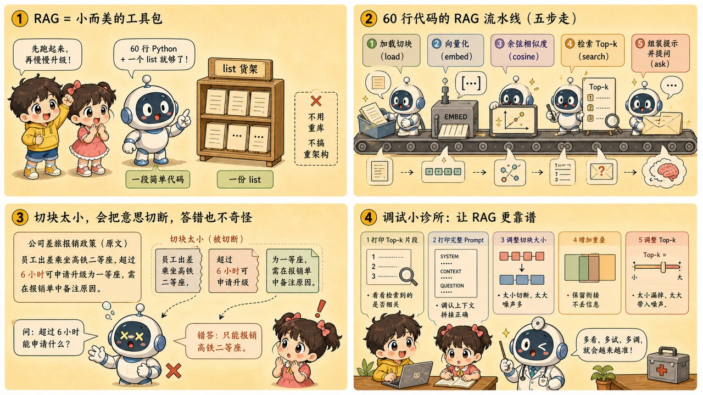
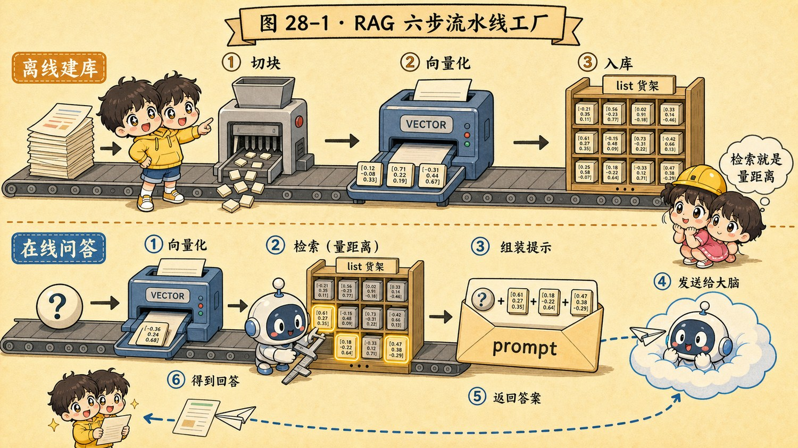

# 第 28 章 · 实战 RAG：手写一个外挂知识库管线



> ### 🎯 先别往下翻 · 这一章要破的题
>
> **🔥 痛点**：第 18 章看懂了 RAG 的原理图。现在——**能不能真的写代码，亲手搭一个会查你自己文档的知识库？**
> **🤔 换你来**：你觉得做一个能用的 RAG，需要先学一套重型框架、部署一个向量数据库吗？
> **🧱 笨办法会撞墙**：第一天就上重型框架和向量库——你只学会了"**调包**"，没学会 RAG；而且框架官方 demo 五分钟跑通，会骗你"RAG 很简单"，真实文档一上来就翻车。
> 先用 60 行裸 Python 把原理摸透。这章我还会**故意把块切碎、让 AI 当场翻车**再修好。往下看。👇


元元把袖子一撸，露出"终于等到这一刻"的表情：「这是**全书最硬核的代码动手章**！第 18 章你看懂了 RAG 的原理图，今天咱们把它一步步**变成能跑的代码**——而且我会**故意把块切碎、让 AI 当场翻车**，再带你排雷修好。准备好，上代码（★ω★）」

---

## 第 1 节　先纠正一个想象：RAG = 60 行 + 一个 list

「动手前先破个迷信，」元元说：

> **想象中**：做 RAG = 学一套重型框架 + 部署向量数据库。
> **实际上**：做 RAG = **约 60 行 Python + 一个 list**。

「框架和向量库当然有用，」元元强调，「但**第一天就上它们，你只学会了'调包'，没学会 RAG**。今天的目标：**60 行、零框架、不用任何向量数据库**——向量存 list、检索靠排序、生成靠第 26 章那次 API 调用。麻雀虽小，五脏俱全。」

他把第 18 章那张六步图挂回墙上：**离线建库**（切块→向量化→存 list）整库只跑一次；**在线问答**（问题变向量→取 top-k→拼 prompt→生成）每次提问跑一遍。

---

## 第 2 节　代码五段：从文档到答案

「五段代码自上而下拼进一个文件，就是完整的 `rag.py`——比这页讲解还短，」元元逐段上：

**① 读入文档，切成块**

```python
def load_chunks(path, chunk_size=300, overlap=50):
    text = open(path, encoding="utf-8").read()       # 整篇读进来
    chunks, start = [], 0
    while start < len(text):
        chunks.append(text[start:start + chunk_size]) # 切下一块
        start += chunk_size - overlap                 # 前进时留 50 字重叠
    return chunks

chunks = load_chunks("docs.txt")
```
「**块（chunk）是检索的最小单位**。`overlap=50` 让相邻两块共享 50 字——没有它，一句关键的话恰好被切口拦腰斩断，两边各拿半句，检索时谁也对不上。」

**② 循环调 embedding，向量存进 list**

```python
def embed(text):
    resp = client.embeddings.create(
        model="text-embedding-3-small",   # 中文场景请换中文效果好的模型
        input=text)
    return resp.data[0].embedding         # 一串一千多个数字 —— 第 8 章的"坐标"

vectors = [embed(c) for c in chunks]      # 所谓"向量库",今天就是这个 list
```
「embedding 是和对话 API 并列的另一种接口：发进一段文字，返回一串坐标——**意思相近的文字坐标就相近**（第 8 章的全部家底）。两个工程提示：整库向量化要花几分钟，**算完用 json 存盘，别每次启动都重算**。」

**③ 余弦相似度：四行纯 Python**

```python
import math
def cos_sim(a, b):                              # 夹角越小，值越接近 1
    dot = sum(x * y for x, y in zip(a, b))      # 点积:方向越一致越大
    na  = math.sqrt(sum(x * x for x in a))
    nb  = math.sqrt(sum(x * x for x in b))
    return dot / (na * nb)                       # 除掉长度 —— 只比方向，不比长短
```
「第 8 章口诀落地：**语义即坐标，夹角越小越相似**。向量数据库里那些花哨索引，最终算的也是同一个数。**四行代码，整条管线的数学就到顶了。**」

**④ 检索：问题变向量，排序取 top-k**

```python
def search(question, k=3):
    q_vec = embed(question)                     # 问题也变坐标:必须用同一个 embedding 模型!
    scored = [(cos_sim(q_vec, v), c)            # 给库里每一块打相似度分
              for v, c in zip(vectors, chunks)]
    scored.sort(key=lambda t: t[0], reverse=True)
    return [c for _, c in scored[:k]]           # 取前 k 块 —— 这就是"检索"
```

**⑤ 拼 prompt，调对话 API**

```python
def ask(question):
    pieces = search(question)
    context = "\n---\n".join(pieces)
    prompt = ("仅根据下面提供的资料回答问题;"     # 划边界:第 16 章的技法
              "资料里没有的信息，直接回答「我不知道」。\n\n"
              f"【资料】\n{context}\n\n【问题】{question}")
    resp = client.chat.completions.create(      # 第 26 章的调用代码原样照搬
        model="gpt-4o-mini",
        messages=[{"role": "user", "content": prompt}])
    return resp.choices[0].message.content
```
「灵魂是开头那两句指令——**'仅根据资料回答'划定边界、'没有就说不知道'堵死编造**（第 18 章误区②的解药，必须白纸黑字写进字符串）。**模型并不知道向量库的存在，它只是做了一场'带资料的阅读理解'**——但对提问的人来说，它突然'懂'了你的私人文档。」



<p class="figcap">▲ 图28-1 · RAG 六步流水线工厂</p>

---

## 第 3 节　翻车现场：我故意把块切碎了

「现在见证'踩坑'，」元元坏笑，故意把 `chunk_size` 从 300 改成 **40**，重新建库，然后问了个文档里明明有答案的问题：

> 🎬 **翻车连环画**：
> 　🎬 **原文**:"年假 10 天（注：仅适用于工作满 5 年的员工）"。
> 　🎬 **切碎后**:`chunk_size=40` 把这句从括号前**一刀斩断**——前半块只剩"年假 10 天"，限定条件"满 5 年"被甩进了另一块。
> 　🎬 **小满提问**:"我刚入职，有几天年假？"
> 　🎬 **AI 自信作答**:"**您有 10 天年假。**" ——大错特错！
> 　🎬 小满傻眼："它怎么把'满 5 年才有'这个关键条件吃了？!"

「**别猜，打印出来看！**」元元敲下 RAG debug 的第一原则。他 `print` 出检索到的 top-3 片段——果然，命中的那块**只有"年假 10 天"，限定条件压根不在里面**。

「病灶明晃晃躺在打印出来的字符串里，」元元说，「**块切坏了，后面神仙难救**——模型拿到的'资料'本身就是残缺的。」

**怎么修？** 元元把 `chunk_size` 调回 **300**、`overlap` 设 **50**，重新建库：

> 🎬 **修好连环画**：
> 　🎬 现在"年假 10 天（注：仅适用于工作满 5 年的员工）"**完整待在同一块里**。
> 　🎬 小满再问"我刚入职有几天年假？"——AI 答："**资料显示 10 天年假仅适用于工作满 5 年的员工；您刚入职，资料中未提供对应天数。**" ✓
> 　「**修好了！**它不仅没乱编，还诚实划了边界——'仅根据资料回答 + 没有就说不知道'那两句指令在兜底。」

---

## 第 4 节　调参直觉：每个旋钮都有代价

「代码里有三个不起眼的数字：`chunk_size=300`、`overlap=50`、`k=3`，」元元说，「它们不是真理，是**跷跷板的支点**——拧向任何一头都要付代价：」

| 旋钮 | 拧太小 | 拧太大 |
|---|---|---|
| **chunk_size** | 每块半句话，命中了词丢了上下文（刚才的翻车） | 一块混多话题，相似度被稀释、容易拿错块，还挤占窗口（第17章） |
| **top-k** | 答案散在多处时关键证据捞不全 | 窗口挤满半相关的块，噪声淹没正确答案 |

> 元元给一句最重的话：「这些参数**没有万能值，最优解长在你自己的文档上**——改一个参数、跑十个真实问题、看答案变好还是变坏，**这个土办法胜过一切教程**。」

---

## 第 5 节　翻车诊室：三种症状，先打印再 debug

> 🏆 **【黄金秘籍盒 · RAG 翻车诊室】**
> RAG 是一条管线，**debug 第一原则：先定位坏在哪一段，再动手修**；最强的工具不是观测平台，是 `print()`。
>
> | 症状 | 先怀疑 | 怎么查 |
> |---|---|---|
> | **检索回来全不相关** | embedding | 把 top-k 片段+分数打印人眼看。**中文文档配英文 embedding 是头号嫌犯**——换中文模型；再查文件编码（乱码进库=向量全噪声） |
> | **片段相关却答非所问** | 拼好的 prompt | **别猜，`print(prompt)`！**看片段是否被截断、塞了重复块、资料太长把问题挤出注意力焦点（第17章） |
> | **资料里没有它还硬编** | 提示词边界 | 检查是否白纸黑字写了"没有就答不知道"（第18章误区②的解药）；漏写它必然用预训练记忆补位 |

---

## 第 6 节　升级路线 & 这些坑你八成也会踩

「今天这 60 行就是所有生产级 RAG 的骨架，」元元说，「后面一切都是**换零件，不是换图纸**：文档涨到几十万块、list 遍历慢了？把 list 换成 **pgvector** 或专用向量库（只是把'存向量+找最近邻'做快做稳）；想更准？加**重排序（rerank）**（先粗捞 50 块、再精排出 5 块）或**混合检索**（向量按意思找+关键词按字面找）。**无论装备升到哪级，流程仍是你刚亲手写的这六步。**」

> 🏆 **【黄金秘籍盒 · 避坑指南】**
>
> **坑一：「RAG 工程 = 调个库，一行 `.query()` 搞定」**
> ❌ 框架官方 demo 五分钟跑通，造成"RAG 很简单"的错觉。
> ✅ 真相：**检索质量才是 80% 的功夫**——切块策略、embedding 选型、top-k、提示词边界，每一环都要亲手调。
> 　病根：跑通≠答得准。demo 用干净数据和简单问题，你的真实文档一上来就翻车——而要调的恰恰是这五段代码暴露的参数。**框架封装得越深，你越不知道该去哪儿拧。**
>
> **坑二：「embedding 随便挑一个就行，反正都是变向量」**
> ❌ 以为 embedding 都一样。
> ✅ 真相：**中文场景必须选中文效果好的模型**，并用自己的真实问答跑个小评测再定。
> 　病根：embedding 是整条管线的**地基**——地基歪了，后面排序、拼 prompt 全白搭。不同模型中文能力差距明显，**拿你自己几十条真实"问题→应命中片段"跑一遍、数命中率再拍板**。

---

## 第 7 节　收尾大招

> 🏆 **【黄金秘籍盒 · 收尾大招：RAG 翻车，永远先打印再下结论】**
>
> 你的 RAG 答错了，别急着换模型、上框架，按这条管线**顺藤摸瓜**:
> 　🗣️ **「打印 top-k 片段 → 相关吗？不相关=检索/embedding 的锅（换中文模型、查编码、调 chunk）；相关 → 打印完整 prompt → 片段全吗、边界指令在吗？都在 → 才轮到换更强的对话模型。」**
> - 关键事实记牢：**RAG 的知识在库里、不在参数里**——新增文档只需切块+embedding+append，**一个参数都不用训练**（这就是知识更新近乎零成本、几乎一边倒胜过微调的原因）。
> - 想完全离线？把 base_url 指向第 27 章的 Ollama，这 60 行就变成**一个不联网的私人知识库**。

### 本章总结表

| 代码段 | 干啥 | 一句话 |
|---|---|---|
| ① load_chunks | 切块 | overlap 防止一句话被斩断 |
| ② embed | 向量化存 list | "向量库"就是个 list，记得存盘 |
| ③ cos_sim | 算距离 | 四行，只比方向不比长短 |
| ④ search | 取 top-k | 问题用同一个 embedding 模型 |
| ⑤ ask | 拼 prompt 生成 | "没有就说不知道"必须写死 |

> **把整章拧成一句话**：实战 RAG = 60 行 Python + 一个 list，走通切块→向量化→余弦相似度→top-k 检索→拼 prompt 生成的闭环；切块切碎会让限定条件丢失、AI 当场翻车，修法是调大 chunk_size+留 overlap。RAG debug 第一原则永远是"先 print 定位坏在哪一段"，知识在库里不在参数里，新增文档零训练。

---

小满把自己的笔记跑进了 RAG，问答如飞，得意极了。可元元却收起笑容，神色一正：「demo 跑通了，先别急着上线给真实用户用。我问你两个**灵魂拷问**——你怎么知道它**到底行不行**?又怎么防住有人给它下'**蒙汗药**'?」

小满愣住：「蒙汗药？代码还能被……下药？」

元元点点头，眼里闪着"攻防演练"的光：「下一章，咱们玩点刺激的！我会在一条用户评论里**埋一句话**，看大模型怎么当场'**上当**'、被人牵着鼻子走——再教你怎么防。走，最后两章了（★ω★）」


---

## 🧰 装进你的工具箱

> **🔑 一句话方法**：实战 RAG = **60 行 Python + 一个 list**，走通"切块→向量化→余弦相似度→top-k 检索→拼 prompt 生成"的闭环；切块切碎会让限定条件丢失、AI 当场翻车，修法是调大 chunk_size+留 overlap；知识在库里、不在参数里，**新增文档零训练**。
> **🎯 触发器 · 以后遇到这种情况就掏出它**：你的 RAG 答错了，别急着换模型——**第一原则永远是"先 `print` 定位坏在哪一段"**：打印 top-k 片段（不相关=检索/embedding 的锅）→打印完整 prompt（边界指令在吗）→才轮到换更强的模型。
>
> **✍️ 合上书自测**：
> 1. chunk_size 从 300 改成 50、再改成 2000，问答质量分别会怎么变？为什么？
> 2. 文档里明明有答案它却答错，给出 5 分钟内的 debug 三步。
> 3. 知识库新增一份文档，需要重新训练吗？最少要重算哪些向量？

> 🪜 **下一章预告**：第 29 章 · 评估与安全——见招拆招，防住给 AI 下的蒙汗药。


---

[← 上一章](../stage_6/chapter_27.md) ｜ [📖 目录](../README.md) ｜ [下一章 →](../stage_6/chapter_29.md)


> 在线阅读《看得见的 AI》· 全 30 章免费 —— 回到 [**项目首页**](../../README.md)，觉得有用点个 ⭐ Star 让更多人看到。
