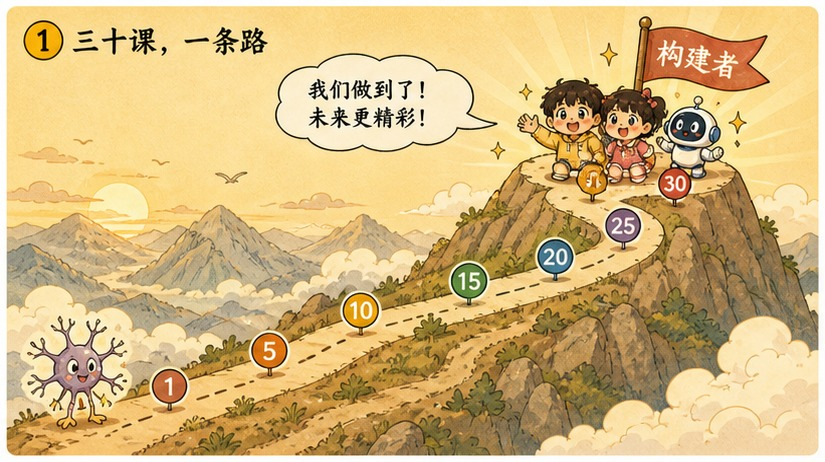
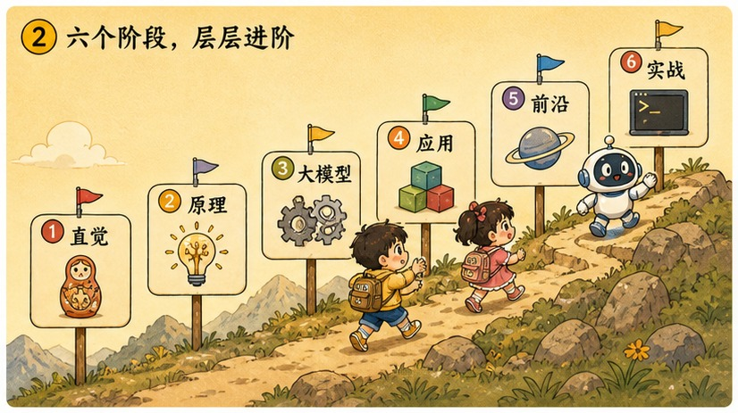
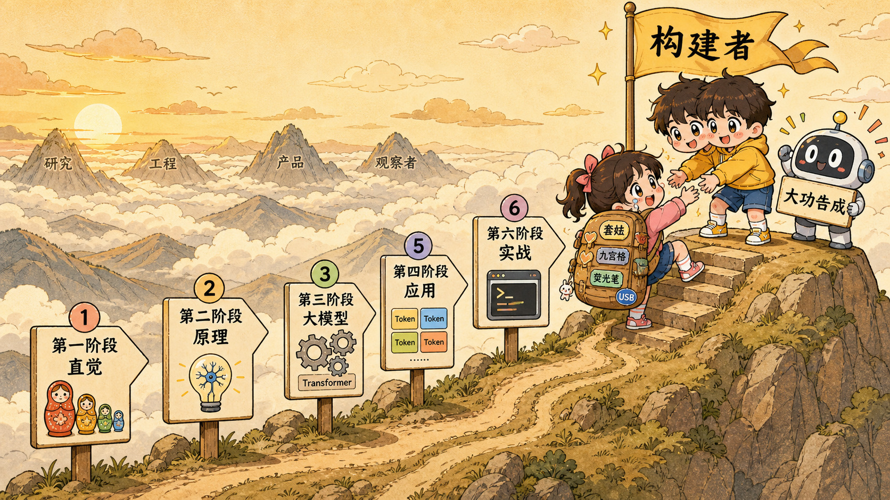
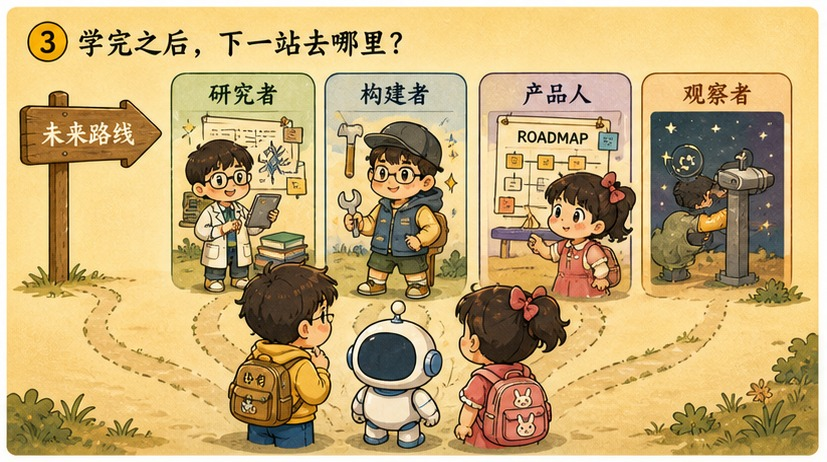
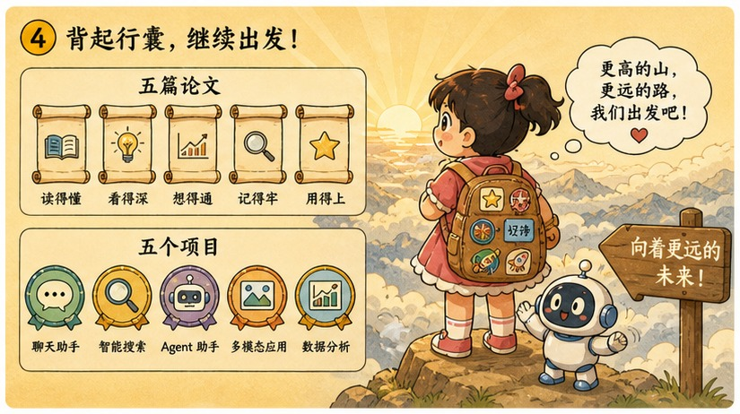

# 第 30 章 · AI 学习地图：大功告成，属于你的英雄之旅

> ### 🎯 先别往下翻 · 这一章要破的题
>
> **🔥 痛点**：30 章走完了。可你心里可能还有点慌——这么多名词、这么多章，我**到底学到了什么、接下来该往哪走**?
> **🤔 换你来**：合上书，你能按顺序说出六个阶段各自解决了什么问题吗？（每个阶段一句话）
> **🧱 笨办法会撞墙**：很多人学完就"收藏吃灰、再也不动"——可**收藏夹里的第 100 篇教程，不如亲手跑通的第 1 个程序**。
> 这一章不教新东西，而是给你一张能用一辈子的地图。往下看。👇

这是最后一章了。

元元把那张卷起来的大地图"唰"地铺满整张桌子，神情比平时郑重许多：「小满，咱俩这趟旅程，从第 1 章你连'三个套娃'都分不清开始，到现在……你已经能调 API、能本地部署、能搭 RAG、还懂上线前的体检与红线了。今天不教新东西——今天，咱们**站上山顶，回头看看这一路**(★ω★)」

---

## 第 1 节　三十章，其实是一条路

▲ 图30-1 · 三十章，其实是一条路

「回头看，这门课从头到尾只讲了**一个故事**，」元元说，「一个只会加权打分的小零件，如何一步步长成会替你干活的智能体。先对比一下出发前和现在的你：」

> **第 1 章的你**：每个 AI 名词都是**噪音**。Transformer、RAG、RLHF、Agent……听起来全是别人世界的黑话，新闻越刷越焦虑。
> **第 30 章的你**：每个名词都落在**地图的某一格**。新模型发布，你会先问：变的是架构、训练方法，还是应用层的包装？——**这就是地图给你的底气。**

元元一口气把 30 章串成一句话，像在念一首诗：

> 从一个会打分的**神经元**（3）出发，学会**下山式自我纠错**（4）；让词语彼此**注意**（9），再组装成 **Transformer**（10）；用整个互联网玩**文字接龙**（12），又被**对齐调教**出人样（13）；你学会与它**对话**（16），给它外挂**知识**（18/28），交给它**工具与任务**（20）；最后，你**亲手把代码跑通**（26–28）。

「这一句话，就是 30 章的全部，」元元轻声说，「也是你现在拥有的**完整心智地图**。下面，把它画出来。」

---

## 第 2 节　六阶段登山图：你走过的每一站

▲ 图30-2 · 六阶段登山图：你走过的每一站

「咱们这一路，其实是一座山的六段台阶，」元元指着地图上蜿蜒而上的山路：

> 🏔️ **第一阶段 · 直觉篇（1–5）**：AI 是什么、靠什么变聪明——三个圈、喂数据、神经元、梯度下山、过拟合。
> 🏔️ **第二阶段 · 原理篇（6–10）**：深度学习四大基石——反向传播、CNN、词向量、注意力、Transformer。
> 🏔️ **第三阶段 · 大模型篇（11–15）**：一个 LLM 的诞生全程——Token、预训练、RLHF、温度采样、Scaling Laws。
> 🏔️ **第四阶段 · 应用篇（16–20）**：应用层技术栈——提示词、上下文、RAG、工具调用、Agent。
> 🏔️ **第五阶段 · 前沿篇（21–25）**：看懂新闻热词——扩散模型、多模态、推理模型、MCP、开源版图。
> 🏔️ **第六阶段 · 实战篇（26–30）**：从学习者到构建者——API、本地模型、RAG 实战、评估与安全，以及……你正站着的这一章。
> 🏁 **山顶 · 构建者**：六个阶段、三十章、几个亲手跑通的程序——**你已经不是 AI 新闻的围观者了。**

▲ 图30-1 · 从神经元到构建者·登山全景图

---

## 第 3 节　选一条路：四条进阶路线

▲ 图30-3 · 选一条路：四条进阶路线

「学完地图，下一步往哪走，取决于你想成为什么样的人，」元元说，「四条路，**不互斥，也随时能换**:」

| 路线 | 适合 | 本周就能做的第一步 |
|---|---|---|
| 🔬 **研究 Researcher** | 爱刨根问底、想懂"为什么有效" | 打开 Karpathy《Zero to Hero》第一集，跟着亲手写完一个反向传播 |
| 🛠️ **工程 Builder** | 想做出"能跑的东西" | 把第 26 章的 30 行升级成带错误处理和对话记忆的"像样"项目 |
| 📦 **产品 Product** | 想用 AI 解决真问题 | 列出工作里最烦的三个重复环节，挑一个画出 MVP 草图 |
| 🔭 **观察者 Observer** | 想持续看懂、不被忽悠 | 收藏三个可靠信源，取关三个只会喊"炸裂"的标题党 |

> 元元特别叮嘱观察者路线的心法：「用第 23、25 章的眼光过滤噪音——看到任何新东西，**先问'它落在地图哪一格？改进的是哪一层？'**。每月把一个新名词讲给完全不懂的朋友——讲不清楚，就回地图补那一章。」

---

## 第 4 节　行囊：五篇论文与五个项目

▲ 图30-4 · 行囊：五篇论文与五个项目

「上路前，给你装两样行囊，」元元说。

**📄 五篇论文（读论文的正确姿势：先读摘要、再把每张图看懂，公式留到最后）：**

| 论文 | 年份 | 它回答了什么 | 对应 |
|---|---|---|---|
| Attention Is All You Need | 2017 | 不用循环、只靠注意力能不能搭更强的语言模型？ | 第 9–10 章 |
| Scaling Laws for Neural LMs | 2020 | 把模型做大到底值不值？"大力出奇迹"变可预测 | 第 15 章 |
| Language Models are Few-Shot Learners(GPT-3) | 2020 | 模型够大后，提示里给几个例子就能学新任务？ | 第 12·16 章 |
| Training LMs to Follow Instructions(InstructGPT) | 2022 | 怎么把"只会接龙"调教成"听懂人话"的助手？ | 第 13 章 |
| Chain-of-Thought Prompting | 2022 | 为什么"一步一步想"就能解出原本不会的题？ | 第 16·23 章 |

**🎒 五个项目（看十个教程，不如跑通一个；由易到难，每完成一个就写进作品集）：**

> ① **性格化聊天 CLI**（基于 26 章）——给 30 行代码加系统提示词和对话记忆，做个有脾气的命令行伙伴。一个周末足够。
> ② **本地模型 + 语音的家庭助手**（基于 27 章）——Ollama 跑本地模型，接上语音转文字，全程不联网、不花钱。
> ③ **个人笔记 RAG 问答**（基于 28 章）——把代码对准你自己的笔记库，反复调切块和检索直到"真的好用"——这一步比想象中难。
> ④ **带工具的周报 Agent**（基于 19、20 章）——让它自己读 git 提交、查日历，每周五自动生成周报草稿。
> ⑤ **给开源 MCP server 提一个 PR**（基于 24 章）——修个 bug 或加个小工具。**生态不是用来围观的，merge 的那一刻你就是贡献者。**

---

## 第 5 节　三个最常见的迷茫

> 🏆 **【黄金秘籍盒 · 答疑：三个最常被问到的问题】**
>
> **1. 数学不好，还能深入学 AI 吗？**
> **能，看路线。**工程和产品路线几乎不卡数学（调 API、做 RAG、写评测，用到的不超过中学水平）；只有研究路线需要线代和概率，而且完全可以"用到哪、补到哪"。**真正危险的不是数学差，而是把'先学完数学'当成永远不出发的理由。**
>
> **2. 现在才认真入场，是不是太晚了？**
> **模型层确实晚了，应用层才刚开始。**训练前沿大模型只剩少数玩家，但"用 AI 把各行各业重做一遍"的大爆发**刚刚启动**——绝大多数行业还没被认真做过。况且，学完这 30 章的你，对 AI 的理解已经超过绝大多数人。
>
> **3. 要不要辞职全职转行 AI?**
> **先别裸辞。**用业余时间做完上面五个项目里的两三个，验证两件事：你是否真的享受这个过程？你的产出是否有人愿意用？两个答案都是"是"，再谈转行——**那时你手里已经有作品集，转行就不再是一场赌博。**

---

## 第 6 节　收尾大招

> 🏆 **【黄金秘籍盒 · 终极大招：用"地图定位法"消化一切 AI 新闻】**
>
> 这是这本书留给你最值钱的一件工具。往后任何 AI 新名词、新模型、新爆款扑面而来，别慌，三步定位：
> 　🗣️ **「① 它落在地图哪一格？（架构/训练/应用/前沿） ② 它改进的是哪一层？（模型层/框架层/协议层/应用层） ③ 拿什么证明它'更强'?有没有第三方复现？（第 29 章的评估眼光）」**
> - 例：看到"某模型靠'测试时计算'大幅提升数学能力"→ 落在**第 23 章推理模型**那一格，改进的是"答题时多想"的训练范式，接着追问用什么基准、有没有复现。
> - 三步问下来，**你永远不会再被一个标题唬住**——这就是"地图"的全部意义。

### 全书六阶段总览表

| 阶段 | 解决的问题 | 一句话 |
|---|---|---|
| 直觉篇 | AI 是什么、靠什么变聪明 | 三个套娃，从数据找规则 |
| 原理篇 | 深度学习四大基石 | 反向传播/CNN/词向量/注意力/Transformer |
| 大模型篇 | 一个 LLM 怎么炼成 | Token→预训练→对齐→采样→Scaling |
| 应用篇 | 把大模型用起来 | 提示词/上下文/RAG/工具/Agent |
| 前沿篇 | 看懂新闻热词 | 扩散/多模态/推理/MCP/格局 |
| 实战篇 | 从学习者到构建者 | 亲手把概念写成能跑的代码 |

> **把整章拧成一句话**:30 章其实是一条从"神经元"登顶"构建者"的山路——你已从"每个 AI 名词都是噪音"变成"每个名词都落在地图某一格"。下一步从研究/工程/产品/观察者四条路里挑一条（随时可换），揣上五篇论文五个项目上路；往后任何新东西，用"地图定位法"三步消化（落在哪格？改哪层？拿什么证明？），你再不会被标题唬住。

---

## 🏁 写在最后

小满摸着那面"构建者"的旗帜，眼眶有点热：「我们……真的爬到山顶了。」

元元望着远处云海里更高的山峰，笑着说出最后一段话：

> 「这门课**没有把你变成'懂 AI 的人'**——没有任何一门课能做到。它给你的是另一样东西：**从今天起，你不再害怕任何 AI 新名词。**新东西出来，你知道它落在地图的哪一格，知道该问什么问题，知道去哪里验证。
>
> 最后只剩一句话：**动手 > 围观，构建 > 收藏。**收藏夹里的第 100 篇教程，不如亲手跑通的第 1 个程序。
>
> 山顶的旗帜上写着'**构建者**'——**去把它，变成你的名字。**」

小满用力点头，转身望向那片云海里更高的山峰。她的登山包已经备好，故事，才刚刚开始。

> 🎒 **—— 全书终。30 章，大功告成。**
> **而属于你的英雄之旅，从合上这本书的此刻，正式启程。**

> 📖 **看得见的 AI · 全书终** · 30 章 · 六大阶段

---
[← 上一章](../stage_6/chapter_29.md) ｜ [📖 目录](../README.md) ｜ ·

> 在线阅读《看得见的 AI》· 全 30 章免费 —— 回到 [**项目首页**](../../README.md)，觉得有用点个 ⭐ Star 让更多人看到。
