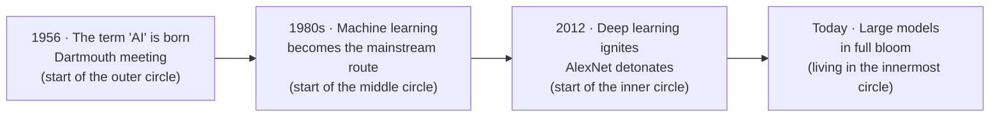
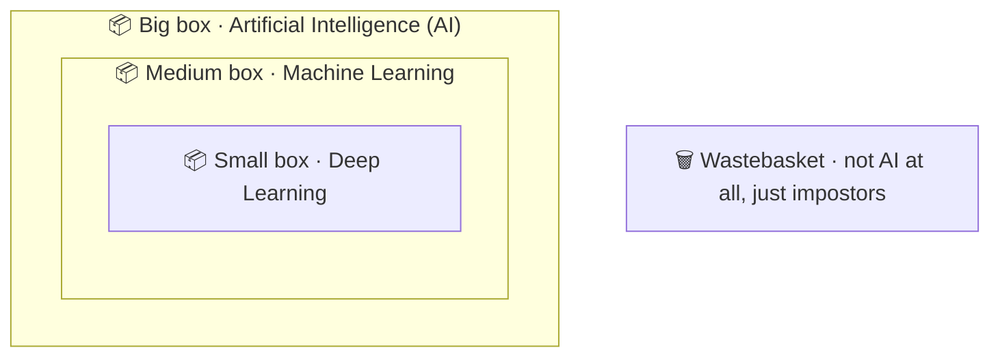

# Chapter 1 · Just Three Nesting Dolls — AI, Machine Learning & Deep Learning

> ### 🎯 Before you turn the page · The puzzle this chapter cracks
>
> **🔥 The pain:** You're scrolling your phone and three headlines flash by — "Company X ships its strongest **AI** yet," "Using **machine learning** to predict stock prices," "**Deep learning** cracks protein folding." The three look like triplets — so how are they related? Which one outranks which?
> **🤔 Your turn:** If you had to seat them in order of rank, how would you line them up? Give it 30 seconds.
> **🧱 The naive move hits a wall:** Most people treat them as **three side-by-side, interchangeable buzzwords** — and that way you'll never get them straight, because they **aren't even on the same level**.
> So what's the real relationship? Read on — Leo sorts it out with a set of nesting dolls. 👇

First day of the new term, and Leo's deskmate just changed. The transfer student is Mia — a girl whose eyes crinkle into crescents when she smiles (*^__^*). Leo was over the moon, already scheming about how to show off a little for the new neighbor. The chance came fast.

---

## Section 1 · Three Nicknames in the Group Chat

Between classes, Mia was scrolling her phone, her frown tightening, until she finally just turned the screen toward Leo:

> Mia: "Leo, look at these three headlines—"
> 　　　First: "Company X ships its strongest **AI** model"
> 　　　Second: "Using **machine learning** to predict tomorrow's stock price"
> 　　　Third: "**Deep learning** cracks protein structure"
> Mia: "AI, machine learning, deep learning... are these three different high-techs? Which one's actually the most powerful?"

Leo's ears perked up — showtime! He puffed out his chest, about to launch in — though honestly he was a little nervous inside, because he used to think they were three parallel buzzwords too, with no idea which was which.

Then his brain clicked. He spotted the set of **Russian nesting dolls** Mia had brought to school, and a plan hatched. He grabbed the dolls and *thunk* — set them on the desk:

> Leo: "Mia, listen up. These three names? **They're not triplets — they're one set of nesting dolls!**"

The reason these three words tie everyone in knots is that headlines and ads **always lay them out flat**, like three bottles of soda lined up on a supermarket shelf, tricking you into thinking it's a pick-one situation.

But the truth is — they're **nested, one inside another**:

> 🪪 **The biggest, outermost doll is "Artificial Intelligence (AI)."** It's the largest, and its belly can hold anything.
> 　🪪 Twist it open, and inside sits a **medium doll, "Machine Learning (ML)."**
> 　　🪪 Twist that open, and the **smallest doll at the core is "Deep Learning (DL)."**

Once that picture locks in, several things stop needing memorization:

- The smallest doll (deep learning) is **definitely** inside the medium doll (machine learning), and **definitely** inside the big doll (AI) — **a small circle always belongs to a bigger one.**
- But it doesn't work in reverse! Inside the big doll, beyond those two smaller ones, **there's a whole empty stretch left over** — and living there are some "is-AI-but-can't-learn" old-timers. Leo will take you on a tour of that empty lot soon; it's the blind spot 99% of people never notice.

Mia's eyes lit up: "Ohh — so it's not about who's more powerful, it's about who's tucked inside whose belly!"

Leo nodded smugly. If only he'd known it was this simple — back when he white-knuckle-memorized all three terms, what a waste of effort (￣▽￣).

---

## Section 2 · Three Chefs in the Kitchen

The dolls explained "who's nested in whom," but Mia tossed out an even trickier question:

> Mia: "But... what decides how you draw the circles? There's gotta be a reason, right?"

Good question! To explain it, Leo dragged Mia into the **cafeteria back kitchen**. Same job — "make the food taste good" — but three tiers of chef stand at the stoves:

**Type 1 · The Recipe Follower 🍳**

He clutches a **family recipe**: how many grams of salt, how many minutes on the flame, flip at exactly which second — **every step written out for him in advance by someone else.** For dishes in the recipe, he nails it perfectly; but one "make it lighter today" from a customer — the recipe doesn't cover that — and he freezes. He never "gets" flavor; he just executes instructions, rigidly.

> 👉 This is **traditional AI**: humans hand-write every rule, the machine just runs them. It's capable, but it **fundamentally can't "learn."**

**Type 2 · The Trial-and-Error Improviser 🔥**

This one has no complete recipe; his game is different: **cook a dish, taste a bite, read the diner's face, adjust next time** — too salty, less salt next round; flame too high, turn it down. After thousands of "cook–taste–tweak" cycles, his hands grow a **feel** for "what combination tastes good." Nobody wrote him rules; the rules are something he **figured out himself from round after round of feedback.**

> 👉 This is **machine learning**: the word "learning" finally earns its name right here.

**Type 3 · The Genius-Palate Master Chef 👅**

He's also a trial-and-error type, but freakishly gifted: his tongue and brain are a **layer-upon-layer flavor system** — the first layer tastes salty/sweet/sour, the second tastes "salty with a thread of umami," the third can somehow taste "this is Grandma's stovetop." From the rawest ingredients he **automatically, layer by layer** distills ever-more-subtle "rules of deliciousness," with no one teaching him "check saltiness first or smell aroma first."

> 👉 This is **deep learning**: it's also a trial-and-error type (also machine learning), it just uses a stack of **many, many layers — a "neural network"** — to chew through the data layer by layer.

See the pattern? Three chefs, **each tier nested inside the next, each one an upgrade of the last** — that's the nesting dolls again! And the line that truly cuts the circles apart is this one sentence:

> **Where do the rules actually come from?** Hand-written and frozen by a human (the recipe follower), or figured out by the machine from the data (the latter two)?

Mia smacked the table: "Got it! Whether it figures the rules out itself — that's the watershed!"

---

## Section 3 · Three Circles, Three Sentences, Three Years

A metaphor alone isn't solid enough, so Leo decided to twist each doll open and show Mia clearly. For each circle, **just remember the one key sentence** and you've got your money's worth.

### Outermost · Artificial Intelligence (AI) — a dream, not a technology

> **One sentence: every effort to make machines display intelligence — *all* of it.**

AI was born in **1956**. That summer, a band of scientists held a meeting at Dartmouth College and formally named the field "Artificial Intelligence" for the first time.

Underline this: it's **a field, a dream, a banner** — **not any single specific technology**. Any trick that makes a machine seem "a little smart," old or new, counts inside this biggest circle.

That explains the "empty lot": early **expert systems** (encoding expert knowledge as thousands of if-else rules), and 1997's **"Deep Blue"** that toppled the world chess champion (via brute-force search of moves + human-written scoring rules) — they are **100% AI, yet 100% incapable of learning.** They're "recipe followers," living inside the big AI circle but unable to squeeze into the machine-learning circle.

### Middle · Machine Learning (ML) — finds the rules in the data itself

> **One sentence: instead of humans writing rules, let the machine figure out the rules from data.**

Machine learning became mainstream in the **1980s**. The shift it brought was humble yet earth-shaking:

**Before**, to make a machine do a job, you had to **write the rules out one by one** and feed them in (that's the next chapter's star).
**Now**, humans stop writing rules and instead **feed the machine a mountain of data**, letting it "chew out" the patterns itself.

More data, usually smarter — only now does "learning" carry real weight. The **spam filter** is its signature act: nobody can write the full set of "what counts as spam" rules, but feed it a few million emails labeled "spam / not spam" and it works out the trick itself. **Recommendation systems, credit scoring** — same playbook.

Here Leo plants a **ruler that runs through the whole book**; carve it into your brain:

> **Want to judge whether something is machine learning? Just ask: what data does it learn from? If you give it more data, does it get better?**

### Innermost · Deep Learning (DL) — learns with many layers of neural network

> **One sentence: do machine learning using a "multi-layer neural network."**

Deep learning truly ignited in **2012**. That year, a multi-layer neural network called **AlexNet** mopped the floor with its rivals at an image-recognition contest, and the whole world snapped to attention: this road works!

It's **one method** of machine learning (so it sits snugly inside the ML circle), and its rare gift is that "**deep**": many layers, able to **automatically, layer by layer** extract features from raw data, growing more abstract the deeper you go (the spitting image of that genius-palate chef). Exactly how this machinery runs is the lid we'll slowly lift across Chapters 3 through 10.

The AI stars whose names have worn calluses on your ears — ChatGPT, Midjourney, face recognition, AlphaGo, the eyes of self-driving cars... — **almost all of them crowd into this innermost little circle.** This world-sweeping AI wave? It's the star of the show.

### Three years, strung on one line

Mia murmured: "Go one layer deeper and the year jumps later, and the name gets one notch more familiar..." Leo nearly applauded — sharp instincts, this deskmate (★ω★).

---

## Section 4 · Leo's Nesting Boxes — Drop the Sticky Notes In

All talk and no practice is empty. Leo tore off six **sticky notes**, each with one thing written on it; then set out **three nested boxes** on the desk — big box labeled `AI`, medium box `Machine Learning`, smallest box `Deep Learning` — with a **wastebasket** parked alongside, just for the impostors that "aren't even AI."

The game has only one ruler (remember it?): **Does it learn from data? Does it use a neural network?** Mia guesses, Leo reveals. Curtain up—

**Note ①: "Deep Blue"**
Mia, on reflex: "This thing's a beast, gotta go in the smallest box!"
Leo shook his head and dropped the note into the **big box — but not into the medium box**: "Nope~ Deep Blue won by brute-force move search + human-written scoring rules. **It doesn't learn from data.** It's AI, but not machine learning. — Big box, end of the line."

**Note ②: "Your inbox's spam filter"**
This time Mia was steady: "It learned from a few million emails — **medium box**!"
Leo raised an eyebrow: "Beautiful! The textbook case of machine learning, bull's-eye (๑•̀ㅂ•́)."

**Note ③: "ChatGPT"**
Mia: "This one I know — **smallest box**!"
Leo *thunked* it into the small box: "Correct. But watch out — it's **also in the medium box, also in the big box**, because..."
Mia jumped in: "**Nesting dolls**! A small circle belongs to the big ones!"

**Note ④: "Phone album auto-sorting photos by face"**
Leo dropped it straight into the small box: "Face recognition runs on convolutional neural networks (Chapter 7 — we'll dig in), one of deep learning's earliest hits. **Small box, no doubt.**"

**Note ⑤: "A so-called 'smart' AC: auto-cools above 26°C"**
Mia was about to set it in the big box when Leo blocked her hand and *whoosh* — flung it into the **wastebasket**: "Hold it! That's **one if-else**, period — not a shred of learning. The 'smart' in ads and the AI of the tech world are often not the same thing at all. You'll meet a truckload of this trap (╯‵□′)╯."

**Note ⑥: "A shopping site's 'Recommended for you'"**
Mia had learned her lesson and reached for the ruler first: "It learns my preferences from my clicks and millions of others'... gets sharper the more I use it... **medium box, machine learning!**"
Leo gave a thumbs-up: "Full marks! The old version is called collaborative filtering, and the new generation is starting to bring in deep learning too."

Six notes sorted, the desk swept clean. Mia stared at the "smart AC" tossed in the wastebasket and laughed: "The biggest fraud's right there — hanging out an AI sheep's head, selling if-else dog meat~"

---

## Section 5 · Traps You'll Probably Fall Into Too

The ideas here aren't hard, but **the misconceptions run thick** — and every one is popular. Leo poured out, heart to heart, the three faceplants he took back in the day.

**Trap 1: "AI is just robots, right?"**

> ❌ Many people hear "AI" and instantly picture a walking, talking humanoid robot.
> ✅ The truth is — **a robot is the "body," AI is the "brain."** The vast majority of AI (like ChatGPT) **has no body at all** — it's just a program quietly running in a server room.

Root cause: too many sci-fi movies (￣ー￣). In reality, AI is mostly a string of code on a server; and plenty of robots (like an assembly-line arm) only repeat rigid motions, with **no AI in their belly whatsoever.** Body and brain — two different things.

**Trap 2: "Deep learning's so hot, all the other machine-learning methods should be in a museum, right?"**

> ❌ Assuming that once deep learning showed up, the old methods all went obsolete.
> ✅ The truth is — on **tabular data** (the rows-and-columns Excel kind), classic methods like gradient-boosted trees can **still beat neural networks flat to this day.**

Root cause: the news only loves to report deep learning's highlight reel. But industry's risk control, pricing, and sales forecasting still use classic machine learning by the bucketful — **methods have no noble or common rank, only fit or unfit.** Using a cleaver to kill a chicken is just wasted effort.

**Trap 3: "ChatGPT is so smart — is general artificial intelligence (AGI) already here?"**

> ❌ Assuming that since it chats so fluently, AI obviously "knows everything," so AGI is right around the corner.
> ✅ The truth is — every AI in the field today is "**narrow AI**"; change the arena and it may flub. **When true general AI (AGI) arrives is, to this day, an open question no one dares call.**

Root cause: mistaking "can chat" for "can do anything." Large models still make mistakes to this day, still confidently spout nonsense (the bug is called "hallucination" — Chapter 29 deals with it specifically), and they're a long way from rock-solid general intelligence — **and exactly how far, even top experts are still bickering about.**

---

## Section 6 · The Finishing Move: spotting "fake AI" in one sentence

Mia slapped her knee after listening: "This chapter, I've finally got it sorted!" Hold on, said Leo — one parting gift before you go: a **kung-fu manual**, plus a **finishing-move kill shot.**

### Three circles, one table to mop it all up

| Look at | 🔵 AI | 🟡 Machine Learning (ML) | 🟢 Deep Learning (DL) |
|---|---|---|---|
| **Essence in one line** | "every effort" to make machines smart (a dream / field) | finds rules in data itself (one route) | learns with multi-layer neural nets (one method) |
| **Born in** | 1956 (Dartmouth meeting) | 1980s (went mainstream) | 2012 (AlexNet ignites) |
| **Where rules come from** | can be hand-written | learned from data | learned from data, **layer by layer** |
| **Does it learn?** | not necessarily (expert systems don't) | yes | yes, and deeper |
| **Star players** | Deep Blue, expert systems | spam filters, recommender systems | ChatGPT, face recognition, AlphaGo |
| **Which chef** | the whole kitchen | trial-and-error improviser | genius-palate master chef |

### The finishing move: spot "fake AI" in one sentence

From now on, whenever someone thumps their chest selling you an "AI-powered" product, you don't need to understand any technology — **just smile and ask one question**—

> 　🗣️ **"What data does it learn from? If the data grows, does it get better?"**
>
> - The other side stammers "the rules are configured by us" → right, that's just **an ordinary program + a trendy word**, off to the wastebasket.
> - Their eyes light up: "it gets stronger the more data it sees" → now *that's* **genuine, no-fake machine learning.**

One move to settle it, no need to unpack any theory. Don't believe me? Try it next time ^^.

### Squeeze the whole chapter into one sentence and stuff it in your head

> **Deep Learning ⊂ Machine Learning ⊂ Artificial Intelligence.**
> A small circle always belongs to a bigger one, but the big circle still houses "can-compute-but-can't-learn" old-timers.
> The AI flooding your screen today almost all crowds into that innermost circle that only ignited in 2012.

---

Mia closed her phone, then suddenly surfaced a new question:

> Mia: "You said machine learning's skill is figuring out rules from data itself... but *how* exactly does it figure them out? Humans don't write the rules, and the machine just magically knows?"

Leo gave a mysterious smile: "Heh, this is exactly an era-changing hairpin turn — **from 'humans write the rules' to 'feed it data.'** That story, my friend, we'll spin next chapter (￣︶￣)↗"

---

## 🧰 Pack it into your toolbox

> **🔑 Method in one sentence:** **Deep Learning ⊂ Machine Learning ⊂ Artificial Intelligence** — they're nesting dolls, not triplets; a small circle must belong to a bigger one, but the big circle still houses "can-compute-but-can't-learn" old-timers (Deep Blue).
> **🎯 Trigger · pull this out whenever:** anything claims to be "AI" — use this ruler to probe: **"Does it learn from data? Does it get better with more data?"** Answer "the rules are configured by us" = ordinary program; answer "stronger the more it's used" = real machine learning.
>
> **✍️ Self-test with the book closed** (answer first, then look back):
> 1. Is "Deep Blue" AI? Is it machine learning? Why?
> 2. What's the single most fundamental difference between a traditional program and machine learning?
> 3. A friend's product claims it's "AI-powered" — which one question lets you see through the bluff?

> 🪜 **Next chapter preview:** Chapter 2 · How does a machine actually "learn"? — from writing rules to feeding data.

---

· ｜ [📖 Contents](../README.md) ｜ [Next →](../stage_1/chapter_02.md)

> Reading *The Visible AI* · 30 free chapters —— back to the [**project home**](../../README.en.md). If it helped, a ⭐ Star helps others find it.
