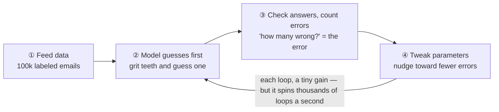

# Chapter 2 · How Does a Machine Actually "Learn"? — From Writing Rules to Feeding Data

> ### 🎯 Before you turn the page · The puzzle this chapter cracks
>
> **🔥 The pain:** Your boss tells you to write a **spam filter**, and you've got exactly one weapon: `if-else` (if... then...). How would you write it?
> **🤔 Your turn:** Sketch two rules in your head first.
> **🧱 The naive move hits a wall:** You'll probably write "**if the subject contains 'You won' then block**"... but the scammer changes "You won" to "Y o u  w o n" or "C0ngratulations, you W0N," and your few hundred rules **go up in smoke in an instant** (this is called rule explosion).
> Rules you can never finish writing — so what on earth do you do? This is the very starting point of the entire AI era. Read on. 👇

This chapter, Leo pokes a hole through that paper window for Mia. Strip it all away, and the starting point of the whole AI era is just **one arrow flipping the other way around.** Don't believe it? Read on (￣▽￣).

---

## Section 1 · Leo Becomes the "Spam Police"

To make it clear, Leo gave himself a job — pretend it's 2002, you're a programmer, and the boss drops a task on you: **write a spam filter.** Your only weapon: `if-else` (if... then...).

Leo rolled up his sleeves and got to work. He spread a big sheet of paper on the desk and started writing rules, one by one:

> 　If the subject has "You won" → block!
> 　If the body has "Free" → block!
> 　If the subject is all caps → block!
> 　......

By rule 500, just as Leo was feeling pleased with himself, the scammers made their move: changed "You won" to "Y o u  w o n" (with spaces), then to "C0ngratulations, you W0N" (with zeros for O's) — **Leo's 500 rules went up in smoke in an instant** (；´Д｀).

> Mia: "So just add more rules?"
> Leo (on the verge of tears): "Add them! But eventually the rules start fighting each other — this one says block, that one says allow, and a perfectly normal email gets killed by mistake..."

This dead end has its own name: **rule explosion.** It's the fatal flaw of the old "humans write the rules" road.

Leo threw down his pen and drew two cards, telling Mia to watch the **direction of the arrow**:

> **🅰️ Old road · Traditional programming**
> 　　**Rules + Data　→　Answers**
> 　　(Humans write the rules. For jobs the rules can spell out — calculating tax, calculating shipping — it's fast and rock-solid. For jobs the rules can't? Hopeless.)
>
> **🅱️ New road · Machine learning**
> 　　**Data + Answers　→　Rules**
> 　　(Humans only supply the raw materials: a big pile of data, plus the correct answer for each item. The machine **reverse-engineers the rules itself** — and that set of rules it derives is exactly what we toss around daily as "the model.")

Notice it? **The two cards differ only in the arrow being flipped:** the old road is "humans give rules, machine computes answers," the new road is "humans give answers, machine finds rules."

Machine learning's solution is crisp: collect 100,000 emails, have humans label "spam / normal," feed the whole batch to the algorithm, and let it tally up "which features clustered together look most suspicious." Scammer switches tactics? Feed it a fresh batch and retrain, and it catches up.

> Leo slapped his thigh: "The coolest thing about this flip is — the things people **can do but can't explain how** finally have a solution! You can't write a definition of 'cat,' but you can hand over a million cat photos!"

If I'd understood this sooner, all 500 of those `if-else` rules that left my hands aching — what a waste of effort (´;ω;｀).

---

## Section 2 · Feeding Data Comes in Three Flavors

Mia got "feed it data," but then a question popped up: "So this 'answer' — where does *it* come from?"

Right on the nose! "Feeding data" actually comes in three flavors, and they differ on **this one question**: **where does the correct answer come from?** These three terms show up in AI news at a terrifying rate; nail them down and the chapters ahead get a lot easier—

| Flavor | Where the answer comes from | In a sentence | Signature acts |
|---|---|---|---|
| **① Supervised learning** | Pre-labeled by humans | Drilling problems with an "answer-key workbook" | Spam classification, house-price prediction |
| **② Unsupervised learning** | No answers at all | Just data — let the machine find the structure | Auto-grouping users into "splurgers / bargain-hunters / lurkers" |
| **③ Reinforcement learning** | Rewards/penalties from the environment, after the fact | No workbook, just a referee who scores you | AlphaGo, game-playing AI, robots learning to walk |

Leo taught Mia a **three-second sorting mantra** that never fails:

> 　🗣️ **First ask one thing: "Where does the answer come from?"**
> 　- Answer pre-labeled by humans → **supervised learning**
> 　- No answer at all, just want to find structure → **unsupervised learning**
> 　- Answer is rewards/penalties from a referee, after the fact → **reinforcement learning**

> Mia: "Wait — within supervised learning, is guessing 'is this spam?' (a yes/no question) the same as guessing 'how much is this house worth?' (a fill-in-the-number question)?"
> Leo: "Sharp eye! Yes/no questions (really multiple choice) are called **classification**; fill-in-the-number questions are called **regression** — both supervised learning, just different question types. Most models deployed in industry are this kind."

Lock these three terms in. In a moment you'll see a mind-blowing fact: **to build one ChatGPT, all three flavors show up on the same assembly line.**

---

## Section 3 · Learning Is Going in Circles: Guess → Compare → Tweak

Now that we know "the machine finds rules itself," the next question is naturally: how *exactly* does it find them? The answer is surprisingly humble — no inspiration, just a **little loop that repeats over and over.**

Leo hauled out a homemade "drill-the-problems spinner," hung an **error counter** on the wall, and roped Mia into playing. The rules go like this (keep your eye on those 1,000 "mock exam papers"):

**Curtain up on the picture-strip—**

🎬 **Loop 1:** Parameters are all random numbers, the model knows nothing about spam, pure guessing. Mia glances at the counter: "Whoa, 471 wrong out of 1,000 — about the same as flipping a coin!"

🎬 **Loop 10:** Errors drop to **392.** Leo cranks the spinner: "See, nudge it toward fewer errors..."

🎬 **Loop 100:** **241.** "Hey, it really is dropping!" Mia's getting into it.

🎬 **Loop 1,000, loop 10,000...:** The counter tumbles down — **118, 46**...

🎬 **Loop 1,000,000:** Settles steadily at **12.** Mia's eyes go wide: "It... it just went in circles like that?!"

Leo spread his hands: "Yep. This 'guess → compare → tweak' loop has a technical name: **training.** Look, one loop alone makes pitifully little progress; but it spins thousands of loops a second — **the entire secret of 'learning' is two things: a dumb method × an enormous number of times.**"

> ⚠️ Mia pressed: "So step ④, 'which way to nudge and by how much' — how's that computed?"
> Leo gave a mysterious smile: "That's the very core magic of deep learning, saved for Chapter 4, *Training Is Walking Downhill*. For this chapter, just lock in the picture of 'going in circles' and you've gotten your money's worth (๑•̀ㅂ•́)."

---

## Section 4 · The Same Loop, Cooked into a ChatGPT

Mia couldn't help asking: "This going-in-circles thing — what's it got to do with a big model like ChatGPT?"

Leo lowered his voice, feigning mystery: "The relationship is — **everything.** A large model is just this loop cranked to the extreme. Only two things change: **the question swaps, and the scale explodes.**"

**What did the question swap to?** Just one question: **guess the next word.**

Leo covered the last character of a famous line of verse with paper and had Mia guess:

> 　**"Twinkle, twinkle, little ＿"**
>
> Mia, without a thought: "Star!"
> Leo lifted the paper: "Right — the next word 'star' **was written in the original text all along!** That's the beauty: **the answer comes built-in, no human labeling needed at all!** The machine sets its own question and checks its own answer — this is called **self-supervised learning**, which you can just think of as 'the free version of supervised learning.'"

This changes everything. With labeling **free**, the data scale can rocket from "100,000 emails" all the way to — **trillions of words** (the entire internet).

Leo dragged the imaginary "training volume" slider, demoing how a small model gets "fed up to size":

> 🎬 **Training volume = 0 words:** Parameters all random; after "Twinkle, twinkle, little" the five candidate words have nearly equal probability — it can't even string "hello" together smoothly.
> 🎬 **Training volume = hundreds of millions of words:** The probability of common phrasings gets nudged up bit by bit, absurd options get pressed down.
> 🎬 **Training volume = the entire internet:** "star" has overwhelmingly the highest probability. It didn't "understand" the nursery rhyme — there's just a terrifying mountain of statistical evidence.

But being able to finish a sentence doesn't yet make ChatGPT. To go from "parrot" to "thoughtful assistant," it has to clear **three gates** — and watch closely, the three flavors from Section 2 **all show up** on this assembly line:

| Gate | What it does | Which flavor |
|---|---|---|
| **Gate 1 · Pretraining** | Drill "guess the next word" on a mountain of internet text, spinning trillions of loops. Out of the oven, it's loaded with language, knowledge, and patterns — but only knows how to continue text | Self-supervised (≈ the free version of supervised) |
| **Gate 2 · Instruction tuning (SFT)** | Humans write a batch of "question + model answer" examples and feed them in; it goes from "parrot" to "an assistant that answers questions" | **Supervised learning** |
| **Gate 3 · RLHF** | Humans score its answers: helpful and honest score points, nonsense and offense lose points, smoothing out its temper | **Reinforcement learning** |

> Mia gasped: "So *all* of ChatGPT's skill at writing poems and code grew out of this one puzzle, 'guess the next word'?!"
> Leo: "Word for word. A simple enough question + vast enough data + enough loops — **that's all there is to it.**"

(Each of these three gates has its own dedicated chapter ahead: pretraining in Chapter 12, SFT and RLHF in Chapter 13. Just get acquainted for now.)

---

## Section 5 · Traps You'll Probably Fall Into Too

This chapter sounds smooth, but the traps run especially thick. Leo poured out, heart to heart, three he fell into—

**Trap 1: "Machine learning is the machine 'teaching itself to mastery' like a human"**

> ❌ Thinking the machine has curiosity, has epiphanies, and gets sharper on its own.
> ✅ The truth is — it's a **purely mathematical optimization process:** following the error signal, it mechanically nudges a pile of numbers into place.

Root cause: the word "learning" is just too human-flavored. The machine is neither curious nor enlightened; it just repeats "guess → compare → tweak" day and night. ChatGPT is no exception — its entire "learning" is doing "guess the next word" trillions of times. **Picture it as an "auto-tuning statistics machine," and your predictions about its strengths and weaknesses will actually land far more accurately.**

**Trap 2: "More data always means a better model — just pile it on"**

> ❌ Thinking data is grunt work, more is stronger.
> ✅ The truth is — **quality and distribution often matter more than quantity. Garbage in, garbage out.**

Root cause: news loves to flaunt "how many trillions of data points were used." But a million mislabeled samples are worse than ten thousand correctly labeled ones; a model trained only on big-city home prices will flat-out flop in a small county — **the model simply can't learn cases the data never covered.** Big firms now spend lavishly to "wash data" and buy high-quality corpora for exactly this reason. (We'll dig into this trap more in Chapter 5.)

**Trap 3: "The model got it right, so it 'understands' the task"**

> ❌ Thinking right answer = truly understood.
> ✅ The truth is — it merely **fit a statistical pattern:** in the data it has seen, it found a correlation between "features" and "answers."

Root cause: anthropomorphizing marketing-speak. There's a classic faceplant: a model meant to tell **wolves from huskies** actually learned the rule "**snowy background = wolf**" — simply because in the training photos, wolves always stood on snow. Show it a wolf on grass and it instantly gets it wrong. A large model's "confidently spouting nonsense" (hallucination) shares the same root: it spits out "the word that statistically looks most like the answer," not "a verified fact" (detailed in Chapter 29).

---

## Section 6 · The Finishing Move: classify any AI in one sentence

Parting ritual: Leo hands Mia a **kung-fu manual** plus a **finishing-move kill shot.**

### One table to see through the whole "feed-the-data" game

| Look at | Old road · Traditional programming | New road · Machine learning |
|---|---|---|
| **Arrow direction** | Rules + Data → Answers | Data + Answers → Rules |
| **Who finds the rules** | Humans, by hand | The machine, itself |
| **Good at** | Things rules can spell out (tax, shipping) | Things rules can't (recognizing cats, translation, chatting) |
| **Fatal flaw** | Rule explosion | Hungry for data, hungry for compute |

### The finishing move: classify any AI app in three seconds

From now on, whatever AI app you run into, you don't need to understand the tech — **just ask it one thing**—

> 　🗣️ **"Where do its answers come from?"**
> 　- Pre-labeled by humans → **supervised learning**
> 　- No answers at all, finds structure itself → **unsupervised learning**
> 　- Rewards/penalties from a referee, after the fact → **reinforcement learning**

One sentence registers any AI's identity card, no theory needed. Don't believe me? Try it next time you spot AI in the news ^^.

### Squeeze the whole chapter into one sentence and stuff it in your head

> **Machine learning = flip the "humans write rules" arrow around, into "the machine finds rules itself from data + answers."**
> The way it finds rules is adorably dumb: guess → compare → tweak, spun a hundred million billion times.
> ChatGPT is just this loop cranked to the extreme — the question swapped to "guess the next word," the data swapped to the entire internet.

---

Mia cupped her chin: "Going in circles, I get it... but step ④ keeps saying 'tweak the parameters.' This **parameter** — what does it actually look like? What kind of thing can be 'tweaked'?"

Leo's eyes lit up: "Great question! Next chapter, we'll take machine learning's smallest part — **a single 'neuron'** — apart, and see who exactly this 'parameter' being tweaked really is (～￣▽￣)～"

---

## 🧰 Pack it into your toolbox

> **🔑 Method in one sentence:** Machine learning = **flip the arrow** — from "humans write rules, machine computes answers" to "humans give data + answers, **the machine reverse-engineers the rules itself**." Three flavors, differing only in "**where the answer comes from**": human-labeled = supervised, no answer = unsupervised, environment rewards/penalties = reinforcement.
> **🎯 Trigger · pull this out whenever:** deciding whether a task needs traditional programming or machine learning — **"Can the rule be stated in one sentence?"** Yes (calculate tax) → `if-else`; can't spell it out but you can collect labeled samples (recognize cats, filter spam) → machine learning.
>
> **✍️ Self-test with the book closed:**
> 1. Why does the old "humans write rules" road hit a wall on spam?
> 2. Supervised / unsupervised / reinforcement — what one mantra tells them apart?
> 3. "Auto-judging whether an expense exceeds the limit" vs. "recognizing the text on a receipt" — which kind for each, and why?

> 🪜 **Next chapter preview:** Chapter 3 · The Birth of a Neuron — weights, bias, and activation.

---

[← Previous](../stage_1/chapter_01.md) ｜ [📖 Contents](../README.md) ｜ [Next →](../stage_1/chapter_03.md)

> Reading *The Visible AI* · 30 free chapters —— back to the [**project home**](../../README.en.md). If it helped, a ⭐ Star helps others find it.
