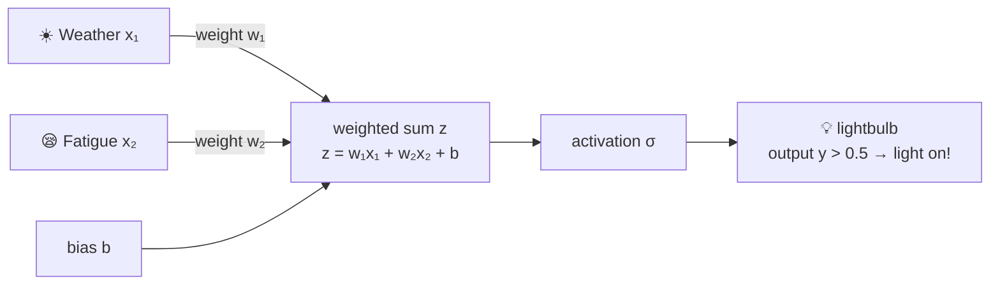

# Chapter 3 · The Birth of a Neuron — Weights, Bias, and Activation

> ### 🎯 Before you turn the page · The puzzle this chapter cracks
>
> **🔥 The pain:** Last chapter said the key to machine learning is "finding rules itself." But which part holds the rules? This part — the **neuron** — sounds like biology class. How does it actually "make a decision"?
> **🤔 Your turn:** Think about how you agonize over "should I go for a run today?" — how does your brain call it?
> **🧱 The naive move hits a wall:** Hear "neuron," "neural network," and you'll probably assume it's **simulating the human brain** — mysterious, high-tech — **and that's exactly the first filter we need to peel off your eyes.**
> The truth is much smaller: it's a grade-school arithmetic problem you do every day. Read on. 👇

This chapter, Leo takes machine learning's smallest part — **a single neuron** — and carves it into pieces, so Mia can see with her own eyes who that "parameter" being tweaked really is. Don't let the words "neuron" spook you; strip it down and **it's just a grade-school arithmetic problem you do every day** (￣▽￣).

---

## Section 1 · You Run a "Neuron" in Your Head Every Day

Weekend morning, Leo stared out the window, agonizing over one big thing: **should I go for a run today or not?**

Mia leaned over: "What's there to agonize about?"

Leo, dead serious: "Don't laugh — I've got a neuron running in my head right now! Listen—"

> 　☀️ **Nice weather** → add points (sky's clear, mood's clear, want to go out)
> 　😪 **Body's tired** → subtract points (stayed up late, legs like lead)
> 　🛋️ And I'm **already a bit resistant** to running in the first place → that's a **base score**

"Tally it up in my head, and **if the total clears some line**, I lace up and head out; if it doesn't, I melt into the couch (￣ω￣)."

Mia laughed: "That's just... weighing it up!"

"Exactly!" Leo slapped the table. "What an artificial neuron does is **identical** — take in a few numbers, multiply each by a 'weight' and add them up, add a 'base score,' and finally ask one thing: **did it clear the line?**"

He scribbled out today's "running willingness" tally:

> 　**Running willingness ＝ Weather ×（+1.5） ＋ Fatigue ×（−1.2） ＋ Base score（−0.5）**

"See, weather's weight is **+1.5**: I care a lot about weather, a sunny day adds heaps of points; fatigue's weight is **−1.2**, a negative weight subtracts; the base score **−0.5** says I'm not that into running to begin with. The moment the total clears the line, I'm going today."

This tally is the **smallest part** of all deep learning. Write it as the "neuron standard formula" and it looks like this:

> 　**z ＝ w₁x₁ ＋ w₂x₂ ＋ b**　　then　　**y ＝ σ(z)**

Don't panic! Every term in this line is an old friend you just met:

- **x**: input (today's weather, fatigue)
- **w**: weight (how much you care about it)
- **b**: bias (that base score)
- First compute a score **z**, then use a thing called **σ** to "squash" it into the final decision **y**

> Leo, mysteriously: "Every fancy trick in the next 27 chapters is **just a hundred million arrangements of this one formula.** Digest this line and you've got your hands on deep learning's vital spot."

---

## Section 2 · The Neuron Trio: Weight, Bias, Activation

Hidden in this scoring problem are three key parts — the trade calls them "the trio." Leo counted them off on his fingers for Mia:

**🔧 Trio member one · Weight — "how much you care about it"**

The **importance** of each input. Positive weight adds, negative weight subtracts; the larger the absolute value, the harder the impact.

> Underline it! **The weight isn't set by humans — the machine "learns" it itself from the data.** The "training" and "tweak the parameters" we kept muttering last chapter — *that's* what gets tweaked! Mia, the "parameter" you kept asking about — this is the first one (￣︶￣).

**🔧 Trio member two · Bias — "how high the bar is"**

The **base score** that ignores all inputs, deciding how high to draw that "line."

- High bias → low bar, the neuron fires at the slightest thing (**rain-or-shine type**: the base score nearly clears the line by itself, runs in any weather)
- Low bias → high bar, has to pile up a heap of positive points before firing (**sunny-day-only type**: won't budge unless it's gloriously sunny)

**🔧 Trio member three · Activation function — "squash the score into a decision"**

The last step, **calling** the score z **into a decision.**

- There's one called **sigmoid** that squashes any score into 0–1, like a "probability";
- And one called **ReLU**, more decisive: negative scores all to zero, positive scores pass through unchanged.

The most unassuming of the trio, the activation function, you'll soon find is actually **the load-bearing wall of the whole building** — that's this chapter's biggest Easter egg, revealed in Section 4.

---

## Section 3 · The Name Is Borrowed from the Brain, the Skill Is All Math

Mia, full of awe: "'Neuron,' 'neural network'... does that mean this thing is **simulating the human brain**? So advanced!"

Leo quickly waved his hands: "Stop, stop — **this is the first filter we need to peel off your eyes** (￣▽￣)."

Back in the 1940s, researchers noticed a behavior in biological neurons: **sum up the signals, and once a threshold is crossed, fire.** From that they distilled this scoring problem. The correspondence goes like this—

| Biological neuron | Artificial neuron | What it does |
|---|---|---|
| Dendrite | Input x | Receives signals from upstream |
| Synaptic strength | Weight w | Decides whether each signal is amplified or dampened |
| Cell body | Weighted sum + activation | Sums the signals, "fires" only past threshold |
| Axon | Output y | Passes the result to the next neuron |

> Leo, rapping the board: "But never forget — **this is just a loose 'naming homage,' not a simulation!** Real neurons have chemical transmitters, spike timing, hundreds of cell types — the complexity isn't even in the same league. An artificial neuron is **just a simple function that borrowed a good name.**"

"Here's an analogy," Leo added. "**Airplanes were inspired by birds, but airplanes don't fly by flapping wings.** Modern deep learning runs on math and compute, barely referencing the latest brain science. 'Silicon brain cells' — listen to it for fun, don't take it seriously."

---

## Section 4 · Easter Egg Revealed: Why We Absolutely Need the Activation Function

Now to crack that Easter egg. Leo asked Mia a "tricky" question:

"What if we **remove** the activation-function step? What happens?"

Mia: "One less step... probably no big deal?"

Leo shook his head and laid out two demos—

> **🚫 Remove the activation function: stack ten thousand layers, still one straight line**
>
> A straight line inside a straight line, simplified, is still a straight line. Work out `w₂(w₁x + b₁) + b₂` and it's nothing but another straight line. **No matter how many layers, the whole network only draws straight lines** — it can't even express **turning logic** like "sunny but too tired, so don't go."
>
> **✅ Add the activation function: every layer can bend a corner**
>
> The activation function injects a "kink" into the straight line. One layer, one bend; stack them and you can enclose **arbitrarily complex boundaries** — from recognizing a cat to catching a sentence.

> Mia, suddenly getting it: "Oh — so it's not an optional bit player, it's **the lifeblood that lets the network turn corners**!"
> Leo: "Bingo! Without it, stacking a million layers is useless — *that's* what you call a waste of effort (´∀｀). As for how 'layer-by-layer bending' actually stacks up into intelligence — heh, saved for Chapter 6."

---

## Section 5 · Leo's "Running Scoring Bench": Sculpt a Neuron by Hand

All talk and no practice is empty. Leo hauled out a homemade **running scoring bench** and pulled Mia in to play. The bench looks like this:

The wires on the left are the weights — **green adds, red subtracts, thicker = cares more.** The three sliders on the right tune the neuron's "personality." Only one rule: **the moment output y exceeds 0.5, the bulb lights up, meaning "go for a run!"**

**Curtain up — Leo set up three experiments:**

🎬 **Experiment 1: turn fatigue's weight w₂ down to 0**

Mia yanked the "fatigue" slider hard, from "fully rested" to "dead tired"... but the bulb **didn't budge!**

> Mia: "Huh? I'm about to collapse from exhaustion and it still tells me to run?"
> Leo: "Ha, because you set w₂ to 0 — **a zero weight means caring not at all.** That whole input is dead; fatigue gets no say."

🎬 **Experiment 2: pull the bias b up to +2**

The instant Mia raised b, the bulb snapped on, and regardless of weather or tiredness, it stayed **lit almost constantly.**

> Mia: "This... this is a fitness fanatic!"
> Leo: "Right, that's the **rain-or-shine type.** Bias b decides 'the baseline tendency that ignores all inputs' — the base score's so high it nearly clears the line by itself; no matter how the inputs change, nothing stops it."

🎬 **Experiment 3: one-click personality swap**

Leo clicked three preset buttons, and the bulb's temper changed dramatically:

| One-click personality | Its temper |
|---|---|
| **Loves-sun, fears-fatigue** | Wants to go when it's nice, backs out the moment it's tired |
| **Rain-or-shine** | Bias maxed, runs in any situation (fitness fanatic) |
| **Sunny-only** | Super-high bar, won't head out unless it's gloriously sunny + not tired |

> Mia, hooked: "What's amazing is — **I didn't touch 'today's conditions' like weather and fatigue at all, yet just by tweaking those three numbers, the neuron's whole 'personality' changed!**"
> Leo nodded meaningfully: "Remember that sentence. So-called **training** does exactly this — it makes the machine **automatically** tweak these three numbers until the neuron's 'personality' is just right for the job. And that ties right back to Chapter 4 (～￣▽￣)～"

---

## Section 6 · Traps You'll Probably Fall Into Too

**Trap 1: "A neural network simulates the human brain"**

> ❌ Hear the word "neural" and assume the machine has an electronic brain inside.
> ✅ The truth is — it only borrowed the loose intuition of "sum signals, fire past a line"; **it's fundamentally a pure mathematical function.**

Root cause: the names "neural network" and "neuron" landed too successfully, and the media loves illustrating it with a glowing brain. But modern deep learning's progress runs on math and compute, **barely referencing brain science** — airplanes were inspired by birds, but don't fly by flapping wings.

**Trap 2: "A single neuron is already a bit intelligent"**

> ❌ See it "make a decision" and figure it's a bit smart.
> ✅ The truth is — **a single neuron can only draw one dividing straight line;** it can't even learn the kindergarten-level "fire only when two inputs differ" (XOR).

Root cause: mistaking "can make a decision" for "smart." What you just saw on the scoring bench is **just a grade-school arithmetic problem.** Intelligence isn't in the part, it's in the **way hundreds of millions of parts are organized** — one grain of sand isn't a castle, but a hundred million grains can be.

---

## Section 7 · The Finishing Move: see through any "decision" at a glance

Same ritual: a kung-fu manual plus a finishing-move kill shot.

### The trio, one table to mop it all up

| Part | Manages | In a sentence | Is it a "parameter" (tweaked in training)? |
|---|---|---|---|
| **Weight** | How much you care about this input | Positive adds, negative subtracts, bigger = cares more | ✅ Yes |
| **Bias** | How high to draw the bar | High bar = picky, low bar = easygoing | ✅ Yes |
| **Activation σ** | Squash the score into a decision | Gives the network its "turning" power, the load-bearing wall | ❌ No (it's a fixed step) |

### The finishing move: translate any decision into a "weighted scoring problem"

From now on, whatever you agonize over — order takeout or not, buy this shirt or not, switch jobs or not — you can take it apart on the spot as a neuron:

> 　🗣️ **"What are the inputs? Is each weight positive or negative? Is my 'base score' (bias) high?"**
>
> Take agonizing over late-night takeout: **hunger** is a positive-weight input (hungrier = more points), **price / guilt** is a negative-weight input. If your "bias is very high" — you're the **takeout-addict type** who wants to order even when not hungry, the base score nearly clears the line before looking at any input (╯▽╰).

Taking things apart like this, you'll find: **so-called 'making a decision' is, underneath, a weighted scoring problem.** You can already read a neuron's "mind."

### Squeeze the whole chapter into one sentence and stuff it in your head

> **One neuron = one weighted scoring problem: multiply each input by a weight, sum, add a base score, fire if it clears the line.**
> Weight manages "what to care about," bias manages "how high the bar," the activation function manages "turning & calling it."
> Its name is borrowed from the brain, but its skill is all math; a single one is pretty dim, yet hundreds of millions wired together are another matter entirely.

---

Mia tweaked the three sliders back and forth for a while, then suddenly looked up: "You said training is making the machine **automatically** tweak these three numbers... but how does it know which way to tweak, and by how much? It can't just tweak blindly, right?"

Leo smiled: "You've hit Chapter 4's bullseye! The machine tweaks parameters with a killer trick called **'walking downhill blindfolded'** — turn 'wrong' into a mountain and feel your way step by step to the valley floor. Come on, next chapter I'll blindfold you and you'll get it (￣▽￣)ノ"

---

## 🧰 Pack it into your toolbox

> **🔑 Method in one sentence:** One neuron = **a weighted scoring problem** — multiply each input by a weight, sum, add a base score (bias), fire if it clears the line (activation). Weight manages "what to care about," bias manages "how high the bar," activation manages "calling it & turning"; **training is just making the machine adjust these three numbers automatically.**
> **🎯 Trigger · pull this out whenever:** you hear "neural networks simulate the brain," you know that's just a borrowed name; and whenever you agonize over a decision (order takeout, switch jobs), you can take it apart on the spot as "which inputs × each weight's sign + my base score."
>
> **✍️ Self-test with the book closed:**
> 1. Break down "should I order late-night takeout" into a neuron; name two inputs and the signs of their weights.
> 2. What do weight, bias, and activation each manage? Which one isn't a "parameter" that training adjusts?
> 3. Why, without an activation function, does stacking ten thousand layers still only draw straight lines?

> 🪜 **Next chapter preview:** Chapter 4 · Training Is Walking Downhill — loss functions and gradient descent.

---

[← Previous](../stage_1/chapter_02.md) ｜ [📖 Contents](../README.md) ｜ [Next →](../stage_1/chapter_04.md)

> Reading *The Visible AI* · 30 free chapters —— back to the [**project home**](../../README.en.md). If it helped, a ⭐ Star helps others find it.
