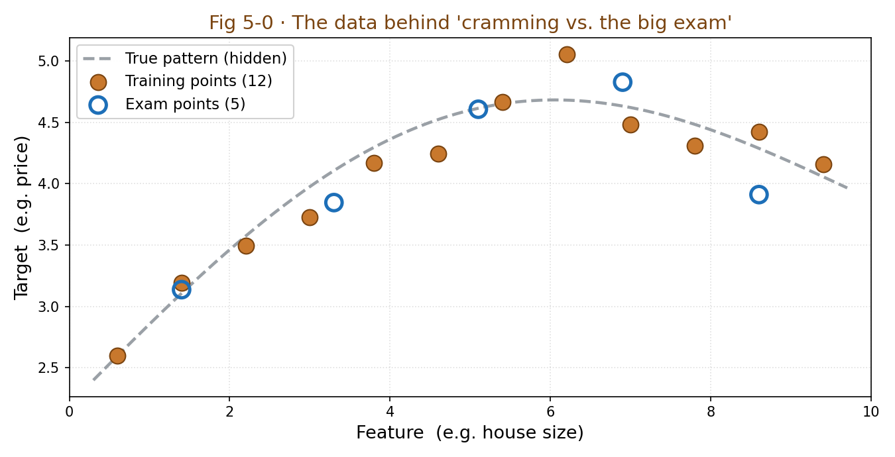

# Chapter 5 · Data and Overfitting — Don't Let AI Become a Rote-Memorizing Top Student

> ### 🎯 Before you turn the page · The puzzle this chapter cracks
>
> **🔥 The pain:** Last chapter said training is pushing "wrong" lower and lower. So — **why not just have the model memorize all the practice problems, drive the error down to 0? Wouldn't that be the best?**
> **🤔 Your turn:** Do that, and what's the hidden danger? Think first.
> **🧱 The naive move hits a wall:** Many people see "**99% training accuracy**" and applaud, figuring the model's amazing — but it's quite possibly just **memorized the answers, noise and all,** and collapses on the spot the moment new questions appear.
> Why is "memorizing answers" AI's biggest nightmare? How do you spot it at a glance? Read on. 👇

But Leo just shook his head: "This is exactly one of AI's biggest nightmares! 'Too diligent' trains the model into a top student who **only rote-memorizes and faceplants the moment new questions appear.** This trap is called **overfitting.**"

This chapter is Stage 1's finale, and Leo's going to drive it all the way home with a scene you know too well — **cramming vs. the big exam** (￣▽￣).

---

## Section 1 · A Tale of Two Top Students: Memorizing Answers vs. Truly Learning

Leo told Mia a little story, starring two students prepping for an exam:

> **Student A:** memorizes every problem in the workbook **answer and all,** down cold.
> **Student B:** doesn't memorize answers while solving, and instead focuses on the **method.**

On the regular quizzes, **answer-memorizing A aces every one,** leaving B in the dust—

> "Until the big exam," Leo paused for effect, "**a whole batch of new questions.**"

The result?

> 　**🅰️ Answer-memorizing A · Overfitting**
> 　　Practice problems **all correct,** big exam **a total mess.**
> 　　He memorized each problem's standard answer; change a number and he's stumped. The model rote-memorizes the training data **noise, coincidences, and all** — this is **overfitting.**
>
> 　**🅱️ Truly-learning B · Generalization**
> 　　Occasional **small mistakes** on practice, **steady performance** on the big exam.
> 　　He learned the problem-solving method; he can handle questions he's never seen. The model stays reliable on **data it has never seen** — this is **generalization.**

Leo slapped the table and dropped the chapter's heaviest line:

> "**AI's purpose was never to memorize training data** — for storing data, a hard drive will do! Its **entire reason for existing is to generalize:** to do the job right on data it hasn't seen."

"So," he lowered his voice, "to judge whether a model is any good, **look at just one pair of numbers:**

> 　**Training error　vs　Test error**

Training error tiny, test error huge → solid overfitting. **The gap between these two numbers is exactly how much it's 'memorizing answers.'**"

---

## Section 2 · Three Cuts of Data: Homework, Mock Exam, Big Exam

"Since the regular grades (training-set performance) can't be trusted," Mia asked, "then what?"

Leo: "The model-cookers' method is dead practical — **before you start training, cut your data into three parts,** each doing its own job, never mixing."

| This part | Maps to which exam | Share | What it's for |
|---|---|---|---|
| **Training set** | Homework | ~70–80% | The **only** data the model is allowed to learn from: see problems, solve, check answers, tweak weights. Chapter 4's "groping downhill" happens on this terrain |
| **Validation set** | Mock exam | ~10–15% | Not for learning, only for **taking stock:** tuning hyperparameters (like the downhill stride), picking the best of several candidate models. The mock exam can be retaken repeatedly |
| **Test set** | Big exam | ~10–15% | Data the model has **never seen** from start to finish, **used only once, at the very end,** to give the final grade. Only this score represents true ability |

> Mia: "Is the ratio a hard rule? 70, 15, 15?"
> Leo: "No! The ratio is just a common habit. **The one truly ironclad law is: the three parts must never mix!** Break that and everything downstream is ruined (╬￣皿￣)."

---

## Section 3 · Leo Pulls a Cotton Thread: see through three ways of learning at a glance

This section is the main event. Leo hammered a row of small nails into the desk, pulled out a spool of **cotton thread,** and put on a "thread-pulling" show for Mia.

First, set out the props clearly:

▲ Fig 5-0 · Scatter of training points and exam points

"Notice," Leo pointed at the dots, "these 12 **solid dots** are the practice problems, and the true pattern behind them is that **gray dashed line** — a gentle curve. The dots don't land exactly on the line, because **real data always carries noise** (you can't measure a house to the millimeter). Those 5 **hollow dots** are freshly-drawn exam questions."

Now Leo pulled the thread across the nails into **three** curves, telling Mia to watch the two **error bars** on the right each time—

🎬 **Pull 1 · Underfitting (learned too shallow)**

Leo pulled the thread into **one dead-straight line,** too lazy to bend. This line didn't even catch the general direction, slicing *clang* through the cloud of dots, wildly off.

> 　**Training error: high 😣　Exam error: high 😣**
>
> Leo: "This is like a student who only memorized one slogan from class — gets the practice problems wrong, so naturally bombs the exam too. **Both error bars are way up.**"

🎬 **Pull 2 · Just right (learned the pattern)**

Leo loosened up, letting the thread **hug smoothly** along that gray dashed line's trend — almost overlapping the true pattern, but **not fussing over every point's noise.**

> 　**Training error: low 😊　Exam error: low 😊**
>
> Leo: "See, it grabs the **trend,** not every point. Occasional small mistakes on practice, steady on the exam — **this is generalization, and it's exactly what we want!**"

🎬 **Pull 3 · Overfitting (memorized the answers)**

Leo got mischievous and **twisted and contorted** the thread, nine bends and eighteen turns, forcing it to **pass exactly through every solid practice point** — training error dropped straight to zero, looking flawless.

> 　**Training error: ≈0 🤩　Exam error: explodes 💥**
>
> Mia stared at the 5 hollow exam points and gasped: "Oh no, the curve is **wildly wrong** at the exam points! But it nailed every single practice problem!"
> Leo: "Because what it memorized was **noise, not the pattern!** To pass through every noisy practice point, it twisted the curve into a pretzel — and the moment that pretzel meets a new question, it's exposed. **Practice all correct, exam a disaster — that's the smoking gun of overfitting.**"

> Mia was fully convinced: "So 'all practice correct' alone means nothing — **you have to see both error bars short together** to call it real skill!"
> Leo: "You've got it! That's Section 1's line — **look only at this one pair of numbers, training error vs. test error.**"

---

## Section 4 · Garbage In, Garbage Out: data's three big pits

Leo shifted gears: "Even if you cut your three parts perfectly clean, if **the data itself is flawed,** it's all for nothing. Engineers have an old saying — **Garbage in, garbage out.** The model is a mirror of the data: whatever's in the data, it learns — including errors, biases, and the 'cheat sheet' you accidentally slipped in."

He listed Mia three big pits:

> **🕳️ Pit 1 · Garbage data (Garbage In)**
> Mislabeled tags, duplicate samples, screens full of noise — the model can't tell right from wrong and just **takes it all in.** Mislabeling 10% of the data is, in effect, **diligently teaching the model to make 10% of the mistakes.**

> **🕳️ Pit 2 · Data bias (Bias)**
> If the doctors in the training data are **almost all male,** the model takes "doctor ＝ male" as ironclad: defaults to "he" in translation, and a hiring model might even **lower the scores of women's résumés.**
> (This isn't scaremongering — **Amazon really stepped into this pit;** that hiring model was ultimately scrapped entirely.)
> Remember this hard truth: **a model is never fairer than the data fed to it.**

> **🕳️ Pit 3 · Data leakage — the sneakiest cheating**
> **Exam questions slipped into the workbook!** The model "saw the questions before the test," its test score is inflated, and it's exposed the moment it goes live. Classic faceplants: test samples accidentally mixed into the training set, using "future" information to predict the past, multiple records from the same patient split into both the training and test sets...

---

## Section 5 · Traps You'll Probably Fall Into Too

**Trap 1: "99% training accuracy — this model's amazing!"**

> ❌ Applauding at the sight of 99%.
> ✅ The truth is — **first ask one thing: how much on the test set?** Training 99%, test 70% is precisely the sign it's **memorizing answers.**

Root cause: mistaking "regular grades" for "true ability." The training-set score is an **open-book exam** — the model has seen these questions! **Any claim that reports only the training score equals zero information.**

**Trap 2: "More data is always better, just pile it on"**

> ❌ Treating data as grunt work, more = stronger.
> ✅ The truth is — **quality and distribution come first:** more mislabeled data is worse; if the distribution is wrong, no amount helps.

Root cause: inertia from "big data" hype. A million mislabeled samples are **a million diligent misdirections;** train only on city home prices and no amount predicts the countryside — **the model learns the data's 'distribution,' not the data's 'volume.'**

**Trap 3: "The test set — just test a few times and ship the best-scoring one"**

> ❌ Figuring it's perfectly natural to reuse the test set to pick a model.
> ✅ The truth is — **the test set may be used only once!** Tune parameters on it repeatedly and it quietly **turns into a validation set,** with inflated scores.

Root cause: not realizing that "glance at the score, then go back and change the model" is itself leaking the exam. Every time you tune based on the test score, the test set leaks one bit of info into the model, and it can no longer represent "data it hasn't seen." **The big exam can only be taken once — exactly the same principle.**

---

## Section 6 · The Finishing Move: one pair of numbers settles life or death

Stage 1's finale: a manual + a kill shot, served up!

### The three cuts of data, one table to mop it all up

| Data | Alias | Reusable? | In a sentence |
|---|---|---|---|
| **Training set** | Homework | Yes (it's what you learn from) | The only data for learning and tweaking parameters |
| **Validation set** | Mock exam | Yes (take stock repeatedly) | Tune hyperparameters, pick models |
| **Test set** | Big exam | **Once only!** | Final grade, represents true ability |

### The finishing move: one pair of numbers settles a model's fate

From now on, whoever brags to you about how magical an AI model is, you don't need to understand the tech — **just press one question**—

> 　🗣️ **"What are the training error and the test error, each?"**
> 　- Both low and about equal → **truly learned (generalizes well),** trustworthy.
> 　- Training super-low, test high → **memorizing answers (overfitting),** sure to flop once live.
> 　- Only willing to report the training score, dead silent on the test → **probably hiding something,** turn and walk.

One pair of numbers settles a model's fate. More useful than any fancy slide deck. Don't believe me? Try it next time you hit an "AI project review" ^^.

### Squeeze the whole chapter into one sentence and stuff it in your head

> **AI's purpose isn't to memorize data it has seen, but to generalize to data it hasn't.**
> Cut data into three parts — "homework / mock exam / big exam" — never mixing; judge good or bad by just one pair of numbers — training error vs. test error.
> Plus one life-saving line: garbage in, garbage out — the data's quality and fairness set the model's ceiling.

---

## 🎓 Stage 1 · Clearing-the-Level Recap

Mia let out a long breath: "After this stage, I feel like... AI isn't so mysterious!"

Leo smiled and strung the five chapters into one line for her:

> 1️⃣ **Three nesting dolls** — AI ⊃ machine learning ⊃ deep learning; boundaries sorted.
> 2️⃣ **Flip the arrow** — machine learning is "reverse-engineering rules from data + answers, itself."
> 3️⃣ **One neuron** — the rule's smallest part, a "weighted scoring problem"; the parameters (weights/bias) are what gets tweaked.
> 4️⃣ **Downhill blindfolded** — training is inching, step by step, down the mountain of loss toward the valley floor.
> 5️⃣ **Cramming vs. the big exam** — the goal isn't memorizing answers but generalizing; one pair of error numbers settles life or death.

"You've gone from a bystander who 'just nods at AI news,'" Leo patted Mia's shoulder, "to a clued-in person **gripping several 'follow-up kill shots'** (★ω★). But this is only Stage 1 — we've been treating the neural network as a 'black box' the whole time."

Mia's eyes lit up: "Next stage, we pry the black box open?"

"Exactly!" Leo rubbed his hands. "**The four cornerstones of deep learning** — how multi-layer networks recognize a cat through 'layer-by-layer abstraction,' how a computer 'sees' an image, how words turn into numbers, and that heart of large models, 'attention'... each one juicier than the last. Ready?"

---

## 🧰 Pack it into your toolbox

> **🔑 Method in one sentence:** AI's purpose **was never to memorize data it has seen, but to generalize to data it hasn't;** judge good or bad by just **one pair of numbers — training error vs. test error,** a big gap = "memorizing answers" (overfitting). Cut data into three parts — "homework / mock exam / big exam" — **never mixing.**
> **🎯 Trigger · pull this out whenever:** someone brags about "99% accuracy," you press one question — **"How much on the test set?"**; anyone who reports only the training score and stays silent on the test is probably hiding something.
>
> **✍️ Self-test with the book closed:**
> 1. Model A: training 99% / test 72%; Model B: training 88% / test 86%. Which to ship, and why?
> 2. "Cramming vs. the big exam" maps to which three cuts of data? Why can the "big exam" be taken only once?
> 3. Is more data always better? A counterexample?

> 🪜 **Next stage preview:** Stage 2 · Principles — the four cornerstones of deep learning (Chapters 6–10).

---

[← Previous](../stage_1/chapter_04.md) ｜ [📖 Contents](../README.md) ｜ [Next →](../stage_2/chapter_06.md)

> Reading *The Visible AI* · 30 free chapters —— back to the [**project home**](../../README.en.md). If it helped, a ⭐ Star helps others find it.
