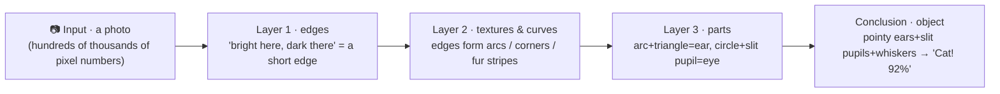

# Chapter 6 · Backpropagation: Made a Mistake? Let's Settle Accounts Layer by Layer

> ### 🎯 Before you turn the page · The puzzle this chapter cracks
>
> **🔥 The pain:** A neuron that can only draw straight lines — how does stacking them recognize a cat? And when the network starts out guessing blindly, how does it know **which part to blame and how much to change each one**?
> **🤔 Your turn:** A film crew of a hundred people shoots a flop. How does the director figure out whose fault it was and how much each should change?
> **🧱 The naive move hits a wall:** You might think "grab everyone and punish them all" or "randomly change parameters" — but that way you can **never improve precisely;** the fixed-right and the changed-wrong get mixed together.
> The clever way is "layer-by-layer accountability." That's exactly the essence of backpropagation. Read on. 👇

Through Stage 1, Leo kept using the neural network as a "black box": feed data in, rules come out. Stage 2, Chapter 1, he takes Mia to **pry the black box open.**

Mia rubbed her hands: "I've waited ages for this! But come to think of it — that 'deep' in '**deep** learning,' where exactly is it deep?"

Leo slapped his thigh: "Perfect question! This chapter we do two big things: first, how it recognizes a cat going **forward** through 'layer-by-layer abstraction'; then how it fixes mistakes going **backward** by 'settling accounts.' Let's go (￣▽￣)ノ"

---

## Section 1 · "Deep" Means Deep in Layer-by-Layer Abstraction

Leo first served Mia back an old conclusion from Chapter 3: "Remember? A single neuron is just one 'weighted scoring problem,' and drawn out it's always **a straight line** — it can't even recognize a 'circle,' let alone a cat."

Mia: "So how does it recognize a cat? Make a single neuron smarter?"

"No!" Leo shook his head. "The secret is — **stacking layers.** Each layer stands on the shoulders of the one below, assembling simple findings into more abstract concepts. Let me draw you a 'cat-recognition assembly line':"

"Follow it along," Leo pointed at the line. "To the machine, a photo **isn't a picture at all — it's hundreds of thousands of pixel numbers.** Layer 1 only watches a small patch and reports 'there's an edge here'; Layer 2 stops looking at pixels and only looks at the edges Layer 1 reported, assembling a few edges into a pattern; Layer 3 assembles patterns into ears and eyes; finally 'pointy ears + slit pupils + whiskers' all light up together, and the 'cat' bulb flares to 92%!"

> Mia's eyes went wide: "Wait — who decreed 'Layer 1 learns edges, Layer 3 learns ears'?"
> Leo lowered his voice and dropped the section's most explosive line: "**No one decreed it! This division of labor grows by itself during training.** That word 'deep' is just how long this abstraction assembly line is."

Even wilder, Leo turned the "scanner" on ChatGPT: researchers observed it layer by layer like a "brain scan" as it reads a sentence, and found a **strikingly similar division of labor**—

| Network layer | The cat network is doing | The large model reading a sentence is doing |
|---|---|---|
| Shallow | Find edges | Read the words smoothly (word forms, parts of speech, neighbors) |
| Middle | Assemble textures, parts | Understand the meaning ("it" refers to the cat, who's chasing whom) |
| Deep | Assemble into a whole cat | Reason it through (hungry → so it chases; pull in world knowledge) |

> "Pictures go 'pixels → edges → parts → object,' sentences go 'words → grammar → semantics → reasoning,'" Leo summarized. "**They walk the same assembly line!** Not deep enough, and you can't build that top floor called 'reasoning' — which is exactly why 'depth' is the lifeblood of large models."

---

## Section 2 · The Film Crew's Blooper: the director's "layer-by-layer accountability"

The abstraction line is about "computing the answer going forward." But the network's **weights are all random when it's fresh off the line,** and mistaking a cat for a dog is routine. How does it improve from mistakes? Enter this chapter's star — **backpropagation.**

To make it crystal clear, Leo told Mia a vivid little story about a **film crew:**

> 🎬 **Act 0 · The ragtag crew**
> A new crew just assembled — director, lead, supporting cast, props team, all rookies, shooting by pure guesswork. This is the "all-random-weights" network.

> 🎬 **Act ① · Forward pass: shoot the film**
> The whole crew collaborates layer by layer — lead acts, support supports, props sets the scene — and end to end, **the finished cut is delivered:** this "cat scene"... came out as a "dog scene." Blooper!

> 🎬 **Act ② · Check the answer: how much did this shoot lose?**
> The correct answer is "cat." The director squashes "the gap between the cut and the script" into one number — that number is the **loss,** exactly the "current altitude" on Chapter 4's mountain.

> 🎬 **Act ③ · Backpropagation: trace the culprit from director down to props, layer by layer**
> The main event! The director starts a **post-mortem of accountability** — but not by grabbing everyone at once. Instead he **traces backward from the finished cut, one layer at a time:** how much of this blooper does the lead bear? Following the lead down, how big is the supporting cast's share of the blame? Further down, that fake mouse the props team misplaced — how much responsibility does it carry?
> **The share of "blame" each person gets is, in the jargon, the gradient.** The bigger the blame, the harder they'll be changed later (the thicker the line in the diagram).

> 🎬 **Act ④ · Reshoot by responsibility**
> Chapter 4's old friend **gradient descent** steps in: the heavily-to-blame lead overhauls the scene, the lightly-to-blame extra nudges their blocking. **Bigger impact, bigger change** — that's the entire spirit of backpropagation.

> 🎬 **Act ⑤ · Reshoot a hundred million times, a lousy crew forged into a legendary one**
> Scene by scene, shoot, blame, change, over and over, and the weights take shape bit by bit: the network is forged from blind guessing into a cat-recognizing master (92%). **ChatGPT's trillion-plus parameters were also tuned, one by one, by this same mechanical process.**

Leo matched each term to the crew, one to one, to drill it into Mia:

| What happens in the network | Its counterpart in the crew |
|---|---|
| Forward pass | The whole crew collaborates to shoot the film |
| Loss | The post-mortem tallies how much this shoot lost |
| Backpropagation | Tracing backward from the director down to each doer |
| Gradient | Each person's "share of blame" |
| Weight update | Heavily-blamed overhaul, lightly-blamed nudge; fight again next scene |

> Mia pressed: "So how does the director compute each person's exact share of blame?"
> Leo: "With a math tool called the **chain rule** — strip it down and it's 'differentiate a composite function, multiplying backward layer by layer,' which we won't unpack here. Just lock in two things: ① it's a **purely mechanical differentiation,** fully automatic, **with no 'thinking' whatsoever;** ② it's a pair with gradient descent — backpropagation computes the slope under everyone's feet, gradient descent takes one step down that slope."

> "Underline this," Leo added. "The astronomical compute burned training a large model **mostly burns on this round trip:** tens of thousands of GPUs spinning for months do this one thing — 'forward → check the answer → backprop → tweak' — and nothing else."

---

## Section 3 · Same Number of Neurons, Why "Deep" Beats "Wide"

Mia tossed out a clever question: "Since more neurons means more capability, is there a difference between **spreading 1,000 neurons into one wide, shallow layer** versus **stacking 10 layers of 100 each**?"

"A difference so big it'll scare you!" Leo laid out two contrast cards:

> **🟥 Wide and shallow: 1 layer × 1,000**
> No intermediate layers to reuse, so **every concept has to be learned straight from pixels.** Want to recognize one more animal? You have to lay down a whole new batch of neurons — demand grows **explosively** with task complexity.

> **🟩 Narrow and deep: 10 layers × 100**
> The low-level parts are **shared by all:** one "diagonal line" can build a cat ear, a dog ear, or a rooftop. **Reuse boosts expressive efficiency exponentially.**

"This 'reuse the parts' wisdom," Leo gave a mysterious smile, "is already baked into written language — **the way letters build into language is itself a deep network!**"

> 　A few dozen **strokes/letters** → hundreds of **building blocks** → thousands of **words** → infinite **sentences**
> 　Each layer reuses the parts of the layer below. Without layering, every word would need its own unique symbol, and the number of symbols to memorize would... **just explode** (°□°).

"So large models voted with their feet too," Leo flashed a string of numbers. "**They unanimously chose 'deep'** — GPT-2 stacks 48 layers, GPT-3 stacks 96, Llama 3 405B stacks 126. Depth is always the foundation; **without depth there's no layer-by-layer abstraction, and no matter how wide, it's just an oversized lookup table.**"

---

## Section 4 · Foreshadowing: the director's critique fades to a whisper by the bottom layer

Depth has its price. Leo dropped a teaser: "Think about it — the director's accountability passes backward from the finished cut, **fading a notch with every layer.** If the crew has 100 layers, by the time it reaches the lowest props gofer, the critique is **nearly inaudible.**"

Mia: "Then they wouldn't know what to fix?"

"Exactly! This is called **vanishing gradients:** the bottom-layer parameters get no adjustment signal and **can't learn anymore,**" Leo said. "It once kept 'very deep networks' untrainable for years. Engineers later patched two paths to the rescue — get acquainted first:"

> 🛠️ **Tool one · the ReLU activation function**
> Swaps the neuron's "switch" for a minimalist version: **negatives to zero, positives straight through.** When the error passes back, the fading slows dramatically. It's now the default for all kinds of networks — you'll meet it in next chapter's CNN.

> 🛠️ **Tool two · residual connections (a "director's hotline" straight to the bottom)**
> Lets the director's critique **bypass all the middle layers, a highway straight to the bottom props team.** From the hundred-layer ResNet to the large model's Transformer (Chapter 10), modern deep networks barely stand without it — **every Transformer layer has a built-in residual connection; without this hotline, there'd be no hundred-layer large models.**

> Mia: "Just remember these two terms for now, since they'll come up again?"
> Leo: "Smart! You already know **who and what they were born for** — when you meet them later, they'll be old friends (￣▽￣)."

---

## Section 5 · Traps You'll Probably Fall Into Too

**Trap 1: "Backpropagation = AI 'reflecting on what it got wrong'"**

> ❌ Hear "accountability" and "learning" and assume AI is self-reflecting.
> ✅ The truth is — it's just **automatic differentiation:** a mechanical chain-rule computation, **with no 'thinking' happening at all.**

Root cause: words like "propagation" and "accountability" are too vivid. In reality, backpropagation is a fixed calculus procedure, the computer just crunching numbers layer by layer per the formula — **picture it as Excel automatically computing how much each cell should change,** far closer to the truth than picturing "reflection." Training ChatGPT is the same: no epiphany, just a hundred million mechanical tweaks.

**Trap 2: "More layers always means a stronger model — just stack to death"**

> ❌ Misreading "deep learning" as "deeper is better."
> ✅ The truth is — **vanishing gradients, overfitting, and compute cost — three walls together cap the number of layers.**

Root cause: blindly adding layers, at best **won't train** (vanishing gradients), at worst memorizes the training set cold and is exposed the moment it hits the exam hall (Chapter 5's **overfitting**), and the compute bill will talk you out of it first. Large models do routinely have hundreds of layers, but that's held up by massive data, residual connections, and astronomical compute **all together** — the right depth is an engineering thing you tune by trial, not a "bigger is more glorious."

---

## Section 6 · The Finishing Move: see through "depth" in one sentence

Same ritual: a manual + a kill shot.

### Forward and back, one table to mop it all up

| Direction | Name | What it does | In a sentence |
|---|---|---|---|
| **Forward →** | Forward pass / layer-by-layer abstraction | Processes input into an answer, layer by layer | pixels→edges→parts→object |
| **Backward ←** | Backpropagation | Traces each person's blame from the error, tweaks by blame | director traces accountability down to props |
| Partner | Gradient descent | Takes one step down by the blame (slope) | Chapter 4's old friend |

### The finishing move: explain AI training to anyone with "crew accountability"

From now on, whenever someone gets stumped by "how does AI learn," just toss out this **crew combo:**

> 　🗣️ **"Shoot the film (forward) → tally the loss in the post-mortem (loss) → trace from director down to props (backpropagation) → the heavily-blamed overhaul (update) → reshoot a hundred million times (training)."**
>
> One story told, and how ChatGPT was forged is explained along the way. And you can add a bluff-stopper: **there's no 'reflection' in here, it's all mechanical differentiation** — anyone who says "AI is self-reflecting now," just smile.

### Squeeze the whole chapter into one sentence and stuff it in your head

> **"Depth" = the length of the layer-by-layer abstraction line; learning = backpropagation's "layer-by-layer accountability" repeated a hundred million times.**
> Forward: pixels→edges→parts→object (the division of labor grows by itself, no one designed it).
> Backward: trace from the output layer down to the input layer; the more to blame, the more it changes. A deep network's vital weakness is vanishing gradients; the antidote is the residual connection, that "direct hotline."

---

Mia, still hungry for more: "Cat-recognition Layer 1 keeps saying 'find edges'... but how on earth does the machine 'find' an edge in a pile of pixel numbers? It doesn't even have eyes!"

Leo grinned and pulled a **palm-sized 3×3 grid card** from his pocket and waved it: "You've hit next chapter's bullseye! The secret of how a machine 'sees' an image is all on this little card. Come on, next chapter I'll slide it across a giant scroll painting and teach you how a machine **counts how many donkeys are in the picture** (￣▽￣)ノ"

---

## 🧰 Pack it into your toolbox

> **🔑 Method in one sentence:** "Depth" = **the layer-by-layer abstraction line** (pixels→edges→parts→object); learning = **backpropagation** — trace each part's blame from the final error (gradient), the more to blame the more it changes, repeated a hundred million times.
> **🎯 Trigger · pull this out whenever:** you hear "training a large model burns astronomical compute," you know the bulk burns on this round trip — "forward → check answer → backprop → tweak"; you hear "AI self-reflects," you know that's just **mechanical differentiation,** no reflection.
>
> **✍️ Self-test with the book closed:**
> 1. Use "crew accountability" to explain: why do the bottom layers near the input often "not hear the accountability"? What's it called?
> 2. With the same number of neurons, why does "deep" beat "wide"? (Think about how letters build into language.)
> 3. What are the shallow, middle, and deep layers each doing when recognizing a cat / reading a sentence?

> 🪜 **Next chapter preview:** Chapter 7 · Convolutional Neural Networks (CNN) — sweeping the image with a 3×3 magnifying glass.

---

[← Previous](../stage_1/chapter_05.md) ｜ [📖 Contents](../README.md) ｜ [Next →](../stage_2/chapter_07.md)

> Reading *The Visible AI* · 30 free chapters —— back to the [**project home**](../../README.en.md). If it helped, a ⭐ Star helps others find it.
