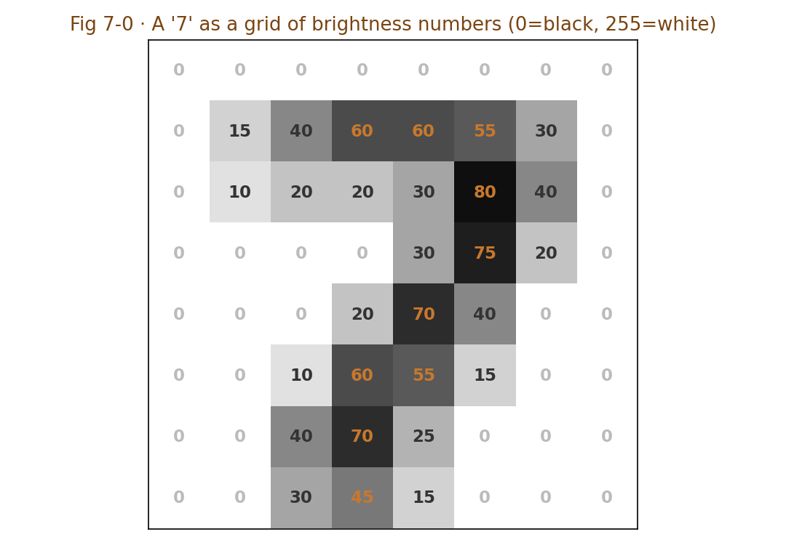

# Chapter 7 · Convolutional Neural Networks (CNN): Sweeping the Image with a 3×3 Magnifying Glass

> ### 🎯 Before you turn the page · The puzzle this chapter cracks
>
> **🔥 The pain:** A machine has no eyes — so how does it "see" how many donkeys are in a sprawling scroll painting?
> **🤔 Your turn:** If an image is just a big pile of numbers to you, how would you find "there's a thing in this spot"?
> **🧱 The naive move hits a wall:** You might think "the hard drive stores a **picture,** open your eyes and you see it" — **not at all!** It stores only a table: each cell a brightness number from 0 to 255, **no 'picture' anywhere in sight.**
> So what math problem does "understanding an image" get translated into? Read on for Leo's 3×3 magnifying glass. 👇

Leo mysteriously pulled out a **palm-sized 3×3 grid card:** "The answer's all on this little card. Today I'll slide it across a giant scroll painting and guarantee you'll understand how a machine **counts the donkeys in the picture** (￣▽￣)ノ"

---

## Section 1 · To the Machine, an Image Is a Table of Numbers

Before getting hands-on, Leo corrected a **deep-rooted illusion** for Mia.

"You think," he pointed at a photo on his phone, "the hard drive stores a 'picture,' right? Open your eyes and you see the pattern, the outline, a cat?"

Mia: "Isn't that so?"

"**Not at all!**" Leo shook his head. "There's **no 'picture' in a computer whatsoever.** Open any image and what's stored is just a **table** — each cell (pixel) holds one brightness number: **0 is pure black, 255 is pure white.** A color image is just three such tables — red, green, blue — stacked together."

▲ Fig 7-0 · A '7' as a grid of numbers in the computer

"Here's the key," Leo rapped the board. "**The computer only has one viewpoint: 'up close.'** It has never seen that '7,' only cell after cell of numbers. So 'understanding an image' is translated into a math problem: **find patterns in the number grid** — where numbers jump suddenly (that's an **edge**), where there's regular repetition (that's a **texture**), which patterns always show up together (that's a **part** like an eye or a wheel). **The convolutional neural network (CNN) is the machine built for this problem.**"

---

## Section 2 · The 3×3 Magnifying Glass: a little detector patrolling with a template

Finally the card takes the stage. Leo spread the scroll painting across the desk and held up the **3×3 grid card:**

"CNN's smallest part is called a **kernel** — just this little **3×3 table,** holding the 'pattern template' it's looking for. It starts at the top-left of the painting, **sliding right one cell at a time,** and at every stop asks one question—"

> 　🔍 **"These 9 pixels under me — do they look like my template?"**
> 　- Alike → output a **big number** (strong response! 'goods here!')
> 　- Unlike → output **near 0** ('nothing I want')

"Stitch all the landing-spot scores back into their original positions," Leo said, "and you get a **feature map** — marking 'where in the picture the thing I'm looking for is.' Put plainly, convolution is one **similarity score:** the more the pattern underfoot resembles the template, the higher the score."

Mia: "So how does it know to look for a 'donkey'?"

"Good question! It goes **step by step.** Swap the 9 numbers in the card and you swap the detection target — same painting, different kernels 'see' completely different things:"

| Card (kernel) | What it hunts | Metaphor |
|---|---|---|
| **Edge kernel** | Spots where brightness jumps | One side positive, the other negative; response peaks at sharp changes — object outlines appear |
| **Corner kernel** | Where two edges meet | Table corners, window frames, a donkey's ear tip — none escape it |
| **Texture kernel** | Regular repetition | Stripes, spots, a donkey's coat — the signature of fur and fabric |

> Leo dropped the section's most crucial line: "The ones above are classic filters **humans** hand-designed for decades. **CNN's real breakthrough is — those 9 numbers in the kernel aren't designed by humans, they're 'learned'!**"
> Mia: "Chapter 4's gradient descent again?"
> Leo gave a thumbs-up: "You've got it! Whatever detector the task needs, the network **'grows' that detector itself.** Dozens to hundreds of kernels in one layer **patrol in parallel,** each hunting its own pattern."

---

## Section 3 · The Triple Jump: from one edge to one donkey

One kernel can only find one kind of small local pattern. The real magic is, again, last chapter's move — **stacking layers.**

"The next layer's kernels scan not the original image," Leo gestured, "but **the feature map the previous layer spat out.** So the detection target **upgrades layer by layer** — isn't this the perfect example of last chapter's 'layer-by-layer abstraction' applied to images!"

| Layer | What it hunts | Like, in written language |
|---|---|---|
| Layer 1 | Edges, color blocks, light-dark jumps | **strokes** |
| Layer 2 | Assemble edges into textures, arcs, simple shapes | **building blocks** |
| Layer 3 | Assemble shapes into parts: eyes, hooves, ears | **words** |
| Deeper | Assemble parts into a whole: **a donkey!** | **phrases** |

"So your question of 'count the donkeys,'" Leo returned to Mia's question, "the machine does it like this: Layer 1 finds countless edges in the scroll → Layer 2 assembles them into arcs and long-ear shapes → Layer 3 assembles the part combo 'long ears + four legs + carrying cargo' → the deep layer calls it: 'a donkey here! another there!' **counting until done.**"

Leo added a common little step:

> 🔻 **Pooling: shrink the image, keep the gist**
> Between layers there's often a pooling step: each 2×2 block keeps only the **maximum response,** halving the feature map's side length. Two benefits — ① the image shrinks, faster compute; ② the donkey is **still recognized even shifted a couple of pixels** (called "shift invariance"). Like shrinking a map: details lost, landmarks still there.

"This 'edge→texture→part→whole' line," Leo glanced around, "is right now running in a pile of devices around you—"

> 📱 **Face unlock:** extracts your facial features, millisecond comparison; Layer 1's edges ultimately assemble into "you."
> 🏥 **Medical imaging reads:** circling suspected lesions in CT and X-ray, reaching senior-physician level for some conditions — but it's a "reminder assistant," the final diagnosis still belongs to the doctor.
> 🚗 **Self-driving perception:** boxing cars, people, and lane lines from camera footage.
> 🏭 **Industrial inspection:** photographing each item on the line for scratches and missing parts, faster than the human eye, never tired, **and never starts spacing out at three in the afternoon** (￣▽￣).

---

## Section 4 · See One Convolution with Your Own Eyes: a picture-strip

All talk and no practice is empty. Leo set up the demo bench: on the left a **12×12 grayscale mini-image** (with a "7" drawn on it), in the middle a **3×3 kernel,** on the right a **10×10 feature map** (all black at first).

**Curtain up—**

🎬 **Frame 1:** Leo presses the grid card onto the image's **top-left** (a blank area) and asks "look like an edge?" — the 9 numbers are nearly all identical, **response ≈ 0.** The corresponding cell on the right: **still black.**

🎬 **Frame 2:** The card slides right one cell, then another... and reaches **the edge of the '7's horizontal stroke!** In the window, "bright on top, dark below," **bam** — the response spikes! The corresponding cell on the right **snaps on.**

🎬 **Frame 3:** Keep scanning. Wherever it presses on a **stroke outline,** the right side lights a cell; wherever it presses on **blank or inside the stroke** (numbers all the same, no jump), the right side stays pitch black.

🎬 **One full sweep:** On the feature map, **the lit cells are all the outline of the '7,'** blanks and stroke interiors all black.

> Mia exclaimed: "It **traced out** the edges of the '7'!"
> Leo: "Right. Swap the kernel and sweep again — a texture kernel, a corner kernel — and the lit spots are completely different. That's the truth of how a machine 'sees': **not seeing the whole, but countless little cards each scanning its own thing, each lighting its own lamps.**"

🎬 **Easter-egg question:** Mia spotted something odd: "Why is the input 12×12 but the output **10×10**?"
Leo: "A palm-sized window on a 12-wide image has only **12 − 3 + 1 = 10** landing positions, same vertically. Real CNNs often pad a ring of 0s around the image (called padding) so the output keeps the original size."

---

## Section 5 · Traps You'll Probably Fall Into Too

**Trap 1: "A CNN 'sees' a whole cat like a human does"**

> ❌ Thinking a whole cat surfaces in the machine's mind.
> ✅ The truth is — it merely **statistically combines the responses of thousands of local patterns** into one judgment.

Root cause: anthropomorphic imagination. A CNN has no "overall impression," only layered-up **local match scores** — the ear-tip score + the whisker-texture score + the coat-pattern score, summed past a threshold, reports "cat." So **when the background is bizarre, the pose is rare, or the lighting is extreme, it flubs:** it recognizes a "pattern combination," not the concept "cat."

**Trap 2: "Such high recognition accuracy means it truly understands images"**

> ❌ Mistaking "fits the statistics well" for "semantic understanding."
> ✅ The truth is — **stick a few small stickers on a stop sign and the model might read it as a speed-limit sign** — this is called an **adversarial example.**

Root cause: tiny perturbations nearly imperceptible to the human eye can make a CNN wrong across the board — because it relies on **pixel-level number patterns,** not the meaning that "a stop sign means you must stop." Adversarial examples are a core research topic in computer-vision security, and a constant reminder: **recognition ≠ understanding.**

---

## Section 6 · The Finishing Move: see through "machine vision" in one sentence

Same ritual: a manual + a kill shot.

### The CNN trio, one table to mop it all up

| Part | What it does | In a sentence |
|---|---|---|
| **Kernel** | A 3×3 template, slides to find local patterns | a 3×3 magnifying glass, lights up if alike, dark if not |
| **Stacking layers** | edge→texture→part→whole | layer-by-layer abstraction, reuse the parts |
| **Pooling** | shrink the image, keep the gist | smaller, faster, shift-invariant |

### The finishing move: puncture "AI understood the image" in one sentence

From now on, whenever someone brags "our AI can understand images," just smile and ask back:

> 　🗣️ **"Did it truly 'understand,' or did it just find a pattern in the pixel numbers that happened to match?"**
>
> A reminder trick: **give it an image with a bizarre background, or one with small stickers stuck on,** and if it flubs on the spot, it shows it always recognized a "pattern combination," not a "concept." **Recognition ≠ understanding** — those three words see through most of the "AI vision" bragging.

### Squeeze the whole chapter into one sentence and stuff it in your head

> **To the machine, an image is a table of 0–255 numbers, and "understanding" = finding patterns in the table.**
> A kernel is a 3×3 sliding magnifying glass, strong response if alike; the numbers in the kernel aren't designed by humans, they're learned.
> Stacking layers lets it assemble, from one edge all the way to a donkey — but what it recognizes is always a "pattern combination," not "the donkey" itself.

---

Mia played with the grid card and suddenly frowned: "Images are numbers by nature, so the machine at least has something to scan... but what about **text**? The word 'cat' in a computer is just one character ID, and two adjacent IDs can have meanings worlds apart — how does the machine know 'cat' and 'dog' are alike, and 'cat' and 'civil code' are not?"

Leo's eyes lit up, and he fished a little desk lamp from a drawer: "You've hit next chapter's most romantic part! We have to **buy each word a home** in a patch of **3D starry sky** — the closer in meaning, the closer they live. Come on, next chapter I'll switch on the lamp and we'll compute whether 'cat' and 'dog' are really neighbors (✦ω✦)"

---

## 🧰 Pack it into your toolbox

> **🔑 Method in one sentence:** to the machine, an image = **a grid of numbers,** "understanding" = finding patterns in the grid; a **kernel** = a 3×3 sliding magnifying glass, strong response if the pattern underfoot matches the template; **stacking layers** lets it assemble from one edge all the way to a donkey.
> **🎯 Trigger · pull this out whenever:** AI misreads an image with a bizarre background, or reads a stop sign as a speed-limit sign after one sticker (adversarial example) — you instantly know it recognizes a "pixel-pattern combination," not a "concept"; lock in three words: **recognition ≠ understanding.**
>
> **✍️ Self-test with the book closed:**
> 1. What exactly is a 100×100 grayscale photo in the computer? How many numbers total?
> 2. A vertical-edge kernel sweeps across a patch of solid-color sky — about what response, and why?
> 3. Why does a CNN tend to flub on images with "rare poses, extreme lighting"?

> 🪜 **Next chapter preview:** Chapter 8 · Word Embeddings — buying each word a home in 3D starry sky.

---

[← Previous](../stage_2/chapter_06.md) ｜ [📖 Contents](../README.md) ｜ [Next →](../stage_2/chapter_08.md)

> Reading *The Visible AI* · 30 free chapters —— back to the [**project home**](../../README.en.md). If it helped, a ⭐ Star helps others find it.
