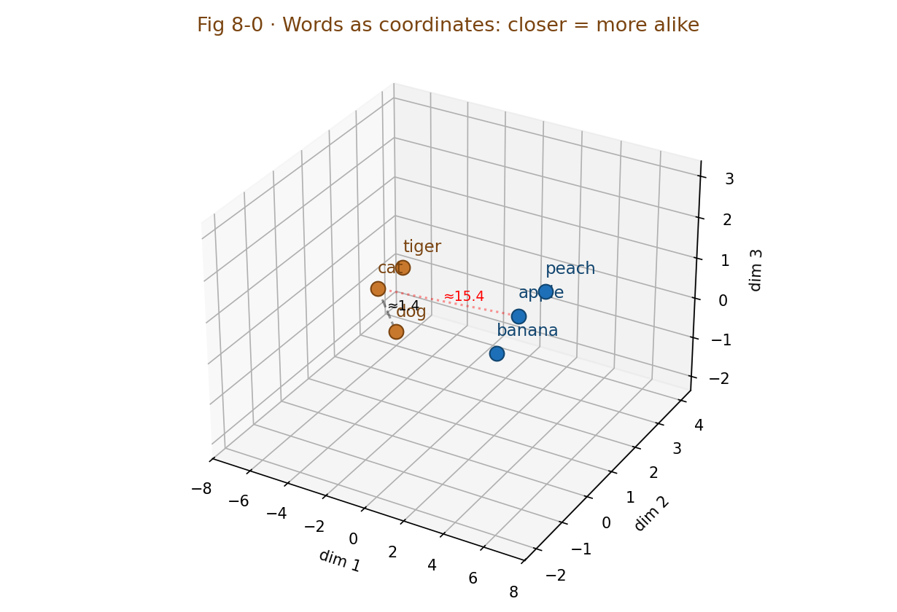

# Chapter 8 · Word Embeddings: Buying Each Word a Home in 3D Starry Sky

> ### 🎯 Before you turn the page · The puzzle this chapter cracks
>
> **🔥 The pain:** Images are numbers by nature, so the machine has something to scan. But the word "cat" in a computer is just one character ID, and **two adjacent IDs can have meanings worlds apart** — how does the machine know "cat" and "dog" are alike, and "cat" and "civil code" are not?
> **🤔 Your turn:** How would you turn "closeness of meaning" into something the machine can compute?
> **🧱 The naive move hits a wall:** Like a dictionary, "explain this word with other words" — to look up "cat" you look up "mammal," and "mammal" sends you elsewhere, **an endless loop that still can't compute 'how alike, exactly.'**
> The clever solution is downright romantic: buy each word a home in a starry sky. Read on. 👇

Leo fished out a little desk lamp, *click* lit it, and set it on the desk: "This chapter is the most romantic. We have to **buy each word a home** in a patch of **3D starry sky** — the closer in meaning, the closer they live. Come on, I'll show you whether 'cat' and 'dog' are really neighbors (✦ω✦)"

---

## Section 1 · Pin Words Into Space, and "Meaning" Becomes Computable for the First Time

Leo first laid out, for contrast, the two ways humans and machines "understand a word":

> **🧑 The human way · look it up in a dictionary**
> "Cat" = "a mammal, good at catching mice, goes meow..."
> Explaining a word with other words **loops endlessly:** look up "mammal" and you have to look up "mamma." Even after reading the whole dictionary, the computer **still can't compute** how alike "cat" and "dog" actually are.

> **🤖 The machine way · give it coordinates**
> "Cat" = (0.82, −1.30, 2.41, ...)
> A word = **one point** in space. "How alike" needs no explanation at all — **just measure the distance between two points,** and distance is grade-school stuff.

"These coordinates," Leo pointed at the lamp-lit desktop, "are the word's **embedding.** It does exactly one thing: assign each word a coordinate point in space, guaranteeing — **the closer in meaning, the closer they sit.**"

He wrote the chapter's **one sentence to memorize** extra big:

> 　✨ **Distance = semantic similarity**

"Cat and dog sit close, cat and pizza sit far, cat and 'civil code' are practically two galaxies apart," Leo marveled. "'Meaning,' that most ethereal of things, **becomes a computable object for the first time** — and the attention, Transformer, and Chapter 18's RAG ahead **all stand on this foundation.**"

> Mia, suddenly getting it: "So when I message ChatGPT, the first thing it does isn't 'read'?"
> Leo: "Right! It's **turning each word into a string of numbers like this.** Words become vectors first, and only then does the neural network have something to chew. **Embedding is the only customs checkpoint between the world of text and the world of numbers.**"

---

## Section 2 · Light the Lamp: settle "cat/dog" and "apple/banana" as neighbors, and measure the distances

All talk and no practice is empty. By the lamplight, Leo laid out a **3D starry-sky coordinate system** on the desk, made several words into glowing little balls, and assigned each a home:

▲ Fig 8-0 · 3D word-vector starry-sky coordinates

"Look," Leo nudged the balls, "**cat, dog, tiger crowd in the upper-left** — because they always appear in similar sentences (feed, raise, furry, zoo); **apple, banana, peach crowd in the lower-right.** A wide vacuum separates the two clusters."

Mia got curious: "So their 'distance' can really be measured with a ruler?"

"Of course! That's the whole point." Leo computed it live for her:

> 🎬 **Measure: cat 🐱(-7,3,-1) to dog 🐶(-6,3,-2)**
> 　x differs by 1, y by 0, z by 1 → distance ≈ √(1+0+1) ≈ **1.4, close neighbors!**
>
> 🎬 **Measure: cat 🐱(-7,3,-1) to apple 🍎(7,-2,3)**
> 　x differs by 14, y by 5, z by 4 → distance ≈ √(196+25+16) ≈ **15.4, two galaxies!**

> Mia clapped: "'Cat and dog alike, cat and apple unalike' — you really can compute a number to compare!"
> Leo: "That's the whole magic of embeddings. **Closeness of meaning is translated into distance in space.**"

> Mia pressed: "This 'distance' — is it the straight-line length between two points?"
> Leo: "As an intuition, fine to start there. But **in practice the more common measure isn't 'straight-line length,' it's the 'direction' — the angle between two vectors, called cosine similarity:** the more two vectors point the same way, the more alike, regardless of their length. When you write a retriever by hand in Chapter 28, that's exactly what the code uses. For this chapter, just hold the picture 'close = alike' and you're set."

But Leo immediately gave a vaccination — this is where embeddings are **most easily misunderstood** — pointing out two **key clarifications:**

> **🔬 Clarification 1 · On dimensions: 3D starry sky is just a 'dimension-reduced sketch'**
> Real embeddings are usually **hundreds to thousands of dimensions:** the word2vec era often used 300 dimensions; large models today commonly run over a thousand internally. High dimensions are what hold a word's **multiple identities** — "apple" must sit near fruit, phone, and "red" all at once. Any 3D picture is like flattening a globe into a map: handy to look at, **necessarily distorted.**

> **🔬 Clarification 2 · On origin: the coordinates aren't human-labeled, they're learned**
> **No linguist ever filled in coordinates for "cat."** The model repeatedly does fill-in-the-blank "predict the neighbor word" over a mountain of text, using Chapter 4's gradient descent to push the wrongness down bit by bit — **whoever keeps appearing in similar contexts gets their coordinates nudged closer.** Fully automatic, zero human labeling; the coordinates are just a byproduct of training.

> Leo quoted linguist Firth's famous 1957 line: "'**You shall know a word by the company it keeps.**' — 'Cat' and 'dog' both fit into '____ sleeps on the sofa' and 'take ____ for a vaccination,' so they get pushed together. This is the **distributional hypothesis.**"

---

## Section 3 · The Star Equation: king − man + woman ≈ queen

Since the coordinates are numbers, **you can add and subtract them.** Leo set up a teaser: "The 2013 word2vec paper had a finding that dropped the world's jaw — do **grade-school arithmetic** on word vectors, and the result is actually meaningful!"

He drew an arrow in the starry sky:

> 　**king − man + woman ≈ queen**

"In plain words," Leo gestured, "**the arrow between the two points 'woman − man'** captures exactly the relationship of '**gender**'; transplant that arrow **unchanged onto 'king,'** and it lands closest to 'queen.' In other words — **the 'relationship' between words is a transportable direction in this space!**"

Even better, arrows of the same relationship are **parallel to each other:**

| Relationship | Arrow A | Arrow B | Geometric feature |
|---|---|---|---|
| Gender | man → woman | king → queen | roughly parallel |
| Capital | China → Beijing | Japan → Tokyo | roughly parallel |
| Tense | walk → walked | go → went | roughly parallel |

> Mia's eyes went round: "Nobody taught it what a 'capital' is, yet the 'capital relationship' **emerges** by itself as a direction in space?!"
> Leo: "It's that magical. But let me calibrate one thing — the equation is **≈, not =.** This analogy 'often holds, isn't guaranteed' in real models; treat it as a **window for intuition, not a mathematical theorem.**"

---

## Section 4 · How the Coordinates Get "Nudged" Out: a fill-in-the-blank done a hundred million times

Mia pressed: "'Learned,' I get — but how exactly?" Leo broke "learning" into a four-frame picture-strip — Chapter 4's gradient descent again:

> 🎬 **Step 1 · Scatter points randomly**
> Training starts; each word gets a string of **pure random numbers.** Right now "cat" might sit right next to "civil code" — the space is pure chaos.

> 🎬 **Step 2 · Do the problem: guess the blank from the neighbors**
> Reading "the cat naps on the sofa," cover "cat," and let the model use the coordinates of "sofa" and "naps" to guess the blank — it scores every word in the vocabulary for "how much it looks like the answer."

> 🎬 **Step 3 · Wrong? Give it a nudge**
> Guessed wrong, so trace back "where it erred" and adjust coordinates: pull **the correct answer a bit closer to this context,** push the wildly-guessed word **a bit farther.** Each time it moves just a smidge — exactly Chapter 4's tiny downhill step.

> 🎬 **Step 4 · Repeat a hundred million times**
> "Cat" and "dog" always appear in the same kinds of contexts, so they get pushed toward the same region again and again. **The clusters, the gender arrow, the capital arrow — all byproducts piled up by this dumb method.**

Mia stared at the starry sky: "So those clusters... 'grew' by themselves, nobody drew the circles?"
Leo nodded: "**The clustering is a byproduct of statistics.** Real training is billions of sentences, hundreds of dimensions, trillions of problems — but the principle is exactly what you saw."

But this old method has a **fatal weakness,** Leo lowered his voice on purpose:

> ⚠️ **Fatal weakness: one word, one point only.**
> "This apple is so sweet" and "Apple's product launch" clearly have two different "apple"s, **but old-style word vectors can only issue it one coordinate** — the polyseme gets flattened into an average, stuck in the awkward zone between the fruit region and the tech region, half-belonging to each, fitting neither.

> Mia: "So how's that fixed?"
> Leo's eyes lit up: "Make the coordinates **'come alive'** — the same 'apple,' reading 'sweet,' drifts toward the fruit region; reading 'phone,' drifts toward the tech region. But how exactly does it 'consult' the surrounding words to update itself? Heh, that's the whole plot of next chapter's attention mechanism. Holding that thought (￣ω￣)"

---

## Section 5 · Embedding Inside ChatGPT: the first stop, and it's "alive"

word2vec is 2013-vintage tech — so why must you still understand it to use ChatGPT today? Leo nailed it in one line: "Because every large model carries its heir inside, and it completed one **key upgrade: coordinates went from 'dead' to 'alive.'**" He drew its position on the assembly line:

| Position | What it does | In a sentence |
|---|---|---|
| **Entrance · first stop** | Each word first **looks up its coordinates** | Your words are cut into tokens, and the model's first act is to look up the embedding table and swap them for vectors. From here on, **only numbers, never text again** |
| **Middle · dozens of layers of 'seasoning'** | Vectors are **rewritten** by context | Dozens of attention layers let each word consult its neighbors and revise repeatedly — by the end of the sentence, "apple" may already be dragged into the tech region by "launch." This is the **contextualized vector,** the watershed between large models and word2vec |
| **Exit · still comparing distance** | Generating the reply also relies on **this space** | When the model spits out the next word, it's essentially taking the current context vector and comparing "match" against all candidate words in the vocabulary; the better the match, the higher the probability |

Once you get this "look up + rewrite" line, Leo said, all your everyday "moments of magic" have explanations:

| What you see | The vector-space mechanism behind it |
|---|---|
| Phrase it differently and it still gets it | "how to return" and "how to apply for a refund" barely overlap in characters, **yet the vectors nearly overlap** |
| Mostly guesses right even with typos | context "pulls" the typo's vector back near the correct meaning |
| Ask in one language, draw on another's knowledge | multilingual training embeds the English "cat" and its Chinese equivalent "猫" to nearly the same point — **knowledge hangs on position, not on language** |
| Hook up a knowledge base and it answers internal questions | RAG: chunk documents, compute vectors, store them; pull the nearest few by distance and feed them to the model (built by hand in Chapter 18) |

> Leo drew a **boundary** at the end: "Remember — **close distance = similar context, not 'factually correct'!** 'I love you' and 'I hate you' have quite close vectors — the sentence structure and scene are nearly identical. So semantic search occasionally hauls back 'looks-alike but off-topic' passages; the vector space also can't tell truth from rumor. We'll use this trap over and over in Chapters 18 and 29."

---

## Section 6 · Traps You'll Probably Fall Into Too

**Trap 1: "Each dimension has a clear meaning, e.g. dimension 7 means 'gender'"**

> ❌ Imagining an embedding as a human-designed table: a height column, a gender column.
> ✅ The truth is — **the vast majority of dimensions have no human-readable meaning;** a concept like "gender" is scattered across the **combined direction** of hundreds of dimensions.

Root cause: the coordinate system forms **automatically** in training; pull out a single dimension and it's almost all noise. An interpretable arrow like the "gender direction" is a dimension-combination researchers dug out of the whole **after the fact** — **not any single coordinate axis.**

**Trap 2: "An embedding is looked up from a fixed 'word→number' dictionary"**

> ❌ "Word becomes number" sounds like a lookup.
> ✅ The truth is — it's a **statistical product trained** on a mountain of text; swap the corpus or the model, and the coordinates are completely different.

Root cause: early word2vec could indeed be saved as a static table once trained, but the values in the table are **learned,** not decreed; and in a modern large model, the same word's vector also **changes in real time with context** — which is exactly next chapter's story.

**Trap 3: "Two sentences with close vector distance mean they have the same meaning and trustworthy content"**

> ❌ Hearing "semantic similarity" as "equivalence."
> ✅ The truth is — close distance only means "**similar context;**" antonymous, opposite-stance sentences are often near neighbors.

Root cause: embeddings come from "who always appears in the same kinds of contexts," and "stocks soar" and "stocks crash" happen to share the same kind of context, so the distance is actually quite close. **Keep this firmly in mind when doing semantic search and RAG,** or you'll take a "looks-alike" wrong answer for the right one.

---

## Section 7 · The Finishing Move: everything is embeddable

Same ritual: a manual + a kill shot.

### The word-vector core, one table to mop it all up

| Concept | In a sentence |
|---|---|
| **embedding** | give each word a coordinate in space; closer in meaning, closer in seat |
| **distance = semantic similarity** | the chapter's one equation to memorize |
| **relationship = direction** | king−man+woman≈queen; arrows of the same relationship are parallel |
| **where coordinates come from** | not human-labeled, a byproduct learned from a hundred million fill-in-the-blanks |
| **static → contextualized** | word2vec: one word, one point; large models: rewritten in real time with context |

### The finishing move: everything is embeddable

This "squash into a vector, do business by distance" idea **doesn't care about the object at all** — as long as you can define "who should be close to whom," anything can be embedded into the same kind of space. This is exactly why it became the infrastructure of modern AI:

> 　🗣️ **"Can it be squashed into a vector? If yes, you can do business by distance."**
> - **Semantic search:** search "a cheap place to stay" and hit "budget hotel" — not one word overlaps, yet the vectors are close.
> - **Text-to-image search:** CLIP embeds images and text into the same space, "a running dog" sits next to dog photos.
> - **Recommender systems:** put your taste and millions of products into one space; whatever drifts near you gets recommended — "recommended for you" is really guessing **distance.**
> - **RAG:** chunk company documents and store them; at question time, haul the most relevant few by distance and feed the model (built by hand in Chapters 18 and 28).

Looking back from there, you'll find the soul of the whole system is this one chapter's line: **distance = semantic similarity.**

### Squeeze the whole chapter into one sentence and stuff it in your head

> **Embedding = buy each word a home in high-dimensional space; closer in meaning, closer in residence; "meaning" can be computed by distance for the first time.**
> Relationships are transportable directions (king−man+woman≈queen); the coordinates are learned by themselves from a hundred million fill-in-the-blanks, nobody labeled them.
> Old word vectors give one word one point, can't hold polysemy; large models make coordinates "come alive" with context — and what brings them alive is next chapter's attention.

---

Mia stared at that "apple" ball drifting back and forth between the fruit region and the tech region and pressed: "You keep saying 'apple' **consults the surrounding words** to update itself... but how exactly does it 'consult'? Average the neighbors? Or pick and choose with emphasis?"

Leo slapped the table: "You've hit next chapter's vital spot! Of course it doesn't dumbly average — it'll **highlight, like you do in class,** pulling out **several different-colored highlighters** to draw lines to the words that truly matter and absorb them with emphasis. Come on, next chapter I'll teach you how the large model draws those lines (✦ω✦)"

---

## 🧰 Pack it into your toolbox

> **🔑 Method in one sentence:** **Embedding** = give each word a coordinate in high-dimensional space, **closer in meaning, closer in seat;** memorize one line for the whole chapter — **"distance = semantic similarity";** relationships are transportable directions (king − man + woman ≈ queen).
> **🎯 Trigger · pull this out whenever:** you see "semantic search," "recommender system," "RAG retrieval," it's all this one line "distance = semantic similarity" behind it; but always remember the boundary — **close distance = similar context ≠ factually correct** ("I love you" and "I hate you" have close vectors).
>
> **✍️ Self-test with the book closed:**
> 1. Why does searching "a cheap place to stay" hit "budget hotel," even with not one word overlapping?
> 2. Mimic the star equation: Paris − France + Japan ≈ ? What is each step "transporting"?
> 3. Old word vectors give "apple" only one coordinate — what trouble does that cause?

> 🪜 **Next chapter preview:** Chapter 9 · Attention — a page full of highlighters; who exactly is the key point?

---

[← Previous](../stage_2/chapter_07.md) ｜ [📖 Contents](../README.md) ｜ [Next →](../stage_2/chapter_09.md)

> Reading *The Visible AI* · 30 free chapters —— back to the [**project home**](../../README.en.md). If it helped, a ⭐ Star helps others find it.
