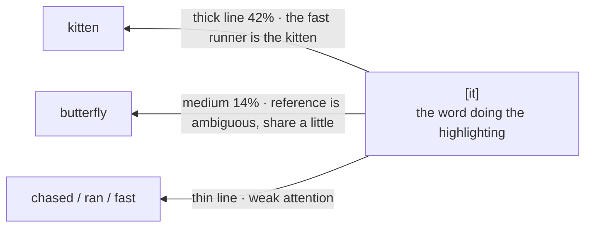

# Chapter 9 · Attention: A Page Full of Highlighters — Who Exactly Is the Key Point?

> ### 🎯 Before you turn the page · The puzzle this chapter cracks
>
> **🔥 The pain:** Last chapter gave each word a **fixed** coordinate. But "Apple launched a new phone" and "this apple is so sweet" clearly have **two** apples (the company / the fruit) — **how does one fixed point hold two meanings?**
> **🤔 Your turn:** How would you let "apple" change its own meaning depending on the neighbors it reads?
> **🧱 The naive move hits a wall:** The old method (RNN) is like **passing a note word by word,** the whole sentence's memory squeezed onto one little note passed down the line — **it forgets the front by the time it reaches the back,** and must queue up, no parallelism. Long sentences lose their memory outright.
> How do you let each word "look around and relocate itself on the spot"? This is the heart of large models. Read on. 👇

Leo dumped a handful of **different-colored highlighters** out of his pencil case: "Of course it doesn't dumbly average! It'll **highlight, like you do in class,** drawing lines to the words that truly matter and **absorbing them with emphasis.** This chapter's star — **attention** — is the heart of large models. Come on, I'll show you how it draws those lines as it reads a sentence (✦ω✦)"

---

## Section 1 · A Fixed Coordinate Can't Hold Flowing Meaning

Leo picked up last chapter's loose thread: "Chapter 8 gave each word a coordinate, but that coordinate is **fixed** — like printed into a dictionary, never to change. Here's the problem—"

> **Chapter 8's dilemma:** "Apple launched a new phone" and "this apple is so sweet" clearly have **two** "apple"s: a company, a fruit. **One point can't hold two meanings!**

"Attention's mission," Leo said, "is to upgrade this '**dictionary coordinate**' into a '**live coordinate**': each word **looks around and relocates itself on the spot.** Seeing 'launched' and 'phone,' this 'apple' drifts toward the tech company; seeing 'sweet,' that 'apple' drifts toward the fruit."

Stripped down, its method is **just three steps,** and every word in the sentence does them once:

| Step | What it does | The picture in a sentence |
|---|---|---|
| **① Score** | Give every word in the sentence (**including itself**) a relevance score | "How related are you and I?" |
| **② Convert** | Convert the uneven scores into a set of "absorption ratios" **summing to 100%** | "Allocate the budget by closeness of relation" |
| **③ Absorb** | Mix all words' information by ratio to get its own new representation | "Listen more to important neighbors, less to irrelevant ones" |

> Leo summarized: "So-called 'highlighting' is, in essence, **one operation of mixing information by relevance:** the higher a word's ratio, the bigger its share in the new representation. Every sentence and every word you send ChatGPT goes through this step — and **dozens of layers, dozens of times per layer,** over and over."

---

## Section 2 · Highlighter Lines: who does "it" refer to?

All talk and no practice is empty. Leo wrote a sentence on the desk, pulled out a highlighter, and taught Mia to **draw lines between words** the way you highlight key points — the thicker the line, the larger the attention weight.

He picked a classic example to nail the essence of "highlighting": **"The kitten chased the butterfly; it ran fast."**

> Leo: "Here, you be the model. Reading the word 'it,' what's the first question that pops into your head?"
> Mia: "Uh... who does 'it' refer to? The kitten or the butterfly?"
> Leo: "Full marks! That's exactly the key point 'it' needs to highlight. Watch me draw the lines—"

🎬 **Highlighter lines, live (from "it"'s viewpoint):**

"See it?" Leo pointed at the thick line. "'it' pressed **the heaviest 42% of its attention back onto 'kitten'** — so the model 'knows' the fast runner is the kitten. Note 'butterfly' also gets **14%** — **when the reference is ambiguous, the weight hesitates and splits, never betting it all on one side** — and that's very clever."

Take another quick one: in "the **bank** by the **river**," the highlighter draws a heavy line from "bank" to "river" — so this "bank" absorbs toward the riverside, not the financial one. Same pen, draws lines to the truly relevant words and brushes lightly past the irrelevant function words.

> Mia, hooked: "So the same 'apple' draws different lines in the two sentences, right?"
> Leo: "Quick study! In 'Apple launched a new phone,' 'apple' draws heavy lines to 'launched' and 'phone,' absorbing toward 'company'; in 'this apple is so sweet,' it draws a heavy line to 'sweet,' absorbing toward 'fruit.' **The same word, with different neighbors, has a completely different new representation after highlighting.**"

---

## Section 3 · Why It's Indispensable: from "passing notes" to "a round-table meeting"

Mia: "Something this useful — it didn't exist before?"

"Now we get to why attention is a **game-changer.**" Leo laid out two reading styles:

> **🐢 The old method (RNN) · the note-passing game**
> Before 2017, the mainstream method read **word by word, left to right:** the whole sentence's memory squeezed onto one 'little note,' passed down the line baton by baton, **losing a little with each pass.**

> **⚡ Attention · the round-table meeting**
> Swap the "relay" for a "round table": everyone directly connected, in one shot.

This swap **cured two fatal ailments at once:**

> **Fatal ailment 1 · long-distance amnesia**
> "The cat I raised at my grandma's house as a kid, the one that always loved to sunbathe... **it**" — by the time the note-passer reaches 'it,' the opening 'cat' was long diluted by the new words along the way. Attention lets 'it' **look straight back at 'cat': 3 words apart or 30,000 words apart, it's one-step direct, zero attrition.** This is the foundation that lets large models "read" hundreds of thousands of words.

> **Fatal ailment 2 · must queue up**
> Note-passing is serial: baton 4 must wait for baton 3. A tens-of-thousands-word article must honestly pass tens of thousands of batons, and the GPU's thousands of compute units can only stare. Attention lets **all words look around at once, all start at once** — training speed takes off, which is what makes the later hundreds of billions of parameters stackable (Chapter 15).

> Leo rapped the board: "The title of that 2017 paper was as bold as a manifesto — **'Attention Is All You Need.'** The architecture it birthed is next chapter's star, the Transformer."

---

## Section 4 · Q, K, V: checking out a book at the library

Mia: "So step 1, 'scoring' — how exactly does it score?"

"You've hit the engineering core!" Leo said. "Each word's vector passes through three trained 'transformation steps,' **splitting into three roles** — like the same person in a library being both the reader who asks a question and the book that gets searched. Picture yourself walking into a library:"

| Role | What it is | In a sentence |
|---|---|---|
| **Q · Query slip** | The question this word, as a "reader," sends out | "it"'s Q asks: **who do I refer to?** |
| **K · Key index tag** | The search tag each word hangs out | "kitten"'s K reads: **I'm an animal noun, the sentence's lead** |
| **V · Value, the book's content** | The actual information absorbed | After a match, **what gets borrowed is V** — tags only find the book, content is the gain |

Taking "it" as the reader, Leo walked through the **whole book-checkout** as a picture-strip:

> 🎬 **Step 1 · Hand over the query slip (Q)**
> "it"'s slip reads: "Who do I refer to? Preferably something animate, just mentioned." — This way of asking is **learned by itself in training.**

> 🎬 **Step 2 · Check against every tag (K), score each**
> Take the slip and check the whole library's tags: "kitten"'s tag "animal · sentence lead" → **high score;** "butterfly" "animal · supporting" → medium; "chased" "action" → low. The more the query and tag match, the higher the score.

> 🎬 **Step 3 · Convert into borrowing ratios**
> The high-low scores convert into borrowing quotas: kitten 42%, butterfly 14%, the rest get scraps. **Note: no one is fully denied a loan** — a low score just means borrowing less; the model never arbitrarily "vetoes."

> 🎬 **Step 4 · Copy by ratio (V), compile a new note**
> Copy content from each book by quota, compile a new note — that's "it"'s **contextualized new representation.** From this moment, "it"'s vector runs with **42% of "kitten":** the model "knows" who it refers to.

Leo flashed the chapter's **one and only formula,** instantly reassuring Mia: "Not understanding it doesn't matter at all! It says exactly the four steps above—"

> 　**Attention(Q, K, V) = softmax( QKᵀ / √d ) · V**

| Formula fragment | The library action |
|---|---|
| **QKᵀ** | Take the query slip and check against every book's tag, scoring each word pair for relevance |
| **÷ √d** | The librarian squashes the scores down a bit so no one dominates and training stays stable |
| **softmax** | Convert the scores into "borrowing ratios" summing to 100% |
| **· V** | Copy content from each book by ratio, compile into a note (= the new representation) |

> Mia: "Why split a word into three roles?"
> Leo: "Because 'what I want to find' and 'what I can offer' are **often not the same thing!** What 'it' most wants to find is someone else (the subject), while the info it can offer is little. Only by splitting Q and K can the model learn this **asymmetric gaze.**"

---

## Section 5 · Multi-Head Attention: several different-colored highlighters

"Now to reveal the secret of that handful of highlighters from the start." Leo spread out the different-colored pens. "**One attention = one 'viewpoint.'** But language has far more than one relationship worth attending to! So slice the vector into several parts and let multiple '**heads**' run in parallel, **each using one color of pen, each highlighting its own key points** — this is **multi-head attention.**"

For the same sentence "Apple launched a new phone, it's very thin," three pens draw three completely different highlight maps:

> 🖊️ **Yellow pen · the grammar head** (builds the sentence skeleton)
> "new" hangs on "phone"; "launched" holds "Apple" with its left hand, "phone" with its right — first raise the sentence's load-bearing walls.

> 🖊️ **Pink pen · the reference head** (who does "it" refer to)
> The heaviest line connects "it" back to "phone" — the thin one is the phone, not Apple the company. It also tentatively glances at "Apple": reference is often ambiguous, don't bet it all on one side.

> 🖊️ **Blue pen · the semantic head** (who's in whose camp)
> "Apple," "launched," "phone," "thin" pull tight into a "tech camp" — and it's exactly this pull that drags this sentence's "Apple" toward the tech company, not the fruit stand.

> 🖊️ **Three pens combined = multi-head attention**
> The three heads each draw their own lines, **without consulting each other,** each getting a little note; finally they're **concatenated and fused** into this layer's output.

> Mia: "Why not use one 'super-head' to highlight it all at once?"
> Leo: "One head can only learn **one way of looking at the sentence** at a time. Multiple heads in parallel, viewpoints complementing — like **several editors each highlighting their own key points and then pooling,** captures far richer relationships than one editor highlighting with one pen to the end. A real large model often has dozens of heads in one layer, then stacks dozens of layers — **a sentence gets 'highlighted' over and over, far more times than any human reader.**"

> Leo added an honest footnote: "The heads' division of labor grows by itself in training, **nobody decreed 'Head 3 handles reference.'** Researchers merely observed, after the fact, that plenty of heads do show such clear roles — and that plenty of heads have roles no one understands to this day."

---

## Section 6 · Traps You'll Probably Fall Into Too

**Trap 1: "Attention = human attention; the model is 'consciously focusing'"**

> ❌ The name is too anthropomorphic; you assume AI grew human-style attention.
> ✅ The truth is — it just **mixes information by similarity:** a mechanical scoring-and-weighting procedure, **with no consciousness and no subjective experience of 'focusing.'**

Root cause: "Attention" is just researchers' analogy borrowed from human cognition; the mechanism itself is those three steps: score → convert to ratio → weighted absorption. Treating it as "AI grew human attention" will **overestimate the model's understanding of the world.**

**Trap 2: "The model reads a sentence word by word, left to right, like a human"**

> ❌ Projecting your own reading habit onto the model.
> ✅ The truth is — **all words are processed in parallel at once;** the order info of who-comes-first is supplied separately into the vector via "positional encoding."

Root cause: attention treats the whole sentence **even-handedly, computed in one shot** — exactly the round table's second selling point: it can be massively parallelized on a GPU. How is the order supplied? Next chapter's Transformer reveals it.

**Trap 3: "Look at one attention-weight map and you can explain 'why the model answered this way'"**

> ❌ The arc diagram is too intuitive; you assume there's a real "key-points list" in the model's mind.
> ✅ The truth is — the weights are just a tiny handful of a hundred million intermediate values; whether "attention can serve as explanation" is **still hotly debated** in the research community.

Root cause: between a single head's weights and the final answer lie dozens of layers of mixing and rewriting — **asserting the model's "reason" from one weight map is like writing a whole film's plot summary from one frame of surveillance footage.**

---

## Section 7 · The Finishing Move: see through "why long chats get slower and pricier" in one sentence

Same ritual: a manual + a kill shot.

### The attention core, one table to mop it all up

| Concept | In a sentence |
|---|---|
| **The three attention steps** | score → convert to 100% ratios → absorb by ratio |
| **Q / K / V** | query slip / index tag / book's content — one library checkout |
| **Multi-head** | several colored highlighters, each highlighting its own key points, then concatenated and fused |
| **Why a game-changer** | the round table cures both "can't remember" (zero attrition) and "can't compute fast" (full parallelism) |

### The finishing move: see through the cost of long chats with the "handshake bill"

The round table has a price — **the number of handshakes:** every word must score against every word. 10 words = 100 handshakes, 100 words = 10,000 handshakes — **double the words, quadruple the bill** (quadratic growth). Remember this and many phenomena demystify on the spot:

> 　🗣️ **"Why, by round 200, does the AI reply slower and slower, with cost rising by length?"**
> —— It's not that the server's weak! It's attention's nature: **every new word generated must shake hands with every word before it.** The longer the chat, the more handshakes per step, and it worsens quadratically.
>
> This is also the root reason the **context window must have a ceiling** (detailed in Chapter 17), and each company's "million-token long-context" race is a contest over who's better at saving money on this **quadratic bill.**

### Squeeze the whole chapter into one sentence and stuff it in your head

> **Attention = each word looks around, "highlights" all words by relevance, then absorbs information by ratio, refreshing its own meaning on the spot.**
> Scoring relies on Q/K/V (a library checkout); multi-head = several highlighters each highlighting their own key points, then stitched together.
> It cures the old method's "can't remember, can't compute fast" in one stroke; the price is handshakes growing quadratically — the root of why context has a ceiling.

---

Mia put the highlighters away, thoughtful: "Attention is so powerful, the heart of large models... but 'heart' isn't 'the whole body,' right? It only handles 'moving the relevant info together' — and after the move? How do these parts actually assemble into a complete ChatGPT?"

Leo slapped his thigh: "You've hit next chapter's assembly shop! Attention only handles 'transport,' not 'digestion.' Assemble it with the other parts into a **'super-orchestra' where all the musicians play at once and nobody waits in line** — that's the **Transformer.** Come on, next chapter I'll take you into the assembly shop (￣▽￣)ノ"

---

## 🧰 Pack it into your toolbox

> **🔑 Method in one sentence:** **Attention** = each word looks around, "highlights" all words by relevance, then absorbs information by ratio, refreshing its own meaning on the spot; scoring relies on **Q/K/V** (one library checkout); **multi-head** = several highlighters each highlighting their own key points, then stitched together.
> **🎯 Trigger · pull this out whenever:** long chats get slower, pricier, and context has a ceiling — the root is all attention's **"quadratic handshake bill"** (double the words, quadruple the handshakes); and its ability to remember an opening tens of thousands of words back relies on "one-step direct, zero attrition."
>
> **✍️ Self-test with the book closed:**
> 1. Do the two "apple"s output the same at the embedding layer? After the attention layer? Why?
> 2. Use "checking out a book at the library" to explain what Q, K, and V each are.
> 3. Why does it get slower and pricier by round 200? "Plead the case" for the AI.

> 🪜 **Next chapter preview:** Chapter 10 · The Transformer Architecture — the ultimate super-orchestra with no queuing.

---

[← Previous](../stage_2/chapter_08.md) ｜ [📖 Contents](../README.md) ｜ [Next →](../stage_2/chapter_10.md)

> Reading *The Visible AI* · 30 free chapters —— back to the [**project home**](../../README.en.md). If it helped, a ⭐ Star helps others find it.
