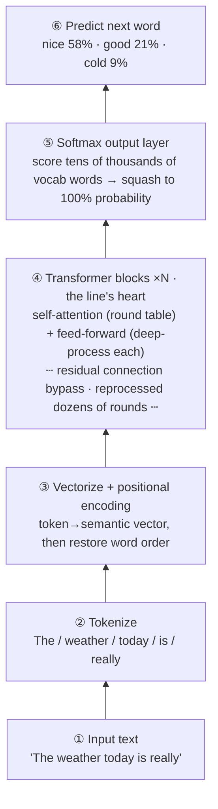

# Chapter 10 · The Transformer Architecture: The Ultimate Super-Orchestra With No Queuing

> ### 🎯 Before you turn the page · The puzzle this chapter cracks
>
> **🔥 The pain:** Attention is the heart of large models — but "heart" isn't "the whole body." How do these parts actually assemble into a complete ChatGPT that **can run in parallel and write out a whole passage word by word**?
> **🤔 Your turn:** The old method passes notes one at a time, in a queue. How would you process **all words of a sentence at once** without it descending into chaos?
> **🧱 The naive move hits a wall:** Keep using the old recurrent network (RNN) and pass serially — **you must wait for the previous word to finish before computing the next,** the GPU's thousands of compute units can only stare, and it **simply can't be fed or trained** on internet-scale data; it can't even line up at the large-model starting gate.
> A 2017 paper knocked this wall down. Read on for "the super-orchestra with no queuing." 👇

Leo rubbed his hands, all solemn: "You've hit Stage 2's **grand finale.** Assemble attention with the other parts and you get a **'super-orchestra' where all the musicians play at once and nobody waits in line** — its name is the **Transformer.** Today I'll take you into the assembly shop (￣▽￣)ノ"

---

## Section 1 · A Paper as Bold as a Manifesto

"In 2017," Leo told it like a storyteller, "eight Google researchers published a paper with a title bold beyond measure — **'Attention Is All You Need.'**"

The subtext: **the recurrent network (RNN) that ruled language AI for years can be thrown out;** with last chapter's attention alone, you can build a stronger architecture. The new architecture they built is called the **Transformer.**

> Mia: "Isn't that bragging a bit much?"
> Leo: "Facts proved it no idle boast — **the T in GPT, the T in BERT, are both Transformer;** Claude and Gemini are its descendants too. **Almost every large model you use today shares this same skeleton.**"

Why could it topple the old orchestra RNN? Leo laid out the contrast:

> **🐢 Before 2017 · the RNN era (like passing notes)**
> Pass word by word down the line, **forgetting the front by the back;** must process word by word in order, **no parallelism.**

> **⚡ After 2017 · the Transformer (like a round-table meeting / a super-orchestra playing in unison)**
> The whole sentence **enters at once, any two words talk directly;** the whole sentence computes in parallel, the GPU at full power — only this can be fed the entire internet's text.

What it does to each sentence boils down to a **four-step assembly line;** Leo had Mia memorize the outline first:

| Step | Name | What it does |
|---|---|---|
| **① Cut** | Tokenize | Cut the sentence into tokens, look up the vocabulary for IDs |
| **② Transform** | Vector + position | Turn each token into a semantic vector, then stamp a "position tag" to restore word order |
| **③ Grind** | N blocks process repeatedly | Self-attention exchanges info + feed-forward network deep-processes each, stacked dozens of rounds |
| **④ Guess** | Output a probability distribution | Score every token in the vocabulary: who's the most likely next word? |

---

## Section 2 · Walk the Assembly Line: from "The weather today is really" to "nice 58%"

Leo set up the demo bench, input "The weather today is really," and let Mia watch a Transformer line process it **bottom-up** into the probability of the "next word"—

Leo pointed out each layer to Mia, emphasizing the **easily-overlooked key** in step ③:

> 🎬 **The little mechanism in layer ③ · positional encoding**
> "Each token first becomes a semantic vector (that's Chapter 8's embedding). But note — the Transformer **processes the whole sentence in parallel,** and by nature **doesn't know the word order!** That way 'I hit him' would equal 'he hit me.' So each vector must also **add a 'position tag'** ①②③... to restore the word order that parallelism threw away."

> Mia: "Oh — so it doesn't read in order, it dumps the whole sentence into a bag of words and sticks a number on each?"
> Leo: "Sharp! Remember this; there's a question on it in Section 5 (￣ω￣)"

> 🔧 **How exactly is this 'position tag' stamped?** (for those who want a deeper look; skip without losing the thread): the early approach used a set of **sine/cosine waves** to give each position a unique "numeric fingerprint" — frequencies high and low, so the model reads off "which one this is, and how far apart they are"; today's mainstream large models mostly switched to **RoPE (Rotary Position Embedding):** rotate each word's vector by an angle based on its position, rotating further apart the farther away, so "relative distance" is encoded naturally into attention's scoring. Whichever the trick, the goal is one — **put back the 'who-comes-first, how-far-apart' that parallelism threw away.**

---

## Section 3 · Open the Engine Bay: the "trio" inside a block

Layer ④ of the line is the heart of the whole architecture: dozens of identical "blocks" connected head to tail (GPT-3 stacks **96**). Each block has only three things. Leo opened the engine bay and showed Mia each piece:

> **🎻 Piece 1 · Self-attention (the round table: all musicians exchange intel)**
> It's the all-hands version of Chapter 9's "highlighting": each word looks around the whole sentence, decides whom to reference and how much, and "absorbs" the others' info by ratio to update itself.
> **Why indispensable?** Without it, "apple" could never tell whether it's a fruit or a phone company — **meaning hides in the relationships between words; there must be an info-exchange step.**

> **🛠️ Piece 2 · Feed-forward network (FFN) (the independent workshop: each word deep-processed alone)**
> A small neural network; each word passes through it **alone,** words not disturbing each other.
> **Why indispensable?** Only meeting without digesting just stirs the info around repeatedly. **Attention handles "communication," the feed-forward network handles "thinking":** refining the just-collected intel into a more abstract judgment — from "there's a 'sweet' next to apple" to "this is a positively-reviewed food."
> 🥚 **Easter egg:** Researchers found that a large chunk of the model's "**factual memory**" — like "Paris" is "France's capital" — is **stored mainly in the feed-forward networks' parameters across the layers!** It's not just a processing workshop, it's also the model's "knowledge warehouse."

> **🛗 Piece 3 · Residual connection (the express elevator: keeps it trainable even at 96 layers)**
> It's the "layer-skipping highway" from last chapter. The chapter's only "formula" worth remembering, in plain words: **this layer's output = the original + this layer's annotation.** Each layer just sticks a sticky note on the original file, rather than rewriting it.
> **Why indispensable?** Without it, dozens of layers of continuous "rewriting" would grind the original info ever fainter, and the training correction signal couldn't pass back to the bottom — **the deep network just collapses in training** (this is Chapter 6's vanishing gradients!). With it, the worst case is "this layer's annotation is worthless, the original uploads unchanged," **making depth a no-lose bargain.**

> Leo summarized: "The trio itself **doesn't 'understand' anything** — what they do is super-large-scale statistics and transformation; 'understanding language' is a behavior that **emerges** once these mechanisms pile up to sufficient scale (detailed in Chapter 12)."

---

## Section 4 · Two Heavy Punches: how it dethroned RNN

"Academia never lacks new architectures," Leo said. "The Transformer's sweep relies not on clever ideas, but on **two hard engineering advantages**—"

| Round | 🐢 RNN · serial note-passing | ⚡ Transformer · parallel round table |
|---|---|---|
| **Training speed** | Must wait for the previous word before the next; the expensive GPU spends most of its time spectating | The whole sentence computes at once, the GPU's parallel power fully consumed — internet-scale corpus goes from "untrainable" to "trainable" |
| **Long-range dependency** | Word 1 passing to word 1000 is like telephone, forgotten along the way | Word 1 and word 1000 **talk directly** via attention, no decay no matter how far |
| **Each one's bill** | Simple structure, memory-cheap inference, advantage ends there | Attention's compute grows **quadratically** with length — the root of the limited context window (Chapter 17) |

> Leo rapped the board: "The first punch is especially fatal: the entry ticket to the large-model era is '**train a huge network on massive data,**' and RNN's serial nature means it **can't even line up for this race.** **It's not that RNN isn't smart enough, it's that it can't be fed.** This 'can-be-fed' engineering advantage ultimately snowballed into a generational gap in intelligence — a script AI history replays over and over: **win by being compute-friendly, not by being ingenious.**"

---

## Section 5 · Make the Model "Pop Out Words" by Hand: the autoregressive generator

"But the line produces only **one** token at a time," Mia puzzled, "so where do ChatGPT's big paragraphs of answers come from?"

"Good question! The answer is called '**autoregression.**'" Leo set up the generator demo. "Pick a word, append it to the sentence's end, **run the new sentence through the line again,** and pick the next one — let's run it by hand: each button press = one full pass of the line."

**Curtain up — prompt "The weather today is really":**

🎬 **Step 1:** Run the line; after "really" it's likely an adjective, roll the dice and pick the highest-probability "nice." **At this instant it has no concept of the word after that.**

🎬 **Step 2:** The whole sentence "The weather today is really nice" **runs again** bottom to top; punctuation is a token too — the comma wins.

🎬 **Step 3:** The attention distribution **flattens!** After a comma there are many paths, the model is less certain than before — "where the distribution flattens" is the source of AI's answer variety. This time it picks "perfect."

🎬 **Steps 4, 5:** "for going" "out"... the words the model generated itself now also **join the next prediction via self-attention — it's continuing its own chain.**

🎬 **Step 6:** The period has the highest probability; the model judges this sentence is done. (In a real large model there's also an invisible "end" token; generating it puts down the pen.)

> Leo revealed the counterintuitive truth: "At the moment it wrote 'nice,' the model **had no idea** 'out' would appear later. **The whole sentence is stitched from six mutually independent predictions!** ChatGPT popping out answers word by word is — **not a typewriter effect, but its real working rhythm.** This also explains why it occasionally 'talks itself into a corner halfway': each step is only responsible for 'the next word,' with no one supervising the whole text."

---

## Section 6 · Two Great Families: the reading BERT, the writing GPT

"The Transformer in the original paper was 'encoder + decoder' stitched together," Leo added a bit of family history. "Later researchers each took one half, splitting into two routes. All the divergence boils down to one question — **when predicting a word, which side may it look at?**"

> **📖 BERT · the comprehension type (fill in the blank)**
> Dig out a word in the sentence and let the model look at the **bidirectional** context to fill it back in. Good at comprehension tasks — search relevance, text classification, sentiment judgment.
>
> **✍️ GPT · the generation type (word chaining)**
> Only allowed to look **left,** predicting the next token. Seemingly "blind in one eye" compared to BERT, but **whoever can chain words can write anything** — ChatGPT, Claude, Gemini, today's large models are basically this route.

> Mia: "Why did the 'one-eyed' one have the last laugh?"
> Leo: "Because 'predict the next word' **forces the model to understand everything:** to chain 'the answer to this problem is ____' well, you have to actually know how to do the problem! Once scale is up, even comprehension tasks can be done by 'generating the answer' — to have GPT judge whether a review is positive or negative, just ask it 'is this positive or negative?' and it chains out 'positive,' and the classification is done. **One chaining model does both reading and writing,** while BERT can never write long text."

---

## Section 7 · Traps You'll Probably Fall Into Too

**Trap 1: "The Transformer is some AI product / some specific model"**

> ❌ In the news it's always tied to product names, so you assume it's a model.
> ✅ The truth is — it's **an architecture blueprint,** like the "internal combustion engine" to a car.

Root cause: remember the three-tier relationship — the **architecture** is the design (Transformer), the **model** is the product trained from the design (GPT-4, Claude), the **product** is the packaged service (ChatGPT). Saying "the Transformer released a new version" is like saying "the internal combustion engine put out a new sedan." (Models differ mainly in number of blocks, training data, and tuning; the trio in the engine bay is **largely the same.**)

**Trap 2: "GPT has already thought out the whole sentence when answering; popping word by word is just a 'typewriter animation'"**

> ❌ Humans have a mental draft before speaking, so you assume AI does too.
> ✅ The truth is — it **predicts only one token at a time,** appends to the sentence end, runs the line again to predict the next; **popping word by word is its real working rhythm.**

Root cause: you just **verified it by hand** in the generator — writing word 100, it doesn't know word 101 either. Chapter 14's temperature sampling and Chapter 23's "draft first, then answer" are all built on this fact.

---

## Section 8 · The Finishing Move: connect any phenomenon back to the assembly line

Same ritual: a manual + a kill shot.

### The Transformer trio, one table to mop it all up

| Part | What it does | In a sentence |
|---|---|---|
| **Self-attention** | All words exchange intel | round table, Chapter 9's heart |
| **Feed-forward network (FFN)** | Each word deep-processed alone | independent workshop + knowledge warehouse |
| **Residual connection** | output = original + annotation | express elevator, trainable even at 96 layers |

### The finishing move: every weird phenomenon you've seen connects back to the line

From now on, whenever you hit a "weird phenomenon" in ChatGPT, you can explain it with the line in one click — this table is also a **bluff-stopping guide:**

> | What you see | The root on the line |
> |---|---|
> | Answers pop out word by word, slower the longer | **Autoregression:** one token predicted at a time, 100 words = 100 full computations |
> | Forgets the opening if you chat too long, hard window ceiling | self-attention's **quadratic bill;** the excess is truncated, genuinely unseen (Chapter 17) |
> | Same question asked twice, different answers | the endpoint is a **probability distribution,** the answer is "dice-rolled" (Chapter 14) |
> | Chinese often "costs" more per token than English | the first step, **tokenization,** cuts Chinese into finer pieces (Chapter 11) |
> | Tell it to "think step by step" and the answer gets smarter | every extra word written is a new round of compute — **scratch paper is added compute** (Chapter 23) |

> 🗣️ A one-move bluff-stopper: see "our AI composes the whole piece before writing"? Check the first row — **as long as it's a Transformer autoregressive route, it pops out one word at a time.**

### Squeeze the whole chapter into one sentence and stuff it in your head

> **Transformer = a super-orchestra where "all musicians play at once, nobody queues": the whole sentence enters in parallel, any two words talk directly.**
> The engine-bay trio: self-attention (communication) + feed-forward network (thinking / storing knowledge) + residual connection (express elevator), stacked dozens of blocks.
> It dethroned RNN via "parallel training + long-range dependency"; the answer is popped out autoregressively, one token at a time.

---

## 🎓 Stage 2 · Clearing-the-Level Recap

Mia exhaled and slumped in her chair: "The four cornerstones... my brain feels stuffed full, but **crystal clear!**"

Leo smiled and strung the five chapters into one line:

> 6️⃣ **Backpropagation** — forward, recognize a cat through layer-by-layer abstraction; backward, fix errors through layer-by-layer accountability.
> 7️⃣ **CNN** — a 3×3 magnifying glass slides over the number grid, assembling a donkey from one edge.
> 8️⃣ **Embedding** — buy each word a home in high-dimensional space; "meaning" can be computed by distance.
> 9️⃣ **Attention** — each word pulls out a highlighter, looks around, highlights, and absorbs by ratio.
> 🔟 **Transformer** — pack attention into a "super-orchestra with no queuing," crushing RNN in parallel.

"You notice," Leo said meaningfully, "Chapters 8, 9, 10 build **layer by layer:** words first become points in space (embedding) → points highlight each other and refresh their meaning via attention → attention is then packed into the Transformer assembly machine. **By here, you've thoroughly taken apart a large model's 'engine'!**"

Mia's eyes lit up: "I get the engine... so next is seeing how this engine **gets built, filled with knowledge, and tuned into ChatGPT,** right?"

"Exactly!" Leo slapped the table. "Stage 3 — **Large Models · How an LLM Is Forged!** From tokens to pretraining, then tuned into the form you know. The engine's installed; time to light the fire (★ω★)"

---

## 🧰 Pack it into your toolbox

> **🔑 Method in one sentence:** **Transformer** = a super-orchestra where "all musicians play at once, nobody queues" (whole sentence parallel + any two words directly connected); the engine-bay trio — **self-attention** (communication) + **feed-forward network** (thinking / storing knowledge) + **residual connection** (express elevator); the answer is **autoregressive,** popped out one token at a time.
> **🎯 Trigger · pull this out whenever:** you see GPT, BERT, Claude, Gemini — they're all **different models of this same architecture blueprint;** and "answers pop word by word / context has a ceiling / same question different answers / Chinese costs more per token" all connect back to this line in one sentence.
>
> **✍️ Self-test with the book closed:**
> 1. The Transformer processes the whole sentence in parallel — how does it tell "I hit him" from "he hit me"?
> 2. Of the trio, which handles "communication," which "thinking," which keeps it trainable at 96 layers?
> 3. When GPT writes word 100, does it know word 101? What does this say about how it works?

> 🪜 **Next stage preview:** Stage 3 · Large Models — how an LLM is forged (Chapters 11–15).

---

[← Previous](../stage_2/chapter_09.md) ｜ [📖 Contents](../README.md) ｜ [Next →](../stage_3/chapter_11.md)

> Reading *The Visible AI* · 30 free chapters —— back to the [**project home**](../../README.en.md). If it helped, a ⭐ Star helps others find it.
