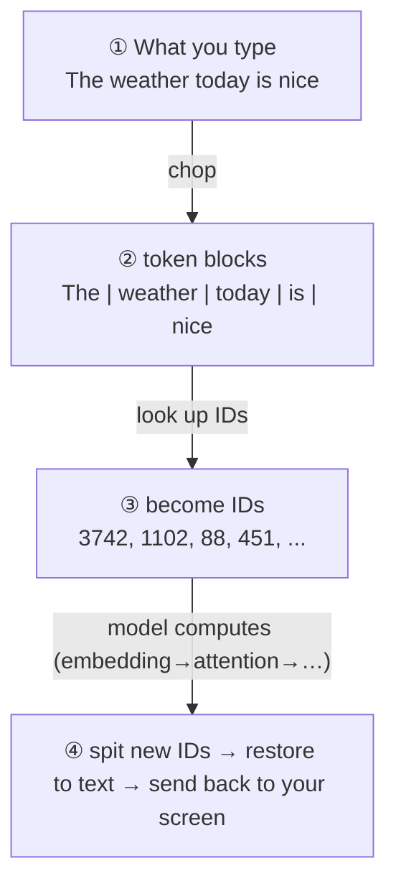

# Chapter 11 · The Tokenizer: The "Word Mincer" That Chops Language Into Pieces

> ### 🎯 Before you turn the page · The puzzle this chapter cracks
>
> **🔥 The pain:** Last chapter took the engine fully apart. But the first step — the model "turning each word into a number" — how does it actually **do** that?
> **🤔 Your turn:** If you had to feed a sentence to a machine that only knows numbers, how would you chop it? Whole words? Or one letter at a time?
> **🧱 The naive move hits a wall:** ① one letter at a time → a thousand-word essay is a thousand-plus steps, **compute blows up;** ② whole words only → new slang, names, typos **can never be enumerated,** and any out-of-vocabulary word is lost. Both are dead ends.
> So which living path do large models take? Read on for Leo's "word-cutting knife." 👇

Through Stage 2, Leo took Mia all the way through the large model's "engine" — the Transformer. Stage 3, Chapter 1, it's time to **fuel the engine.**

Mia: "I remember you said the model's 'first act isn't to read, it's to turn each word into a number'... but how exactly does it do that?"

Leo whipped a small knife from a drawer, a label on its spine reading "**word-cutting knife**": "Good question! Before fueling, we first have to **chop language into pieces the model can chew.** Today I'll use this knife to teach you what the 'token' in a large model's mouth actually is (￣▽￣)ノ"

---

## Section 1 · The Model Never "Sees Letters," It Sees a String of IDs

Leo first corrected a deep-rooted illusion for Mia:

> **You think:** the model reads "The weather today is nice" letter by letter — as if a literate person sits across the screen.
> **In reality:** it receives **[3742, 1102, 88, 451]** — a string of **IDs.**

"A large model never 'sees letters,'" Leo said. "Every sentence you type, before entering the model, is chopped into blocks of text Lego — **tokens** — each corresponding to one ID in the vocabulary. The model eats a sequence of IDs and spits out a sequence of IDs; **only the last step restores it to text for you to see.**"

He drew a sentence's full journey:

"The program that translates 'text ↔ IDs' back and forth," Leo pointed at the flow, "is the **tokenizer.** Lock in one thing — **it's not part of the model, it's the interpreter standing at the model's door.**"

> Mia: "So when ChatGPT answers, the words pop out in little chunks..."
> Leo: "Exactly! Every time the model computes **one** new ID, the system instantly translates it to text and sends it to you. The smallest unit that pops out is a **token block, not a letter** — so occasionally half a word pops out first and the next beat completes it; not strange at all."

---

## Section 2 · Why "Chopping Into Blocks" Is a Must: a living path forced out by two dead ends

Mia: "Read letter by letter, or read whole words — won't that work? Why bother chopping into blocks?"

"It really won't!" Leo laid out two dead ends. "Tokens are a living path forced out from both sides—"

> **🚫 Dead end ① · letter by letter (character level)**
> Each letter a block, a thousand-word essay is a thousand-plus steps. And inside the model "every block must greet every block" (Chapter 9's **quadratic bill**); a long queue **rapidly blows up** compute and working memory. Like building a wall out of grains of rice: you can build anything, it's just too slow and too expensive.

> **🚫 Dead end ② · whole words (word level)**
> Internet slang, names, typos, code variable names... **words can never be enumerated!** Any out-of-vocabulary word can only be marked "unknown," and a whole stretch of info is lost on the spot. Like building only from prefab rooms: a floor plan not on the blueprint can't be built.

> **✅ The living path · weld frequent ones whole, split rare ones into pieces (BPE)**
> Common words welded into whole blocks (saving steps), rare words split down to bytes (any input can be assembled, **never "unknown"**), and the vocabulary size can be precisely controlled. **Take the best of both ends!**

"So 'chopping into blocks' isn't the designers' OCD," Leo summarized. "It's the **optimal engineering compromise.** Get this, and every step of BPE follows naturally — all it does is **automatically find 'which combinations are worth welding into whole blocks.'**"

---

## Section 3 · The Word-Cutting Knife in Action: weld "to" and "ken" into a new block

Finally the knife takes the stage. Leo said: "The chopping scheme isn't decided by a human on a whim — it's **counted** from a mountain of corpus. The mainstream method is **BPE (byte-pair encoding),** and the idea is simple enough for one sentence — **whoever always sits next to each other, weld them into one block.**"

He spread the finest single-character blocks on the desk and started the picture-strip:

> 🎬 **Step 0 · Break it all apart**
> The vocabulary has only a few hundred smallest units (characters or bytes): `t` `o` `k` `e` `n` `i` `z` `e`... any text can be assembled, just chopped to bits.

> 🎬 **Step 1 · Count frequencies**
> Leo waved the knife over each: "Which two blocks sit together most often?" — one sweep of the corpus, and the pair `e`+`r` turns out to appear **tens of billions of times,** far in the lead!

> 🎬 **Step 2 · Weld into a new block**
> *Snap,* one cut, and Leo **welds `e` and `r` into one block** `er`, registers it in the vocabulary, issues a **new ID.** This high-frequency, high-upvote new token from now on **shows up whole, never split again!**

> 🎬 **Step 3 · Repeat tens of thousands of times**
> "Count frequencies → weld," "count frequencies → weld"... repeated tens of thousands to hundreds of thousands of rounds, finally amassing a vocabulary of tens of thousands to a couple hundred thousand blocks. **Frequent words become big whole blocks, rare words can only be assembled from pieces.**

Leo took the knife and, on the spot, welded the same sentence from **17 bits of debris** step by step into **9 Lego blocks** for Mia.

> Mia, suddenly getting it: "So everyday ones like 'the' and 'today' were long welded into whole blocks; the obscure ones are still debris?"
> Leo: "Quick study! Hence an **ironclad law** — **the more common, the bigger the block; the more obscure, the more it's split.**"

---

## Section 4 · The "Language Tax": why some languages cost more per token

That ironclad law directly determines different languages' "token density." Leo pulled out the ledger and computed for Mia:

| Chopping | One token holds | Example |
|---|---|---|
| **English** | About **three-quarters of a word** | common words whole (the, token), long words split into subwords (un·break·able); 1000 tokens ≈ 750 English words |
| **Chinese / Japanese / Korean** | **1–2 tokens per character** | high-frequency words whole, most single characters one block, rare characters split into bytes |
| **Rare characters / emoji** | **2–3 tokens per character** | no whole block in the vocabulary, falls back to byte-level assembly — "饕餮" "🍲" all pay "shipping" |

"See it?" Leo tapped the ledger. "**For the same meaning, a passage in many non-English languages chops into more tokens than English!** And the API **charges by token,** and the model's working memory (context window) is also counted by token — so these languages naturally pay a '**language tax**' (￣ヘ￣). English gets the discount, because tokenizers are trained predominantly on English text."

> Mia: "So why not weld the blocks even bigger, make the vocabulary even more aggressive, so a sentence takes just two or three blocks?"
> Leo: "Both ends have a price! **Blocks too big:** each appears fewer times in the corpus, the model can't accumulate enough 'feel for language,' and the vocabulary bloats; **blocks too small:** back to dead end ①, the queue lengthens, each step costs more. Mainstream vocabularies stop at tens of thousands to a couple hundred thousand blocks — **not a theoretical truth, but a sweet spot tuned through repeated engineering trade-offs.**"

---

## Section 5 · Three Weird Phenomena, One Pair of Token Glasses Sees Through All

"Many 'how can a large model not even do this' news stories," Leo gave a mysterious smile, "instantly stop being strange once you put on token glasses—"

> 🔍 **Weird phenomenon ① · can't count the r's in strawberry**
> What it sees isn't 10 letters, but `[str][aw][berry]` — **three ID blocks!** Asking it the letter count is like asking you over the phone "how many pen-strokes were in that sentence I just said" — the letter info was **sealed inside the blocks** at chopping time.

> 🔍 **Weird phenomenon ② · thinks 9.11 is bigger than 9.9**
> After chopping it's `[9][.][11]` versus `[9][.][9]`. Comparing block by block, "11" beats "9" — **like a version number, like a date, just not like a decimal.** Once chopped into blocks, numbers aren't naturally compared by value.

> 🔍 **Weird phenomenon ③ · why charge by token**
> The token is the basic unit of the model's every computation step: how many blocks eaten, how many spat, that's how much compute spent. So APIs charge by token, and the context window is counted by token too (detailed in Chapter 17).

> Leo taught a **case-cracking mantra:** "From now on, whenever a large model makes a baffling mistake, first ask one thing — **'Are the blocks it sees the same as the letters I see?'** Most mysteries solve right there."

---

## Section 6 · Traps You'll Probably Fall Into Too

**Trap 1: "One token is one word / one character"**

> ❌ The name "token" sounds too much like a tidy unit.
> ✅ The truth is — a token could be half a word, a phrase, a punctuation mark, even just one byte, **entirely decided by frequency of appearance.**

Root cause: BPE **only knows frequency, not grammar** — "the" is frequent enough to be one whole block, "饕餮" too obscure gets split into byte debris. **The block boundaries often don't line up with the human "word" boundaries.**

**Trap 2: "The model knows every character and understands its shape and strokes"**

> ❌ Anthropomorphic imagination.
> ✅ The truth is — the model only knows token IDs; **the concept of a 'character' simply doesn't exist for it.**

Root cause: what the model receives is always an ID sequence like [3742, 1102, ...]; it has no way to know what a character looks like or how many strokes make it. So **splitting characters, counting strokes, playing letter-shape puzzles are precisely its natural blind spots.** (Newer models often route around this by calling a code tool.)

**Trap 3: "The tokenizer is part of the model and gets smarter with use"**

> ❌ Mistaking the "interpreter" for the "brain."
> ✅ The truth is — the tokenizer is **finalized and frozen before training even begins;** it's just a "chopping lookup table" fixed by frequency.

Root cause: the flow is to first count the vocabulary from corpus and freeze the tokenizer, then all of training and every later conversation use this same table. So **after a new piece of slang catches fire, an old model still chops it into debris per the old table** — one reason a model carries a "sense of its era."

---

## Section 7 · The Finishing Move: one pair of token glasses cracks ten thousand cases

Same ritual: a manual + a kill shot.

### The token core, one table to mop it all up

| Concept | In a sentence |
|---|---|
| **token** | a Lego block of text, one ID per block; the model sees only IDs, never letters |
| **tokenizer** | the interpreter at the door, frozen before training, not part of the model |
| **BPE** | weld whoever always sits together: frequent whole, rare split |
| **token density** | English 1 block ≈ 0.75 words; CJK 1 character ≈ 1–2 blocks (the language tax) |

### The finishing move: put on the token glasses and crack weird phenomena instantly

From now on, whenever a large model makes any "rookie mistake," first put on these glasses and ask:

> 　🗣️ **"Are the 'blocks' it sees the same as the 'letters' I see?"**
> - Can't count letters → it sees `[str][aw][berry]`, the letters are sealed in the blocks.
> - 9.11 bigger than 9.9 → it sees `[9][.][11]`, chaining by version-number logic.
> - CJK costs more → low token density, paying the language tax.
>
> One pair of glasses cracks ten thousand cases. Even "why pop word by word" and "why charge by token" get explained along the way.

### Squeeze the whole chapter into one sentence and stuff it in your head

> **A large model doesn't see letters, only token IDs — text is first chopped by the "word-cutting knife" via BPE into Lego blocks, frequent ones whole, rare ones split, then swapped into a string of numbers and fed in.**
> Many non-English languages have lower token density than English, so they cost more per token (the language tax).
> Can't-count-letters and 9.11 > 9.9 — put on the token glasses and none of it is strange; the blocks it sees were never the same as the letters you see.

---

Mia handed the word-cutting knife back to Leo and pressed: "Okay, now the fuel is chopped into token blocks and poured into the engine... but what does the engine **actually do** with these tens of trillions of tokens? How does it learn, from a pile of debris, the skill of putting 'star' after 'Twinkle, twinkle, little'?"

Leo's eyes lit up: "You've hit Stage 3's heart! The answer is so humble you won't believe it — it plays **one game,** plays it **a trillion times.** Come on, next chapter I'll show you how this 'super-parrot that swallowed the entire internet' is forged (★ω★)"

---

## 🧰 Pack it into your toolbox

> **🔑 Method in one sentence:** a large model **doesn't see letters, only token IDs;** text is first chopped by **BPE** into Lego blocks (**frequent whole, rare split**), then swapped into a string of numbers and fed in. Many non-English languages have lower token density than English, so they **cost more per token** (the language tax).
> **🎯 Trigger · pull this out whenever:** a large model makes any "rookie mistake," first put on the token glasses — **"Are the 'blocks' it sees the same as the 'letters' I see?"** Can't count letters, says 9.11 > 9.9, CJK costs more — none of it is strange anymore.
>
> **✍️ Self-test with the book closed:**
> 1. Why can't it count the r's in strawberry?
> 2. Same meaning — which costs more tokens, the language or English? What does this mean for the bill?
> 3. Is the tokenizer part of the model, and does it get smarter with use?

> 🪜 **Next chapter preview:** Chapter 12 · Pretraining — the super-parrot that swallowed the entire internet.

---

[← Previous](../stage_2/chapter_10.md) ｜ [📖 Contents](../README.md) ｜ [Next →](../stage_3/chapter_12.md)

> Reading *The Visible AI* · 30 free chapters —— back to the [**project home**](../../README.en.md). If it helped, a ⭐ Star helps others find it.
