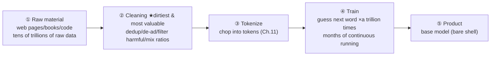

# Chapter 12 · Pretraining: The Super-Parrot That Swallowed the Entire Internet

> ### 🎯 Before you turn the page · The puzzle this chapter cracks
>
> **🔥 The pain:** The fuel is chopped into tokens and poured in — what does the engine **actually do** with these tens of trillions of tokens? How does it learn the skill of putting "star" after "Twinkle, twinkle, little"?
> **🤔 Your turn:** If you could only do one kind of "homework," repeated a hundred million times, and it taught a machine language, knowledge, even how to code — guess which kind of homework?
> **🧱 The naive move hits a wall:** You might think you'd have to **hire people to label the answer for every piece of data** (like labeling spam in Chapter 2) — but for tens of trillions of words, **no number of hires could ever finish,** and the cost talks you out of it instantly.
> Clever people found a game where "the answer comes free, built-in." Read on. 👇

Leo rubbed his hands, his face all "here comes the good stuff": "The answer's so humble you won't believe it — all of pretraining **plays just one game: word chaining.** It just plays this game **a trillion times.** Come on, let's see how this 'super-parrot that swallowed the entire internet' is forged (★ω★)"

---

## Section 1 · One Game, Played a Trillion Times

"Last chapter said the world is a string of tokens to a large model," Leo opened. "This chapter answers the next question: given tens of trillions of tokens, what exactly is it learning?"

He broke "word chaining" into three steps for Mia:

> 🎬 **Step 1 · Pose the question**
> Grab a snippet from the corpus: "Twinkle, twinkle, little ____" — and have the model guess the next token. It spits not one word but a **probability table:** star 92%, one 4%, lamb 1%... each candidate placing a bet.

> 🎬 **Step 2 · Check the answer**
> The original's next word "star" **is the answer key** — no question-setter, no grader needed! **Every position in the text comes with its own answer,** which is called **self-supervised learning.**

> 🎬 **Step 3 · Tweak**
> Guessed off? Use backpropagation (Chapter 6) to compute how much each parameter is to blame, tweak each a smidge — exactly Chapters 4 and 6's "guess → compare → tweak" loop. Then swap in the next stretch of text, **repeat a trillion times.**

"The whole training goal fits on one line," Leo wrote. "**Make P(next token | preceding text) as high as possible.**" Seeing Mia frown, he quickly translated: "**P is 'probability,' and that vertical bar reads 'given.'** In plain words: looking at this preceding text, the probability you report for the word that actually appears next in the original should keep getting higher. The more absurd the guess, the harder the parameters get tweaked. **Pretraining has no second goal.**"

Leo dragged the imaginary "training volume" slider, demoing the growth of four chaining problems:

> 🎬 **Training volume = 0:** the hundred billion knobs sit at factory-random; every candidate is pure guessing.
> 🎬 **Millions:** the most common patterns surface first — which words always sit together.
> 🎬 **Billions:** grammar is basically passable, common facts start to stick.
> 🎬 **Trillions:** obscure facts and code patterns gradually fall into place.
> 🎬 **Tens of trillions:** all four problems chained smoothly and accurately — grammar, facts, memory, coding, **none of them taught separately.**

> Mia spotted a detail: "These four problems progress at **different speeds**? Grammar learned fast, world facts ('the capital of France is Paris') slow, the really obscure ones not even sticking?"
> Leo gave a thumbs-up: "Sharp eyes! **The more common a pattern is in the corpus, the earlier it's learned** — remember this, it's big in the next section."

---

## Section 2 · The Game's Real Beauty: free answers

Mia: "Such a crummy little game — how can it hold up an entire large model?"

"The beauty is **Step 2**!" Leo raised his voice. "Chapter 2 said supervised learning's most expensive part is **human-labeled answers** — labeling a million cat photos takes a whole team, and at a million you hit the wall. But word chaining's answer is **built into the text,** so labeling cost **drops straight to zero**!"

"So," he said word by word, "the ceiling of training scale jumps from '**how many labelers you can afford**' to '**how big the internet is.**' This is the first secret behind a large model being able to get 'large' — **not that the game is sophisticated, but that this game can supply unlimited goods.**"

> Leo added: "No other task can do this! To teach the model 'translation,' you first hire people to pair a million sentences; for 'summarization,' you first hire people to write a million summaries; only 'predict the next word' — **every sentence on the entire internet is a ready-made exam question.**"

---

## Section 3 · Compression Is Intelligence: how chaining chains its way into "understanding"

Mia was still half-skeptical: "Such a simple game — how could it play its way to intelligence?"

"The key is the two words '**chain it right**'!" Leo said. "Internet corpus has everything under the sun, and to chain all kinds of sentences right, **memorizing alone isn't enough** — every type of chaining problem forces the model to learn a real skill:"

| A chaining problem you really meet in the corpus | To chain it right, you must... |
|---|---|
| "He studied very hard, so his grades ____" | **grasp grammar and common-sense causality** (chain "went up," not "went down") |
| "The capital of France is ____" | **remember world facts** (store "Paris" in your belly) |
| Last page of a detective novel: "The murderer is ____" | **long-range reasoning** (understand tens of thousands of words of setup, crack the case yourself) |
| "def add(a, b): return ____" | **know how to code** (read the function name and parameters, chain out a+b) |

"Now max out the scale," Leo got to the key. "Tens of trillions of tokens of corpus have to fit into a 'brain capacity' of only **hundreds of billions** of parameters — **two orders of magnitude apart, the original text simply can't be stored!**"

He gave a brilliant analogy:

> 🎓 **A top student cramming:** the textbook is three thousand pages, the cheat sheet allowed is one. He can't shrink-print the original; he can only **distill** — condense ten thousand example problems into a few solution methods, condense a whole chapter of history into a causal thread.

"The model faces exactly the same multiple-choice, and it **has no choice:** rather than memorize ten thousand phrasings of 'Paris is France's capital,' better to store one fact; rather than memorize all of GitHub's code, better to learn the grammar and patterns."

"An even harsher layer," Leo lowered his voice. "**Rote memorization simply can't score high in this game!** Tomorrow's snippet of preceding text is almost certainly unseen — a model that memorizes the original is exposed the moment it leaves the exam hall (Chapter 5's overfitting). **Only by distilling the patterns can it chain right on unseen sentences too. The more accurate the prediction, the deeper the distillation** — this is the line of jargon: **compression is intelligence.**"

> Mia slapped her thigh: "No wonder it can 'write a programmer's poem in Shakespeare's style'! That poem doesn't exist anywhere on the internet..."
> Leo: "Exactly! It stores not any poem's original text, but the **pattern itself** that is 'Shakespeare's style.' Grammar, facts, logic, translation, coding — **none of them taught as a separate chapter, all byproducts of playing one game to the extreme.**"
> Leo added two fair caveats: "One: 'compression is intelligence' is **the most persuasive interpretation around right now, not a sealed law** — whether compression alone fully explains how 'reasoning' and 'world models' emerge is still debated in the field; but as an **intuition,** it serves well enough. Two: the coin has a flip side — compression is **lossy,** details get blended and misremembered. Note both down; we'll settle the account in 'Traps.'"

---

## Section 4 · The Data Workshop: grunt work and astronomical numbers

"'Train on the entire internet' sounds romantic," Leo shifted gears, "but the workshop floor is all grunt work." He laid out a five-station line:

"Station ② is the most unassuming, yet the most critical." Leo stressed. "Raw web pages are full of ads, garbled text, templates, and junk-site nonsense — feed it straight in and that's what the model learns. The engineering each company pours into this step is **no less than training itself:**"

> 🧹 **Dedup:** the same viral post is reposted tens of thousands of times; without dedup the model rote-memorizes it (overfitting in disguise).
> 🧹 **Filter:** strip ads and nav, cut harmful and private content, throw out whole low-quality pages — **the rejection rate is astonishingly high.**
> 🧹 **Mix ratio:** like tuning a recipe, set what share code, multilingual, and encyclopedia each take. **Feed more code and the logic is usually stronger** (industry consensus).
> 🧹 **Conclusion:** Chapter 5's "data is king" comes true here — **same architecture and compute, the company with cleaner data wins. The model's ceiling is set at this cleaning step.**

Finally Leo had Mia feel the scale of this game (order-of-magnitude sketch for flagship models around 2025):

| Dimension | Magnitude | The feel |
|---|---|---|
| Training data | tens of trillions of tokens | one person reading 8 hours a day would need tens of thousands of years |
| Parameter scale | hundreds of billions of parameters | hundreds of billions of learnable "knobs" (Chapter 3's weights) |
| Training time | months of continuous running | tens of thousands of top GPUs round the clock; crash and climb back from a checkpoint |
| Training cost | millions of dollars in electricity | total cost an order of magnitude higher — only a few players left at the table |

---

## Section 5 · The Fresh-Baked Base Model: full of learning, can't chat

"Burn months of electricity," Leo said, "and what you get is **not ChatGPT,** but a '**base model.**' Give it the most accurate mental model — a **universal document completer:** whatever you input, it assumes this is the opening of some internet document, then strives to 'finish writing' that document."

"Don't believe it? Ask it a question—" Leo acted it out:

> **You think it'll answer:** "What is the capital of France?" → **Paris.** (a question and an answer — that's "assistant" behavior)
> **The base model might continue:** "What is the capital of France?" → **This is a second-grade quiz question. Choose the correct answer from the options below: A. Marseille B. Paris...**

"See!" Leo pointed. "The problem **isn't that it doesn't know, it's that it doesn't obey:** it has only one mode of behavior, 'continue the text,' and has no grasp of the social contract 'you're asking, I should answer.'"

He demoed a **trick** that amazed Mia:

> 🎬 Arrange the input as "The capital of France is ____" (leave the sentence half-done), and the base model instantly continues: "**Paris. Paris is the capital of France...**"
> 🎬 Or lay it out as "Q: ... [newline] A:", and to continue this "Q&A document" properly, **it has no choice but to dutifully write out the answer.**

> Mia: "Amazing! The knowledge is clearly in its belly, you just have to 'strike the right pose' to draw it out?"
> Leo: "Sharp! This trick is precisely the **embryo of prompt engineering** (Chapter 16). But a trick is still a trick — it works sometimes, not always, and can't trick out qualities like 'politeness,' 'refusing harmful requests,' 'admitting it doesn't know.' Truly tuning this chaining machine into an assistant that answers everything and knows the rules takes another kind of surgery — **next chapter's star.**"

---

## Section 6 · Traps You'll Probably Fall Into Too

**Trap 1: "The model stores a database of original text inside, and answering is 'looking it up' in there"**

> ❌ Treating the model as a search engine.
> ✅ The truth is — there's **not one piece of original text** in the parameters, only lossy-compressed statistical patterns; **the answer is generated on the spot, not looked up.**

Root cause: tens of trillions of tokens squashed into hundreds of billions of parameters means inevitable lossy compression. The upside is learning to generalize; the price is details getting "**blended,**" — mixing up similar names, dates, paper titles, confidently fabricating things that don't exist. **A major root of hallucination is right here** (detailed in Chapter 29).

**Trap 2: "The model surfs the internet daily, continuously learning new knowledge"**

> ❌ Mistaking the product's "web search" feature for the model's own ability.
> ✅ The truth is — **the moment training ends, the parameters are frozen;** it knows nothing of later news or new slang.

Root cause: retraining once is too expensive to do daily, so every model has a "**knowledge cutoff date.**" To make it chat about the latest, you have to **feed the material into the context on the spot** — this "external knowledge base" play is called **RAG** (covered in Chapter 18).

---

## Section 7 · The Finishing Move: see through "AI is looking it up" in one sentence

Same ritual: a manual + a kill shot.

### The pretraining core, one table to mop it all up

| Concept | In a sentence |
|---|---|
| **Pretraining = word chaining** | guess the next token, tweak parameters if wrong, repeat a trillion times |
| **Self-supervised** | the answer is built into the text, labeling free — so scale can reach the entire internet |
| **Compression is intelligence** | can't store the original, can only distill patterns; more accurate = deeper distillation |
| **Base model** | a universal document completer: full of learning but only continues text, can't chat |

### The finishing move: puncture "AI is looking it up" in one sentence

From now on, whoever says "it stores Wikipedia's original text in its belly, and answering is looking it up," rebut with the word "**compression:**"

> 　🗣️ **"Tens of trillions of tokens into hundreds of billions of parameters, two orders of magnitude apart — the original simply can't be stored, so it can only do lossy compression and distill patterns."**
> - So the answer is **regenerated on the spot,** not a lookup of original text.
> - So it can "write a programmer's poem in Shakespeare's style" (it stores patterns, not originals).
> - And so it will **confidently fabricate a nonexistent citation** (lossy compression, blended details) — that's hallucination.

One "compression is lossy" explains, along the way, why a large model "confidently spouts nonsense."

### Squeeze the whole chapter into one sentence and stuff it in your head

> **Pretraining = playing "guess the next word" chaining on the entire internet, a trillion times.**
> The answer is built into the text (self-supervised), so it can supply unlimited goods; the corpus is bigger than the brain capacity, forcing it to compress the original into patterns — compression is intelligence.
> The "base model" it produces is full of learning but only continues text, a universal document completer — tuning it into an obedient assistant is next chapter's business.

---

Mia stared at this base model that only continues text and treats questions as quiz papers, both exasperated and amused: "This thing... full of knowledge, but its temper is wild! You give it 'What's the capital of France' and it turns around and gives *you* a multiple-choice quiz (╯▽╰)"

Leo laughed: "You nailed it! A fresh-baked base model is a **wild, untamed 'savage beast'** — it only chains words along; pick a fight with it and it'll trade insults with you all day. How do you put **two taming spells** on this beast and grind it into a thoughtful assistant? Next chapter, the main event (★ω★)"

---

## 🧰 Pack it into your toolbox

> **🔑 Method in one sentence:** Pretraining = playing "**guess the next word**" chaining on the entire internet, a trillion times; the answer is **built into the text** (self-supervised), so it can supply unlimited goods; the corpus is bigger than the brain capacity, forcing it to **compress the original into patterns** — **compression is intelligence.** The "base model" it produces is full of learning but only continues text.
> **🎯 Trigger · pull this out whenever:** whoever says "it stores Wikipedia's original text and answers by looking up," rebut with "**compression**" — the parameters can't hold the original, only distill patterns and **generate on the spot;** and precisely because compression is **lossy,** it will confidently **fabricate a nonexistent citation** (hallucination).
>
> **✍️ Self-test with the book closed:**
> 1. Pretraining claims "no human labeling," yet it's always checking answers — contradiction?
> 2. Use the word "compression" to explain: why can't it store the original, and why does it hallucinate?
> 3. Send a fresh-baked base model "How do you make a soft-boiled egg?" — what's it most likely to output, and why?

> 🪜 **Next chapter preview:** Chapter 13 · Instruction Tuning & Reinforcement Learning — two taming spells from savage beast to thoughtful assistant.

---

[← Previous](../stage_3/chapter_11.md) ｜ [📖 Contents](../README.md) ｜ [Next →](../stage_3/chapter_13.md)

> Reading *The Visible AI* · 30 free chapters —— back to the [**project home**](../../README.en.md). If it helped, a ⭐ Star helps others find it.
