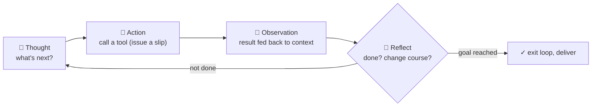

# Chapter 20 · Agents: The ReAct Loop, Letting AI Go to Work on Its Own

> ### 🎯 Before you turn the page · The puzzle this chapter cracks
>
> **🔥 The pain:** A task needs **many request slips in a row** (research three headphones → compare → recommend). Can it **check round by round on its own and decide the next step after each,** without you sending a command every step?
> **🤔 Your turn:** You give an intern a job, "report by Friday" — does he run back to ask "what's next?" after every web page he checks?
> **🧱 The naive move hits a wall:** You might think "the model's strong enough, chat long enough and it upgrades into an Agent" — but as long as every step is **initiated by you, the ball back in your hands,** however strong it is, it's just a "Chatbot with tools," not an Agent.
> The difference isn't how smart the brain is, but the architecture wrapped around it. Read on for that go-in-circles loop. 👇

Leo slapped his thigh, eyes blazing: "You've hit Stage 4's grand-finale bullseye! Pack the 'slip-issuing round' **into a loop,** let it **talk to itself and go in circles** to finish the job — that's the ultimate worker, the **Agent!** Today I'll send an Agent to do a job, and you'll watch it go in circles in the terminal (★ω★)"

---

## Section 1 · Chatbot vs. Agent: who holds the ball

"First take stock of the parts gathered over the last four chapters," Leo said. "Chapter 16 you learned to direct the model, Chapter 17 grasped the memory boundary, Chapter 18 gave it external material, Chapter 19 it learned to issue tool request slips. But these scenarios share one thing — **every round is initiated by you, and after one answer the ball returns to your hands.** However strong the model, this 'ask-answer' form is called a **Chatbot.**"

> **Intuitive impression:** an Agent is a **smarter** chatbot.
> **Real mechanism:** an Agent packs the large model **into a loop** — given a goal, it autonomously plans, calls tools, reads results, and decides again, **returning the ball only when done.**

"The model itself can be identical," Leo stressed. "The difference is the architecture wrapped around it: loop, tools, memory. The aptest picture is **giving an intern a job:**"

> 🧑‍💼 You say "research the competitors, report to me by Friday" — he won't run back to ask "what's next?" after every page; instead he **outlines it himself, searches himself, swaps keywords himself when a link is dead, and only comes to you when truly stuck.**

"**A Chatbot 'asks for instructions on everything,' an Agent 'gives a goal, delivers a result,'**" Leo summarized. "Note: what changes isn't necessarily the brain's smartness — **it's the collaboration mode that changed.** The judging criterion is one line: **who holds the ball.**"

Open any agent and inside is the same **set of four,** each of which you've seen:

| Part | From | Does what |
|---|---|---|
| 🧠 **Brain = LLM** | Chapters 10–14 | the only part that "thinks": plan, pick tools, read results, judge |
| 🔧 **Hands & feet = tools** | Chapter 19 | search, read pages, run code — "model issues slip, host executes," unchanged |
| 💓 **Heartbeat = loop** | this chapter's star | a plain `while` in the host: if not done, feed the result back and run another round |
| 🗂️ **Workbench = memory** | Chapter 17 | the context window holds the goal, plan, each round's footprints; long tasks also need external notes |

---

## Section 2 · The ReAct Loop Turntable: Think → Act → Observe → Reflect

"How does the 'loop' turn, zoomed to frames?" Leo drew a **turntable.** "The classic model is **ReAct** — each heartbeat is just these beats:"

"**The chapter's most important sentence,**" Leo rapped the board, "**the previous beat's output is the next beat's input.** The Agent didn't grow new organs — what makes decisions each round is still that chaining machine: read the context, continue the next stretch. The only change is what's in the context: no longer just your question, but the **footprints** it left all the way along — plan, request slips, tool results, errors, reflections. **The model keeps deciding on its own footprints.**"

"Why a loop at all?" Leo explained. "Because a multi-step task's key info '**only appears when you walk to that step**': without searching first, you don't know which three to check; without opening the link, you don't know the page is already 404. **However smart, a model can't write a perfect, never-to-be-revised plan at second zero** — when the plan can't keep up with change, the only way is walk a step, look a step, fix a step. A single generation gives no chance to 'look a step'; a loop does."

---

## Section 3 · Watch an Agent at Work: 7 heartbeats researching headphones

All talk and no practice is empty. Leo sent an agent to work — task: "Research three noise-cancelling headphones and give a buying recommendation," tools: search, open_page, read_notes. In the terminal, the agent starts **talking to itself, going in circles:**

> 🎬 **Round 1 · planning**
> 　🧠 Thought: "Break into three subtasks: ① find the top three by reputation ② collect price and reviews for each ③ summarize and write a recommendation. Do ① first."
> 　🔧 Action: `search("noise-cancelling headphones reputation ranking reviews")`
> 　👀 Observation: "Three names keep coming up: Brand A flagship, Brand B lightweight, Brand C value. Subtask ① done ✓"
> (Leo cut in: "'Break into three subtasks' looks like deep deliberation, but it's just an ordinary text generation — a cousin of chain of thought.")

> 🎬 **Round 2 · standard beat**
> 　🧠 Thought: "Check Brand A flagship: price, noise cancelling, fit, battery — four items."
> 　🔧 Action: `open_page("Brand A flagship in-depth review")`
> 　👀 Observation: "Key points to notes: strongest noise cancelling, comfortable fit, around the $300 tier; weakness, a bit heavy."
> ("Note 'key points to notes' — **working memory is accumulating,** that's the 'workbench' of the four.")

> 🎬 **Round 3 · reality strikes back**
> 　🧠 Thought: "Same approach, check Brand B's review page."
> 　🔧 Action: `open_page("Brand B lightweight review")`
> 　👀 Observation: "**Request failed: 404, page doesn't exist!**"
> ("404'd — **this is exactly why the loop must exist:** whether a page opens is info you 'only know at this step,' a perfect plan can't foresee it. The failure result is fed back too — the key is what it does next round.")

> 🎬 **Round 4 · reflect and correct (the show's highlight!)**
> 　🔄 Reflect: "Last round failed — **don't hit the same wall again.** Change strategy: don't open a specific page, use search terms to get the conclusion directly."
> 　🔧 Action: `search("Brand B lightweight noise-cancelling headphones review pros cons")`
> 　👀 Observation: "Key points: noise cancelling close to A, much lighter, around $200; weakness, average battery. Progress 2/3."
> ("**Errors are fuel too!** The failure record sits in the context, the model reads its own failure footprint and generates a new strategy — no one intervened. This is the most valuable scene of 'last round's output = next round's input.'")

> 🎬 **Round 5 · experience inherited**
> 　🧠 Thought: "Brand C left. **Reuse the just-validated search-term strategy,** steadier." → found the key points, subtask ② done (3/3) ✓
> ("Note 'reuse the just-validated' — Round 4's success experience stays in the footprint too, **the agent 'remembers' within the task.** But only valid in this context, forgotten when the window closes.")

> 🎬 **Round 6 · self-check**
> 　🧠 Thought: "On to subtask ③. Self-check first: are the three × four key-point notes complete?"
> 　🔧 Action: `read_notes() → check cell by cell` → "All 12 cells present, no gaps."
> ("Check the list before delivering — catch errors on the spot, rather than charging to the finish line sick.")

> 🎬 **Round 7 · judge done, exit the loop**
> 　🧠 Thought: "Info complete, wrap up: generate the recommendation, end the task." → Delivers: budget ample → A / commute priority → B / budget tight → C. **Goal reached → exit loop ✓**
> ("'Goal reached' is also a judgment the model generates — it can judge wrong too, so mature products often set **human acceptance** here. Recap this life: 7 rounds, 5 tool calls, 1 failed retry.")

> Leo connected phenomenon to mechanism: "What you've seen in products — Deep Research running ten-plus minutes showing 'read 14 sources,' Claude Code running tests after editing code, fixing again when tests go red — **that's not decorative animation, it's the real-time log of every loop beat; the product broadcasts the heartbeat to you.**"

---

## Section 4 · The Tyranny of Compounding: why Agents aren't so magical

"By here the agent sounds near-perfect," Leo turned. "Time for cold water — **this is the chapter's most honest part.**"

"The root was planted in Chapter 14: every model output is **probabilistic sampling,** and even an accurate single step is only 'probably right.' In chat it doesn't matter — you see the error and correct it next sentence. But an agent strings dozens of steps into a chain, **each step standing on the previous step's output,** and the trouble begins: errors aren't averaged out, they **compound!**"

He computed a scary bill (assuming 95% confidence per step):

| Consecutive steps | Confidence of no error throughout | The feel |
|---|---|---|
| 1 step | about 95% | very steady |
| 5 steps | about 77% | starting to worry |
| 10 steps | about 60% | barely past half |
| 20 steps | about 36% | **probably already erred midway** |
| 50 steps | about 8% | **almost certain to faceplant** |

"**The longer the chain, the more 'smooth all the way' resembles a lottery,**" Leo said. "Beyond error accumulation, three common death modes:"

> 💀 **Death 1 · infinite loop:** repeatedly retrying the same failing action — like an NPC stuck in a corner, marching in place, burning tokens, zero output.
> 💀 **Death 2 · drift:** a small misread in Round 3 (reading "noise-cancelling headphones" as "noise-cancelling speakers"), inherited as established fact by a dozen later rounds, drifting further and further.
> 💀 **Death 3 · cost explosion:** every round re-reads the ever-growing footprint in full (Chapter 17, billed by token); rounds × footprint length, the bill spikes far beyond intuition.

The engineering world's **set of three solutions** (common idea: don't let an error survive a round, don't let the chain grow out of control):

> ✅ **Human-in-the-loop:** delete files, spend money, send externally — must stop and wait for a human to sign.
> ✅ **Subtask splitting:** cut a 20-step long chain into several 5-step short chains, each delivering a quickly-checkable small result. **The shorter the compounding chain, the higher the survival probability — arithmetic, no magic.**
> ✅ **Verifiable intermediate products:** write code, run tests; do research, keep source links. Catch errors on the spot.

> Leo answered a phenomenon-level question: "**Why did code-writing agents mature first?** Because code comes with a free verifier — the compiler and tests. Every round's 'observation' gets an objective hard signal, an error can't survive a round before it's found, and a wrong fix can be rolled back in one click. Whereas 'fully-automatic stock trading' and 'fully-automatic negotiation' have slow feedback, loud noise, irreversible errors. A rule of thumb: **the more easily a domain's results can be cheaply verified and its errors reversed, the sooner agents become usable.** Next time you see an agent product launch, ask these two questions first — more reliable than watching the demo video."

---

## Section 5 · Traps You'll Probably Fall Into Too

**Trap 1: "An Agent has autonomous consciousness — it 'wants' to reach the goal, and 'won't give up' retrying when it fails"**

> ❌ Watching it work continuously, hit walls and reroute, looks too much like "having a will."
> ✅ The truth is — **"the goal" is just a piece of text you wrote into the prompt, and "won't stop till the goal" is a hard-coded `while` loop in the program.**

Root cause: two experiments to expose it: ① swap the prompt's goal for any other string and it's **equally "persistent"** about the new goal, with no preference; ② have the host stop feeding results back (unplug the loop) and the "will" **vanishes on the spot,** degrading to ordinary ask-answer. **Persistence is a property of the architecture, not of the mind** — desire is written in your prompt, perseverance is written in the engineer's `while`.

**Trap 2: "Agents can already fully-automatically replace human work"**

> ❌ The agent demo videos you scroll past are all **cherry-picked successes** cut from countless runs.
> ✅ The truth is — **long-chain success rate decays by compounding,** and the steadiest form right now is **human-machine collaboration:** AI runs short chains, humans gatekeep the joints.

Root cause: the failures don't appear in your timeline. In real engineering, long tasks still infinite-loop, drift, burn budget, so mature products all keep a human-confirmation gate (Claude Code asks you before every file delete or command). **The most capable usage right now isn't "fully automatic," but treating the agent as a tireless intern:** you set the direction, split the tasks, accept the intermediate products — it brings speed, you bring judgment.

---

## Section 6 · The Finishing Move: who holds the ball

Same ritual: a manual + a kill shot.

### The Agent core, one table to mop it all up

| Concept | In a sentence |
|---|---|
| **Chatbot vs. Agent** | ask-answer vs. give-a-goal-autonomous-multistep — criterion: who holds the ball |
| **The set of four** | brain (LLM) + hands & feet (tools) + heartbeat (loop) + workbench (memory) |
| **ReAct loop** | Think → Act → Observe → Reflect, previous beat's output = next beat's input |
| **Compounding tyranny** | 95% per step, 50 steps leaves only 8% — the longer the chain, the more a lottery |

### The finishing move: two questions to see through any "Agent product"

From now on, see any "fully-automatic Agent" launch, skip the demo video, ask two things first:

> 　🗣️ **"① Can this domain's results be cheaply verified? ② Are the errors it makes reversible?"**
> - Both "yes" (writing code: compiler/tests verify on the spot, wrong fixes roll back) → **agent matured early, usable.**
> - Both "no" (stock trading, negotiation: slow feedback, loud noise, irreversible errors) → **compounding decay with no one to stop it, absurd.**
>
> Plus a demystifier: **its "persistence" is a hard-coded `while` loop, not a will** — swap the goal for another string and it's equally "persistent"; unplug the loop and the "will" vanishes on the spot.

### Squeeze the whole chapter into one sentence and stuff it in your head

> **Agent = pack a large model into the ReAct loop (Think → Act → Observe → Reflect), and given a goal, let it keep deciding on its own "footprints," autonomously call tools, and walk through many steps before delivering — the set of four = brain + hands & feet + heartbeat + workbench.**
> The previous beat's output is the next beat's input, so errors are fuel too (it can self-correct), but errors also compound — 50 steps almost certainly faceplants.
> It has no will (persistence is a hard-coded `while`), and can't fully-automatically replace humans; the steadiest form is human-machine collaboration, and code agents matured first thanks to "cheap verification + reversible errors."

---

## 🎓 Stage 4 · Clearing-the-Level Recap

Mia exhaled, counting on her fingers: "This stage, I feel like I went from 'can chat' to 'can orchestrate'!"

Leo smiled and strung the five chapters into an "application advancement chain":

> 1️⃣6️⃣ **Prompts** — draw a circle in high-dim space, put on a personality mask, drag the model into the right knowledge cluster.
> 1️⃣7️⃣ **Context window** — the model has only one window (goldfish memory + quadratic bill), put the right info in the window.
> 1️⃣8️⃣ **RAG** — open-book exam: keep documents outside, retrieve the most relevant few passages into the window by question.
> 1️⃣9️⃣ **Function Calling** — fit the brain with robot hands: write the prescription (JSON), the host fills it (executes).
> 2️⃣0️⃣ **Agent** — pack the slip-issuing round into the ReAct loop, let AI go in circles and work on its own.

"You notice," Leo said meaningfully, "these five chapters are an **ability-leap chain:** first 'speak' (prompts) → understand the boundary of 'memory' (context) → give it 'external knowledge' (RAG) → give it 'hands' (tools) → pack it all 'into a loop and let it be autonomous' (Agent). **Each step stands on the previous step's parts, finally assembling an agent that works on its own — exactly the hottest frontier of today's AI products!**"

Mia's eyes lit up: "I can build applications now... so what about AI's **cutting edge**? Text-to-image, reasoning models that 'think,' and that MCP thing..."

"Right into the next stage!" Leo slapped the table. "Stage 5 — **Frontier · Multimodal & Reasoning!** Image generation's denoising magic, AI understanding image, text, and audio at once, reasoning models that 'draft first, then answer,' and the engineering-ecosystem panorama. **Understand every hot term in today's news (★ω★)**"

---

## 🧰 Pack it into your toolbox

> **🔑 Method in one sentence:** **Agent** = pack a large model into the **ReAct loop** (Think → Act → Observe → Reflect), and given a goal, let it keep deciding on its own "footprints" and autonomously walk through many steps; the set of four = brain (LLM) + hands & feet (tools) + heartbeat (loop) + workbench (memory). **The previous beat's output is the next beat's input** — so errors are fuel, but errors also **compound** (50 steps almost certainly faceplants).
> **🎯 Trigger · pull this out whenever:** see any "fully-automatic Agent" launch, ask two things first — **① can this domain's results be cheaply verified? ② are its errors reversible?** (both "yes" like writing code = matured early; both "no" like stock trading = absurd); its "persistence" is a hard-coded `while` loop, not a will.
>
> **✍️ Self-test with the book closed:**
> 1. Use "the set of four" and "who holds the ball" to judge: is a chatbot with a search tool an Agent now? What's still missing?
> 2. An Agent at Round 15 is still repeatedly visiting an unopenable site — which death mode is this? How to save it?
> 3. Why did the "code-writing" Agent mature before the "fully-automatic stock trading" Agent?

> 🪜 **Next stage preview:** Stage 5 · Frontier — Multimodal & Reasoning (Chapters 21–25).

---

[← Previous](../stage_4/chapter_19.md) ｜ [📖 Contents](../README.md) ｜ [Next →](../stage_5/chapter_21.md)

> Reading *The Visible AI* · 30 free chapters —— back to the [**project home**](../../README.en.md). If it helped, a ⭐ Star helps others find it.
