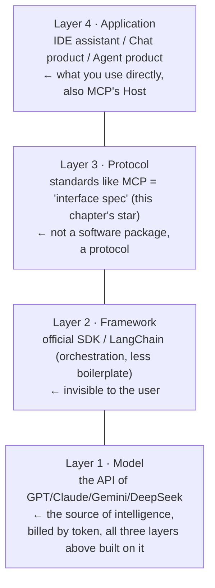

# Chapter 24 · The MCP Ecosystem: Fitting AI's Toolbox With a Standard USB Port

> ### 🎯 Before you turn the page · The puzzle this chapter cracks
>
> **🔥 The pain:** In Chapter 19 the model learned to "issue request slips," but **every tool's interface looks different,** application teams write glue code daily and keep connecting wrong. N apps need to connect M tools — how does this end?
> **🤔 Your turn:** Devices used to come with their own chargers and cables; how was "a pile of cables" eventually solved?
> **🧱 The naive move hits a wall:** With no standard, **each app writes its own integration for each tool:** 4 apps × 5 tools = 20 sets; a tool upgrades and all apps follow, a new app arrives and all tools reconnect — **an N×M spiderweb, the ecosystem simply can't grow.**
> The answer is fitting a unified port onto all the world's tools. Read on for that USB-C. 👇

Mia: "Is there a unified standard?"

Leo fished a standard **USB-C socket** from his pocket and plunked it on the desk: "Right into this chapter! Today's hottest **MCP** is here to fit a **unified USB port** onto all the world's tools — local systems, browsers, databases. Any large model, **plug and play** (★ω★)"

---

## Section 1 · Before the Port Was Unified: every device carried its own cable

"Continuing from Chapter 19," Leo opened, "that chapter's conclusion: the model only issues 'request slips,' the host program actually executes the tool. But one question went unspoken then — **who writes the connecting code between the host and each tool?**"

"Checking weather connects to a weather API, reading files connects to the file system, connecting a repo connects to GitHub..." Leo said. "In the era without a standard, **each app team had to write its own 'glue code' for each tool.** Count the ledger and you see this road doesn't go far:"

> **No standard · the spiderweb:**
> 　**N apps × M tools = N×M sets of glue code**
> 　4 apps × 5 tools = 20 dedicated lines. A tool upgrades and all apps follow; a new app arrives and all tools reconnect — **everyone's overwhelmed, the ecosystem can't grow.**

> **With a unified port · the bus:**
> 　**Each connects only once = N+M integrations**
> 　The tool side writes one server, the app side connects one client: 4+5=9. **A new tool launches and only adds 1, all apps instantly usable** — growth goes from **multiplication to addition,** and the ecosystem can finally roll.

"This is what **MCP (Model Context Protocol)** solves," Leo said. "Open-sourced by Anthropic in late 2024, with OpenAI, Google, and other mainstream players following from 2025, it's now one of the industry's de facto standards. What it does, in one line — **define a unified port between AI applications and the outside world.**"

He held up the USB-C socket:

> 🔌 **MCP is to AI applications what USB-C is to electronic devices.**
> Before the port was unified, every device came with its own charger and cable; after, **the device side and accessory side each adapt to USB-C once, and they're plug-and-play with each other.** MCP is the same: the tool side writes one MCP server per the protocol, and all MCP-supporting apps can use it directly — **they needn't know each other, only know the port.**

---

## Section 2 · Count Them: spiderweb vs. bus (picture-strip)

All talk and no practice is empty. Leo laid out on the desk: **4 AI apps** on the left (chat app, IDE assistant, Agent product, office plugin), **5 tools** on the right (file system, database, browser, GitHub, calendar), demoing two worlds:

> 🎬 **Act 1 · the world with no standard (spiderweb)**
> Leo connected each app to each tool it uses with red lines **pairwise**... and the desk was instantly **plastered with a dense mess of red lines.** "'IDE assistant' uses 5 tools, so it writes **5 sets of integration code;** any tool upgrade and this code may follow!"

> 🎬 **Act 2 · launching a new tool (spiderweb version)**
> Leo added a 6th tool, "search engine": "**All 4 apps each write another integration** — the spiderweb suddenly gains 4 lines! The tool side is worse off: one tool serving 4 apps gets integrated 4 times, one set each — who maintains it?"

> 🎬 **Act 3 · the world with MCP (the bus)**
> Leo placed the USB socket in the middle — this is the **MCP bus.** Each app connects only **1 line** to the bus (implement an MCP client once), each tool also connects only **1 line** to the bus (write an MCP server). The desk cleared up at once: **4+5=9 lines.**

> 🎬 **Act 4 · launching a new tool (bus version)**
> Add the 6th tool again: "The tool side writes **1 MCP server** and hangs it on the bus, and **all 4 apps are instantly usable** — only 1 more line!"

> Leo tapped the socket: "**The MCP bus itself contains no model** — it's just a protocol for 'how to talk,' **like the USB-C port doesn't generate power, yet lets all devices interconnect.**"

---

## Section 3 · Take Apart an MCP Server: three capabilities, three roles

"What actually flows through the unified port?" Leo asked. "MCP specifies the server can offer the app **three kinds of things** — the first you already know:"

> 🔧 **Capability 1 · Tools:** callable actions — send a message, query a database, run code. **It's the Chapter 19 function-calling set,** just that the tools now live in the server and introduce themselves in a unified format.
> 📄 **Capability 2 · Resources:** readable data — documents, tables, logs. The app pulls it into the context (Chapter 17's desk) for the model to read, **so reading data needn't masquerade as "calling a tool."**
> 📝 **Capability 3 · Prompts (prompt templates):** preset phrasings — the tool side knows best "how to ask its own tool for best effect" (Chapter 16's craft), so it packages mature phrasings as templates, **for users to pick and use.**

Then learn **three roles** (high-frequency in docs and news, one plain sentence each):

| Role | Plain: who it is | Example |
|---|---|---|
| **Host** | the AI app proper you're using — decides which servers to connect, which operations to permit (the "sign and execute" of Chapter 19) | Claude Desktop, IDE assistant |
| **Client** | the "connector" inside the Host, dedicated to talking with one server, one-to-one paired (the user can't feel it) | the app's built-in MCP connection module |
| **Server** | the "provider" the tool side writes: packages tools/data/templates per the protocol and hangs them out, local or remote | file-system server, GitHub server |

---

## Section 4 · The Ecosystem Panorama: a four-layer map, find your position

"Zoom the lens out," Leo said. "MCP is just **one layer** of the AI engineering ecosystem. From model to the product in your hands lies a clear **four-layer division.** Looking up from the foundation:"

> Leo positioned Mia: "Two sentences — **when you go hands-on in Chapters 26–28, you mainly deal with the model-layer API** (apply for a key, send requests, read responses); and to quickly add capability to an AI app at hand (query GitHub, connect a database, read local files), **using a ready-made MCP server is the low-code shortcut:** the community already has plenty of ready servers, install and use, **not one line of glue code needed.**"

Connect phenomena you've seen in products to this bus — many "new features" are really MCP wiring behind the scenes:

| What you see in AI products | The mechanism behind it |
|---|---|
| Claude/Cursor settings gain an "Add MCP server," install it and it can query GitHub | the app is the **Host,** what you installed is a **Server,** plug-and-play onto the bus — the ability is connected in, not newly learned by the model |
| The same "connect database" server works in several different AI apps | the tool side wrote the **server once,** all MCP-supporting Hosts share it — that's the "N+M" dividend |
| Some AI assistant couldn't read your local notes yesterday, install a plugin and it can | not a model upgrade, but **a new line connected** (notes server) — unplug the line and the ability instantly vanishes |
| News says "model X now supports MCP" | means its app implemented a **Client** and can join the MCP bus — a different matter from whether the model itself "got smarter" |

---

## Section 5 · Traps You'll Probably Fall Into Too

**Trap 1: "MCP is a new model Anthropic released"**

> ❌ The name has "Model" in it, and news often reports it mixed with model launches.
> ✅ The truth is — **MCP is a protocol (interface standard), containing no model:** it specifies "how to talk," not "who thinks."

Root cause: the test goes back to the metaphor — **the USB-C port itself doesn't generate power or store data, it just lets devices interconnect;** MCP the same, switch to any supporting model or app and **not a word of the protocol changes.** It belongs to the ecosystem map's **protocol layer,** while the model lives in the **model layer.**

**Trap 2: "Connect MCP and the AI can move my computer freely"**

> ❌ Mistaking "interface connected" for "all permissions open."
> ✅ The truth is — **what the AI can do is jointly decided by what the server exposes and what the host authorizes** — permission always in the user's hands.

Root cause: recall Chapter 19's safety boundary — the model only issues slips, the host gatekeeps before execution, **MCP didn't change this.** The server only exposes the allowed directories and actions, the host still pops up for confirmation on dangerous operations, both gates indispensable. **What to truly beware is installing a server of unknown origin — like don't plug a found USB stick into your computer.**

---

## Section 6 · The Finishing Move: turn multiplication into addition

Same ritual: a manual + a kill shot.

### The MCP core, one table to mop it all up

| Concept | In a sentence |
|---|---|
| **What MCP is** | the unified port (USB-C) between AI apps and the outside world, a protocol not a model |
| **What it solves** | N×M sets of glue code → N+M integrations, multiplication to addition |
| **Three capabilities** | Tools (actions) / Resources (data) / Prompts (phrasing templates) |
| **Three roles** | Host (app proper) / Client (connector) / Server (tool provider) |

### The finishing move: see through "the AI tool ecosystem" in one sentence

From now on, see "model X supports MCP," "integrate XX's MCP server," and you know what it means:

> 　🗣️ **"MCP is the AI world's USB-C — the tool side writes one server and hangs it on the bus, all MCP-supporting apps plug-and-play, turning the N×M spiderweb into the N+M bus. It's a protocol, not a model; it doesn't think, doesn't generate power."**
> - "MCP is a new model?" → wrong, it's an interface standard, switch any model and the protocol doesn't change.
> - "Connect it and it can move my computer freely?" → no, permission is decided by what the server exposes + what the host authorizes; dangerous operations still need your signature.
> - Want to add AI capability without writing code? → install a ready-made MCP server, plug-and-play (but **don't install ones of unknown origin**).

### Squeeze the whole chapter into one sentence and stuff it in your head

> **MCP (Model Context Protocol) = the AI world's USB-C unified port: the tool side writes one MCP server per the protocol, all MCP-supporting apps plug-and-play, turning the N×M spiderweb of glue code into the N+M bus.**
> It offers three capabilities (Tools/Resources/Prompts), three roles (Host/Client/Server), living in the "protocol layer" of the four-layer ecosystem map — it's a protocol not a model, doesn't think itself.
> Safety unchanged: permission is jointly decided by what the server exposes + what the host authorizes, dangerous operations still need a human signature, don't install servers of unknown origin.

---

Mia turned the USB socket over, then looked at the four-layer map's **top layer:** "The port's unified, tools connect freely... but the top of the map has so many models — GPT, Claude, Gemini, Llama, DeepSeek... **which do I even pick?** Are they pricier-is-better, bigger-is-stronger?"

Leo rolled up the map and spread out a **world map** covered in colorful tiles: "You've hit the book's general-knowledge **perfect finale!** This is a **2026 'grid of warring immortals'** — the open-source camp and the closed-source camp are in a celestial brawl over cost, privacy, and business. Next chapter, I'll teach you how to **pick the right weapon for yourself** in this martial world (★ω★)"

---

## 🧰 Pack it into your toolbox

> **🔑 Method in one sentence:** **MCP** = the AI world's **USB-C unified port** — the tool side writes one server per the protocol, all MCP-supporting apps plug-and-play, turning the **N×M spiderweb into the N+M bus** (multiplication to addition); it's a **protocol, not a model,** doesn't think, doesn't generate power.
> **🎯 Trigger · pull this out whenever:** see "model X supports MCP," "integrate XX's MCP server," you know it fit the tool with a unified plug; but "MCP is a new model" = wrong (switch any model and the protocol doesn't change), "connect it and it can move my computer freely" = wrong (permission decided by server exposure + host authorization, **don't install servers of unknown origin**).
>
> **✍️ Self-test with the book closed:**
> 1. 10 apps × 8 tools, how many sets without a standard? With MCP? When the 9th tool launches, what does each side do?
> 2. Why "MCP contains no model"? Use the USB-C metaphor.
> 3. Who are Host / Client / Server?

> 🪜 **Next chapter preview:** Chapter 25 · Open vs. Closed Source — the 2026 panorama of warring immortals.

---

[← Previous](../stage_5/chapter_23.md) ｜ [📖 Contents](../README.md) ｜ [Next →](../stage_5/chapter_25.md)

> Reading *The Visible AI* · 30 free chapters —— back to the [**project home**](../../README.en.md). If it helped, a ⭐ Star helps others find it.
